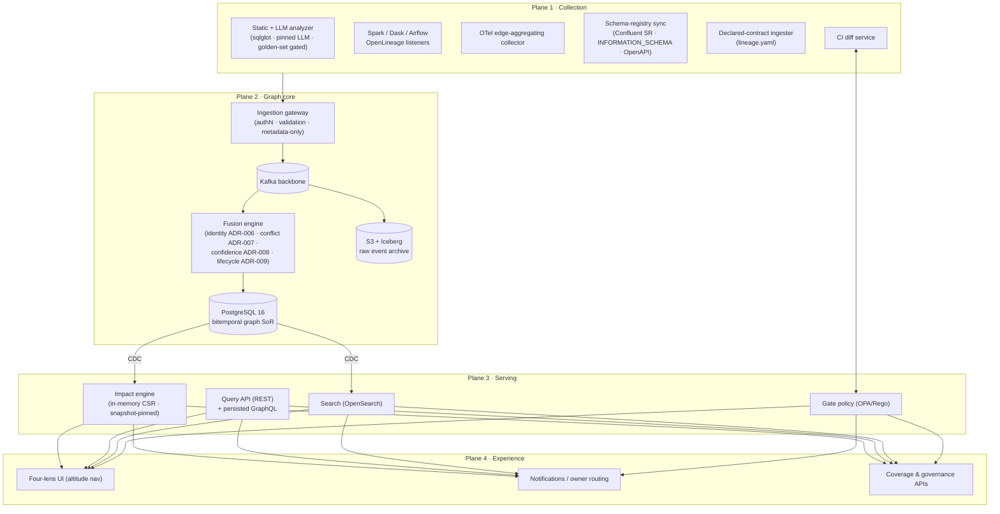

# 02 — Target Architecture

| | |
|---|---|
| **Status** | Final — for review board |
| **Role** | The architecture narrative: what we are building, with named technology. Decisions and alternatives: [03-decision-records.md](03-decision-records.md). Normative specs: [04-high-level-design.md](04-high-level-design.md). Subsystem walkthroughs with examples: [05-subsystem-deep-dive.md](05-subsystem-deep-dive.md) / [deep-dive.html](deep-dive.html). |
| **Scale anchor** | 2,000 services design point · 10,000 validated ceiling |

## §1 Design principles

Each principle carries its consequence; these are the rules that resolved most of the gap register.

1. **Metadata only, enforced — never data values.** Ingestion schemas structurally reject value-bearing payloads. Consequence: the security posture starts at the gateway, not in policy documents (GAP-D3).
2. **One boring system of record; everything else rebuildable from the log.** PostgreSQL holds truth; projections, caches, and indexes are derived and disposable. Consequence: DR is replay, operations are one database's operations (GAP-D1, GAP-D2).
3. **Append-only facts, derived current state.** No writer ever updates a fact; snapshots are logical watermarks. Consequence: every gate decision is reproducible and appealable (GAP-A1).
4. **Evidence-scored, calibration-versioned.** Confidence is a claim with a measured error rate, not a decoration. Consequence: bands move by quarterly calibration; models are versioned and pinned (GAP-S4, GAP-E2).
5. **Declared lineage is a first-class signal, not an afterthought.** Any team can make any system visible today at honestly-capped confidence. Consequence: coverage becomes a product surface with "uncovered" as a rendered state (GAP-S1).
6. **The system may be incomplete, but never quietly.** Cold paths always surface; truncation is explicit; unknown ≠ absent. Consequence: the seven-state consumer contract (GAP-S5) and the cold-path invariant (GAP-S2).
7. **Fail-open gates with a trust budget.** The gate earns authority through measured precision, and loses it mechanically through the waiver circuit-breaker. Consequence: adoption survives the first false positive (GAP-C2..C4).

## §2 Architecture overview

v8's four planes are retained — they were the right shape — and re-drawn with named technology, plus the components v8 was missing (declared-contract ingester, registry sync, snapshot/waiver machinery).

## §3 Technology stack decision table

The one-page answer to GAP-D1. Every row has a full decision record with alternatives in 03.

| Component | Recommendation | Key criteria | Alternatives considered | Managed option | ADR |
|---|---|---|---|---|---|
| Graph system of record | PostgreSQL 16 | 4 GB graph @10k fits SQL; bitemporal + joins native; one boring database | Neo4j, JanusGraph/Neptune, dual-store | RDS / Aurora | 001 |
| Traversal | In-process CSR projection (from CDC) | bounded BFS = cache-friendly loop; replicas disposable | graph DB, recursive CTEs (kept as fallback) | — | 001, 010 |
| Event backbone | Apache Kafka | per-entity ordering; offsets = replay cursors; v8-assumed | Redpanda (acceptable), Pulsar | MSK / Confluent Cloud | 002 |
| Raw event store | S3 + Parquet on Iceberg | schema evolution; time-range replay; GDPR row deletes | raw JSON on S3, Delta Lake | S3 + Glue | 003 |
| SQL parsing / column lineage | sqlglot | 20+ dialects; AST column lineage; embeddable | Calcite, ZetaSQL, sqllineage | — | 013 |
| Schema registries | Confluent SR + INFORMATION_SCHEMA + repo OpenAPI/protobuf | authoritative types; drift detection | Glue SR, Buf BSR (substitutions) | Confluent Cloud | 014 |
| LLM extraction | Managed LLM API, pinned versions, temp 0, golden-set gated | governable accuracy; change-rate-bounded cost | fine-tuned local model (premature), static-only | provider-managed | 015 |
| Gate policy engine | OPA / Rego | policy-as-code; decision logs; steward ownership via PR | bespoke DSL, config flags | styra/managed OPA | 011 |
| Search | OpenSearch | faceted asset search; k-hop entry points | Elasticsearch (equivalent) | AWS OpenSearch | — (02 §3) |
| Platform observability | OTel + Prometheus + Grafana | SLI family doubles as success metrics | Datadog (managed) | Grafana Cloud | 017 |
| Orchestration/runtime | Kubernetes, single region multi-AZ | stateless planes on HPA; disposable projections | serverless (poor fit for stateful projection) | EKS/GKE/AKS | 018 |
| Identity provider | Corporate OIDC | SSO; short-lived workload identity | — | — | 016 |
| API surface | REST + persisted-query GraphQL | closed cost surface over hub-node graph | open GraphQL w/ limits, REST-only | — | 019 |

## §4 Data model overview

Full DDL in HLD §2. The essentials:

- **Entities** carry stable `entityId` (ULID); URNs are deterministic *names* (`urn:tl:{env}:{type}:{authority}:{path}[#fragment]`, HLD §1) that resolve to entityIds; `sameAs` aliases give rename continuity.
- **Axes v8 lacked:** environment (in the URN), schema version (separate `(urn, schemaVersion)` registry), transaction time (`validFrom/validTo` on every fact), lifecycle (`active/stale/retired`).
- **Edges** retain v8's distinctive fields — level, channel, transform, path guard/codeRef/frequency, signals — and add versioning, lifecycle, conflict flags, and a full per-signal `edge_observations` provenance table with the idempotency key.
- **Snapshots** are one-row logical watermarks; gate decisions and impact reports pin `{snapshotId, policyVersion, confidenceModelVersion}`.
- **Governance objects** are first-class tables: waivers (expiring, approver-bound), policies (Rego versions, ramp stages), tombstones, calibration log.

## §5 Three data-flow walkthroughs

Narrative versions with worked examples are in 05; sequence diagrams in HLD §3/§6.

1. **Baseline build (code → candidate graph).** Repo change → static analyzer (content-hash cache) → sqlglot for `feasible-static` files, pinned LLM for `LLM-assisted` files → candidate edges with transform/guard/codeRef → declared `lineage.yaml` contracts alongside → gateway → fusion → Inferred/Probable baseline edges (capped ≤64/75 without runtime).
2. **Runtime confirmation (run → Verified edge).** Spark/Dask/Airflow OL event or OTel edge observation → gateway → Kafka (URN-hash partition) → Iceberg archive → fusion: identity chain joins to the same entityIds → observation upsert (idempotent) → conflict matrix → score recompute (e.g. 61 → 96, Verified) → append-only version write → CDC → CSR/search/rollup deltas.
3. **CI gate (PR → decision in 30s).** Webhook → `throughline.yaml` manifest → re-derive changed paths → schema deltas + codeRef intersections → impact on pinned snapshot → OPA (ramp stage, tiers; Possible never blocks) → status check + comment; waiver path with expiry and the FP circuit-breaker.

## §6 Key changes vs v8

| # | v8 said | This architecture decides | Why | Ref |
|---|---|---|---|---|
| 1 | "graph DB + partitions" (unnamed) | PostgreSQL 16 + in-process CSR; no graph DB | graph is ~4 GB @10k; bitemporal/joins beat traversal wins | ADR-001 |
| 2 | continuous upsert, no time model | append-only bitemporal + logical snapshots; decisions pin versions | reproducible, appealable gate decisions | ADR-004 |
| 3 | URNs by example; no env/schema-version axes | normative URN grammar + entityId/alias identity | identity is the join key for every signal | ADR-005/006 |
| 4 | "who wins?" unanswered | per-attribute conflict matrix; cold-path invariant; registry = type truth | fusion becomes deterministic, auditable | ADR-007 |
| 5 | two-decimal confidence, uncalibrated weights | bands-first display; quarterly calibration moves thresholds; versioned model | "Verified" gets a measured error rate | ADR-008 |
| 6 | stale-edge decay only | active → stale → retired lifecycle with tombstones | "gone" vs "quiet" are different facts | ADR-009 |
| 7 | unbounded BFS, roll-ups unspecified | cycle-safe budgeted traversal; max-severity + band-distribution roll-ups | correctness at hubs; honest aggregates | ADR-010 |
| 8 | gate happy-path only | OPA policy-as-code; waivers + FP circuit-breaker; fail-open; codeRef logic detection; repo manifests | the gate survives contact with the organization | ADR-011 |
| 9 | four collectors, coverage unmapped | tiered connectors + declared `lineage.yaml` signal; coverage as product | dark zones made visible and closable | ADR-012 |
| 10 | "parse the code" (no parser) | sqlglot + feasibility inventory; no deep app-code dataflow v1 | tractability drawn honestly | ADR-013 |
| 11 | registry integration asserted | registry sync as collector family; drift = owner finding | severity matrix gets true types | ADR-014 |
| 12 | LLM self-reported confidence | golden-set gates; pinned models; content-hash cache; cost model | the boldest bet becomes governable | ADR-015 |
| 13 | no security model | OIDC + RBAC; metadata-only enforced; PII-lineage reads audited | the graph maps PII flows; treat it as sensitive | ADR-016 |
| 14 | one health endpoint | SLI family (coverage, precision, gate quality) = success metrics | the trust product proves its own trustworthiness | ADR-017 |
| 15 | no deployment/DR story | K8s multi-AZ; DR by rebuild-from-log; env-axis disambiguation | production infrastructure from block-mode day one | ADR-018 |
| 16 | OL-only scale math | corrected capacity incl. OTel aggregation + payload fields, at 2k/10k | v8's sizing omitted the dominant volume | HLD §10 |

## §7 ADR index

See [README §5](README.md#5-decision-index) for the full index with one-line decisions and statuses, and [03-decision-records.md](03-decision-records.md) for the records.

## §8 Review-board items

The five `Default`/flagged decisions requiring explicit confirmation are consolidated in [README §6](README.md#6-open-items-for-the-review-board) and restated with context in HLD §13.
