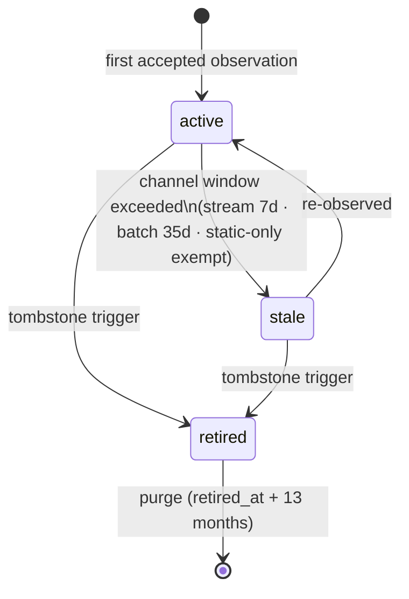
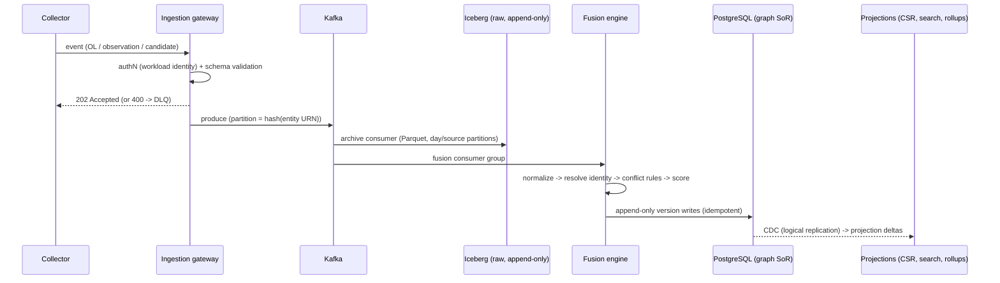
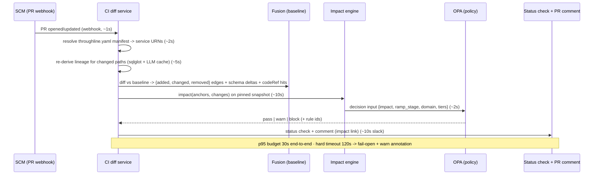

# 04 — High-Level Design (Normative Specifications)

| | |
|---|---|
| **Status** | Final — for review board |
| **Role** | The normative specifications behind the ADRs in [03-decision-records.md](03-decision-records.md). ADRs decide and justify; this document specifies. Narrative walkthroughs and worked examples live in [05-subsystem-deep-dive.md](05-subsystem-deep-dive.md). |
| **Scale anchor** | Design point 2,000 services; validated ceiling 10,000. All capacity numbers appear as 2k / 10k pairs with formulas. |

Sections: §1 Identity · §2 Data model · §3 Ingestion · §4 Fusion & confidence · §5 Impact engine · §6 CI gate · §7 API surface · §8 Consumer data contracts & UI states · §9 Security · §10 Capacity · §11 NFR/SLO table · §12 Operations & operating model · §13 Open items

---

## §1 Identity and naming — *Resolves: GAP-A2 (spec for ADR-005/006)*

### 1.1 URN grammar (normative)

```abnf
urn        = "urn:tl:" env ":" type ":" authority ":" path [ "#" fragment ]
env        = 1*( lowercase / digit / "-" )        ; registered vocabulary, see 1.4
type       = "org" / "domain" / "app" / "svc" / "ds" / "job" /
             "col" / "ep" / "topic" / "field"
authority  = seg *( "." seg ) [ "/" seg *( "/" seg ) ]   ; system-of-record namespace
path       = seg *( "/" seg )                             ; name within the authority
fragment   = 1*( pchar )                                  ; element within the parent
seg        = 1*( lowercase / digit / "-" / "_" )
pchar      = seg / ":" / "." / "{" / "}"                  ; e.g. "GET:/v1/orders/{id}" lowercased
```

Rules:

- **Lowercase everything**; source-system case sensitivity is handled in normalization (ADR-006 step 3), never in the URN.
- Reserved characters (`:` `/` `#` `%` and whitespace) inside a *name segment* are percent-encoded (`%3A`, `%2F`, `%23`, `%25`, `%20`). Encoding applies per segment, before joining.
- URNs are **deterministic**: constructed from `(environment, system, local name)` with zero lookups.
- **Schema/contract version is never part of the URN** — it is the `(urn, schemaVersion)` axis in the version registry (§3.4).

### 1.2 Worked examples (one per entity type)

| Entity | URN |
|---|---|
| Domain | `urn:tl:prod:domain:tl.org:revenue` |
| Business app | `urn:tl:prod:app:tl.org:revenue/order-management` |
| Service | `urn:tl:prod:svc:k8s.main:payments/orders-svc` |
| Dataset (warehouse table) | `urn:tl:prod:ds:snowflake.acme1:analytics/orders_raw` |
| Column | `urn:tl:prod:col:snowflake.acme1:analytics/orders_raw#total_amount` |
| Job | `urn:tl:prod:job:airflow.main:revenue/normalize_orders` |
| Kafka topic | `urn:tl:prod:topic:kafka.main:orders.events` |
| Topic field | `urn:tl:prod:field:kafka.main:orders.events#total_amount` |
| Endpoint | `urn:tl:prod:ep:k8s.main:payments/orders-svc#get:/v1/orders/{id}` |
| Staging twin of a table | `urn:tl:staging:ds:snowflake.acme1:analytics/orders_raw` |

### 1.3 Name vs identity: entityId, aliases, rename continuity

- Every entity row carries a stable **`entityId` (ULID)**. URNs *resolve to* entityIds; all edges reference entityIds.
- **`sameAs` alias records** `{aliasUrn, entityId, evidence, confirmedBy, confirmedAt}` map additional URNs onto an entity.
- **Rename procedure (normative):** (1) collector observes the new name and computes a new URN; (2) resolver finds no match, files a candidate suggestion (old entity scored by similarity + co-location evidence); (3) steward confirms; (4) new URN becomes the primary name of the *existing* entityId, old URN becomes a `sameAs` alias; (5) history, edges, and confidence survive untouched. Unconfirmed candidates remain separate entities flagged `unresolved`.

### 1.4 The two meanings of "environment" (normative disambiguation)

- The **URN `env` segment** describes the *observed estate*: which environment the asset lives in (`prod`, `staging`, `dev`, registered vocabulary owned per §12).
- The **platform's own environments** (platform-dev/platform-staging/platform-prod, ADR-018) are orthogonal: platform-prod ingests events about estate-prod *and* estate-staging alike.
- **Cross-environment corroboration is forbidden:** a staging run never raises the confidence of a prod edge. Signals join only within the same URN `env`.

### 1.5 OpenLineage interop mapping

OpenLineage remains the ingest wire format. Mapping (bidirectional, applied at the gateway):

| OpenLineage | Throughline URN |
|---|---|
| dataset `namespace` (e.g. `snowflake://acme1`) | `authority` (`snowflake.acme1`) |
| dataset `name` (e.g. `analytics.orders_raw`) | `path` (`analytics/orders_raw`) |
| column lineage facet field | `#fragment` on a `col:`/`field:` URN |
| job `namespace`+`name` | `job:` URN under the orchestrator authority |
| *(no OL equivalent)* | `env` — supplied by collector configuration, required |

---

## §2 Graph data model — *Resolves: GAP-A1, GAP-A3 (spec for ADR-004/009)*

### 2.1 Tables (PostgreSQL 16; key columns only, types abbreviated)

```sql
-- Identity
entities        (entity_id ULID PK, urn TEXT UNIQUE, type, env, authority, path, fragment,
                 domain, owner, lifecycle_state, attrs JSONB,
                 first_seen_at, last_observed_at, retired_at NULL)
aliases         (alias_urn TEXT PK, entity_id FK, evidence JSONB, confirmed_by, confirmed_at)
identity_crosswalk (source, source_native_id, entity_id FK, rule_version, resolved_at,
                    PRIMARY KEY (source, source_native_id))

-- Bitemporal facts (append-only; writers close versions, never UPDATE facts)
node_versions   (entity_id FK, valid_from TSTZ, valid_to TSTZ NULL,  -- NULL = open
                 schema_version_id NULL, attrs JSONB, lifecycle_state,
                 PRIMARY KEY (entity_id, valid_from))
edges           (edge_id ULID PK, source_entity FK, target_entity FK,
                 level,            -- system | dataset | column
                 channel,          -- batch | stream | rest | graphql | grpc | async
                 transform TEXT, path_id, guard TEXT, code_ref TEXT,
                 valid_from TSTZ, valid_to TSTZ NULL,
                 confidence_score INT, confidence_band, lifecycle_state,
                 conflict BOOL, signals TEXT[], last_observed_at)
edge_observations (obs_id ULID PK, edge_id FK, signal, source, run_id, event_id,
                   observed_at TSTZ, payload JSONB,
                   UNIQUE (source, run_id, event_id))   -- the ADR-003 idempotency key

-- Lifecycle & time
tombstones      (entity_id FK, trigger,   -- ol_delete | ci_file_delete | registry_delete | attestation
                 evidence JSONB, retired_at, purge_after)
snapshots       (snapshot_id ULID PK, max_valid_from TSTZ, offset_vector JSONB,
                 confidence_model_version, created_at, created_for)  -- gate | report | manual

-- Schema/version axis (ADR-014)
schema_versions (schema_version_id PK, entity_id FK, version_label, source,  -- registry | infoschema | repo
                 definition JSONB, registered_at)

-- Gate & governance
gate_decisions  (decision_id ULID PK, pr_ref, repo, snapshot_id FK, policy_version,
                 confidence_model_version, decision,  -- pass | warn | block | fail_open
                 impact_report JSONB, latency_ms, created_at)
waivers         (waiver_id ULID PK, gate_decision_id FK, scope, reason TEXT,
                 approver, expires_at TSTZ NOT NULL,   -- <= 90 days, enforced
                 audit_ref, created_at)
policies        (policy_version PK, domain, rego_package, ramp_stage,  -- observe | warn | block
                 git_ref, activated_at)
```

Indexes (headline): `edges (source_entity, valid_to)` and `edges (target_entity, valid_to)` for adjacency; `edges (level, lifecycle_state)`; `entities (urn)`, `entities (domain, type)`; `edge_observations (edge_id, observed_at DESC)`; BRIN on `edge_observations.observed_at`.

**Snapshot query semantics:** `AS OF s` ≡ `valid_from <= s.max_valid_from AND (valid_to IS NULL OR valid_to > s.max_valid_from)`. The "current graph" is the materialized view `WHERE valid_to IS NULL`.

### 2.2 Edge schema v2 vs v8 (delta)

| Field | v8 | v2 (this design) |
|---|---|---|
| source/target | URN strings | `entity_id` FKs (URNs are names, not join keys) |
| level, channel, transform, path/guard/codeRef/frequency, signals[], lastObservedAt | ✔ | ✔ retained |
| confidence | 0–1 two-decimal | integer score + band, serialization enforces bands-first (ADR-008) |
| *(new)* valid_from / valid_to | — | bitemporal versioning (ADR-004) |
| *(new)* lifecycle_state | — | active / stale / retired (ADR-009) |
| *(new)* conflict flag | — | ADR-007 disagreement marker |
| *(new)* edge_observations table | — | full per-signal provenance, idempotent |

### 2.3 Lifecycle state machine (ADR-009)



Tombstone triggers (any one suffices): OpenLineage lifecycle/deletion event · CI diff reports source file deleted · schema-registry subject deleted · owner attestation via API. Retired entities/edges are excluded from impact traversal and search defaults; queryable via `includeRetired=true` for 13 months.

---

## §3 Ingestion pipeline — *Resolves: GAP-B1, GAP-B2 (spec for ADR-003/014)*

### 3.1 Kafka topic map (2k design point)

| Topic | Key | Partitions | Retention | Producers |
|---|---|---|---|---|
| `tl.lineage.events` | hash(primary entity URN) | 24 | 7d (raw archived to Iceberg) | Spark/Dask/Airflow OL, gateway HTTP |
| `tl.otel.observations` | hash(edge URN pair) | 24 | 3d | OTel edge-aggregating collector |
| `tl.registry.changes` | hash(subject/table URN) | 6 | 30d | registry sync collectors |
| `tl.baseline.candidates` | hash(repo) | 12 | 7d | static+LLM analyzer, contract ingester |
| `tl.cicd.diffs` | hash(repo) | 6 | 30d | CI diff service |
| `tl.dlq` | (as source topic) | 6 | 30d | gateway, fusion engine |

### 3.2 Ingestion contract (normative rules)

1. **Idempotency:** key `(source, runId, eventId)`; enforced by the `edge_observations` unique constraint; duplicates ACKed and dropped. Window: unbounded (constraint-based, not cache-based).
2. **Ordering:** per-entity via partition key. Consumers MUST NOT assume cross-entity order.
3. **Event time:** all merges use `observedAt` (event time). A late event inserts into observation history; it updates `last_observed_at`/lifecycle only if it is the newest observation.
4. **Validation:** schema-validated at the gateway (OpenLineage JSON Schema + Throughline facet schemas). Value-bearing payload fields are **structurally absent** from the accepted schemas (ADR-016). Invalid → `tl.dlq` with reason; DLQ depth is an alerting SLI.
5. **Tombstone events** follow the same contract (they are observations with `lifecycle: deleted`).
6. **Replay/backfill:** select an Iceberg predicate (time range × source) → reprocess through the fixed pipeline into a **shadow build** (separate schema) → verify counts/spot-checks → mint a snapshot → atomic swap of the serving view → old build retained 7 days.

### 3.3 Pipeline flow



### 3.4 Schema-registry sync (ADR-014)

- **Streams:** poll Confluent SR (plus change events where enabled); new subject versions land as `schema_versions` rows and `tl.registry.changes` events; Avro/protobuf/JSON-schema parsed into `field` entities.
- **Warehouses:** scheduled `INFORMATION_SCHEMA` snapshots (Snowflake/warehouse-specific), diffed; column adds/drops/type changes become schema-version events; subject deletion / table drop → tombstone trigger.
- **Services:** OpenAPI/protobuf harvested by the static collector; payload fields become `field` entities under `ep` entities.
- Registry-vs-runtime drift → `finding` event routed to the asset owner (never silently reconciled).

---

## §4 Signal fusion and confidence — *Resolves: GAP-S2, GAP-B3, GAP-B4 (spec for ADR-007/008/013/015)*

### 4.1 Conflict-resolution matrix (normative, full)

Signals: `static`, `llm`, `spark`, `dask`, `otel`, `declared`, `registry` (type axis only). "Runtime" = spark|dask|otel.

| Attribute | Precedence (high → low) | Conflict handling |
|---|---|---|
| **Edge existence** | runtime > declared > static > llm | Runtime-observed, static-absent → edge exists, flag `unexplained`, parser-coverage triage. Static/LLM-asserted, never observed → **cold-path edge**: visible, lifecycle exempt from staleness, always in impact output as Possible. Declared, never observed → visible, capped per row 6. |
| **Transform semantics** | static > llm > OL transform facets | Disagreement → static wins; edge flagged `conflict`; −10 score penalty; triage event |
| **Type / schema** | registry > runtime-observed > static > llm | Registry always wins; registry-vs-runtime drift → owner finding (§3.4) |
| **Path guard / frequency** | runtime only (static supplies superset) | Latest observation wins per path_id |
| **Channel** | static > runtime inference | Disagreement → static wins + `conflict` flag |
| **Ownership** | declared > CODEOWNERS > catalog/inferred | Never LLM-only; ties → domain steward triage |
| **Declared-edge cap** | — | `declared` without runtime corroboration: score cap 75 (Probable); mandatory review TTL 180d; expiry → decay to Inferred |
| **Inter-runtime disagreement** | none (peers) | Union observations; `conflict` flag; −10 penalty; triage. The pipeline never guesses which runtime lied. |

### 4.2 Scoring algorithm v2 (pseudocode; v8 weights retained as priors)

```text
score(edge):
    W = {static: 30, llm: 18, spark: 30, dask: 26, otel: 22, declared: 25}
    recency(sig) = 1.0 if last_obs < 1d else 0.82 if < 7d else
                   0.5 if < channel_window else 0.0        # v8 x0/never extended with a mid step
    baseline  = sum(W[s] for s in {static, llm, declared} if s asserts edge)
    runtime   = sum(W[s] * recency(s) for s in {spark, dask, otel} if s observed edge)
    s = min(100, round(baseline + runtime))
    if no runtime signal: s = min(s, 64)                    # baseline-only cap (v8, retained)
    if edge.declared and no runtime: s = min(s, 75 if attestation_valid else 64)
    if edge.conflict: s -= 10
    band = verified if s >= T_v else probable if s >= T_p else inferred
    # T_v = 85, T_p = 65 initially (v8); thresholds move via calibration, weights do not
```

### 4.3 Calibration protocol (quarterly; ADR-008)

1. Stratified sample: 60 Verified, 60 Probable, 60 Inferred edges (per major domain where volume allows).
2. Steward ground-truth verification (does the edge exist as described?).
3. Compute observed precision per band. Targets: Verified ≥95%, Probable ≥80%.
4. If missed: move `T_v`/`T_p` up until targets hold on the sample; never touch weights between Bayesian-upgrade reviews.
5. Publish new `confidence_model_version`; historical snapshots keep their pinned version (no retro-grading).
6. Record results in the calibration log (feeds the ADR-008 v2 Bayesian trigger: two completed cycles).

### 4.4 Static-analysis feasibility inventory (ADR-013)

| Source type | Class | Mechanism |
|---|---|---|
| Warehouse SQL (Snowflake/ANSI), dbt models | feasible-static | sqlglot AST column lineage |
| Airflow DAGs (topology, operators) | feasible-static | DAG parse + operator mapping |
| Avro / protobuf / JSON-schema / OpenAPI | feasible-static | schema parse → field entities |
| SparkSQL strings in code | feasible-static | sqlglot on extracted strings |
| PySpark / DataFrame API chains | LLM-assisted | LLM extraction under §4.5 gates |
| Notebooks, dynamic SQL, UDF bodies | LLM-assisted | LLM extraction under §4.5 gates |
| Java/Go service code (request handling) | runtime-covered | OTel observations; no static dataflow in v1 |
| Stored procedures, closed-source/legacy ETL | declared-only | `lineage.yaml` contracts + best-effort sqlglot |

### 4.5 LLM extraction gates and cost (ADR-015)

- Golden set ≥500 labeled file→edges examples; targets: **precision ≥90%, recall ≥70%** for LLM-only edges; below precision gate → LLM-only edges hard-capped at Inferred.
- Temperature 0; pinned model + prompt versions; upgrades gated on golden-set re-run.
- Cache: `content_hash(file) → extraction result` in PostgreSQL; extraction runs only on hash change.
- Cost model: `cost/month = changed_files_per_month × avg_tokens_per_file × unit_price`. At 2k services: assume 2,000 repos × 40 candidate files × 5%/week change rate = 4,000 files/week ≈ 17,300 files/month; at ~1.5k tokens/file ≈ 26M tokens/month — order **hundreds of USD/month steady-state**; the one-time backfill (2,000 × 40 = 80,000 files ≈ 120M tokens) is the dominant spend, order **low thousands USD**. (Unit prices vary by provider/model; the formula, cache, and change-rate bound are the design content.)

---

## §5 Impact engine — *Resolves: GAP-A4, GAP-A5 (spec for ADR-010)*

### 5.1 Projection build

- CSR adjacency arrays (out-edges and in-edges) keyed by dense node index; per-edge attributes packed: band (2 bits), severity-relevant channel, level, lifecycle, path frequency class.
- Built from PostgreSQL via CDC (logical replication); full rebuild from the current-state view in minutes at 2k (projection ≈ 22 MB, §10); incremental deltas applied in-order per entity.
- SCCs pre-collapsed (Tarjan) for roll-up metrics; cycle membership retained per node for traversal bookkeeping.
- Replicas are disposable (ADR-018); warm-up = rebuild + CDC catch-up.

### 5.2 Traversal contract (normative pseudocode)

```text
impact(anchor, change, snapshot, budget = {nodes: 5000, edge_visits: 50000, depth: 10 (max 25)}):
    pin snapshot (required; minted if absent)                     # ADR-004
    frontier = {anchor}; visited = {}; results = []
    while frontier and budget remains:
        n = pop BFS frontier
        for e in out_edges(n) where e.level matches scope and e.lifecycle != retired:
            budget.edge_visits -= 1
            if e.target in visited: continue                      # cycle-safe
            sev  = classify(change, e)          # change-type x usage matrix (v8, retained)
            tier = min_band_along_path(e)       # any inferred hop -> Possible
            results += (e.target, sev, tier, path)
            if sev != absorbed: frontier.push(e.target)
    return report {
        summary, confirmed[], possible[],
        coverage: {paths_confirmed, paths_total},                 # v8, retained
        truncated: bool, continuation_cursor?,                    # never silent
        pinned: {snapshot_id, policy_version, confidence_model_version}
    }
```

Severity classification retains v8's change-type × usage matrix verbatim (widen/narrow/rename/drop/add/nullability × read/join-transform/contract-export). Severity never attenuates with hops.

### 5.3 Roll-up rules (normative)

- **Severity:** parent = `max(children)` — one Breaking child makes the parent Breaking.
- **Confidence:** parent = coverage-weighted **band distribution**, e.g. `{verified: 62%, probable: 30%, inferred: 8%}`, rendered as a distribution. Blending into a single number is prohibited.
- **Counts:** rolled-up edges carry `underlying_count` (v8, retained).

### 5.4 Precompute policy

Top-N hub columns by out-degree (N = 500 at 2k) get materialized blast radii refreshed on projection delta; `GET /v1/impact/{changeId}` and hub-anchored queries serve from cache with `computedAt` + `snapshotId`.

---

## §6 CI/CD gate — *Resolves: GAP-C1..C5 (spec for ADR-011)*

### 6.1 Sequence



### 6.2 `throughline.yaml` manifest (normative spec)

```yaml
# repo root or monorepo subtree; validated in CI; ownership of mapping is the repo's
version: 1
services:
  - urn: urn:tl:prod:svc:k8s.main:payments/orders-svc
    paths: ["services/orders/**"]          # glob, subtree-scoped
    schemas: ["services/orders/api/*.avsc"]
  - urn: urn:tl:prod:job:airflow.main:revenue/normalize_orders
    paths: ["pipelines/revenue/normalize_orders/**"]
environments:                               # optional; default prod
  default: prod
```

Unmapped changed paths → gate reports `unmapped-paths` warn (never silently skipped).

### 6.3 Logic-only change detection (v1)

For each changed file/function span, look up edges whose `code_ref` intersects; if intersecting edges exist and the PR produces **no schema delta** for them → emit warn-tier `transform-logic-changed` impact to downstream owners with the edge list. v2 (deferred, trigger: first quarter of gate operation): sqlglot AST semantic diff classifies the change (identity-preserving vs semantics-changing).

### 6.4 Example Rego policy (complete rule)

```rego
package throughline.gate.revenue

import rego.v1

default decision := {"result": "pass", "rules": []}

# Ramp stage for this domain comes from data.policy.ramp_stage: observe|warn|block
decision := {"result": "block", "rules": ["confirmed-breaking-tier0"]} if {
    data.policy.ramp_stage == "block"
    some impact in input.impact.confirmed
    impact.severity == "breaking"
    impact.target_domain_tier == 0
}

decision := {"result": "warn", "rules": ["confirmed-breaking-ramp"]} if {
    data.policy.ramp_stage in {"observe", "warn"}
    some impact in input.impact.confirmed
    impact.severity == "breaking"
}

decision := {"result": "warn", "rules": ["possible-breaking"]} if {
    some impact in input.impact.possible
    impact.severity == "breaking"
}   # Possible tier can never block (v8 FR-I6, retained)
```

### 6.5 Waiver workflow

- Object: `{waiver_id, gate_decision_id, scope (rule|edge|pr), reason, approver, expires_at ≤ 90d, audit_ref}`.
- Approver MUST be the impacted downstream owner or the domain steward (RBAC-enforced); self-approval by the PR author is rejected.
- All waivers queryable (`GET /v1/waivers?rule=…`); waiver creation and expiry are audit events.
- **Circuit-breaker:** for each policy rule, `waiver_rate_30d = waivers / block_decisions`; if > 10%, the rule auto-demotes block→warn, pages the rule owner, and stays demoted until re-promoted by policy PR.

---

## §7 API surface — *Resolves: part of GAP-D1 (spec for ADR-019)*

v8's endpoints are retained; additions marked **new**. All REST; versioned `/v1`; cursor pagination; ETags on graph reads; every impact/gate response echoes its pinned `{snapshotId, policyVersion, confidenceModelVersion}`.

| Group | Endpoint | Notes |
|---|---|---|
| Collection | `POST /v1/lineage/events` | OpenLineage; 202 + `edgesUpserted` |
| Collection | `POST /v1/baseline/edges` | static/LLM bulk candidates |
| Collection | `POST /v1/lineage/declared` **new** | `lineage.yaml` contract ingest (CI-driven) |
| Collection | `POST /v1/cicd/diff` | PR diff → deltas + impact preview |
| Graph | `GET /v1/entities/{id}` · `GET /v1/entities/{id}/lineage` | `direction, depth, minBand, snapshotId, includeRetired` |
| Graph | `GET /v1/search` | faceted (owner, domain, pii, criticality, env, lifecycle) |
| Graph | `POST /graphql` (persisted IDs only) | altitude/lens queries; registered shapes only |
| Graph | `GET /v1/snapshots/{id}` · `POST /v1/snapshots` **new** | mint/inspect logical snapshots |
| Impact | `POST /v1/impact/simulate` | + `snapshotId`; response per §5.2 |
| Impact | `GET /v1/impact/{changeId}` | cached blast radius |
| Impact | `POST /v1/impact/gate` | CI decision; §6 |
| Governance | `POST /v1/waivers` · `GET /v1/waivers` **new** | §6.5 |
| Governance | `POST /v1/attestations` **new** | owner attestation (lifecycle, declared TTL renewal) |
| Governance | `GET /v1/coverage` **new** | per-domain coverage SLIs (exec/governance surface) |
| Admin | `GET /v1/collectors/health` | + heartbeat freshness |
| Admin | `POST /v1/owners/notify` | routing per v8 |
| Admin | `POST /v1/entities/{id}/retire` **new** | manual tombstone (steward) |

Error model: RFC 7807 problem+json; rate limits per service account; async jobs (`202` + `Location`) for traversals exceeding synchronous budget.

---

## §8 Consumer data contracts and UI states — *Resolves: GAP-S4, GAP-S5 (partial)*

Lineage/impact read responses distinguish, per neighbor slot (normative closed set):

| State | Meaning | Rendering guidance |
|---|---|---|
| `no-dependency` | Area covered by ≥1 signal; no edge found | plain absence |
| `not-observed` | Coverage gap: no signal reaches this asset class; lists missing signals | **first-class "blind spot" treatment** — never blank |
| `stale` | Edge exists; channel window exceeded | dimmed + age |
| `retired` | Tombstoned; `retired_at`, evidence | "was connected until X" on request |
| `cold-path` | Static/declared asserted, never observed running | dashed + Possible in impact |
| `error` | Partial upstream failure during assembly | explicit, never silently omitted |
| `truncated` | Budget exhausted | count + continuation cursor |

Confidence serialization: `{score: 87, band: "verified"}` — integer + band, bands lead, decimals prohibited (ADR-008).
Exec/governance persona (GAP-S4) is served at the API layer by `GET /v1/coverage` and domain roll-up endpoints (risk distribution, coverage trend, gate-quality SLIs) — a dashboardable contract; visual design is the product team's deferred scope.

---

## §9 Security design — *Resolves: GAP-D3 (spec for ADR-016)*

### 9.1 Role/permission matrix (v1 RBAC)

| Operation | viewer | domain-steward | platform-admin | service-account |
|---|---|---|---|---|
| Read graph/impact (non-PII-tagged) | ✔ | ✔ | ✔ | ✔ (scoped) |
| Read PII-tagged lineage | ✔ (audited) | ✔ (audited) | ✔ (audited) | ✖ unless scoped |
| Simulate impact | ✔ | ✔ | ✔ | ✔ |
| Ingest events | ✖ | ✖ | ✖ | ✔ (own sources) |
| Confirm identity merges / aliases | ✖ | ✔ (own domain) | ✔ | ✖ |
| Approve waivers | ✖ | ✔ (own domain) | ✔ | ✖ |
| Change gate policy (Rego PR) | ✖ | ✔ (own domain, via PR) | ✔ | ✖ |
| Retire entities / attest | ✖ | ✔ (own domain) | ✔ | ✔ (own assets) |
| Manage collectors, calibration, thresholds | ✖ | ✖ | ✔ | ✖ |

### 9.2 Audit event catalog

`gate.decision`, `waiver.created/expired`, `identity.merge.confirmed/rejected`, `entity.retired`, `policy.changed`, `lineage.declared.ingested`, `pii_lineage.read`, `calibration.published`, `replay.executed`. Append-only store, queryable, retained per corporate schedule.

### 9.3 Enforcement points

- **Metadata-only:** gateway JSON schemas contain no value-bearing fields; payloads with unknown fields are rejected (not stripped) → DLQ + SLI.
- Collectors run least-privilege read-only credentials from the org vault; short-lived workload identity (no static keys).
- PII/classification tags propagate downstream along Verified edges as advisory markings; propagation is recomputed on projection delta.
- GDPR/retention: raw events 13 months (Iceberg row-level delete for targeted purge); graph carries no personal data by construction; audit actor IDs per corporate retention.

---

## §10 Capacity and performance — *Resolves: GAP-D5, GAP-D6*

All numbers generated by the capacity script (assumptions below are the script's constants); v8's per-service shape assumptions are retained where sane, and corrected where v8 omitted volume (OTel, API payload fields, jobs).

### 10.1 Assumptions

| Assumption | Value | Source |
|---|---|---|
| Datasets/service · columns/dataset · lineage edges/column | 5 · 20 · 3 | v8, retained |
| Job runs/service/day · events/run · OL event size | 24 · 2 (START+COMPLETE) · 4 KB | v8, retained |
| Node · edge stored size | 1.5 KB · 0.8 KB | v8, retained |
| Jobs/service · endpoints/service · payload fields/endpoint | 2 · 5 · 12 | correction (GAP-D5) |
| Interaction edges/service | 10 | correction |
| OTel flush classes (hot/warm/cold share × flushes/day) | 10%×288 · 30%×24 · 60%×1 | correction (edge-aggregating collector) |
| OTel observation size | 0.6 KB | correction |
| Index+version overhead ×2.5 · Parquet compression ÷2.5 · peak factor ×4 | — | engineering allowances |

### 10.2 Results (script output)

| Metric (formula) | @2k | @10k |
|---|---|---|
| Datasets (svc × 5) | 10,000 | 50,000 |
| Dataset columns (ds × 20) | 200,000 | 1,000,000 |
| Jobs (svc × 2) · Endpoints (svc × 5) | 4,000 · 10,000 | 20,000 · 50,000 |
| API payload fields (ep × 12) | 120,000 | 600,000 |
| **Nodes — v8 basis (svc+ds+col)** | 212,000 | 1,060,000 |
| **Nodes — corrected (incl. jobs, ep, fields)** | **346,000** | **1,730,000** |
| Lineage edges (col × 3) | 600,000 | 3,000,000 |
| Interaction edges (svc × 10) · payload-field edges (field × 1) | 20,000 · 120,000 | 100,000 · 600,000 |
| **Total edges** | **740,000** | **3,700,000** |
| Graph store pre-overhead (nodes×1.5KB + edges×0.8KB) | 1.06 GB | 5.30 GB |
| **Graph store incl. indexes+versions (×2.5)** | **2.6 GB** | **13.2 GB** |
| CSR projection (edges×24B + nodes×16B) | 22.2 MB | 111.1 MB |
| OpenLineage events/day (svc × 24 × 2) | 96,000 | 480,000 |
| OpenLineage ingest/day (× 4KB) | 375 MB | 1,875 MB |
| OTel observations/edge/day (0.1×288 + 0.3×24 + 0.6×1) | 36.6 | 36.6 |
| **OTel observations/day (interaction edges × 36.6)** | **732,000** | **3,660,000** |
| OTel ingest/day (× 0.6KB) | 429 MB | 2,145 MB |
| **Total ingest/day** | **804 MB** | **4,020 MB** |
| Raw events/year uncompressed · Parquet (÷2.5) | 287 · 115 GB | 1,433 · 573 GB |
| All events/day · avg events/sec · peak (×4) | 828,000 · 9.6 · 38.3 | 4,140,000 · 47.9 · 191.7 |

### 10.3 What the corrections show

1. **The OTel correction (GAP-D5) is the story:** even *after* collector-side aggregation to per-edge flushes, OTel observations (732k/day) outnumber OpenLineage events (96k/day) ~7.6:1 at 2k. Without aggregation — raw spans at, say, 50 rps/service — the input would be ~8.6 **billion** spans/day at 2k: four orders of magnitude more. The edge-aggregating collector is a capacity requirement, not an optimization. v8's sizing counted zero of this.
2. **Corrected node count is ~1.6× v8's basis** once API payload fields, endpoints, and jobs are counted — still comfortably small (1.7M nodes at 10k).
3. **Peak ingest ≈ 38 events/sec at 2k, ≈ 192/sec at 10k** — trivial for Kafka. Capacity is not this system's risk; **correctness under merge/conflict/identity is.** The numbers justify ADR-001's "no graph DB" and redirect engineering attention where the risk actually lives.

### 10.4 Query/QPS model (2k design point)

`UI: ~300 weekly actives, ~40 concurrent peak × ~0.5 req/s ≈ 20 QPS (cache-served) · Gate: ~200 lineage-relevant PRs/day, bursts ~10/min at deploy trains — latency-critical, not throughput-critical · Simulate: ~100/day · Search: ~5 QPS peak.` Total ≈ 30–50 QPS peak. Load-test plan: worst-case hub column (max out-degree) at depth 10 under gate-storm concurrency (20 simultaneous gates), assert §11 latency; repeat at 10k-scale synthetic graph.

---

## §11 NFR / SLO table — *Resolves: GAP-C4, GAP-D6, GAP-E2 (with ADR-017)*

Proposed targets at the 2k design point (headroom validated at 10k by load test). These are commitments for the platform team and the funding gates, reviewed quarterly.

| Category | SLI | Target |
|---|---|---|
| Impact query (≤5k nodes) | latency | p50 < 300 ms · p99 < 2 s |
| UI lens fetch (scoped) | latency | p95 < 500 ms |
| Search | latency | p95 < 300 ms |
| Simulate (sync) | latency | p95 < 10 s (async job above budget) |
| **CI gate end-to-end** | webhook→status-check | **p95 < 30 s · timeout 120 s → fail-open+warn** |
| Ingestion freshness | event `observedAt` → queryable | p95 < 60 s (stream) · < 10 min (batch/registry) |
| Availability | query APIs · ingest APIs | 99.9% · 99.5% (queue-buffered; effective data loss ≈ 0) |
| Durability / DR | raw events · graph | S3 11-nines, RPO ≈ 0 · rebuild ≤ 8 h, RPO 24 h, RTO 4 h |
| Coverage (success metric) | Tier-1 assets with ≥1 signal | ≥ 80% within 2 quarters of domain onboarding |
| Coverage (success metric) | active edges runtime-confirmed | ≥ 50% per onboarded domain |
| Identity quality | sampled resolution precision | ≥ 95% (v8 spike gate, continuous) |
| Confidence quality | observed Verified precision (calibration) | ≥ 95% (Probable ≥ 80%) |
| Gate quality | waiver rate per rule | < 10% / 30d (circuit-breaker threshold) |
| Gate quality | fail-open rate | < 0.5% of decisions / 30d |
| Pipeline health | DLQ depth | alert > 100; drain < 24 h |

---

## §12 Operations and operating model — *Resolves: GAP-D2, GAP-E1 (spec for ADR-018)*

### 12.1 Topology and failure modes

Kubernetes, single region, 3 AZs. Stateless planes on HPA; impact-engine replicas hold the CSR projection (disposable; warm-up = rebuild + CDC catch-up). PostgreSQL managed multi-AZ failover; Kafka 3-AZ.

| Failure | Behavior |
|---|---|
| Kafka unavailable | Collectors buffer locally (OL/OTel exporters); gateway 503s ingestion; **gate degrades per policy (fail-open + warn)**; reads unaffected |
| PostgreSQL failover | Writes pause seconds–minutes; reads continue from CSR/search projections; fusion consumers resume from offsets (idempotent) |
| Impact engine replica loss | Disposable; LB drains; new replica warm-up minutes |
| LLM provider outage | Baseline refresh pauses; cache serves unchanged files; **zero effect on runtime signals or gating** |
| Region loss | DR: re-deploy; graph rebuild from Iceberg ≤ 8 h; RTO 4 h (ADR-018) |

Upgrades: standard rolling; fusion-engine schema migrations gated by shadow-build replay (§3.2 rule 6) when they touch scoring/merge logic.

### 12.2 Day-2 ownership table

| Artifact | Owner | Change mechanism | Cadence |
|---|---|---|---|
| Identity normalization rules + URN vocabulary (`env`, authorities) | Platform team | Git PR + rule tests | As needed; sampled-precision SLI watches |
| Severity matrix (change-type × usage) | Architecture guild | Git PR + board review | Quarterly review |
| Gate policies (Rego packages, ramp stages) | Domain stewards | Git PR (CODEOWNERS per domain) | Continuous |
| Confidence thresholds (`T_v`, `T_p`) + model version | Platform team + calibration review | Calibration protocol §4.3 | Quarterly |
| Connector roster & tier sequencing | Platform team | Roadmap review vs estate share | Quarterly |
| `lineage.yaml` contracts | Asset owners | Repo PR; TTL re-attestation | ≤ 180 d TTL |
| Waiver hygiene (expiries, rates) | Domain stewards | Dashboard + circuit-breaker | Continuous |
| Vertical-slice representativeness criteria (crosswalk #20) | Program team | Published criteria: slice must include ≥1 cross-domain dependency, ≥1 streaming hop, ≥1 uncovered/legacy system | Before slice selection |

### 12.3 Dashboards and alerts

Grafana boards per ADR-017 SLI family: pipeline health (lag, DLQ, heartbeats), graph quality (coverage, runtime-confirmed %, unresolved entities, conflict backlog), gate quality (latency, fail-open, waiver rates, calibration drift). Alert thresholds per §11.

---

## §13 Consolidated open items (mirror of README §6)

1. ADR-019 GraphQL posture (persisted queries) — board confirm.
2. ADR-012 buy-note: catalog connector estate as Tier-2 accelerator — board decide.
3. ADR-011 Tier-0 fail-closed opt-in — board confirm.
4. ADR-013 v1 exclusion of deep app-code dataflow analysis — board confirm.
5. ADR-018 single-region posture with rebuild DR — board confirm.
