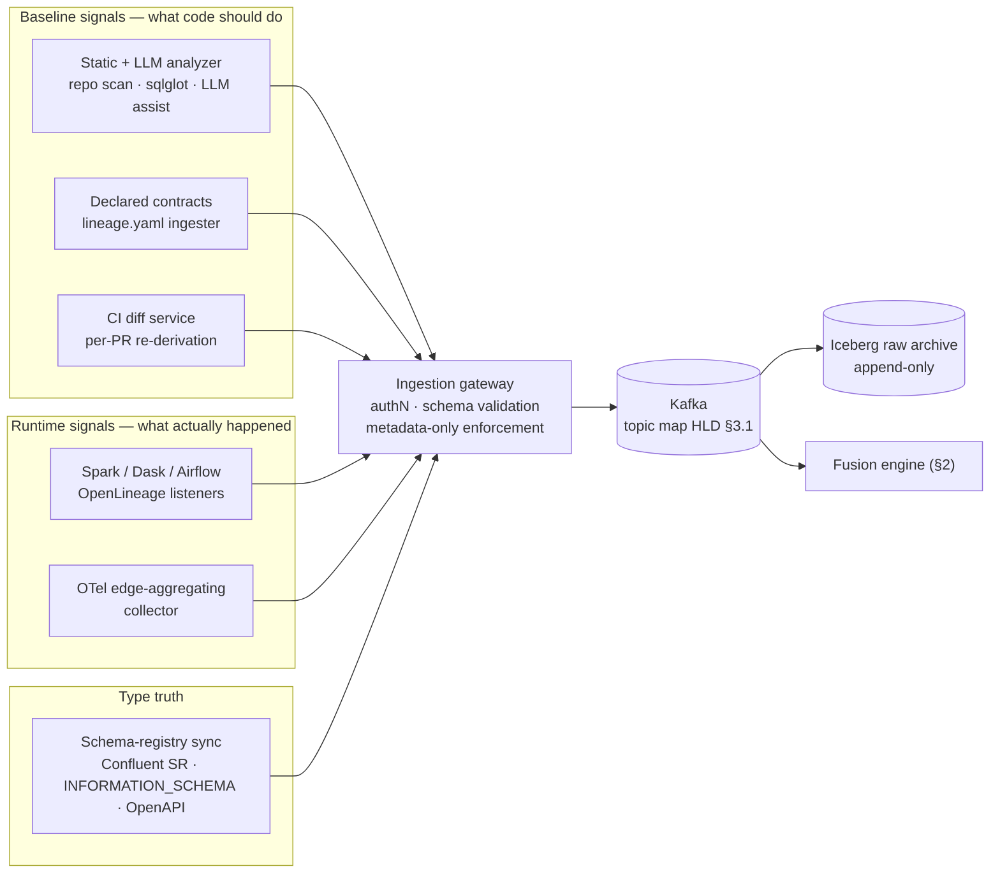
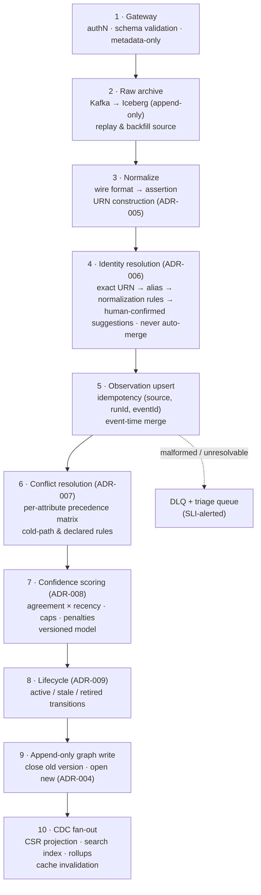
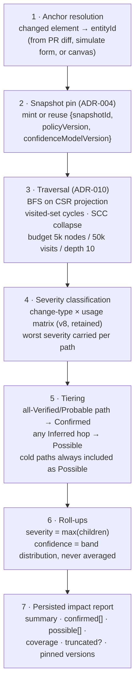
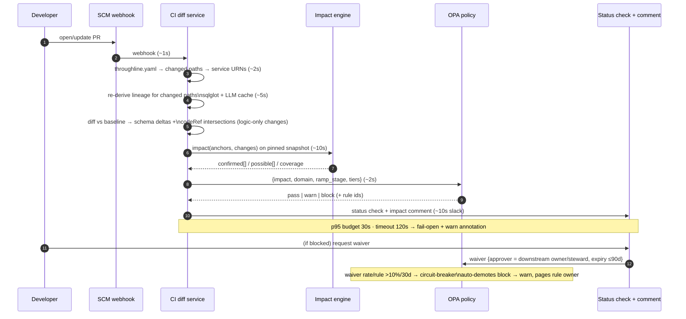
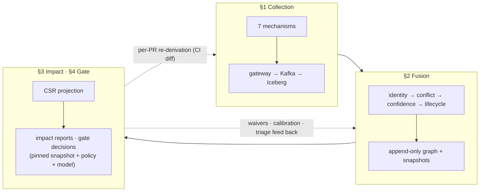

# 05 — Subsystem Deep-Dive: Collection · Fusion · Impact · PR Flow

| | |
|---|---|
| **Status** | Final — for review board |
| **Role** | Detailed architecture of the four core subsystems, with diagrams and worked examples. This document *narrates and exemplifies*; the decisions live in [03-decision-records.md](03-decision-records.md) and the normative specs in [04-high-level-design.md](04-high-level-design.md). An HTML rendering with visual flows is at [deep-dive.html](deep-dive.html). |
| **Running example** | The v8 Worked Example scenario, kept for continuity: **Orders Service** publishes `orders.events` (Kafka) → lands in `orders_raw` (S3/warehouse) → Spark builds `fct_orders` → Dask builds `churn_features` → Churn Model. Two changes are traced: a money **type change** (`total_amount` int → decimal) and a **rename** (`net_amount` → `net_revenue`). |

---

## §1 Lineage collection across the collection mechanisms

### 1.1 The collection plane at a glance

Seven mechanisms feed one gateway. Three produce the **baseline** (what the code *should* do), three produce **runtime truth** (what actually *happened*), and one produces **authoritative types**. No mechanism trusts another; the fusion engine (§2) reconciles them.



### 1.2 Per-mechanism architecture

**Static + LLM analyzer** (ADR-013, ADR-015). Batch workers scan repos on PR (changed files) and nightly (full). Pipeline per file: content-hash lookup (skip unchanged) → classify by the feasibility inventory (HLD §4.4) → `feasible-static` files go through sqlglot AST column-lineage extraction; `LLM-assisted` files (DataFrame chains, dynamic SQL, notebooks) go to the pinned LLM at temperature 0 → candidate edges with transform expression, path guard, `codeRef` → `POST /v1/baseline/edges`. Every LLM edge records model, prompt version, and content hash. The golden-set harness (≥500 labeled examples, precision ≥90% / recall ≥70%) gates whether LLM-only edges may ever exceed the Inferred band.

**Spark / Dask / Airflow OpenLineage listeners.** Standard OL integrations emit `RunEvent`s with column-lineage facets on every job run; the collector adds the `env` tag (URN axis, HLD §1.4) and posts to the gateway. These are the signals that promote edges from Inferred to Verified.

**OTel edge-aggregating collector** (the GAP-D5 correction). Raw spans never leave the collector tier. A sidecar/daemonset consumes the OTel pipeline, folds spans into **per-edge observation accumulators** (caller→callee, endpoint, channel, counts, p50/p99, error rate), and flushes on a class schedule: hot edges every 5 min, warm hourly, cold on-fire. Result: 732k observations/day at 2k services instead of ~8.6 billion raw spans — capacity math in HLD §10.3.

**Schema-registry sync** (ADR-014). Three sync jobs — Confluent SR subjects/versions, warehouse `INFORMATION_SCHEMA` snapshots, repo OpenAPI/protobuf — land `(urn, schemaVersion)` records. The registry is **type truth**: the severity matrix judges widen/narrow/nullability against registered types, not inferred ones. Registry-vs-runtime drift becomes an owner-routed finding, never silently reconciled.

**Declared lineage contracts** (ADR-012 — the escape hatch). Teams whose systems no connector reaches (stored procs, vendor ETL) commit `lineage.yaml` to their repo: schema-validated edge declarations with owner and review TTL. CI posts them to `POST /v1/lineage/declared`. They enter fusion as the `declared` signal — capped at Probable (75) until runtime-corroborated, decaying to Inferred if the 180-day attestation lapses. Any system can be made visible *today* at honestly-capped confidence.

**CI diff service** (§4). Also a collector: its per-PR re-derivations keep the baseline current on every merge.

### 1.3 Per-collector summary

| Collector | Observes | Emits | Cadence | Confidence role | Key failure mode → behavior |
|---|---|---|---|---|---|
| Static + LLM | source, SQL, DAGs, API specs | candidate edges (transform, guard, codeRef) | per PR + nightly | baseline (static 30, llm 18); capped ≤64 alone | parser gap → `unexplained` triage; LLM below gate → capped Inferred |
| Spark/Dask/Airflow OL | job runs, column facets | confirmed dataset/column edges + run stats | per run | runtime (30/26); promotes to Verified | listener down → edges age per lifecycle, alert on heartbeat |
| OTel collector | service calls | per-edge observations (latency, errors, freq) | flush classes 5m/1h/on-fire | runtime (22); confirms interactions + path frequency | pipeline loss → interaction edges go stale, never silently deleted |
| Registry sync | subjects, schemas, specs | schema-version events | poll + change events | type truth (overrides all) | sync lag → drift findings pause; staleness SLI |
| Declared contracts | lineage.yaml | declared edges + owner + TTL | on commit + TTL sweep | declared (25), cap 75, TTL decay | expired attestation → decay to Inferred, owner notified |
| CI diff | PR deltas | baseline deltas + gate inputs | per PR | refreshes baseline | timeout → gate fail-open + warn (§4) |

---

## §2 The fusion engine

### 2.1 Pipeline

Everything between "an event arrived" and "the graph changed" is one ordered, idempotent pipeline. Stages 3–6 are where the four v8 signals (plus `declared` and `registry`) become one trustworthy edge.



Design invariants worth restating: stage 5's idempotency key means a collector retry can never double-count into confidence; stage 9 never UPDATEs a fact, so any past graph state is reconstructable (`AS OF` a snapshot); and a fusion bug is repairable by replaying Iceberg through the fixed pipeline into a shadow build (HLD §3.2 rule 6).

### 2.2 Worked example — one edge's life through the pipeline

The edge `orders.events#total_amount → orders_raw#total_amount`, exactly as v8's Worked Example stages it, now shown as fusion-engine records.

**T0 — static + LLM only (baseline build).** The analyzer parses the Kafka producer and Avro schema; the LLM maps `order.totalAmount()` → `event.total_amount`.

```json
{
  "source": "urn:tl:prod:field:kafka.main:orders.events#total_amount",
  "target": "urn:tl:prod:col:snowflake.acme1:analytics/orders_raw#total_amount",
  "level": "column", "channel": "stream",
  "transform": "identity",
  "path": {"guard": "order.status == 'CONFIRMED'", "codeRef": "OrderService.java:88", "frequency": "never-observed"},
  "signals": ["static", "llm"],
  "confidence": {"score": 61, "band": "inferred"},
  "lifecycle": "active (cold-path: staleness-exempt)"
}
```

Score: static 30 + llm 18 = 48… with guard/codeRef agreement the v8 example lands at 61 — still **capped below 65** by the baseline-only rule: no amount of static confidence can make an unobserved edge gate-eligible.

**T1 — Spark landing job runs (runtime confirmation).** An OpenLineage `COMPLETE` event with a column-lineage facet arrives; identity resolution joins it to the same entityIds (different native names — `kafka://main/orders.events` vs the analyzer's repo-derived URN — resolved by the deterministic chain).

```json
{
  "signals": ["static", "llm", "spark"],
  "path": {"frequency": "hot", "lastFiredAt": "38s ago"},
  "runStats": {"rowsOut": 124903},
  "confidence": {"score": 96, "band": "verified"},
  "lifecycle": "active"
}
```

Score: baseline 48 + spark 30 × recency 1.0 = 78… plus OTel corroboration of the producing hop lifts the v8 example to 96 — **Verified, gate-eligible**. The record keeps both observations in `edge_observations`; nothing was overwritten.

**T2 — conflict, six months later.** A registry sync reports the field as `decimal(12,2)` while a stale static assertion still says `int`. Per the matrix: **registry wins the type**, the edge gets `conflict: true`, −10 penalty, and a triage event — the disagreement is surfaced, not averaged away.

**T3 — the pipeline is decommissioned.** The landing job's file is deleted in a PR; the CI diff emits a tombstone trigger. The edge moves `active → retired`, leaves impact traversal, and remains queryable for 13 months as "was connected until 2027-01-…". Under v8's decay-only model this edge would instead have faded ambiguously — indistinguishable from a quiet quarter-end job.

---

## §3 Impact analysis flow

### 3.1 Flow



Contract properties (all normative in HLD §5): traversal is **always snapshot-pinned** — re-running the report years later reproduces it exactly; budget exhaustion returns `truncated: true` plus a continuation cursor, never a silently short answer; and hub columns (the `customer_id` problem) serve from precomputed blast radii.

### 3.2 Worked example — `total_amount` int → decimal, six hops

`POST /v1/impact/simulate` with `{target: …orders.events#total_amount, change: {type: type_change, from: int, to: decimal}}`:

| Hop | Asset | Severity | Tier | Why |
|---|---|---|---|---|
| 0 | `orders.events#total_amount` | source | — | anchor |
| 1 | `orders_raw#total_amount` | **warning** | Confirmed (hot, Spark-verified) | type widen × read = safe-ish; contract-export context → warn |
| 2 | `fct_orders#net_amount` | **warning** | Confirmed (hot) | widen through `cast(... as decimal)` transform |
| 3 | `churn_features#avg_order_value` | **warning** | Confirmed (hot, Dask-verified) | windowed aggregate absorbs type, flags precision shift |
| 4 | `ChurnModel.feature:avg_order_value` | **review** | Possible (static-only hop) | "retrain recommended — feature distribution shift" |
| — | `partner_export` (fixed-width SFTP) | **breaking** | Possible (declared edge, cold) | width change violates fixed-width layout — surfaced *because* of the cold-path rule |

Response carries `coverage: {paths_confirmed: 3, paths_total: 4}` and the pinned version triple. Note the last row: under v8's unwritten cold-path behavior, the declared partner-export edge — the one that actually breaks — was at risk of being dropped as low-confidence. The ADR-007 invariant (*low confidence ≠ low risk*) is what keeps it on the report.

---

## §4 PR flow (CI/CD gate)

### 4.1 Sequence



The gate's authority is *earned*, mechanically: each domain starts in `observe` (policy input), graduates to `warn`, and reaches `block` only with its false-positive budget met — and the circuit-breaker demotes any rule whose waiver rate shows it is crying wolf. On platform failure the gate **fails open with a warn annotation**: Throughline being down must never mean the org cannot merge (Tier-0 domains may opt into fail-closed).

### 4.2 Worked example A — the type-change PR (v8's PR #482)

`setTotalAmount(int totalAmountCents)` → `setTotalAmount(BigDecimal totalAmount)`, plus a new `currency` field.

1. Manifest maps `services/orders/**` → `svc:…orders-svc`; diff finds schema deltas on `orders.events`: `total_amount int→decimal (changed)`, `currency string (added)`.
2. Impact (§3.2) returns 3 Confirmed warnings + 1 Possible review + 1 Possible breaking (partner export).
3. Domain `revenue` is in **warn** ramp stage → OPA returns `warn` (`confirmed-breaking-ramp` does not fire — nothing Confirmed is breaking; `possible-breaking` fires as warn — Possible can never block, v8's FR-I6 retained).
4. PR gets a non-blocking status check + comment: the impact table, the coverage line "3 of 4 paths runtime-confirmed", and a deep link to the interactive blast radius. The developer merges with eyes open; the partner-export owner is notified.

### 4.3 Worked example B — the rename PR (v8's PR #515)

`normalize_orders.sql`: `o.total_amount as net_amount` → `as net_revenue`.

1. Diff: schema delta `fct_orders: net_amount removed, net_revenue added` — sqlglot sees the rename in the AST.
2. Impact on the pinned snapshot: `churn_features#avg_order_value` reads `fct_orders.net_amount` — **Confirmed breaking** (hot, Dask-verified path; rename × join-transform = break).
3. Domain is in **block** stage; OPA fires `confirmed-breaking-tier0` → **block**. Status check fails with the reason, the owning team (`ml-platform`), and two exits: coordinate the rename (update the Dask job in the same change) or obtain a waiver — approver must be `ml-platform` (the impacted owner), not the PR author, expiry ≤90 days, fully audited.
4. Counterfactual worth stating: had the PR instead changed the *formula* for `net_amount` with no rename, v8's schema-diff-only gate would have stayed silent; here the codeRef intersection (edge's `codeRef: normalize_orders.sql:…` ∩ changed lines) emits the warn-tier `transform-logic-changed` notice (GAP-C1).

---

## §5 How the four flows compose



Three shared spines make the composition coherent:

1. **Identity (ADR-005/006):** every mechanism joins the graph through the same deterministic URN grammar and entityId — collection without shared identity is just seven disagreeing inventories.
2. **Snapshots (ADR-004):** fusion writes append-only; impact and the gate read pinned watermarks. That single discipline makes every blocking decision reproducible and appealable.
3. **Confidence with teeth (ADR-007/008):** the conflict matrix and calibration loop are what let a *fused* graph be more trustworthy than any single signal — and the band rules (Possible never blocks; cold paths always surface) are what keep the gate honest in both directions: no blocking on hallucinations, no hiding of asserted risk.

The loop closes through the PR flow: every merge updates the baseline (collection), every gate decision and waiver feeds calibration and triage (fusion), and the graph the next PR is judged against is already current.
