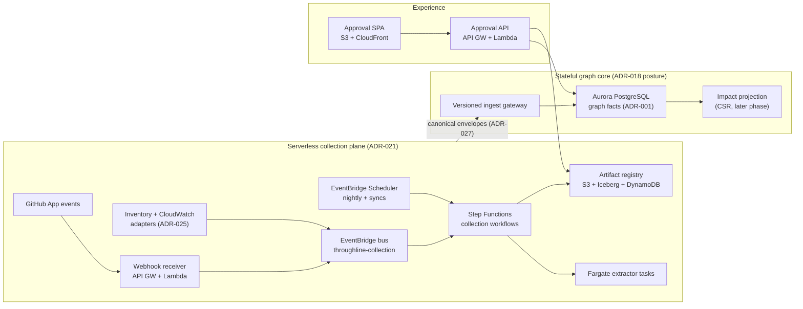
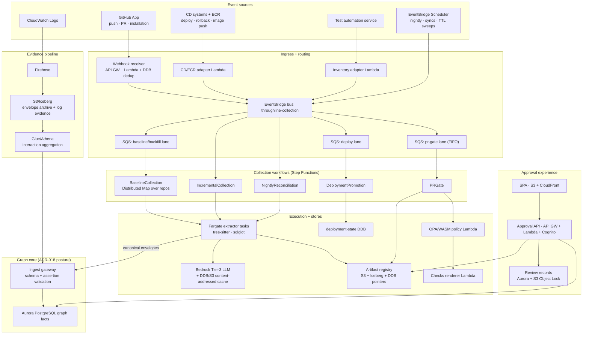
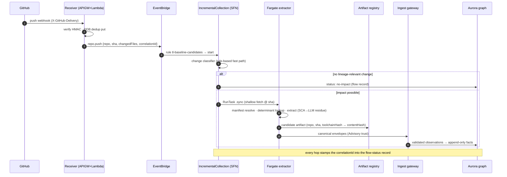
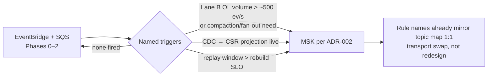

# 02 — AWS Architecture for the Lineage Collection Service

| | |
|---|---|
| **Status** | Draft — for review |
| **Role** | Normative mapping of every collection-pipeline component to a named AWS service, with the plane boundary from ADR-021 drawn explicitly. Decisions and rationale live in [01-decision-records.md](01-decision-records.md); scale math and failure modes in [08-scale-resilience-observability.md](08-scale-resilience-observability.md). |
| **Scale anchor** | 10,000 repos, ≥1 deployment/repo/day, spiky ([08](08-scale-resilience-observability.md) §1). Pilot = one Business Application (3–5 repos). |

## 1. The two planes

ADR-021 splits the platform into a **serverless collection plane** (stateless, bursty, event-driven — everything in this document) and the **stateful graph core** (Aurora PostgreSQL system of record, CSR impact projection, future Kafka consumers — governed by ADR-018 and the v8 HLD, unchanged here). The boundary is a one-way street: the collection plane writes to the core through the versioned ingest gateway and reads through the published APIs; nothing in the core invokes collection.

## 2. The twelve pipeline components → AWS services

The required pipeline components are defined in [../platform-10-de-review/README.md](../platform-10-de-review/README.md) §6.2. This table is the normative realization; [07-verification-and-acceptance.md](07-verification-and-acceptance.md) checks it stays 1:1.

| # | Component (de-review §6.2) | AWS realization | Notes |
|---|---|---|---|
| 1 | SCM App/webhook receiver with deduplication and installation-scoped credentials | **API Gateway (HTTP API) → Lambda**. HMAC signature verification; dedup by DynamoDB conditional put on the `X-GitHub-Delivery` GUID (TTL 7 days); enrich with installation context; emit normalized events to the **EventBridge bus** | ADR-023. App private key in Secrets Manager, rotated |
| 2 | Manifest resolver (repo/monorepo path → service/environment) | **Lambda** workflow step: fetch `throughline.yaml` + `lineage/<artifact>.yaml` via Contents API, validate against JSON Schema (ADR-027 registry), resolve changed paths → service URNs | Unmapped paths → `unmapped-paths` warn, never a silent skip (HLD §6.2) |
| 3 | Incremental extractor runner with isolated, least-privilege source access | **ECS Fargate task** (Graviton; Spot for nightly/backfill waves), invoked `.sync` from Step Functions. Image packages tree-sitter, sqlglot, and the extractor implementing the contract in [04](04-collection-workflow-spec.md) §4 (the scout-agent archetype/gap scripts are the seed implementation). Task role scoped to one installation token, no ambient credentials | ADR-021. PR path uses shallow fetch + cached image layers to stay inside the gate budget |
| 4 | Immutable artifact registry keyed by repo, commit SHA, extractor/toolchain version, content hash | **S3** content-addressed objects (`artifacts/{contentHash}`), **Iceberg** index table in **Glue Data Catalog** (queryable history, ADR-003 alignment), **DynamoDB** pointer table `(repo, sha, toolchainHash) → contentHash` for O(1) lookups | Reproducibility fields (extractor/parser/prompt/model versions) inside the artifact per [../lineage-collection-assessment.md](../lineage-collection-assessment.md) §3 |
| 5 | Baseline resolver keyed by environment's last successful deployment, not default-branch HEAD | **Lambda** + **DynamoDB** `deployment-state` table `(environment, serviceUrn) → {artifactDigest, contentHash, deployedAt}` | The single most-cited correctness rule in the de-review; enforced here as the only baseline lookup path |
| 6 | Versioned diff engine (entities, edges, transforms, schemas, codeRefs) | **Lambda** — pure function over two artifacts producing `{added, changed, removed}` + schema deltas + codeRef hits; **Fargate** fallback above a size threshold | Delta format in [04](04-collection-workflow-spec.md) §6 |
| 7 | Snapshot-pinned impact service with bounded traversal | Pilot: **Lambda + Aurora recursive CTE** (a one-app graph is small; ADR-001 names CTEs the fallback). Phase 3+: **ECS service** holding the CSR projection — stateful, lives in the graph core under ADR-018 | Every decision pins `{snapshotId, policyVersion, confidenceModelVersion}` (ADR-004) |
| 8 | Policy decision service and waiver store | **OPA compiled to WASM inside Lambda**; policy bundles built from the policy git repo → S3, versioned; decision logs → S3; **waivers in Aurora** with HLD §6.5 semantics verbatim (downstream-owner/steward approver, ≤90 d expiry, self-approval rejected, >10 %/30 d circuit breaker) | Rego stays the policy language (ADR-011) |
| 9 | SCM check/comment renderer with stable annotation IDs | **Lambda** → Checks API + one PR comment updated in place (stable annotation IDs, no comment spam); renders the delta and the accept/correct entry point | Observe → warn → block ramp per ADR-011 |
| 10 | Deployment and rollback event adapter | **EventBridge**: native **ECR image-push** events (digest signal) + CD events (CodePipeline native; Harness/ArgoCD/Spinnaker via a receiver Lambda) → promotion Lambda writing `deployment-state` | Emits the F-06 alert: *digest observed in prod with no lineage package* |
| 11 | Nightly reconciliation scheduler | **EventBridge Scheduler** → NightlyReconciliation Step Function (full rescan on Fargate Spot, diff vs incremental state → drift findings; Lane B/C sweeps) | The F-03 "divergence rate as bug detector" metric is computed here |
| 12 | Metrics, audit, DLQ/replay, operator tooling | **CloudWatch** metrics/alarms + **per-consumer SQS DLQs** + **Firehose → S3/Iceberg envelope archive** + a standing **replay Step Function** reading the archive; audit = append-only Aurora tables + S3 export | Correlation-ID tracing and flow-status records per ADR-026, spec in [08](08-scale-resilience-observability.md) §5 |

## 3. Components beyond the twelve

| Component | AWS realization | Governing ADR |
|---|---|---|
| Business App registry | **DynamoDB** table + registration API (`POST /v1/apps`): `{appId, name, team, domain, repos[], serviceUrns[], environments[]}`; registration emits `onboarding.registered`. Seeded from the service catalog; catalog sync keeps it honest | ADR-020 |
| Test-automation inventory adapter | **Lambda** (scheduled + onboarding-triggered) pulling the active-repo set; emits `repo.inventory.delta` | ADR-025 |
| CloudWatch interaction pipeline | **CloudWatch Logs subscription filters → Firehose → S3/Iceberg**; scheduled **Glue/Athena** aggregation → `CloudWatchInteractionAggregate` observations through the ingest gateway. Raw log lines never enter the graph (metadata-only boundary) | ADR-025 |
| Tier-3 LLM extraction | **Amazon Bedrock** (pinned model versions, temperature 0), fronted by the **content-addressed cache**: DynamoDB key `(codeSliceHash, schemaHash, modelVersion, promptVersion)` → S3 result. Cache is central and shared (F-04) — never per-runner. Bedrock batch inference for nightly re-extraction waves. Secret-scanning before prompt assembly (Deep Dive security posture). **Only deterministic edges can ever fail a build** | ADR-021, F-04 |
| Schema registry (canonical schema) | Git-versioned **JSON Schema** documents published to **S3**, served to gateway validators with version pinning; **Glue Schema Registry** is the managed step-up if Avro/protobuf transport arrives with Kafka (ADR-022 trigger) | ADR-027 |
| Ingest gateway | **API Gateway + Lambda** validating every envelope against `(schemaVersion, signal)` + the assertion-constraint table; accepted → Firehose archive + graph-core handoff; rejected → DLQ with reason | ADR-027 |
| Approval UI + API | **S3 + CloudFront** SPA; **API Gateway (HTTP API) + Lambda** approval API; **Cognito** federated to corporate OIDC, groups → `viewer`/`domain-steward`/`platform-admin` | ADR-024, HLD §9.1 |
| Review-record store | Append-only **Aurora** tables + content-addressed, hash-chained **S3 objects under Object Lock** (governance mode) | ADR-024 |
| IaC | CDK (TypeScript) with module boundaries mirroring the plane split; one stack set per phase in [06](06-delivery-roadmap.md) | ADR-021 consequence |

## 4. Full component architecture

## 5. The push→publish path (sequence)

## 6. Backbone-to-Kafka migration path (ADR-022)

## 7. Security posture (inherited, applied)

- **Metadata-only boundary** enforced at the ingest gateway (rejects value-bearing fields) and at the CloudWatch aggregator (identities and counts only) — per ADR-016 and the assessment's gateway rules.
- **Installation-scoped, short-lived credentials** for all repo access; the GitHub App key in Secrets Manager; Fargate task roles scoped per-run.
- **Code-to-LLM controls**: scoped Bedrock endpoints, no training on submitted code, secret-scanning before prompt assembly, classification-aware access on the graph — the Deep Dive's pre-Phase-1 security requirements, realized here.
- **RBAC**: Cognito→OIDC groups map to HLD §9.1 roles; PII-tagged lineage reads audited for all human roles.
