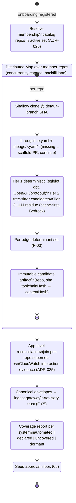
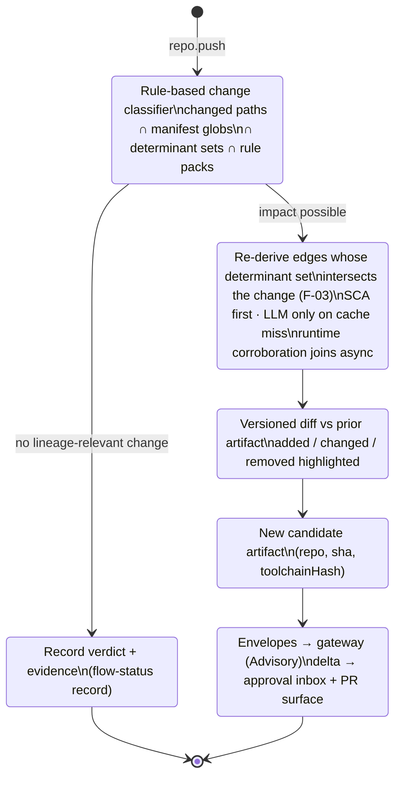
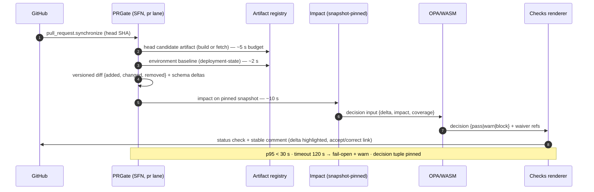
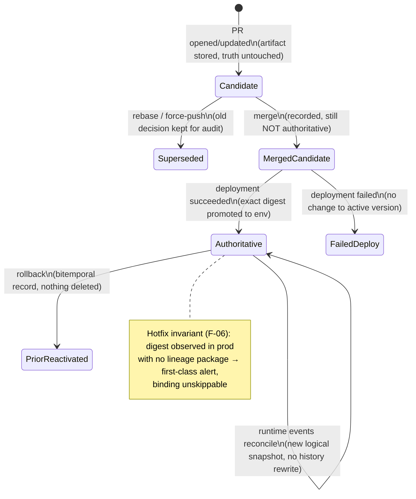

# 04 — Collection Workflow Specification

| | |
|---|---|
| **Status** | Draft — for review (normative once approved) |
| **Role** | Specifies the two collection processes (baseline and incremental), the three supporting workflows, the canonical observation schema (ADR-027), and the artifact/determinant contracts. Contracts already normative elsewhere — the ingestion envelope, the 9-step reconciliation, the immutable-artifact fields — are referenced from [../lineage-collection-assessment.md](../lineage-collection-assessment.md), never restated. |

## 1. Process 1 — BaselineCollection (Business-Application-scoped)

Triggered by rows 1–3 of the [trigger matrix](03-trigger-matrix.md). The context-rich path: it may take hours, it runs in the backfill lane, and it builds the app-level picture the incremental process will later lean on.



Notes:
- **Repos are analyzed independently and reconciled at the app level** (ADR-020). Cross-repo edges come only from the reconciliation stage's evidence joins (CloudWatch now; OTel/OpenLineage as they arrive) — never from a static analyzer pretending to cross a boundary.
- Partial failure is a first-class outcome: a repo whose extraction fails lands in the coverage report as `error`, the app baseline still completes, and the flow-status record shows exactly which member failed and why.
- Re-running baseline for an already-baselined app is cheap by construction: unchanged `(repo, sha, toolchainHash)` keys hit the artifact registry and skip extraction.

## 2. Process 2 — IncrementalCollection (repo-scoped)

Triggered by row 4 (push). Deliberately lightweight: the baseline already exists, so the job is to decide *whether* the change translates to lineage impact, re-derive *only* what the change determines, and publish a clearly highlighted delta.



Notes:
- **The classifier is the fast path, not a soundness shortcut.** Its "no impact" verdict is only trusted because invalidation is determinant-based (§7): an edge's determinant set names every file, symbol, and config key that contributed to deriving it, so "changed set ∩ determinant sets = ∅ (and no manifest/schema globs hit)" is a sound exit. Forward reachability from changed files alone is documented as unsound (F-03) and is not used.
- The classifier's rule packs (per file type: SQL, dbt, OpenAPI, IaC, application code, config) are code-reviewed configuration, versioned with the toolchain hash.
- **The three paths (SCA, LLM, runtime) are a ladder here, not a triple-run**: SCA re-derives deterministically; the LLM is consulted only for residue slices whose content hash misses the shared cache (F-04); runtime corroboration arrives asynchronously through the standing evidence pipelines and re-scores the affected edges when it lands. A push therefore costs seconds-to-minutes, not a baseline.
- The safety net for classifier bugs is trigger row 10: the nightly full rescan diffs against the incremental state, and the divergence rate is a published metric — if the fast path ever skips real impact, it surfaces as drift within a day, with the offending rule pack identifiable.

## 3. PRGate

Row 5–6. Runs in the priority lane against the **environment baseline** (last successful deployment — de-review component 5), pinned snapshot, OPA decision, single updated check/comment. Latency budget inherited verbatim from HLD §6.1: p95 < 30 s end-to-end, hard timeout 120 s → fail-open + warn annotation. The PR path never waits on a cold clone (shallow fetch + cached image layers; warm pool from Phase 3 if p95 demands it). Only deterministic edges can fail a build — LLM-derived edges surface as information, never as gate cause (F-04).



## 4. DeploymentPromotion and NightlyReconciliation

**DeploymentPromotion** (rows 8–9) implements the deployment-authority state machine from [../platform-10-de-review/README.md](../platform-10-de-review/README.md) §6.1 exactly; the diagram below is that table in picture form.



**NightlyReconciliation** (row 10): full rescan on Fargate Spot → diff vs incremental state → drift findings as issues/alerts (never silent overwrite) → Lane B OpenLineage/warehouse joins → Lane C scanner sweep → publish the incremental-vs-full divergence metric (the F-03 bug detector; target trend in [07](07-verification-and-acceptance.md)).

## 5. The canonical observation schema (ADR-027)

### 5.1 Shape

Every mechanism — SCA, LLM residue, runtime (OpenLineage, CloudWatch/OTel aggregates), registry sync, declared contracts — emits:

```
ingestion envelope (verbatim from ../lineage-collection-assessment.md §2)
└── payload: OpenLineage-aligned observation
    ├── standard OL fields: job / run / dataset identities, columnLineage facet where applicable
    └── namespaced custom facets (tl.*):
        tl.path        {pathId, guard, codeRef, frequency?}
        tl.transform   {expression, language, provenance}
        tl.determinants[ {file, symbol?, configKey?, contentHash} ]   ← F-03
        tl.provenance  {signal, tier, extractorVersion, parserVersion?, promptVersion?, modelVersion?}
        tl.interaction {peer, channel, count, recency, errorRate?, latency?}   ← aggregates only
```

The envelope's `producer`, `provenance.signal`, `idempotencyKey`, `orderingKey`, `commitSha`, and `deploymentId` fields are exactly the assessment's; nothing is redefined.

### 5.2 Assertion-constraint table (normative, machine-enforced)

Derived from the signal responsibility matrix; the gateway validates each event's populated fields against its declared `provenance.signal`. Violations → DLQ with reason `assertion-violation`.

| Signal | MAY populate | MUST NOT populate |
|---|---|---|
| `sca` (Tier 1/2 deterministic + tree-sitter) | dataset/column candidates, `tl.transform`, `tl.path.guard/codeRef`, `tl.determinants`, schema intent | `tl.path.frequency`, run stats, any runtime recency |
| `llm` (Tier 3 residue) | proposed column mapping, `tl.transform`, `tl.path.guard` | authoritative types; any confidence field (LLM self-confidence is excluded from scoring by design); runtime fields |
| `spark-ol` / `airflow-ol` / `warehouse` | observed dataset/column edges (where facets exist), run stats, `tl.path.frequency` | complete-coverage claims when facets are absent (coverage is measured per operation, not per event) |
| `cloudwatch-agg` / `otel-agg` | `tl.interaction` (peer, channel, counts, recency, latency, error rate) | column/field mappings of any kind |
| `registry` | entity schema, type/version truth | transforms, execution evidence |
| `declared` (`lineage.yaml`) | owner-attested edges + TTL | Verified status without runtime corroboration (Probable ceiling) |

### 5.3 Validation pipeline

Gateway order of operations (extends the assessment's gateway rules): authenticate workload identity → envelope JSON Schema for `schemaVersion` → payload schema for `(schemaVersion, signal)` → assertion-constraint check → metadata-only boundary (reject value-bearing fields) → durable accept (archive + hand-off) → ack. Consumers stay idempotent; replay converges.

### 5.4 Evolution rules

Additive-first: new optional fields and new facets are minor versions; removing or re-typing a field is a major version requiring a **dual-publish window** (emitters publish both versions; consumers migrate; old version retired on a dated schedule). The registry (git-versioned JSON Schema → S3) is the single source; validators pin versions; a schema change is a reviewed PR like any code change. Prompt/model bumps are *toolchain* versions, not schema versions — they flow through trigger row 15.

## 6. Artifact and delta contracts

**Candidate artifact** — fields verbatim from [../lineage-collection-assessment.md](../lineage-collection-assessment.md) §3 (repo+SHA, environment intent, entities/aliases, candidate edges with level/channel/transform/guard/codeRef, extractor/parser/prompt/model versions, per-edge provenance, unsupported-construct findings, artifact hash). This package adds one required section: `determinants` (§7). Same commit + toolchain ⇒ identical artifact hash — checked in CI ([07](07-verification-and-acceptance.md)).

**Delta** — the diff engine's output, consumed by the PR comment, the approval UI's delta review, and the gate:

```json
{
  "baseArtifact": "sha256:…", "headArtifact": "sha256:…",
  "baseline": {"kind": "environment", "environment": "prod", "deploymentId": "…"},
  "added":   [ {"edge": {…}, "provenance": "sca|llm", "materiality": "material|minor"} ],
  "changed": [ {"before": {…}, "after": {…}, "changeKind": "transform|guard|schema|channel"} ],
  "removed": [ {"edge": {…}, "reason": "code-removed|determinant-invalidated"} ],
  "schemaDeltas": [ … ],
  "coverageDelta": {"pathsConfirmed": 3, "pathsTotal": 4}
}
```

`materiality` drives the approval UI's per-edge acknowledgement requirement (material mappings only, ADR-024). Before/after pairs in `changed` are exactly what the UI renders side-by-side and what the review record freezes.

## 7. Determinant-set contract (F-03)

Per emitted edge, the extractor records every input whose content contributed to deriving it: files (always), symbols (where resolution occurred), config keys (profiles, bean qualifiers, serialization annotations), each with a content hash. Invalidation rule: **an edge is re-derived iff any determinant's content hash changes** — sound and still incremental. The classifier (§2) consumes the inverted index (determinant → edges); the nightly divergence metric (§4) is the standing proof the index is honest. Determinant sets ship inside the artifact and as the `tl.determinants` facet, so the graph core can answer "why does this edge exist" with evidence.
