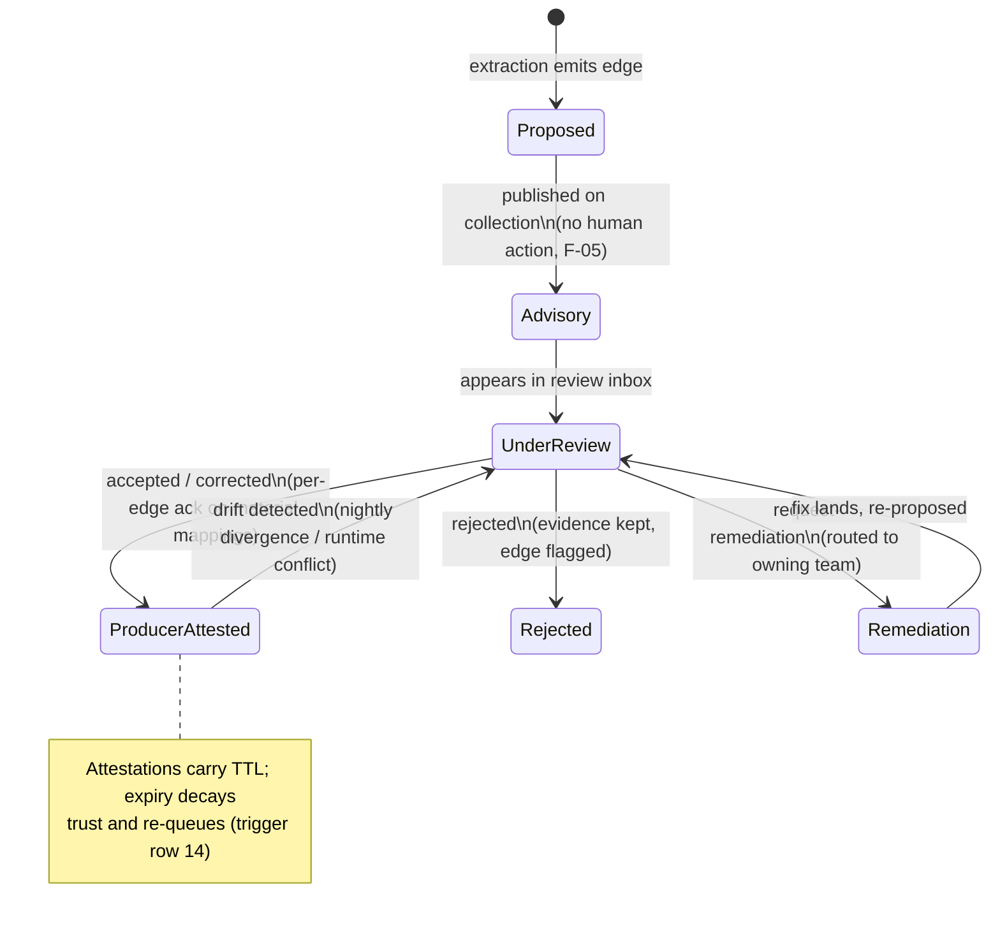
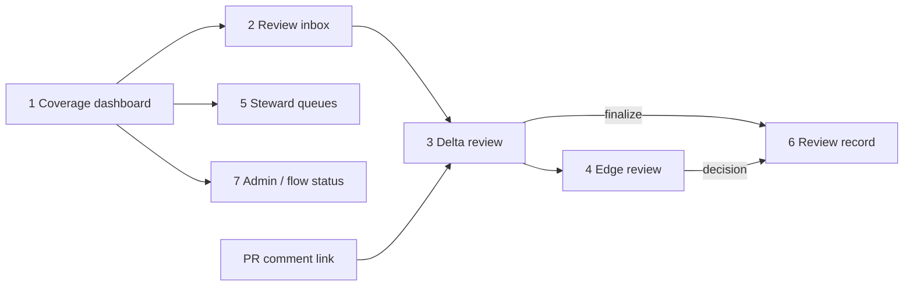

# 05 — Approval Experience Specification

| | |
|---|---|
| **Status** | Draft — for review |
| **Role** | Specifies the approval UI: screens, state rendering, API surface, roles, and review-record mechanics. Decision and rationale in [ADR-024](01-decision-records.md#adr-024-approval-experience--trust-promotion-through-immutable-review-records); object semantics (waivers, attestations) referenced from [../architecture-review-v8/04-high-level-design.md](../architecture-review-v8/04-high-level-design.md) §6.5–§9, never redefined. |
| **Stack** | React SPA on S3 + CloudFront · API Gateway (HTTP API) + Lambda · Cognito federated to corporate OIDC. Confidence renders as `{score, band}` — integer + band, never decimals (ADR-008). |

## 1. What this UI is for

Collection publishes lineage at **Advisory** trust with no human in the loop (F-05). This UI is where humans add what automation cannot: per-edge judgement on material mappings, before/after-audited corrections, steward decisions on identity and waivers, and the trust promotion that makes edges **Producer-attested**. It is also where anyone answers "what did collection find, and where is my run?" — for Business Applications, not repos (ADR-020: the app is the approval and reporting unit).

## 2. Trust ladder

Runtime corroboration moves the *confidence band* (Inferred/Probable/Verified) independently of this ladder — trust (human) and confidence (evidence) are orthogonal axes, both visible on every edge.

## 3. Screens

| # | Screen | Contents | Primary roles |
|---|---|---|---|
| 1 | **Coverage dashboard** (landing) | Per Business App: systems by coverage state (`automated` / `declared` / `uncovered` / `dormant` / `error`), % edges by trust and band, review backlog, freshness. `not-observed` regions get first-class blind-spot treatment — never blank space | all |
| 2 | **Review inbox** | Proposals awaiting decisions, filterable by app/repo/materiality/age; SLA aging surfaced. Bulk operations exist only for *non-material* edges (bulk-accept of material mappings is structurally impossible — ADR-024) | viewer (read), steward |
| 3 | **Delta review** | The `{added, changed, removed}` delta from a push/PR with **before/after side-by-side** per changed edge; per-edge highlight; jump-link from the PR comment. Accept/correct/reject per edge; material edges require explicit acknowledgement | edge owner, steward |
| 4 | **Edge review** | Single-edge deep view: evidence panel (which signals assert it, per the provenance facet), confidence `{score, band}` with the runtime-less cap surfaced ("capped at 64 — no runtime corroboration yet"), determinants ("why this edge exists"), path/guard/codeRef, decision actions (IMP-009: acknowledge, comment, accept, correct, reject, request-remediation) | edge owner, steward |
| 5 | **Steward queues** | Three tabs: **identity merges** (fuzzy candidates — approve/reject; never auto-merged, ADR-006), **waivers** (HLD §6.5: downstream-owner/steward approver, ≤90 d expiry, self-approval rejected; circuit-breaker status per rule), **attestations/drift** (TTL renewals, nightly drift findings triage) | domain-steward, platform-admin |
| 6 | **Review-record viewer** | Immutable records: proposal, per-edge decisions with **before/after states**, actors, timestamps; export (IMP-011); hash-chain verification indicator | all (read), audited |
| 7 | **Admin & flow status** | Business App registry CRUD; GitHub App installation health; ramp stage per domain (observe/warn/block); waiver circuit-breaker board; **"where is my run?"** — flow-status lookup by repo/SHA/correlation ID showing each stage with timestamps (ADR-026) | platform-admin (flow status: all) |

Screen flow:

## 4. State rendering — the seven-state consumer contract

The UI renders all seven states from HLD §8, verbatim semantics:

| State | UI treatment |
|---|---|
| `no-dependency` | Plain absence — nothing drawn, no caveat |
| `not-observed` | First-class blind-spot: hatched region + "no signal has observed this" + which collector would cover it — **never blank** |
| `stale` | Dimmed edge + age badge ("last observed 12 d ago"); excluded from Verified styling |
| `retired` | Ghosted with "was connected until <date>"; queryable via history toggle |
| `cold-path` | Dashed edge, always visible, labeled Possible in impact contexts (the "low confidence ≠ low risk" invariant) |
| `error` | Explicit error chip with reason + flow-status link; never silently omitted |
| `truncated` | Count + "N more…" continuation control; never an unlabeled cut |

## 5. API surface (extends the HLD §7 catalog; endpoints 21–29)

| # | Endpoint | Purpose |
|---|---|---|
| 21 | `POST /v1/apps` · `GET /v1/apps/{id}` | Business App registration/read (registration emits trigger row 1) |
| 22 | `GET /v1/apps/{id}/coverage` | Coverage dashboard payload (states, trust/band distributions, backlog) |
| 23 | `GET /v1/proposals?app&repo&status` | Review inbox listing |
| 24 | `GET /v1/proposals/{proposalId}` | Full proposal: delta, evidence, materiality flags |
| 25 | `POST /v1/proposals/{proposalId}/edges/{edgeId}/decision` | Per-edge decision `{action: acknowledge\|accept\|correct\|reject\|request-remediation, correction?, comment?}` — server captures before/after |
| 26 | `POST /v1/proposals/{proposalId}/finalize` | Freeze decisions → immutable review record → trust promotion (trigger row 16) |
| 27 | `GET /v1/review-records/{id}` | Immutable record read/export (IMP-011) |
| 28 | `POST /v1/identity-merges/{candidateId}/decision` | Steward merge confirm/reject (ADR-006) |
| 29 | `GET /v1/flows/{correlationId}/status` | Flow-status record — "where is my run?" (ADR-026) |

Existing endpoints referenced, not redefined: `POST /v1/attestations`, waiver create/list (HLD §6.5), `GET /v1/entities/{id}/lineage`, `GET /v1/coverage`.

## 6. Roles and authorization (HLD §9.1 applied)

| Action | viewer | domain-steward | platform-admin |
|---|---|---|---|
| Browse coverage, proposals, records, flow status | ✓ | ✓ | ✓ |
| Per-edge decisions on owned edges | ✓ (own team's) | ✓ (domain) | ✓ |
| Finalize a proposal | — | ✓ | ✓ |
| Identity-merge decisions | — | ✓ | ✓ |
| Waiver approval | — | ✓ (as downstream owner/steward; **self-approval rejected server-side**) | ✓ |
| App registry, ramp stage, installations | — | — | ✓ |

Service accounts are denied UI-scoped endpoints unless explicitly scoped; PII-tagged lineage reads are audited for all human roles (ADR-016).

## 7. Review-record immutability mechanics

Finalize (`POST …/finalize`) executes atomically: (1) write the record row-set to append-only Aurora tables (no UPDATE grants on these tables for the API role); (2) serialize the canonical record JSON, compute its hash, set `previousRecordHash` to the app's latest record (hash chain); (3) put to S3 under Object Lock (governance mode, retention per compliance policy); (4) apply trust promotions; (5) emit `proposal.finalized` + calibration-corpus events (`{edge, engineSaid, humanSaid, provenance, archetype, repo, commit, reviewer, acknowledged}` — the per-edge `acknowledged` flag distinguishes reviewed labels from unreviewed pass-through, which is what makes the corpus usable). Corrections after finalize = a new proposal referencing the old record; nothing is ever rewritten.

## 8. Non-functional notes

- Inbox/dashboard queries p95 < 500 ms (inherits the HLD UI-fetch SLO); delta review renders progressively for large deltas (`truncated` state, endpoint pagination).
- Accessibility: severity/trust are never color-only (badge text + line style); keyboard-completable decision flow — the DE review calls out the prototype's a11y gaps; this surface must not repeat them.
- The UI never renders the whole graph; every view is app-scoped or edge-scoped (PRD 3's founding principle).
