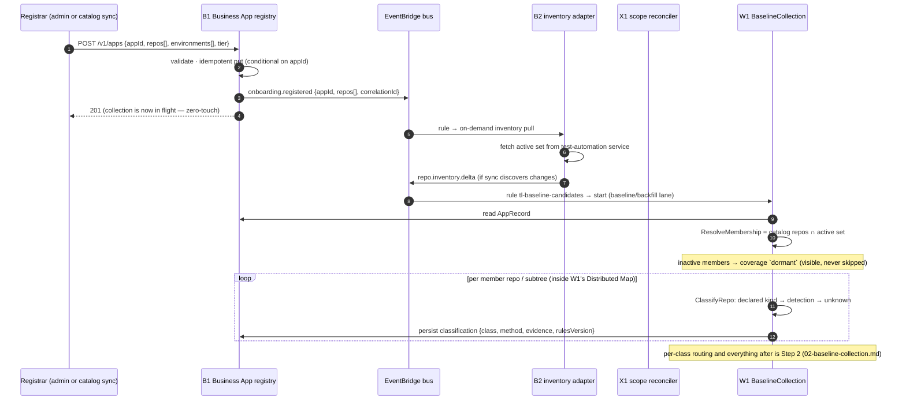
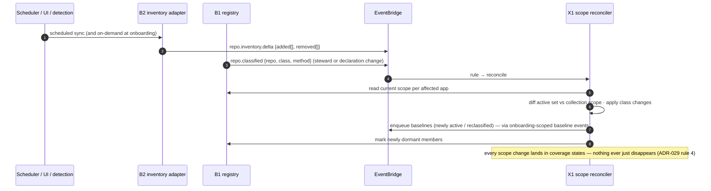
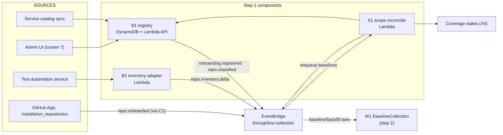

# 01 — Step 1: Onboard a Business Application

| | |
|---|---|
| **Status** | Draft — for review (normative once approved) |
| **Step** | Register the app → resolve member repos (service catalog ∩ test-automation active inventory) → classify each repo (application / library / infrastructure / documentation / tooling / unknown) |
| **Runs** | Once per Business Application, then continuously via inventory syncs and classification deltas |
| **PRD homes** | B1 Business App registry · B2 test-automation inventory adapter · X1 scope reconciler ([00-component-inventory.md](00-component-inventory.md)) |

## 1. Step overview and boundaries

Onboarding turns a Business Application from a catalog entry into a resolved, classified collection scope — with zero manual invocation. A `POST /v1/apps` (or catalog sync) emits `onboarding.registered`; membership is resolved as *catalog repos ∩ test-automation active set* (ADR-025); every member repo (or monorepo subtree) gets an ADR-029 classification; and the resulting scope launches BaselineCollection (W1). Onboarding never ends: inventory syncs and reclassifications (trigger row 3) keep the scope honest for the life of the app.

- **Owned trigger rows:** 1 (registration → the onboarding half: membership + classification), 2 (`repo.onboarded` via GitHub App installation), 3 (`repo.inventory.delta` / `repo.classified`).
- **Entry events:** `onboarding.registered` · `repo.onboarded` · `repo.inventory.delta` · `repo.classified`.
- **Exit events / state mutated:** a resolved `AppRecord` (memberRepos with `active` + `classification`) in the B1 registry; W1 execution started; coverage entries (`dormant`, `excluded:<class>`, `unclassified`) seeded.
- **Not in this step:** extraction, reconciliation, publication (step 2 — row 1's collection half); the GitHub App webhook mechanics beyond `installation_repositories` (C1's PRD is in [03](03-incremental-collection.md)); coverage-report assembly (X4's PRD is in [02](02-baseline-collection.md)).

## 2. Normative inputs

| Source | What it governs here | Mode |
|---|---|---|
| [ADR-020](../aws-lineage-collection-plan/01-decision-records.md) | Three scoping units; the Business App as onboarding/approval/reporting unit; registry as hard dependency of baseline | referenced |
| [ADR-023](../aws-lineage-collection-plan/01-decision-records.md) | Zero-touch: repo-added ⇒ collection begins; no manual invoke point anywhere | referenced |
| [ADR-025](../aws-lineage-collection-plan/01-decision-records.md) | Catalog = membership authority; test-automation service = activity authority; dormant is visible, never skipped | referenced |
| [ADR-029](../aws-lineage-collection-plan/01-decision-records.md) | Classes; declared-first → detected-fallback → `unknown`; exclusion is a recorded, reversible state | referenced |
| [Trigger matrix rows 1–3](../aws-lineage-collection-plan/03-trigger-matrix.md) | Event semantics and products | referenced |
| [Workflow spec §1, §8](../aws-lineage-collection-plan/04-collection-workflow-spec.md) | ResolveMembership/ClassifyRepo stages; per-class treatment table | referenced |
| [`contracts/schemas/repo-classification.schema.json`](contracts/schemas/repo-classification.schema.json) | AppRecord + classification shapes | **new — normative here** |
| [`contracts/openapi/registry-api.openapi.yaml`](contracts/openapi/registry-api.openapi.yaml) | Endpoints 21–22 + reclassification | **new — normative here** |
| [`contracts/events/event-catalog.md`](contracts/events/event-catalog.md) rows 1–3 | Event payloads, idempotency keys, lanes | **new — normative here** |

## 3. Process flow

### 3.1 Happy path



Row 2 (`repo.onboarded`) is the single-repo variant: the GitHub App installation gains a repo, C1 emits the event, and the same classify-then-baseline path runs for that repo alone — publication is not merge-gated (F-05); a missing `throughline.yaml` produces a scaffold PR and the flow continues.

### 3.2 The standing loop (row 3)



### 3.3 Failure and ordering

- **Registration is idempotent** on `appId`: identical re-registration is a no-op 201/200; a differing body is a 409 (the catalog sync resolves by re-reading and diffing).
- **Test-automation service unreachable at onboarding:** membership resolution proceeds with the catalog set and marks activity `unknown-pending-inventory`; the scheduled sync repairs it. Baseline is *not* blocked on the activity authority — over-scan is the safe direction (mirrors ADR-029's `unknown` posture). The flow-status record shows the degraded resolution.
- **Out-of-order row-3 events:** X1 treats inventory deltas as *sets* against the current registry state, not as incremental instructions — replaying or reordering deltas converges (last-writer-wins per `(repo, syncRunId)` with the registry as the merge point).
- **Duplicate events:** consumers dedup on the catalog keys in [`event-catalog.md`](contracts/events/event-catalog.md) rows 1–3.
- **DLQ:** X1 and B2 consumers each have a DLQ (C12); a poisoned inventory payload quarantines with reason and alerts at depth > 100.

## 4. Components in this step

| ID | Role here | PRD |
|---|---|---|
| B1 Business App registry | System of record for apps, membership, classification; emits rows 1, 3 | **this doc §5.1** |
| B2 inventory adapter | Pulls active set; emits `repo.inventory.delta` | **this doc §5.2** |
| X1 scope reconciler | Diffs activity/classification against scope; enqueues/dormants/reclassifies | **this doc §5.3** |
| C1 webhook receiver | Emits `repo.onboarded` on installation change | [03 §5.1](03-incremental-collection.md) |
| C2 manifest resolver | Reads declared `kind:` during classification | [02 §5.1](02-baseline-collection.md) |
| X4 coverage reporter | Receives `dormant`/`excluded:*`/`unclassified` states | [02 §5.5](02-baseline-collection.md) |
| W1 BaselineCollection | Hosts ResolveMembership + ClassifyRepo stages | [02 §5.6](02-baseline-collection.md) |
| B8 approval UI | Screen 7 registry CRUD; screen 1 reclassify action | [06 §5.1](06-approval.md) |
| C12 metrics/audit/DLQ | Flow-status records, DLQs, audit of reclassification | [08 §5.1](08-scale-and-visibility.md) |

## 5. Component PRDs

### 5.1 B1 — Business App registry

**Purpose.** The machine-readable system of record for Business Applications: identity, team/domain ownership, member repos, environments, criticality tier, and per-member-repo classification. ADR-020 makes it a hard dependency of baseline collection; it did not previously exist as a machine-readable object.

**Requirements.**

- REQ-B1-01 (MUST) Expose `POST /v1/apps` and `GET /v1/apps/{id}` per [`registry-api.openapi.yaml`](contracts/openapi/registry-api.openapi.yaml); records validate against [`repo-classification.schema.json`](contracts/schemas/repo-classification.schema.json).
- REQ-B1-02 (MUST) Emit `onboarding.registered` exactly once per accepted registration (idempotent on `appId` + registration hash) and `repo.classified` on every classification change, each carrying a `correlationId`.
- REQ-B1-03 (MUST) Store classification per member repo *and* per monorepo subtree, with `method ∈ {declared, detected, steward}`, detection evidence, and detection-rules version; a `declared` classification always wins over `detected`.
- REQ-B1-04 (MUST) Support steward reclassification (`PUT …/classification`) restricted to `domain-steward`/`platform-admin`, audited (actor, reason, before/after) via C12's append-only audit tables.
- REQ-B1-05 (MUST) Accept catalog syncs that add/remove member repos; removals never delete history — a removed member's coverage rows remain queryable with an end date.
- REQ-B1-06 (MUST NOT) Offer any endpoint whose effect is "run collection now" (ADR-023). Registration *causes* collection as a side effect of the event, not as an RPC.
- REQ-B1-07 (SHOULD) Serve reads at p95 < 100 ms (registry reads sit inside W1 startup and X1 reconciliation).

**Interfaces.** Produces: `onboarding.registered`, `repo.classified` (event catalog rows 1, 3). API: endpoints 21–22 + reclassification. Store: DynamoDB `business-apps` table (PK `appId`), GSI on `repo` → apps (a repo can serve multiple apps; membership is many-to-many). Consumed by: W1, X1, X2 (class gate), X4, B8.

### 5.2 B2 — Test-automation inventory adapter

**Purpose.** Bridge to the organization's activity authority: pulls the active-repo set from the test-automation service on a schedule and on demand at onboarding, and emits deltas. Keeps a 10,000-repo estate from being scanned as if all of it were alive (planning value: active fraction a = 0.7 → 7,000 active of R = 10,000; formulas in [08 §1](../aws-lineage-collection-plan/08-scale-resilience-observability.md)).

**Requirements.**

- REQ-B2-01 (MUST) Pull the full active set on schedule (default hourly) and on `onboarding.registered` (scoped to the app's repos), via the test-automation service's API with workload credentials.
- REQ-B2-02 (MUST) Emit `repo.inventory.delta {added[], removed[]}` only when the set changed; idempotency key = sync-run ID; full-set snapshots persist to S3 for X1's set-based reconciliation.
- REQ-B2-03 (MUST) On upstream failure: retry with backoff (3 attempts), then emit nothing and alarm — a failed sync MUST NOT emit an empty active set (which would dormant the estate). Staleness of the last good snapshot is a published SLI.
- REQ-B2-04 (MUST) Record `test.run.completed` passthrough metadata unchanged (row 17 consumer is in [04](04-runtime-corroboration.md); B2 only relays the subscription).
- REQ-B2-05 (SHOULD) Cross-check git-activity heuristics as a *metric only* (ADR-025 alternatives: heuristics never decide activity).

**Interfaces.** Produces: `repo.inventory.delta` (row 3). Consumes: `onboarding.registered`. Store: S3 `inventory-snapshots/{syncRunId}.json`. Upstream: test-automation service API (live dependency — §10).

### 5.3 X1 — Scope reconciler

**Purpose.** The standing consumer of row 3: converges collection scope with reality. Newly active members get baselines enqueued; newly inactive members get marked `dormant`; reclassified repos re-enter through the baseline flow with their new per-class treatment. Exclusion is a recorded, reversible state — nothing silently leaves scope.

**Requirements.**

- REQ-X1-01 (MUST) On `repo.inventory.delta` or `repo.classified`: compute, per affected app, `(newlyActive, newlyDormant, reclassified)` as set differences between the latest inventory snapshot + registry state and the current collection scope.
- REQ-X1-02 (MUST) For `newlyActive` and `reclassified`: enqueue single-repo baseline entries on the baseline/backfill lane (never the pr-gate lane), keyed so duplicate enqueues collapse (`(repo, snapshotId)`).
- REQ-X1-03 (MUST) For `newlyDormant`: write the `dormant` coverage state with the evidence (which sync run) — never delete edges or entities (a dormant repo's published lineage stays, aging via freshness).
- REQ-X1-04 (MUST) Be replay-safe: reconciliation is a pure function of (registry state, latest snapshot); reprocessing any delta sequence converges to the same scope.
- REQ-X1-05 (MUST) Write a flow-status record per reconciliation run (`trigger: repo.inventory.delta`, stages `received → reconciled → reported`).
- REQ-X1-06 (SHOULD) Batch: one reconciliation per app per delta event, not one per repo.

**Interfaces.** Consumes: rows 3 events. Produces: baseline enqueue events (row 1/2-shaped, single-repo scope), coverage-state writes (to X4's store), flow-status records. Reads: B1, B2 snapshots.

## 6. High-level design



AWS realizations per [02-aws-architecture §3](../aws-lineage-collection-plan/02-aws-architecture.md) — not restated. Stores touched: `business-apps` DynamoDB (writer: B1; readers: W1, X1, X2, X4, B8), `inventory-snapshots` S3 (writer: B2; reader: X1), coverage-state store (writer: X1/X4; reader: B8).

## 7. Low-level design

### 7.1 B1 registry

- **Module layout** (TypeScript Lambda, CDK-deployed):
  ```
  services/registry/
  ├── src/api/            # handlers: registerApp, getApp, getCoverage(proxy to X4), reclassify
  ├── src/domain/         # AppRecord aggregate, classification rules (declared-wins), validation
  ├── src/events/         # EventBridge publisher (conformance library)
  ├── src/store/          # DynamoDB repository (conditional writes)
  └── test/               # unit + contract tests (§9)
  ```
- **Data structures.** `AppRecord` = [`repo-classification.schema.json`](contracts/schemas/repo-classification.schema.json). DynamoDB item: PK `APP#{appId}`, SK `META` for the record head; SK `REPO#{repo}` per member (holds `active`, `classification`); GSI1 PK `REPO#{repo}` for repo→apps lookup.
- **Core algorithm — registration:** validate → conditional `PutItem` on `attribute_not_exists(appId)` (retry path compares registration hash: equal → 200 idempotent, differ → 409) → write member items with `classification = {class: unknown, method: detected, confidence: low}` placeholders → publish `onboarding.registered` **after** durable write (transactional outbox item + publisher poll, so event loss can't strand a registered-but-never-baselined app).
- **Error taxonomy:** `validation-failed` (422) · `conflict` (409) · `store-unavailable` (503, retryable) · `event-publish-failed` (outbox retries; alarm at age > 5 min).
- **Idempotency key:** `appId` + SHA-256 of the canonical registration body.
- **Config/flags:** `catalogSyncEnabled`, `registrationRateLimit` (default 10/min — registrations are rare; a runaway sync must not trigger a baseline storm; excess → 429 and the sync backs off).

### 7.2 B2 inventory adapter

- **Module layout:** `services/inventory-adapter/` — `src/client/` (test-automation API client, backoff), `src/diff/` (set diff vs last snapshot), `src/events/`.
- **Core algorithm:** fetch full active set → canonicalize (sorted repo list) → hash; if hash == last snapshot hash: write freshness metric, exit (no event) → else persist snapshot to S3, diff vs previous, emit `repo.inventory.delta {added, removed, syncRunId, snapshotRef}`.
- **Error taxonomy:** `upstream-unreachable` (alarm after 3 failed scheduled syncs) · `upstream-malformed` (quarantine payload to S3, alarm, do not emit) · `empty-set-guard` (an active set smaller than 20% of the previous snapshot is treated as malformed until a steward confirms — the mass-dormant guard).
- **Idempotency key:** `syncRunId` (ULID minted per pull).

### 7.3 X1 scope reconciler

- **Core algorithm (per affected app):**
  1. Load AppRecord + latest inventory snapshot.
  2. `activeMembers = catalogRepos ∩ activeSet`; `newlyActive = activeMembers − scopedMembers`; `newlyDormant = scopedMembers − activeMembers`.
  3. For `repo.classified` events: `reclassified = {repo}` when the stored class differs.
  4. Enqueue baseline entries for `newlyActive ∪ reclassified` (dedup key `(repo, snapshotId)`); write `dormant` states for `newlyDormant`; update B1 member items.
  5. Emit flow-status stages; publish reconciliation metrics (scope size, delta counts).
- **Error taxonomy:** `registry-read-failed` (retry) · `enqueue-failed` (retry; DLQ) · `partial-apply` (the run is resumable: step 4 writes are individually idempotent, so a crashed run re-converges on redelivery).
- **Idempotency key:** `(appId, syncRunId)` / `(repo, classifiedAt)`.

## 8. Use cases with success criteria

| ID | Use case | Success criteria (measurable) |
|---|---|---|
| UC-1-01 | Register a new Business App with 5 member repos (4 active, 1 inactive) | 201 within 2 s; `onboarding.registered` on the bus ≤ 5 s after write; W1 starts without any further action; the inactive member appears as `dormant` in the coverage report; flow-status record exists with `trigger: onboarding.registered` |
| UC-1-02 | Re-register the same app with an identical body | Idempotent success; **no** second `onboarding.registered`; no duplicate baseline |
| UC-1-03 | Register with a conflicting body for an existing appId | 409; no event; no state change |
| UC-1-04 | Repo added to the GitHub App installation (row 2) | `repo.onboarded` emitted; single-repo baseline begins with no human action; missing `throughline.yaml` ⇒ scaffold PR opened *and* extraction proceeds (F-05: publication is not merge-gated) |
| UC-1-05 | Classification: repo declares `kind: library` in `throughline.yaml`; detection would have said `application` | Stored class = `library`, `method = declared` (declaration always wins); coverage state `library`; no extraction scheduled |
| UC-1-06 | Classification: no declaration; IaC-dominant repo | `method = detected`, class `infrastructure`, detection evidence + rules version recorded; declaration-only extraction routed (verified in step 2) |
| UC-1-07 | Low-confidence detection | Class `unknown`; scan-light pass scheduled; steward confirmation item created — never a silent guess |
| UC-1-08 | Steward reclassifies `unknown` → `documentation` from screen 1 | `repo.classified` emitted; audit row has actor/reason/before/after; repo re-enters baseline flow; coverage state becomes `excluded:documentation` — visible, not absent |
| UC-1-09 | Inventory sync marks 2 members inactive, 1 new member active | Reconciliation runs once per app; dormant states written with sync-run evidence; one baseline enqueued; no edge/entity deletions anywhere |
| UC-1-10 | Test-automation service down at registration | Baseline proceeds on catalog set; activity `unknown-pending-inventory`; alarm raised; next successful sync repairs and the repair is visible in flow status |
| UC-1-11 | Malformed/near-empty active set from upstream | Guard trips (< 20% of prior snapshot); no delta emitted; alarm; steward confirmation path documented |
| UC-1-12 | Replay of the last 24 h of row-3 events | Scope state identical to pre-replay (set-based convergence, REQ-X1-04) |

Seeded from the de-review §6.3 rows: "new service/dataset" (UC-1-04), "environment collision" is covered under identity in step 2; duplicate/replay rows (UC-1-02, UC-1-12).

## 9. Contract-testing expectations

| Component | Contract under test | Provider → consumer pairs | CI check |
|---|---|---|---|
| B1 | [`repo-classification.schema.json`](contracts/schemas/repo-classification.schema.json) | B1 (provider) → W1, X1, X2, X4, B8 (consumers) | Every AppRecord fixture B1's tests emit validates against the schema; consumer tests parse only via the schema — a field consumers need but the schema lacks fails the consumer's build, not runtime |
| B1 | [`registry-api.openapi.yaml`](contracts/openapi/registry-api.openapi.yaml) | B1 → SPA, catalog sync | Schemathesis (or equivalent) generative conformance run against a local B1; responses validate; 409/422 paths exercised |
| B1, B2 | [`event-catalog.md`](contracts/events/event-catalog.md) rows 1–3 | emitters → X1, W1 rules | Emitted event fixtures validate against the catalog's payload essentials; idempotency keys present; EventBridge rule patterns in CDK match `detail-type` strings exactly (a rule/catalog drift test) |
| X1 | coverage-state writes | X1 → [`coverage-report.schema.json`](contracts/schemas/coverage-report.schema.json) states | X1's state writes restricted to the closed enum; `dormant`/`excluded:*` rows always carry evidence fields |
| all | Backward compatibility (ADR-027 / workflow-spec §5.4) | — | Schema-diff job: additive = minor OK; removal/re-type without a major bump + dual-publish plan fails CI |

## 10. Live-dependency-testing expectations

| Dependency | Test | What a passing run proves | Guards |
|---|---|---|---|
| Test-automation service (real instance or recorded sandbox) | Scheduled + on-demand pull against the sandbox org's inventory | Auth works with workload credentials; set diff and empty-set guard behave against real payload shapes | Read-only API; rate ≤ 1 pull/min in test |
| GitHub App (sandbox org) | Add/remove a repo from the installation | `repo.onboarded` arrives end-to-end (webhook → C1 → bus → W1 start), scaffold-PR path opens a real PR in the sandbox repo | Sandbox org only; PR auto-closed by teardown |
| DynamoDB + EventBridge (real AWS, test account) | Registration → event → rule → W1 start (W1 stubbed at its first state) | Conditional-write idempotency and outbox publisher work against real service semantics (LocalStack conditional-write fidelity is not trusted for this) | Test account; teardown deletes tables |
| Service catalog | Nightly sync against the real catalog's staging export | Membership parsing survives real catalog quirks | Read-only |

## 11. End-user testing hooks

- E2E journeys traversing this step: **E2E-01** (onboard → approved graph) and **E2E-05** (nightly repairs a missed event) in [09-end-user-testing.md](09-end-user-testing.md).
- User-observable interfaces: screen 7 (registry CRUD, installation health), screen 1 (classification distribution + reclassify), coverage report rows (`dormant`, `excluded:*`, `unclassified`), `GET /v1/flows/{correlationId}/status` for the onboarding flow itself.

## 12. Step acceptance criteria

- [ ] Registering an app is the *only* human action between "app exists in the catalog" and "app-scoped lineage published at Advisory" — demonstrated on the pilot app (3–5 repos).
- [ ] Membership = catalog ∩ active set, with `dormant` members visible in the coverage report (never silently skipped).
- [ ] Every member repo/subtree carries a classification with method + evidence; declarations win; `unknown` triggers scan-light + steward item.
- [ ] Reclassification round-trips: steward action → `repo.classified` → re-baseline with new treatment → coverage state updated — all visible in flow status.
- [ ] No endpoint, console path, or CLI exists whose purpose is "run collection now" (ADR-023 audit).
- [ ] Flow-status record exists for every run entering through rows 1–3, including degraded and no-op runs.

## 13. Traceability

- **ADRs:** 020 (scoping), 023 (zero-touch), 025 (inventory + activity authority), 029 (classification).
- **Trigger rows:** 1, 2, 3 (owned).
- **Findings:** F-05 (publication not merge-gated; scaffold PR), F-02 (Lane C systems enter via registry, not repos).
- **De-review:** §6.2 component 1 (receiver, by reference), month-6 coverage criterion "100% in-scope assets classified".
