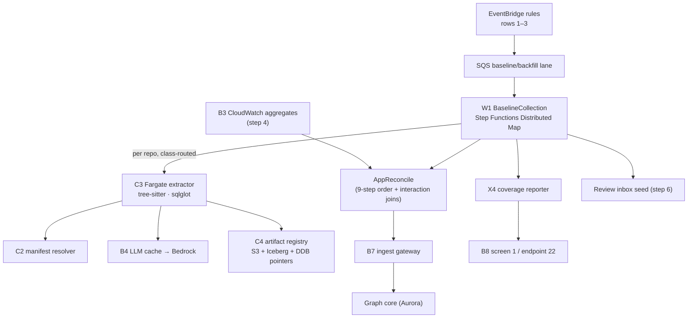

# 02 — Step 2: Baseline Collection

| | |
|---|---|
| **Status** | Draft — for review (normative once approved) |
| **Step** | App-scoped fan-out over member repos → extract (SCA → LLM residue) → reconcile at app level with CloudWatch interaction evidence → publish everything at Advisory trust → coverage report |
| **Runs** | First time per Business App (row 1's collection half), per newly onboarded/reactivated/reclassified repo (rows 2–3), and as the nightly rescan's execution machinery ([07](07-nightly-reconciliation.md)) |
| **PRD homes** | C2 manifest resolver · C3 extractor runner · C4 artifact registry · B4 LLM extraction + cache · X4 coverage reporter · W1 BaselineCollection ([00-component-inventory.md](00-component-inventory.md)) |

## 1. Step overview and boundaries

Baseline collection builds the app-level picture the incremental process leans on ever after. W1 fans out over the resolved, classified membership from step 1 (Distributed Map, backfill lane), runs per-class extraction — Tier 1 deterministic parsers, Tier 2 tree-sitter candidates, Tier 3 LLM residue through the shared cache — records per-edge determinant sets (F-03), emits immutable candidate artifacts, reconciles per-repo supersets at the app level where CloudWatch interaction evidence joins them, publishes everything at **Advisory** trust (F-05, no human in the loop), and produces the coverage report that tells the app team exactly what was and wasn't covered. It may take hours; that is by design (backfill lane, overnight window: a full org wave is `W = A × t̄_base = 7,000 × 0.1 h = 700` task-hours → < 8 h wall-clock at concurrency C ≥ 100, [08 §1](../aws-lineage-collection-plan/08-scale-resilience-observability.md)).

- **Owned trigger rows:** none exclusively — row 1's collection half executes here (row 1 is owned by [01](01-onboard.md); the boundary is the ResolveMembership/ClassifyRepo → FanOut hand-off).
- **Entry:** W1 start (from rows 1–3 events); re-entry per repo from X1 enqueues.
- **Exit events / state mutated:** candidate artifacts in C4; app-scoped graph published at Advisory through B7; coverage report; seeded review queue ([06](06-approval.md)).
- **Not in this step:** membership/classification decisions (step 1); the CloudWatch aggregation pipeline itself (B3's PRD in [04](04-runtime-corroboration.md) — this step *consumes* its aggregates); the gateway's validation internals (B7, [04](04-runtime-corroboration.md)); trust promotion ([06](06-approval.md)).

## 2. Normative inputs

| Source | What it governs here | Mode |
|---|---|---|
| [Workflow spec §1](../aws-lineage-collection-plan/04-collection-workflow-spec.md) | The BaselineCollection state machine — this doc decomposes it, never alters it | referenced |
| [Workflow spec §7](../aws-lineage-collection-plan/04-collection-workflow-spec.md) | Determinant-set contract and invalidation rule | referenced |
| [Workflow spec §8](../aws-lineage-collection-plan/04-collection-workflow-spec.md) | Per-class extraction treatment | referenced |
| [ADR-020](../aws-lineage-collection-plan/01-decision-records.md) | Repos analyzed independently, reconciled at app level; cross-repo edges only from evidence joins | referenced |
| [ADR-021](../aws-lineage-collection-plan/01-decision-records.md) | Fargate for extraction (duration/storage envelope), serverless orchestration | referenced |
| [Assessment §'Deterministic reconciliation'](../lineage-collection-assessment.md) | The 9-step reconciliation order applied at AppReconcile | referenced |
| [Assessment §'3. Immutable candidate lineage artifact'](../lineage-collection-assessment.md) | Artifact field semantics; reproducibility invariant | referenced |
| [HLD §4 scoring](../architecture-review-v8/04-high-level-design.md) | Confidence: weights 30/18/30/26/22, runtime-less cap 64, bands 85/65 — integer + band only | referenced |
| [`lineage-artifact.schema.json`](contracts/schemas/lineage-artifact.schema.json) · [`determinant-set.schema.json`](contracts/schemas/determinant-set.schema.json) · [`coverage-report.schema.json`](contracts/schemas/coverage-report.schema.json) · [`observation-envelope.schema.json`](contracts/schemas/observation-envelope.schema.json) | Shapes produced in this step | **new — normative here** |

## 3. Process flow

The normative state machine is workflow-spec §1. The build-level view of one W1 execution:

```mermaid
sequenceDiagram
  autonumber
  participant W1 as W1 (SFN Distributed Map)
  participant C2 as C2 manifest resolver
  participant C3 as C3 extractor (Fargate)
  participant B4 as B4 LLM + cache
  participant C4 as C4 artifact registry
  participant B7 as B7 ingest gateway
  participant X4 as X4 coverage reporter

  W1->>W1: per repo: class routing (application/unknown → extract; library → register source; infra → declarations; docs/tooling → record exclusion)
  W1->>C3: RunTask .sync {repo, sha, class, correlationId}
  C3->>C3: shallow clone @ default-branch SHA
  C3->>C2: resolve throughline.yaml + lineage/*.yaml
  C2-->>C3: service/env mapping (missing manifest → scaffold PR, continue)
  C3->>C3: Tier 1 (sqlglot, dbt, OpenAPI/protobuf) → Tier 2 (tree-sitter)
  C3->>B4: residue slices (content-addressed lookup)
  B4-->>C3: cached results | Bedrock inference (temperature 0, pinned model)
  C3->>C3: record per-edge determinant sets (F-03)
  C3->>C4: put candidate artifact (repo, sha, toolchainHash → contentHash)
  C3-->>W1: item result {artifact, findings, error?}
  Note over W1: map complete (partial failures allowed — failed repos land as coverage `error`)
  W1->>W1: AppReconcile: join per-repo supersets + CloudWatch interaction aggregates (9-step order)
  W1->>B7: canonical envelopes, signal sca|llm — Advisory trust
  W1->>X4: coverage inputs per member
  X4->>X4: assemble coverage report (automated | declared | uncovered | dormant | error | excluded:* | library | unclassified)
  W1->>W1: seed review inbox (proposal per app)
```

### Failure and ordering

- **Partial failure is a first-class outcome:** a member repo whose extraction fails becomes coverage `error` with the failure class and a flow-status link; the app baseline still completes (workflow-spec §1 note).
- **Idempotent re-runs:** unchanged `(repo, sha, toolchainHash)` keys hit C4 and skip extraction — re-baselining an app is cheap by construction.
- **Spot interruption:** map-state retry Spot → on-demand ([08 §2](../aws-lineage-collection-plan/08-scale-resilience-observability.md)); the wave checkpoints at item granularity and resumes where it stopped.
- **Bedrock throttle/outage:** cache hits still serve; misses queue for the nightly wave; deterministic extraction is unaffected — and only deterministic edges can ever gate (F-04).
- **Ordering:** map items are independent (repos are analyzed independently, ADR-020); AppReconcile is the only barrier and consumes whatever completed.

## 4. Components in this step

| ID | Role here | PRD |
|---|---|---|
| C2 manifest resolver | Repo/subtree → service/environment; scaffold-PR trigger | **this doc §5.1** |
| C3 extractor runner | Clone, Tier 1/2 extraction, determinants, artifact emit | **this doc §5.2** |
| C4 artifact registry | Immutable content-addressed artifact store + pointers | **this doc §5.3** |
| B4 LLM extraction + cache | Tier-3 residue via shared content-addressed cache | **this doc §5.4** |
| X4 coverage reporter | Per-app coverage report assembly | **this doc §5.5** |
| W1 BaselineCollection | Orchestration: fan-out, reconcile, publish, seed | **this doc §5.6** |
| B1 / B2 / X1 | Scope inputs | [01](01-onboard.md) |
| C6 diff engine | Baseline-vs-prior diff on re-baseline | [03 §5.2](03-incremental-collection.md) |
| B3 CloudWatch pipeline | Interaction aggregates consumed at AppReconcile | [04 §5.1](04-runtime-corroboration.md) |
| B6 / B7 | Schema validation and ingestion | [04 §5.3–5.4](04-runtime-corroboration.md) |
| C12 | Flow status, DLQs, wave metrics | [08 §5.1](08-scale-and-visibility.md) |

## 5. Component PRDs

### 5.1 C2 — Manifest resolver

**Purpose.** Resolve a repo (or monorepo subtree) at a SHA into service URNs, environments, and declared classification, from `throughline.yaml` + `lineage/<artifact>.yaml`; the mapping every downstream stage keys on.

**Requirements.**

- REQ-C2-01 (MUST) Fetch manifests via the Contents API at the exact SHA under analysis (never default-branch-latest during a pinned run) with installation-scoped tokens.
- REQ-C2-02 (MUST) Validate against the manifest JSON Schema (B6-served, version-pinned); reject with actionable errors; a schema-invalid manifest is coverage `error`, not a crash.
- REQ-C2-03 (MUST) Resolve monorepo subtrees independently: path-scoped mappings, per-subtree `kind:` (ADR-029), changed-path → subtree routing for step 3.
- REQ-C2-04 (MUST) Missing manifest ⇒ emit a scaffold PR request (archetype detection informs the template) **and** return a best-effort mapping so extraction proceeds (F-05); the gap lands as a `findings` entry, and unmapped paths surface as `unmapped-paths` warnings — never a silent skip (HLD §6.2).
- REQ-C2-05 (MUST) Be a pure function of `(repo, sha, manifest content)` — same inputs, same mapping (it participates in artifact reproducibility).

**Interfaces.** Called by C3 (in-task library) and W2/W3 (Lambda step). Reads: GitHub Contents API, B6 schemas. Output feeds `environmentIntent` in [`lineage-artifact.schema.json`](contracts/schemas/lineage-artifact.schema.json).

### 5.2 C3 — Extractor runner

**Purpose.** The isolated, least-privilege execution vehicle for extraction: shallow clone at a SHA, run the tiered ladder (deterministic parsers → tree-sitter candidates → LLM residue via B4), record determinants, emit exactly one candidate artifact.

**Requirements.**

- REQ-C3-01 (MUST) Run as a Fargate task whose role is scoped to a single installation token and the run's write prefixes; no ambient credentials (de-review component 3).
- REQ-C3-02 (MUST) Extract per the tier ladder: Tier 1 (sqlglot, dbt, OpenAPI/protobuf parsers) first; Tier 2 tree-sitter candidate discovery; Tier 3 only for residue slices, through B4's cache — never direct to Bedrock.
- REQ-C3-03 (MUST) Record a determinant set per emitted edge ([`determinant-set.schema.json`](contracts/schemas/determinant-set.schema.json)): every contributing file (including dependency manifests/lockfiles), symbol, and config key, each content-hashed.
- REQ-C3-04 (MUST) Emit one artifact per run validating against [`lineage-artifact.schema.json`](contracts/schemas/lineage-artifact.schema.json), with reproducibility fields (extractor/parser/prompt/model/rule-pack versions) — same commit + toolchain ⇒ identical artifact hash (CI-checked; de-review month-6 target: deterministic reproducibility 100%).
- REQ-C3-05 (MUST) Respect per-class treatment (workflow-spec §8): `infrastructure` → declaration-only extraction (entities + identity evidence, no transform edges); `unknown` → scan-light Tier-1 sweep.
- REQ-C3-06 (MUST) Record unsupported constructs, parse errors, and uncached residue as `findings` — visible gaps, never silent skips.
- REQ-C3-07 (MUST) Run secret-scanning over any slice before it leaves the task toward B4 (Deep Dive security posture; ADR-016 boundary).
- REQ-C3-08 (SHOULD) Mean full-extraction time t̄_base ≤ 6 min at the planning percentile (the [08 §1](../aws-lineage-collection-plan/08-scale-resilience-observability.md) capacity input; measured per wave).

**Interfaces.** Invoked `.sync` by W1/W2/W5. Calls: C2 (library), B4 (cache API). Writes: C4 (artifact put), B7 (envelopes, `sca`/`llm` signals), flow-status stages. Image: tree-sitter + sqlglot + extractor (scout-agent archetype/gap scripts are the seed implementation).

### 5.3 C4 — Artifact registry

**Purpose.** The immutable, content-addressed memory of every extraction: S3 objects at `artifacts/{contentHash}`, an Iceberg index for queryable history, and a DynamoDB pointer table for O(1) `(repo, sha, toolchainHash) → contentHash` lookups.

**Requirements.**

- REQ-C4-01 (MUST) Store artifacts content-addressed; a put of an existing hash is a no-op (idempotent); objects are never overwritten or deleted inside the retention window.
- REQ-C4-02 (MUST) Maintain the pointer table keyed `(repo, sha, toolchainHash)`; lookups answer "has this exact analysis run before" in O(1) — the cache check that makes re-baselining cheap.
- REQ-C4-03 (MUST) Maintain the Iceberg index (Glue Catalog) with repo, sha, toolchainHash, contentHash, createdAt, class, findings counts — the query surface for [07](07-nightly-reconciliation.md)'s divergence work and audits.
- REQ-C4-04 (MUST) Validate every artifact against the schema on write; reject invalid artifacts to the DLQ (a malformed artifact must fail loudly at the boundary, not corrupt diffs later).
- REQ-C4-05 (SHOULD) Serve artifact fetch p50 < 200 ms for gate-path reads (the W3 budget spends ~5 s on artifact build-or-fetch).

**Interfaces.** Writers: C3. Readers: C6 (diff), W3 (gate), C5 (promotion reads by digest association), B8 (evidence panel), W5 (nightly). API: thin Lambda (`GET /artifacts/{contentHash}`, `GET /pointers/{repo}/{sha}/{toolchainHash}`) — internal, SigV4.

### 5.4 B4 — Tier-3 LLM extraction + content-addressed cache

**Purpose.** The only path to the LLM: a central shared cache in front of Bedrock (pinned models, temperature 0) keyed `(codeSliceHash, schemaHash, modelVersion, promptVersion)` — cache-first is what makes LLM cost bounded by *change*, not by traffic (F-04).

**Requirements.**

- REQ-B4-01 (MUST) Serve lookups from the DynamoDB key → S3 result store; on miss, invoke Bedrock with pinned `(modelVersion, promptVersion)` and temperature 0; write-through.
- REQ-B4-02 (MUST) Be central and shared — never per-runner caches (F-04); all three consumers (W1 baseline, W2 incremental, W5 nightly wave) hit the same keyspace.
- REQ-B4-03 (MUST) Validate LLM output against the residue result schema (proposed mapping/transform/guard only); reject anything asserting authoritative types or self-confidence (the envelope constraint for `llm` mirrors this at publish).
- REQ-B4-04 (MUST) On throttle/outage: return `miss-deferred`; the caller records the slice as `llm-residue-uncached` in findings and the slice queues for the nightly batch wave — the interactive path never blocks on Bedrock.
- REQ-B4-05 (MUST) Support batch inference for row-15 re-extraction waves (model/prompt bumps invalidate the cache by design; the wave repopulates it off-peak, never in the PR path).
- REQ-B4-06 (MUST) Publish cache hit rate and Bedrock spend as standing metrics ([08 §5.4](../aws-lineage-collection-plan/08-scale-resilience-observability.md)).
- REQ-B4-07 (MUST NOT) Accept a slice that failed C3's secret scan.

**Interfaces.** Callers: C3 (only). Downstream: Bedrock. Store: DynamoDB `llm-cache` + S3 results. Emits nothing directly to B7 — results return to C3, which owns envelope emission.

### 5.5 X4 — Coverage reporter

**Purpose.** Assemble the per-app coverage report — the honest ledger of what was extracted, declared, excluded, dormant, failed, or never observed — consumed by screen 1 and endpoint 22.

**Requirements.**

- REQ-X4-01 (MUST) Produce reports validating against [`coverage-report.schema.json`](contracts/schemas/coverage-report.schema.json), using only the closed state set; `error` and `stale` rows always carry reasons; `error` rows carry a flow-status reference.
- REQ-X4-02 (MUST) Assemble from: W1 map results (automated/error), classification states (excluded:*/library/unclassified), activity states (dormant), declared contracts (declared), reconciliation gaps (uncovered), freshness signals (stale, row 13).
- REQ-X4-03 (MUST) Version reports (one per producing flow, `sourceFlow` = correlationId) — the dashboard shows latest; history remains queryable.
- REQ-X4-04 (MUST) Compute edge distributions (by trust rung, by band) as integers (ADR-008: no decimals).
- REQ-X4-05 (SHOULD) Emit the coverage delta between consecutive reports as a metric (a shrinking `automated` share is an early warning).

**Interfaces.** Writers into it: W1, X1, W5, freshness monitor. Readers: B8 (screen 1), endpoint 22. Store: DynamoDB latest + S3 history.

### 5.6 W1 — BaselineCollection workflow

**Purpose.** The app-scoped orchestrator: Distributed Map fan-out with per-class routing, the AppReconcile barrier, Advisory publication, coverage, and review seeding — workflow-spec §1 realized as an executable state machine.

**Requirements.**

- REQ-W1-01 (MUST) Implement the workflow-spec §1 state machine exactly (states, transitions, per-class branches); the ASL definition is generated/reviewed against that diagram.
- REQ-W1-02 (MUST) Fan out via Distributed Map with per-wave concurrency `C_wave = min(mapMaxConcurrency, ⌊vCPU_quota × reserveFraction / vCPU_task⌋, RunTask_rate_headroom)` ([08 §2](../aws-lineage-collection-plan/08-scale-resilience-observability.md)); backfill lane; Spot with on-demand retry.
- REQ-W1-03 (MUST) Tolerate partial failure: failed items → coverage `error`; the map completes; AppReconcile runs over completed items.
- REQ-W1-04 (MUST) AppReconcile applies the assessment's 9-step deterministic reconciliation over per-repo supersets, joining CloudWatch interaction aggregates (interaction evidence only — never column lineage, ADR-025); cross-repo edges come only from evidence joins.
- REQ-W1-05 (MUST) Publish via B7 at Advisory (F-05); publication is per-envelope idempotent (`idempotencyKey`), so workflow retries never double-publish.
- REQ-W1-06 (MUST) Seed the review inbox with one proposal per app (material edges flagged per delta materiality rules) and write flow-status stages throughout (`received → classified → extracted → reconciled → published → reported`).
- REQ-W1-07 (MUST) Skip-by-pointer: before RunTask, check C4's pointer table; hits skip extraction (REQ-C4-02).

**Interfaces.** Started by: EventBridge rules (rows 1–3), X1 enqueues, W5 (as the rescan vehicle). Calls: B1 (read), C3, B7, X4. Emits: proposal-seeded event to B8's store.

## 6. High-level design



Stores: C4 S3/Iceberg/DDB (writer C3; readers C6, W3, W5, B8) · `llm-cache` (writer/reader B4 only) · coverage store (writer X4; reader B8) · flow-status DDB (writers: all stages; reader endpoint 29).

## 7. Low-level design

### 7.1 C3 extractor (the largest LLD; the others follow its conventions)

- **Module layout** (Python, container image):
  ```
  services/extractor/
  ├── src/clone/           # shallow fetch @ SHA, installation-token auth
  ├── src/manifest/        # C2 library embed
  ├── src/tier1/           # sqlglot, dbt, openapi, protobuf, iac parsers (one module each)
  ├── src/tier2/           # tree-sitter candidate discovery per language
  ├── src/tier3/           # residue slicer + B4 client + secret scan
  ├── src/determinants/    # per-edge determinant recording + inverted index emit
  ├── src/artifact/        # assembly, canonicalization, hashing, C4 put
  ├── src/envelopes/       # conformance library (ADR-027) — envelope build + self-check
  └── src/main.py          # tier ladder driver, per-class routing
  ```
- **Core algorithm (application class):**
  1. Clone shallow at SHA; resolve manifest (C2).
  2. Tier 1 parsers over mapped paths → deterministic edges (+ determinants as they parse).
  3. Tier 2 tree-sitter over remaining mapped source → candidates + residue slices.
  4. Slice → secret scan → content-hash → B4 lookup; assemble Tier-3 edges from results; `miss-deferred` → findings.
  5. Canonicalize (stable ordering, normalized URNs) → determinant sets per edge → artifact assembly → hash → C4 put → envelope emission.
- **Canonicalization is the reproducibility mechanism:** edge/entity lists sorted by URN then edgeId; no timestamps inside the hashed body (createdAt sits outside the semantic hash); map iteration order never leaks into output.
- **Error taxonomy:** `clone-failed` · `manifest-invalid` · `parse-error:<parser>` (partial: other parsers continue; finding recorded) · `llm-deferred` · `artifact-put-failed` (task fails; map retries) · `secret-detected` (slice suppressed; finding recorded; alarm).
- **Idempotency key:** `(repo, sha, toolchainHash)` — the pointer check makes duplicate tasks no-ops.
- **Config/flags:** rule-pack versions pinned in the image; `scanLightMode` (unknown class); `maxSliceBytes` for Tier-3 slices; per-language parser enablement.

### 7.2 The other five, by exception

- **C2:** stateless library + Lambda wrapper; error taxonomy `manifest-missing` (soft — scaffold path), `manifest-invalid` (hard for the mapping, soft for the run), `contents-api-throttled` (retry with backoff). Idempotency: pure function.
- **C4:** conditional S3 put (`If-None-Match`) + DDB conditional pointer write; Iceberg append via a small batcher (map-run granularity). Never in the mutation path of an existing hash. Error taxonomy: `schema-invalid` → DLQ; `pointer-conflict` (same key, different hash) → **loud alarm: reproducibility violation** (the CI invariant broken in production).
- **B4:** DDB `GetItem` → S3 fetch on hit; miss path takes a per-key lock (conditional put on an in-flight marker, TTL 15 min) so concurrent misses on one slice invoke Bedrock once; `miss-deferred` on throttle. Batch mode: Bedrock batch job manifest from queued keys.
- **X4:** report assembly is a pure reduce over typed inputs; store latest + append history; every state write carries its source event.
- **W1:** ASL with per-class Choice states mirroring workflow-spec §1; map ItemBatcher off (repo granularity); `ToleratedFailurePercentage` 100 (failures are coverage states, not wave aborts); the AppReconcile stage is a Lambda (pilot) with a Fargate escape hatch above a payload threshold, like C6.

## 8. Use cases with success criteria

| ID | Use case | Success criteria |
|---|---|---|
| UC-2-01 | First baseline of the pilot app (3–5 repos, mixed classes) | All active `application` members produce artifacts; `library`/`infrastructure`/`docs` members get per-class treatment (no transform edges from IaC; zero compute for docs); app graph queryable at Advisory; coverage report complete with every member in exactly one state; review inbox seeded; end-to-end flow-status trail |
| UC-2-02 | Reproducibility | Re-run any member at the same `(sha, toolchainHash)`: identical artifact hash (100% on sampled repos — de-review month-6 bar); pointer hit skips extraction |
| UC-2-03 | One member repo fails to clone | That member → coverage `error` with class + flow link; app baseline completes; no gap disguised as "no lineage" |
| UC-2-04 | LLM residue with cold cache | Tier-3 slices invoke Bedrock once per unique slice (concurrent-miss lock verified); results cached; re-run = 100% cache hit, zero Bedrock calls |
| UC-2-05 | Bedrock outage mid-wave | Deterministic edges publish normally; affected edges carry `llm-residue-uncached` findings; slices drain in the nightly batch; nothing blocks; **no gate ever depended on them** (F-04) |
| UC-2-06 | AppReconcile with CloudWatch evidence | Cross-repo interaction edges appear only where aggregates assert them (interaction level, never column); conflicts preserved, not averaged (9-step rule 7); uncorroborated edges capped at score 64 |
| UC-2-07 | Advisory publication | Every published edge: trust `Advisory`, confidence integer + band; no human action anywhere in the path |
| UC-2-08 | Re-baseline after reclassification (UC-1-08 continuation) | New per-class treatment applied; old edges from the prior class tombstoned by reconciliation, not deleted |
| UC-2-09 | Wave-scale rehearsal (Phase 5) | 7,000-repo synthetic wave: wall-clock < 8 h at C ≥ 100; Spot interruptions retried on-demand; zero lost items (checkpoint resume verified) |
| UC-2-10 | Identity quality (assessment gate) | Sampled URN resolution on the pilot slice: precision ≥ 95%, recall ≥ 90%, zero cross-environment auto-merges |

## 9. Contract-testing expectations

| Component | Contract | Pairs | CI check |
|---|---|---|---|
| C3 | [`lineage-artifact.schema.json`](contracts/schemas/lineage-artifact.schema.json) | C3 → C4, C6, W3, B8 | Every artifact fixture validates; golden-repo corpus (one per archetype) asserts semantic content, not just shape; hash-stability test runs the extractor twice in CI and diffs hashes |
| C3 | [`determinant-set.schema.json`](contracts/schemas/determinant-set.schema.json) | C3 → X2 | Every emitted edge has ≥ 1 determinant incl. manifest/lockfile files; inverted-index build from fixtures round-trips |
| C3/W1 | [`observation-envelope.schema.json`](contracts/schemas/observation-envelope.schema.json) | emitters → B7 | Envelope fixtures for `sca` and `llm` pass their allOf branches; deliberately violating fixtures (sca+frequency, llm+confidence) are rejected by the validator — the constraint table is executable |
| B4 | residue result schema | B4 → C3 | Recorded Bedrock fixtures validate; a fixture asserting authoritative type fails |
| X4 | [`coverage-report.schema.json`](contracts/schemas/coverage-report.schema.json) | X4 → B8, endpoint 22 | Reports validate; every-member-in-exactly-one-state property test |
| W1 | ASL ↔ workflow-spec §1 | — | A structural test walks the ASL and asserts the state/transition set matches the spec diagram (state names pinned) |

## 10. Live-dependency-testing expectations

| Dependency | Test | Proves | Guards |
|---|---|---|---|
| GitHub (sandbox org) | Full baseline of the sandbox pilot app (real clones, real manifests) | Token scoping, shallow fetch, Contents API behavior, scaffold PR | Sandbox only; rate-limited |
| Bedrock (real, pinned model) | Golden residue slices through the real model weekly | Prompt/model pinning yields schema-valid, stable-enough output; cost per slice within envelope | Budget alarm; ≤ 100 slices/run; results recorded as fixtures for offline CI |
| Fargate + Step Functions (test account) | 50-repo synthetic wave incl. forced Spot interruptions | Distributed Map semantics, checkpoint resume, `.sync` error propagation — not trustable on emulators | Test account; C_wave ≤ 20 |
| S3/DynamoDB (real) | Artifact put/pointer race: two concurrent identical tasks | Conditional-write idempotency; `pointer-conflict` alarm fires on a manufactured hash mismatch | Test tables |
| B7 gateway (real deployment, test stage) | Publish a full baseline's envelopes | End-to-end validation, archive, graph-core handoff, idempotent re-publish | Test stage graph |

## 11. End-user testing hooks

- E2E journeys: **E2E-01** (onboard → approved graph) and **E2E-06** (sidecar lifts confidence — consumes this step's baseline) in [09-end-user-testing.md](09-end-user-testing.md).
- User-observable interfaces: coverage report (screen 1 / endpoint 22), review inbox seed (screen 2), flow status per member repo (endpoint 29), scaffold PRs in member repos.

## 12. Step acceptance criteria

- [ ] Pilot app baseline completes end-to-end with zero manual invocations and a complete coverage report (every member in exactly one state).
- [ ] Deterministic artifact reproducibility 100% on sampled re-runs; pointer-hit skip verified.
- [ ] Determinant sets present for every emitted edge (spot-audited), including manifest/lockfile determinants.
- [ ] LLM path: cache-first verified; outage degrades to findings + nightly drain, never blocks; no LLM-derived edge can gate.
- [ ] AppReconcile: conflicts preserved; cross-repo edges only from evidence joins; runtime-less edges capped at 64.
- [ ] All publication at Advisory; identity gate (≥ 95% precision / ≥ 90% recall, zero cross-env auto-merges) measured on the pilot slice.
- [ ] Flow-status record exists for every run, including partial-failure and no-op (pointer-hit) runs.

## 13. Traceability

- **ADRs:** 020, 021, 025 (consumption side), 027, 029 (treatment), 008 (bands), 006 (identity, via reconciliation).
- **Trigger rows:** executes 1–3's collection half (rows owned by 01).
- **Findings:** F-03 (determinants recorded here), F-04 (cache-first, batch waves, deterministic-only gating), F-05 (Advisory publication, scaffold-and-proceed).
- **De-review:** components 2, 3, 4 (§6.2); month-6 bars for extraction, identity, coverage.
