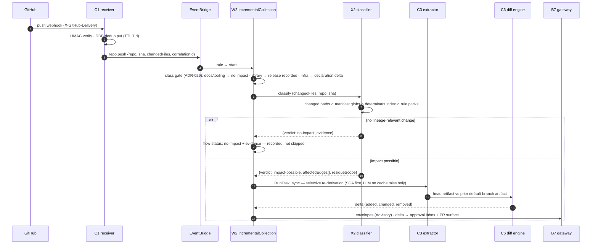
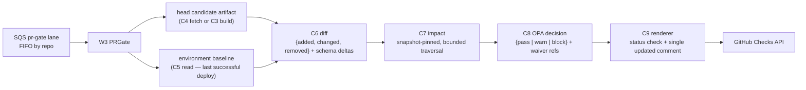
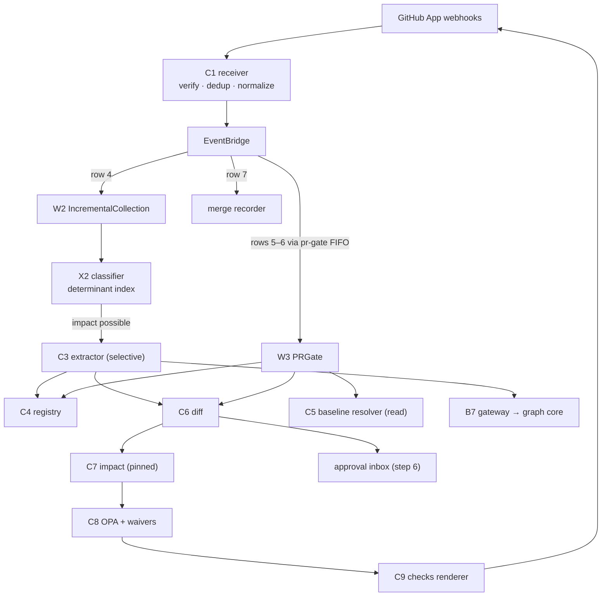

# 03 — Step 3: Incremental Collection and the PR Gate

| | |
|---|---|
| **Status** | Draft — for review (normative once approved) |
| **Step** | Push/PR on one repo → repo-class gate → rule-based change classifier (fast no-impact exit) → re-derive only edges whose determinants changed → versioned delta with added/changed/removed highlighted → (PR path) snapshot-pinned impact → policy decision → check + comment |
| **Runs** | Every code change on every onboarded repo, forever |
| **PRD homes** | C1 webhook receiver · C6 diff engine · C7 impact service · C8 policy/waiver service · C9 check/comment renderer · X2 change classifier · W2 IncrementalCollection · W3 PRGate ([00-component-inventory.md](00-component-inventory.md)) |

## 1. Step overview and boundaries

This is the evergreen loop. A push (row 4) enters W2: class gate first (ADR-029), then X2's rule-based classifier — a sound fast exit built on determinant sets (F-03), not forward reachability — then selective re-derivation of exactly the edges whose determinants the change touched, a versioned delta, and Advisory publication. A PR event (rows 5–6) enters W3 on the priority lane: head candidate artifact, diff against the **environment baseline** (C5's last-successful-deployment lookup — never default-branch HEAD), snapshot-pinned impact, OPA decision, one status check + one updated comment — p95 < 30 s, hard timeout 120 s → fail-open + warn. Merge (row 7) records the candidate; it is still not environment-authoritative (that is step 5). Row 15 (prompt/model bump) re-enters this machinery as a planned nightly batch wave, never the PR path (F-04).

- **Owned trigger rows:** 4 (push), 5 (PR opened/sync), 6 (rebase/force-push), 7 (merge), 15 (toolchain bump).
- **Entry events:** `repo.push`, `repo.pr.updated`, `repo.pr.rebased`, `repo.pr.merged`, `toolchain.updated`.
- **Exit / state mutated:** new candidate artifacts (C4); deltas to the approval inbox + PR surface; gate decisions with pinned tuples `{snapshotId, policyVersion, confidenceModelVersion}`; flow-status records for every entry including no-impact exits.
- **Not in this step:** `deployment-state` writes (step 5 — C5 is *read-only* here); trust promotion (step 6); the divergence safety net for classifier bugs (step 7 detects; this step's rule packs get fixed); sidecar evidence production (step 4 — its results join the head artifact here).

## 2. Normative inputs

| Source | What it governs here | Mode |
|---|---|---|
| [Workflow spec §2, §3](../aws-lineage-collection-plan/04-collection-workflow-spec.md) | The IncrementalCollection and PRGate machines — decomposed here, never altered | referenced |
| [Workflow spec §6, §7](../aws-lineage-collection-plan/04-collection-workflow-spec.md) | Delta contract; determinant invalidation rule ("re-derived iff any determinant's content hash changes") | referenced |
| [Trigger rows 4–7, 15](../aws-lineage-collection-plan/03-trigger-matrix.md) | Event semantics, lane assignments, fail-open posture | referenced |
| [HLD §6.1](../architecture-review-v8/04-high-level-design.md) | Gate latency budget: p95 < 30 s, timeout 120 s → fail-open + warn | referenced |
| [HLD §6.2–§6.5](../architecture-review-v8/04-high-level-design.md) | `throughline.yaml`, Rego policy shape, ramp observe→warn→block, waiver semantics (≤ 90 d, self-approval rejected, > 10%/30 d circuit breaker) | referenced |
| [ADR-004 via workflow spec](../aws-lineage-collection-plan/04-collection-workflow-spec.md) | Every decision pins `{snapshotId, policyVersion, confidenceModelVersion}` | referenced |
| [ADR-023](../aws-lineage-collection-plan/01-decision-records.md) | Webhook authority, dedup, installation-scoped credentials | referenced |
| [De-review §6.1](../platform-10-de-review/README.md) | PR/rebase/merge rows of the CI/CD state machine | referenced |
| [`delta.schema.json`](contracts/schemas/delta.schema.json) · [`determinant-set.schema.json`](contracts/schemas/determinant-set.schema.json) · [`event-catalog.md`](contracts/events/event-catalog.md) rows 4–7, 15 | Shapes | **new — normative here** |
| X2 rule-pack format (§7.6) | The classifier's versioned configuration | **new — defined here** |

## 3. Process flow

### 3.1 Push path (row 4, W2)



### 3.2 PR path (rows 5–6, W3, priority lane)

The normative sequence is workflow-spec §3 (budget waypoints: artifact build-or-fetch ~5 s, baseline lookup ~2 s, impact ~10 s). Decomposition:



Rebase/force-push (row 6): invalidate the prior candidate by head SHA — superseded, never deleted — and recompute against the new base. Merge (row 7): record the merged candidate; trust-upgrade eligibility if the PR carried manifest/contract acceptance; still not environment-authoritative.

### 3.3 Failure and ordering

- **Dedup:** C1's conditional put on `X-GitHub-Delivery` (TTL 7 d) makes GitHub's at-least-once delivery exactly-once downstream. Missed deliveries are repaired by the nightly sweep (row 10).
- **Ordering:** pr-gate lane is FIFO by repo (`MessageGroupId = repo`) so a rapid push sequence gates in order; the push path needs no cross-repo order (artifact keys make reordering harmless — [event-catalog](contracts/events/event-catalog.md) notes).
- **Gate overrun:** 120 s hard timeout → **fail-open + warn** annotation — degraded honestly, never silently green; fail-open rate is a fleet SLI (< 0.5% of decisions/30 d).
- **Concurrent PRs touching the same edge:** each gates against its own pinned snapshot; the second-to-merge's delta recomputes at merge; the de-review §6.3 concurrency rows are the test corpus (UC-3-10).
- **LLM in the PR path:** cache-first; a miss defers to findings — a PR never waits on Bedrock, and only deterministic edges can fail a build (F-04).
- **DLQ:** per-consumer DLQs; a poison PR event quarantines with reason; the PR gets a neutral "gate unavailable" check rather than silence.

## 4. Components in this step

| ID | Role here | PRD |
|---|---|---|
| C1 webhook receiver | Rows 4–7 ingress: verify, dedup, normalize, emit | **this doc §5.1** |
| X2 change classifier | Class gate + sound no-impact fast exit | **this doc §5.2** |
| C6 diff engine | Versioned delta over two artifacts | **this doc §5.3** |
| C7 impact service | Snapshot-pinned, bounded-traversal impact | **this doc §5.4** |
| C8 policy/waiver service | OPA decision + waiver semantics | **this doc §5.5** |
| C9 check/comment renderer | Stable check + single updated PR comment | **this doc §5.6** |
| W2 IncrementalCollection | Push-path orchestration | **this doc §5.7** |
| W3 PRGate | PR-path orchestration on the priority lane | **this doc §5.7** |
| C3 / C4 / B4 / C2 | Extraction machinery (selective mode) | [02](02-baseline-collection.md) |
| C5 baseline resolver | Environment-baseline read | [05 §5.1](05-deployment-promotion.md) |
| B5 sidecar evidence | Joins head artifacts pre-merge | [04 §5.2](04-runtime-corroboration.md) |
| C12 | Flow status, lane metrics, DLQs | [08 §5.1](08-scale-and-visibility.md) |

## 5. Component PRDs

### 5.1 C1 — Webhook receiver

**Purpose.** The single SCM ingress (ADR-023): verify HMAC, deduplicate, enrich with installation context, normalize GitHub webhooks into the event catalog's rows 2, 4–7, and emit to the bus. The platform's front door for every code change.

**Requirements.**

- REQ-C1-01 (MUST) Verify the GitHub App HMAC signature before any parsing; reject non-verifying deliveries with 401 and a security metric.
- REQ-C1-02 (MUST) Deduplicate via DynamoDB conditional put on `X-GitHub-Delivery` (TTL 7 d); duplicates ack 200 and emit nothing.
- REQ-C1-03 (MUST) Normalize to catalog events with `correlationId` minted here (the flow's root); ack GitHub only after the event is durably on the bus.
- REQ-C1-04 (MUST) Handle `installation_repositories` (→ `repo.onboarded`, row 2), `push` (row 4), `pull_request` opened/synchronize (row 5), rebase/force-push detection (row 6), merged (row 7), and `pull_request_review` (trust-upgrade eligibility metadata on row 7).
- REQ-C1-05 (MUST) Keep the App private key in Secrets Manager (rotated); mint installation tokens on demand; never persist tokens.
- REQ-C1-06 (MUST) Stay comfortably inside GitHub's 10 s webhook response expectation: receiver work is verify + dedup + publish only (p95 < 500 ms); everything else is downstream.
- REQ-C1-07 (SHOULD) Surface per-event-type delivery metrics and a delivery-lag estimate (GitHub redelivery is the retry; row 10 is the backstop).

**Interfaces.** Ingress: API Gateway HTTP API. Produces: rows 2, 4–7 events. Store: `webhook-dedup` DDB (TTL). Consumed by: EventBridge rules for W2/W3/candidate recorder.

### 5.2 X2 — Change classifier

**Purpose.** The fast path that makes per-push collection affordable: a rule-based classifier whose "no impact" verdict is *sound* because invalidation is determinant-based — `changedFiles ∩ determinant sets = ∅` (and no manifest/schema globs hit) proves no derived edge could change (F-03). Classifier runs are Lambda-milliseconds; `A·p = 21,000/day` of them are negligible ([08 §1](../aws-lineage-collection-plan/08-scale-resilience-observability.md)).

**Requirements.**

- REQ-X2-01 (MUST) Apply the class gate first (ADR-029): `documentation`/`tooling` → no-impact; `library` → release-recorded exit; `infrastructure` → declaration-delta scope; `application`/`unknown` → classify.
- REQ-X2-02 (MUST) Compute the verdict as: `changedFiles` ∩ manifest globs (C2 mapping) ∩ the repo's inverted determinant index (determinant file → edges) ∩ rule-pack triggers. Any non-empty intersection ⇒ `impact-possible` with the affected edge set and residue scope.
- REQ-X2-03 (MUST) Never use forward reachability from changed files as the exit condition (documented unsound, F-03).
- REQ-X2-04 (MUST) Record every verdict — including no-impact — with its evidence (which sets were intersected, which rule packs consulted) in the flow-status record: the audit trail row 10's divergence metric checks against.
- REQ-X2-05 (MUST) Load rule packs (per file type: SQL, dbt, OpenAPI, IaC, application code, config) as code-reviewed, versioned configuration; the active rule-pack version set is part of `toolchainHash`.
- REQ-X2-06 (MUST) Fail toward extraction: a missing/stale determinant index (e.g. first push after onboarding, index rebuild in flight) ⇒ `impact-possible` with reason `index-unavailable` — over-scan, never under-scan.
- REQ-X2-07 (SHOULD) Track the classifier no-impact ratio as a fleet metric (planning value: pass-through f = 0.4); a sudden jump means a broken rule pack ([08 §5.4](../aws-lineage-collection-plan/08-scale-resilience-observability.md)).

**Interfaces.** Called by W2 (and W3 for scope hints). Reads: determinant inverted index (built from C4 artifacts, stored DDB `determinant-index` keyed `(repo, file) → edgeIds`), B1 classification, C2 globs, rule packs (S3, versioned). Produces: verdicts into flow status.

### 5.3 C6 — Versioned diff engine

**Purpose.** A pure function over two artifacts producing the delta consumers render, review, and gate on: `{added, changed, removed}` with before/after pairs, schema deltas, codeRef hits, and materiality flags.

**Requirements.**

- REQ-C6-01 (MUST) Output validates against [`delta.schema.json`](contracts/schemas/delta.schema.json); `changed` entries carry full before/after edge states (what the UI renders side-by-side and the review record freezes); `removed` entries carry reason `code-removed` or `determinant-invalidated`.
- REQ-C6-02 (MUST) Be deterministic and symmetric-safe: `diff(A, A) = ∅`; `diff(A, B)` is stable across runs (canonical ordering).
- REQ-C6-03 (MUST) Compare against the caller-specified baseline: environment baseline (W3 — from C5) or prior default-branch artifact (W2); the baseline descriptor is embedded in the delta.
- REQ-C6-04 (MUST) Classify materiality per edge (`material` = element-level mapping/transform/schema changes on non-cold paths; `minor` = the rest) — the flag ADR-024's per-edge acknowledgement keys on.
- REQ-C6-05 (MUST) Compute schema deltas (additive/widening/narrowing/rename/drop/nullability — the de-review §6.3 change taxonomy) as typed entries.
- REQ-C6-06 (SHOULD) Run as Lambda; fall over to Fargate above a size threshold (monorepo-scale artifacts) without behavior change.

**Interfaces.** Callers: W2, W3, W5 (nightly divergence diffs). Reads: C4. Output to: C9, B8 inbox, C8 decision input.

### 5.4 C7 — Snapshot-pinned impact service

**Purpose.** Answer "what does this delta break" against a pinned graph snapshot with bounded traversal — reproducibly, inside the gate budget.

**Requirements.**

- REQ-C7-01 (MUST) Pin every evaluation to an explicit `snapshotId`; the same `(delta, snapshotId, policyVersion, confidenceModelVersion)` reproduces the same impact set (100% of sampled decisions replay — de-review month-6 bar).
- REQ-C7-02 (MUST) Bound traversal (depth + fan-out caps per HLD §5); truncation is an explicit `truncated` result state — **never** reported as "no impact" (de-review Phase-4 rule).
- REQ-C7-03 (MUST) Weight impact by confidence band and coverage state: `cold-path` edges surface as Possible (low confidence ≠ low risk); `not-observed` regions surface as unknown, not safe.
- REQ-C7-04 (MUST) Answer within the ~10 s slice of the 30 s gate budget at pilot scale (Lambda + Aurora recursive CTE); the Phase-3+ CSR service swap must not change the interface.
- REQ-C7-05 (MUST) Return machine-consumable output for C8: affected entities/edges with band, coverage, materiality, truncation flags.

**Interfaces.** Caller: W3 (and endpoint consumers out of scope here). Reads: graph core (pinned snapshot), C4 artifacts as needed. Output to: C8.

### 5.5 C8 — Policy decision service and waiver store

**Purpose.** Turn delta + impact + coverage into `{pass | warn | block}` under versioned Rego policy, with HLD §6.5 waiver semantics enforced server-side.

**Requirements.**

- REQ-C8-01 (MUST) Evaluate OPA compiled to WASM in Lambda over versioned policy bundles (git → S3); every decision records `policyVersion` in the pinned tuple.
- REQ-C8-02 (MUST) Enforce the ramp per domain: observe → warn → block (ADR-011); block only where the ramp stage allows it and never on LLM-derived edges (F-04: only deterministic edges can fail a build).
- REQ-C8-03 (MUST) Apply waivers from Aurora with HLD §6.5 semantics verbatim: approver = downstream owner/steward, expiry ≤ 90 d, self-approval rejected server-side, audit on issue/expiry/revocation.
- REQ-C8-04 (MUST) Trip the false-positive circuit breaker: > 10% of blocks overturned within 30 d for a rule ⇒ rule auto-demotes to warn + steward alert.
- REQ-C8-05 (MUST) Write decision logs (input digest, decision, waivers applied, tuple) to S3 — the reproduction corpus.
- REQ-C8-06 (MUST) Never decide "no impact" when traversal was truncated, coverage unknown, or a required collector stale — those degrade to warn with the reason (de-review Phase-4 rule; row 13 posture).

**Interfaces.** Caller: W3. Reads: policy bundles, waiver tables (Aurora), ramp config. Output to: C9. Waiver CRUD surfaces via HLD §6.5 endpoints (graph-core catalog, referenced not redefined).

### 5.6 C9 — SCM check/comment renderer

**Purpose.** The developer-facing surface: one status check and one PR comment, updated in place with stable annotation IDs — evidence, uncertainty, coverage, and the accept/correct entry point, without comment spam.

**Requirements.**

- REQ-C9-01 (MUST) Render exactly one check run per (PR, gate) and one comment updated in place; annotation IDs stable across updates (de-review component 9).
- REQ-C9-02 (MUST) Show: the delta (added/changed/removed with materiality), impact summary with bands (integer + band, never decimals), coverage caveats (`not-observed`, `stale`, `truncated` stated explicitly), waivers applied, and the deep link into screen 3 (delta review).
- REQ-C9-03 (MUST) Render fail-open distinctly: "gate degraded — warn" with the reason, never a green check that hides a timeout.
- REQ-C9-04 (MUST) Render supersession on rebase (row 6): the old check marked superseded, the new head's check replacing it.
- REQ-C9-05 (SHOULD) Include the sidecar pre-merge line when present: "N of M changed paths executed under integration tests" (ADR-028).

**Interfaces.** Caller: W3 (and W2 for push-delta comment on the default branch when configured). Writes: GitHub Checks API + issue comment. Reads: delta, decision, flow status.

### 5.7 W2 / W3 — the workflows

**Purpose.** W2 realizes workflow-spec §2 (push path); W3 realizes §3 (PR path, priority lane). Both are thin, deterministic orchestrations — logic lives in the components.

**Requirements.**

- REQ-W2-01 (MUST) Implement the §2 state machine exactly (class gate → classify → no-impact exit | selective re-derivation → delta → artifact → publish); every branch writes flow-status stages.
- REQ-W2-02 (MUST) Selective re-derivation passes X2's affected-edge set and residue scope to C3 — extraction cost scales with the change, not the repo (`A·p·f × t̄_incr = 8,400 × 2 min = 280` task-hours/day ≈ 12 concurrent on average).
- REQ-W3-01 (MUST) Implement §3 with the budget waypoints; consume from the pr-gate FIFO lane; reserved concurrency never borrowed against (ADR-026).
- REQ-W3-02 (MUST) Enforce the 120 s hard timeout at the state-machine level → fail-open + warn via C9; record `outcome: fail-open`.
- REQ-W3-03 (MUST) Pin and persist the decision tuple `{snapshotId, policyVersion, confidenceModelVersion}` on every decision.
- REQ-W3-04 (MUST) Never wait on a cold clone: artifact fetch-or-build with shallow fetch + cached image layers (warm pool from Phase 3 if p95 demands).
- REQ-W23-05 (MUST) Row 15: consume `toolchain.updated` by scheduling the nightly Bedrock batch wave over the content-addressed cache and a comparison report old-vs-new — never inline in PR/push paths.

**Interfaces.** W2 from EventBridge rule (row 4); W3 from pr-gate lane (rows 5–6); the merge recorder (row 7) is a Lambda step of W3's family recording the merged candidate.

## 6. High-level design



Stores: `webhook-dedup` DDB (writer C1) · `determinant-index` DDB (writer: index builder off C4 artifact writes; reader X2) · policy bundles S3 + waivers Aurora (writer: policy repo CI / waiver API; reader C8) · decision logs S3 (writer C8) · C4/C5 per their homes.

## 7. Low-level design

### 7.1 C1

- **Modules:** `services/receiver/` — `src/verify/` (HMAC), `src/dedup/`, `src/normalize/` (per-event mappers), `src/publish/`.
- **Algorithm:** verify → conditional put `DELIVERY#{guid}` (TTL 7 d; exists ⇒ 200 exit) → normalize → `PutEvents` → 200. Any failure after dedup-put deletes the dedup item before erroring (so GitHub's redelivery isn't swallowed).
- **Errors:** `signature-invalid` (401, metric) · `payload-unparseable` (200 to GitHub + DLQ copy — never make GitHub retry a poison payload) · `bus-unavailable` (5xx ⇒ GitHub redelivers).
- **Idempotency:** `X-GitHub-Delivery`.

### 7.2 X2

- **Modules:** `services/classifier/` — `src/gate/` (class), `src/intersect/` (globs, determinant index, rule packs), `src/verdict/`.
- **Algorithm:** class gate → load mapping + index shards for changed files only (`BatchGetItem` on `(repo, file)`) → intersect → rule-pack triggers (e.g. lockfile changed ⇒ affected edges via manifest determinants; migration file glob ⇒ schema scope) → verdict with evidence.
- **Determinant index maintenance:** an index builder Lambda consumes C4 artifact-put events and rewrites the repo's shard set transactionally (index version = artifact hash); X2 rejects shards older than the prior artifact (⇒ `index-unavailable` over-scan path).
- **Errors:** `index-unavailable` (soft ⇒ impact-possible) · `rulepack-load-failed` (soft ⇒ impact-possible, alarm — the classifier never fails closed into no-impact).
- **Idempotency:** pure function of `(sha, changedFiles, indexVersion, rulePackVersions)`.

### 7.3 Rule-pack format (new contract, Tier 2)

```yaml
# rule-packs/sql.yaml — code-reviewed, versioned with toolchainHash
pack: sql
version: 3
triggers:
  - glob: "**/*.sql"
    action: rederive-matching        # via determinant index
  - glob: "db/migrations/**"
    action: schema-scope             # forces schema-delta computation
  - glob: "**/lockfile|**/package-lock.json|**/poetry.lock"
    action: dependency-scope         # manifest/lockfile determinants (ADR-029 library bridge)
never-impact:
  - glob: "**/*.md"
  - glob: "docs/**"
```

Semantics: `never-impact` globs are subtracted *before* intersection; any trigger hit adds its scope to the verdict; an unmatched changed file inside manifest-mapped paths defaults to `rederive-matching` (over-scan default). Packs live in the config repo; merges version-bump `toolchainHash` (which flows through row 15 when extraction-relevant).

### 7.4 C6

- Pure function; canonical edge identity = `edgeId` (deterministic per artifact contract); comparison by edgeId with field-level before/after extraction; schema deltas from entity `schemaRef` comparison typed per the §6.3 taxonomy; materiality per REQ-C6-04 rules (configurable thresholds, versioned).
- **Errors:** `artifact-unreadable` (retry) · `size-threshold-exceeded` (re-dispatch to Fargate variant, same code path).

### 7.5 C7 / C8 / C9

- **C7:** recursive CTE templates with depth/fan-out caps as bind parameters; snapshot pinning via the graph core's snapshot API; result assembly tags truncation per traversal frontier. Swap-to-CSR behind the same request/response types.
- **C8:** decision input document `{delta, impact, coverage, ramp, waivers}` → WASM eval; waiver application after policy eval (a waived block records both raw and effective outcomes); circuit-breaker state in Aurora, evaluated per rule on a schedule.
- **C9:** comment body templated with stable HTML anchors per annotation; check-run upsert keyed by external ID `(prNumber, "throughline-gate")`; renders from the delta + decision only (no graph reads in the render path).

### 7.6 Idempotency keys (mandatory)

| Component | Key |
|---|---|
| C1 | `X-GitHub-Delivery` |
| X2 | `(repo, sha, indexVersion, rulePackVersions)` — pure |
| C6 | `(baseArtifact, headArtifact)` — pure |
| C7 | `(deltaHash, snapshotId)` — pure |
| C8 | `(decisionInputDigest, policyVersion)` — pure eval; waiver application audited per evaluation |
| C9 | `(prNumber, headSha)` — upsert semantics |
| W2 | `(repo, sha, toolchainHash)` |
| W3 | `(repo, prNumber, headSha, toolchainHash)` |

## 8. Use cases with success criteria

| ID | Use case | Success criteria |
|---|---|---|
| UC-3-01 | Doc-only push to an application repo | Class gate/never-impact exit; verdict + evidence in flow status; zero Fargate/Bedrock spend; outcome `no-impact` |
| UC-3-02 | Push changing one SQL transform | Only edges whose determinants include the changed file re-derive (verified by artifact comparison: untouched edges byte-identical); delta shows exactly the changed edges with before/after; published Advisory; total wall-clock ≤ minutes (t̄_incr ≈ 2 min) |
| UC-3-03 | Lockfile bump in a consumer of a `library` repo | Dependency-scope trigger fires; consumer edges with manifest/lockfile determinants re-derive (the ADR-029 library bridge, F-03) |
| UC-3-04 | PR gate happy path | p95 < 30 s end-to-end on the pilot; decision tuple pinned and persisted; one check + one comment; delta highlighted with jump-link to screen 3 |
| UC-3-05 | Gate overrun (forced 120 s+) | Fail-open + warn check with reason; `outcome: fail-open` recorded; fail-open rate SLI increments — never a silent green |
| UC-3-06 | Rebase/force-push | Old decision superseded (kept for audit); new head recomputed against the new base; no orphan checks |
| UC-3-07 | Merge then no deploy | Candidate recorded `MergedCandidate`; **not** environment-authoritative; gate for other PRs still baselines on last deployment (C5), not this merge |
| UC-3-08 | Block-worthy deterministic break (ramp = block) | Block with evidence; waiver path works (downstream-owner approval; self-approval rejected server-side); waiver expiry ≤ 90 d enforced |
| UC-3-09 | LLM-derived edge would break | Surfaces as information/warn — never block cause (F-04); asserted by test fixture |
| UC-3-10 | Two concurrent PRs touching the same edge; one merges first | Each decision reproducible from its own tuple; post-merge recompute for the second PR on its next sync; no cross-contamination (de-review §6.3 concurrency rows) |
| UC-3-11 | Truncated traversal / stale collector during gate | Decision degrades to warn with the reason; never "no impact" (REQ-C8-06) |
| UC-3-12 | Row 15: prompt version bump | No PR/push path invokes the new prompt inline; nightly batch wave re-derives cached residue under new keys; comparison report old-vs-new produced |
| UC-3-13 | Classifier evidence audit | For any no-impact verdict, flow status reconstructs the exact intersections consulted; nightly divergence (step 7) over a seeded classifier bug traces to the offending rule pack |

## 9. Contract-testing expectations

| Component | Contract | Pairs | CI check |
|---|---|---|---|
| C1 | [`event-catalog.md`](contracts/events/event-catalog.md) rows 2, 4–7 | C1 → W2/W3/recorder rules | Recorded real webhook fixtures (push, PR sync, rebase, merge, installation) normalize to catalog-valid events; CDK rule patterns match detail-types |
| X2 | verdict + evidence record | X2 → flow status, W2 | Verdict fixtures validate; property test: `no-impact ⇒ changedFiles ∩ index = ∅` on generated corpora — soundness is a tested invariant, not a comment |
| X2 | rule-pack format (§7.3) | packs repo → X2 | Pack schema validation; a pack adding a `never-impact` glob that intersects any existing determinant file in the golden corpus fails CI (the unsound-exclusion guard) |
| C6 | [`delta.schema.json`](contracts/schemas/delta.schema.json) | C6 → C9, B8, C8 | `diff(A,A)=∅`; golden before/after artifact pairs produce expected deltas incl. every §6.3 schema-change kind; materiality rules pinned by fixtures |
| C7 | impact I/O types | C7 → C8 | Truncation flags asserted on capped fixtures; replay test: same inputs + tuple ⇒ identical output |
| C8 | decision input/output + waiver rules | C7 → C8 → C9 | Rego unit tests per rule; waiver semantics tests (self-approval rejection, expiry, circuit breaker) run against the real WASM bundle |
| C9 | Checks/comment payloads | C9 → GitHub | Golden rendered comments per decision type (pass/warn/block/fail-open/superseded); annotation-ID stability across re-renders |
| W2/W3 | ASL ↔ workflow-spec §2/§3 | — | Structural state/transition match tests, as W1's |

## 10. Live-dependency-testing expectations

| Dependency | Test | Proves | Guards |
|---|---|---|---|
| GitHub (sandbox org) | Scripted PR lifecycle: open → push → rebase → merge on a sandbox repo | Real webhook ordering/latency, check upsert, comment update-in-place, supersession | Sandbox; auto-close |
| GitHub (sandbox) + full stack | Wall-clock gate SLO run: 20 sequential PRs | p95 < 30 s measured end-to-end (webhook receipt → check visible) against real GitHub latency | Off-peak; sandbox |
| Aurora (test cluster) | C7 CTE bounds under a synthetic 10k-edge hub graph | Fan-out caps hold; truncation reported; latency inside the 10 s slice | Test cluster |
| OPA bundles (real S3 pipeline) | Policy repo merge → bundle build → C8 picks up new `policyVersion` | Version pinning: in-flight decisions keep the old version; new decisions record the new | Test bucket |
| SQS FIFO (real) | Burst 50 PR events across 5 repos | Per-repo ordering held; cross-repo parallelism; reserved concurrency respected under a simultaneous backfill flood | Test account |

## 11. End-user testing hooks

- E2E journeys: **E2E-02** (push → delta → approval), **E2E-03** (PR gate under 30 s), **E2E-07** (10k wave with lanes held) in [09-end-user-testing.md](09-end-user-testing.md).
- User-observable interfaces: the PR check + comment (the primary developer surface), screen 3 delta review via the comment's jump-link, flow status by repo/SHA (screen 7, endpoint 29), classifier verdicts visible per push.

## 12. Step acceptance criteria

- [ ] Every push produces a flow-status record with a verdict — no silent paths, including no-impact and class-gated exits.
- [ ] Selective re-derivation verified: unchanged-determinant edges are byte-identical across artifacts (sampled).
- [ ] Gate: p95 < 30 s, timeout 120 s → fail-open + warn, fail-open rate < 0.5%/30 d, decision tuples pinned and replayable (100% of sampled decisions).
- [ ] Only deterministic edges can block; ramp and waiver semantics (≤ 90 d, no self-approval, circuit breaker 10%/30 d) enforced server-side and tested.
- [ ] Rebase/merge semantics per de-review §6.1: superseded kept, merged recorded, nothing environment-authoritative before deploy.
- [ ] Row 15 waves never touch the interactive path.

## 13. Traceability

- **ADRs:** 023 (receiver), 029 (class gate), 020 (repo-scoped incremental), 011 (ramp/Rego), 004 (pinning), 008 (bands in rendering), 026 (lanes), 027 (envelope publication).
- **Trigger rows:** 4, 5, 6, 7, 15 (owned).
- **Findings:** F-03 (determinant-based soundness — the load-bearing invariant of this step), F-04 (LLM never gates; batch waves), F-01 (the gate reports validation honestly: coverage caveats, fail-open distinctness), F-06 (merge ≠ authoritative; hand-off to step 5), F-07 (noted: resident-index implication deferred with the 30 s *server-side* budget the chosen posture).
- **De-review:** components 1, 6, 7, 8, 9 (§6.2); §6.1 PR/rebase/merge rows; §6.3 suites 1, 3, 5 as test corpora.
