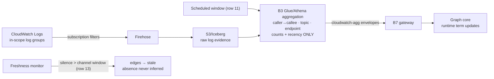
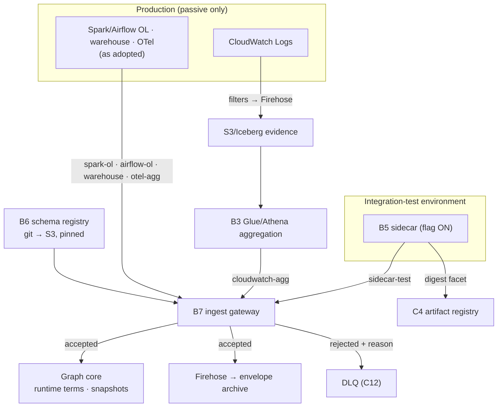

# 04 — Step 4: Runtime Corroboration

| | |
|---|---|
| **Status** | Draft — for review (normative once approved) |
| **Step** | Sidecars during integration tests (feature-flagged, off in prod); CloudWatch/OpenLineage evidence from production — lifting confidence asynchronously, never blocking the change loop |
| **Runs** | Continuously: scheduled aggregation windows (row 11), heartbeat monitoring (row 13), and per integration-test run (row 17) |
| **PRD homes** | B3 CloudWatch interaction pipeline · B5 sidecar evidence path · B6 schema registry · B7 ingest gateway ([00-component-inventory.md](00-component-inventory.md)) |

## 1. Step overview and boundaries

Runtime corroboration is the confidence axis. Nothing here creates a change loop — evidence arrives asynchronously through standing pipelines and re-scores the edges it touches. Three evidence paths: **sidecar-test** (ADR-028: a feature-flagged sidecar in integration-test environments, off in production by policy, joining evidence to the run's commit SHA and artifact digest within the change loop); **cloudwatch-agg** (ADR-025: log-derived interaction aggregates — service/endpoint/topic interaction with counts and recency, never column lineage); and the OpenLineage family (`spark-ol` / `airflow-ol` / `warehouse` / `otel-agg`) as adoption arrives. This step also homes the two components every signal flows through: the schema registry (B6) and the ingest gateway (B7) — the single validated entry where the assertion-constraint table is enforced by construction.

The honest scoping rules, restated once because every design choice here descends from them: **cross-environment corroboration is rejected** (a test run never directly raises a production edge's confidence); sidecar evidence attaches to the **artifact digest** as an execution-confirmed-in-test facet with a **Probable ceiling** in prod context; production **Verified** requires production-environment evidence; and interaction signals **must not assert** field/column mappings.

- **Owned trigger rows:** 11 (CloudWatch aggregation), 13 (collector heartbeat loss), 17 (integration-test run completed).
- **Entry:** aggregation schedules; heartbeat silence; `test.run.completed`.
- **Exit / state mutated:** validated observations into the graph core (confidence-term updates, new logical snapshots); `stale` coverage states; digest-level test facets; no trust-ladder movement (that is [06](06-approval.md)) and no deployment authority (that is [05](05-deployment-promotion.md)).
- **Not in this step:** confidence scoring internals (HLD §4, graph core); Lane B/C reconciliation sweeps (nightly, [07](07-nightly-reconciliation.md)); the sidecar's join to PR rendering (surface in [03](03-incremental-collection.md)).

## 2. Normative inputs

| Source | What it governs here | Mode |
|---|---|---|
| [ADR-025](../aws-lineage-collection-plan/01-decision-records.md) | CloudWatch signal scope: interaction-confirming only; metadata-only aggregation; retirement trigger at ≥ 80% OTel coverage | referenced |
| [ADR-028](../aws-lineage-collection-plan/01-decision-records.md) | Sidecar mechanics, flag policy, digest-level facet, Probable ceiling, prod-tag alarm | referenced |
| [ADR-027](../aws-lineage-collection-plan/01-decision-records.md) | One canonical schema; signal-constrained assertions; registry-validated gateway; evolution rules | referenced |
| [Workflow spec §5](../aws-lineage-collection-plan/04-collection-workflow-spec.md) | Observation shape, assertion-constraint table, validation pipeline order, evolution | referenced |
| [Assessment §5](../lineage-collection-assessment.md) | `OtelInteractionAggregate` and `RuntimeLineageObservation` contracts and their admission gates | referenced |
| [Trigger rows 11, 13, 17](../aws-lineage-collection-plan/03-trigger-matrix.md) | Event semantics | referenced |
| [HLD §4.2](../architecture-review-v8/04-high-level-design.md) | Runtime term in scoring; runtime-less cap 64; bands 85/65 | referenced |
| [`observation-envelope.schema.json`](contracts/schemas/observation-envelope.schema.json) · [`ingest-gateway.openapi.yaml`](contracts/openapi/ingest-gateway.openapi.yaml) | The executable contracts | **new — normative here** |

## 3. Process flow

### 3.1 Sidecar path (row 17)

```mermaid
sequenceDiagram
  autonumber
  participant TAS as Test-automation service
  participant APP as App + B5 sidecar (test env)
  participant GW as B7 ingest gateway
  participant AR as C4 artifact registry
  participant CORE as Graph core

  TAS->>APP: start integration run (flag asserted ON; runId, sha, digest)
  APP->>APP: sidecar observes boundary I/O (HTTP/gRPC, Kafka, S3, DB)
  APP->>GW: sidecar-test envelopes {env=test, testRunId, commitSha, artifactDigest, flagState}
  TAS->>GW: test.run.completed {testRunId, sha, digest}
  GW->>GW: validate: schema · assertion constraints · env≠prod · metadata-only
  GW->>CORE: accepted observations (test-env graph: full runtime term)
  GW->>AR: join evidence → digest-keyed test-execution annotation (stored beside the artifact, never inside it)
  Note over AR: "N of M changed paths executed under test" — available to the PR surface pre-merge (03)
```

### 3.2 CloudWatch path (row 11) and heartbeat (row 13)



Note the deliberate bypass: log volume goes subscription filter → Firehose → S3, **never through the EventBridge bus** (ADR-022 consequence — the bus never carries span-scale traffic). Only the small aggregate observations touch the gateway.

### 3.3 Failure and ordering

- **Gateway down:** producers buffer in SQS; the Firehose archive continues independently; consumers drain on recovery; replay converges ([08 §4](../aws-lineage-collection-plan/08-scale-resilience-observability.md)).
- **Sidecar evidence tagged prod:** rejected + misconfiguration alarm (ADR-028: that is an alarm, not a signal).
- **Late/out-of-order evidence:** observations are append-only with `observedAt`; reconciliation (9-step order) is order-tolerant; recency computations use observation time, not arrival time.
- **Collector silence (row 13):** affected edges/regions → `stale`; the gate degrades per policy (fail-open + warn); **absence of evidence is never inferred as absence of dependency**.
- **Aggregation window failure:** window re-runs idempotently (windowed idempotency keys); a missed window widens recency, which is visible truth, not corruption.

## 4. Components in this step

| ID | Role here | PRD |
|---|---|---|
| B3 CloudWatch interaction pipeline | Log → aggregate → observation | **this doc §5.1** |
| B5 sidecar evidence path | Test-env boundary observation + digest join | **this doc §5.2** |
| B6 schema registry | Versioned canonical schemas, pinned serving | **this doc §5.3** |
| B7 ingest gateway | The single validated entry; assertion enforcement | **this doc §5.4** |
| B2 inventory adapter | Relays `test.run.completed` subscription | [01 §5.2](01-onboard.md) |
| C4 artifact registry | Digest facet attachment | [02 §5.3](02-baseline-collection.md) |
| X4 coverage reporter | `stale` states | [02 §5.5](02-baseline-collection.md) |
| X3 trust promotion | Orthogonality consumer (bands move independently of trust) | [06 §5.3](06-approval.md) |
| C12 | Freshness SLIs, DLQs, replay | [08 §5.1](08-scale-and-visibility.md) |

## 5. Component PRDs

### 5.1 B3 — CloudWatch interaction pipeline

**Purpose.** The bridge signal: extract service/endpoint/topic interaction evidence with counts and recency from logs the estate already produces — the cheapest runtime corroboration available before OTel/OpenLineage adoption, and precisely the cross-repo evidence app-level reconciliation needs.

**Requirements.**

- REQ-B3-01 (MUST) Ingest via subscription filters on in-scope log groups → Firehose → S3/Iceberg; scheduled Glue/Athena aggregation per window; **raw log lines never enter the lineage graph** (aggregator emits identities and counts only — metadata-only boundary).
- REQ-B3-02 (MUST) Emit `cloudwatch-agg` envelopes carrying only `tl.interaction` facets (peer, channel, count, recency, error rate, latency); the envelope's allOf branch makes column assertions structurally impossible.
- REQ-B3-03 (MUST) Parse via config-per-archetype rules — code-reviewed, versioned parsing configuration, like URN normalizers; never inference.
- REQ-B3-04 (MUST) Scope subscription filters per app enrollment; poor log hygiene ⇒ sparse evidence ⇒ the coverage report says so and uncorroborated edges keep the 64 cap — the designed behavior, not a failure.
- REQ-B3-05 (MUST) Support per-app retirement when OTel aggregates cover ≥ 80% of the app's services (ADR-025 revisit trigger), as a config change with an audit entry.
- REQ-B3-06 (SHOULD) Window default 1 h; recency granularity = window end.

**Interfaces.** Sources: CloudWatch Logs. Emits: `cloudwatch-agg` → B7. Stores: S3/Iceberg raw evidence (private to B3), parsing-rule config (S3, versioned). Consumers of its output: AppReconcile (W1), graph-core scoring, nightly Lane joins (W5).

### 5.2 B5 — Sidecar evidence path

**Purpose.** Runtime evidence inside the change loop with zero production overhead: a platform-shipped sidecar image + conformance library, flag-enabled only for integration-test runs, emitting attributable evidence bound to test-run ID, commit SHA, and artifact digest.

**Requirements.**

- REQ-B5-01 (MUST) Observe boundary I/O (HTTP/gRPC, Kafka produce/consume, S3/DB access) without app changes; accept opt-in explicitly instrumented in-process element mappings per the `RuntimeLineageObservation` contract (once per operation/path/schema version — never per row).
- REQ-B5-02 (MUST) Emit `sidecar-test` envelopes stamped with test environment, `testRunId`, `commitSha`, `artifactDigest`, and `flagState` — evidence always attributable to the run that produced it.
- REQ-B5-03 (MUST) Activate only by feature flag (AppConfig or org flag system), asserted ON by the test-automation service for integration runs and OFF in production by policy; the platform alarms on any `sidecar-test` envelope tagged with a production environment.
- REQ-B5-04 (MUST) Join completed-run evidence (row 17) to the run's candidate artifact as a **digest-keyed annotation** ([`test-execution-annotation.schema.json`](contracts/schemas/test-execution-annotation.schema.json): paths executed / paths total, append-only, stored in C4 *alongside* the artifact) — never by mutating the content-addressed artifact body, whose hash and reproducibility guarantee are inviolable. Consumers join artifact + annotations at read time.
- REQ-B5-05 (MUST) Enforce the element-mapping admission gates from the assessment §5 before any element edge is confirmable: schema conformance, no truncation, acceptable overhead, independent delivery, emitted-vs-ingested accounting, correct success/commit semantics — gates failing ⇒ interactions only.
- REQ-B5-06 (MUST NOT) Ever raise a production edge's confidence directly (cross-environment rule); prod-context effect is only the digest facet with its Probable ceiling.
- REQ-B5-07 (SHOULD) Keep overhead within the test-run budget agreed with the test-automation service (measured per run; published metric).

**Interfaces.** Deliverables: sidecar image + conformance library (platform-owned, Phase 2 roadmap). Consumes: flag state, run metadata from the test-automation service. Emits: `sidecar-test` → B7; digest facets → C4. Read by: C9 (pre-merge line), impact/UI treatment.

### 5.3 B6 — Schema registry

**Purpose.** The single source for canonical-schema versions: git-versioned JSON Schema documents (the [`contracts/`](contracts/README.md) directory is the authoring surface) published to S3 and served to validators with version pinning.

**Requirements.**

- REQ-B6-01 (MUST) Publish schemas from the reviewed git source to S3 on merge; every published version immutable; `$id` embeds the version.
- REQ-B6-02 (MUST) Serve `(schemaVersion, signal)` payload schemas to B7 and emitter conformance libraries with pinning; validators **fail static** (keep last-known versions) when the registry is unreachable — never fail open.
- REQ-B6-03 (MUST) Enforce evolution rules in CI (ADR-027/workflow-spec §5.4): additive = minor; removal/re-type = major + dual-publish window plan; a schema change is a reviewed PR like any code change.
- REQ-B6-04 (MUST) Treat prompt/model bumps as toolchain versions, not schema versions (they flow through row 15, not here).
- REQ-B6-05 (SHOULD) Provide the Glue Schema Registry step-up path if Avro/protobuf transport arrives with Kafka (ADR-022 trigger) without changing consumer semantics.

**Interfaces.** Source: `contracts/` git. Store: S3 versioned bucket. Consumers: B7, emitter libraries, CI jobs.

### 5.4 B7 — Ingest gateway

**Purpose.** The one validated entry to the graph core. Everything asserts through it — the platform's own extractors included — so the responsibility matrix is enforced by construction, not by reviewer vigilance.

**Requirements.**

- REQ-B7-01 (MUST) Validate in the pipeline order of workflow-spec §5.3: workload identity → envelope schema → payload schema per `(schemaVersion, signal)` → assertion-constraint check → metadata-only boundary (reject value-bearing fields) → durable accept (Firehose archive + graph-core handoff) → ack.
- REQ-B7-02 (MUST) Reject with itemized machine-readable reasons per [`ingest-gateway.openapi.yaml`](contracts/openapi/ingest-gateway.openapi.yaml); assertion violations → DLQ with reason `assertion-violation`.
- REQ-B7-03 (MUST) Ack only after durable acceptance; consumers idempotent; replay of duplicates and out-of-order events converges to identical graph state (the standing replay acceptance test).
- REQ-B7-04 (MUST) Archive every *accepted* envelope to the S3/Iceberg archive via Firehose (the replay source); rejected envelopes go to the DLQ, not the archive.
- REQ-B7-05 (MUST) Enforce the sidecar prod-tag alarm (REQ-B5-03's server side) and the `declared`-TTL presence check.
- REQ-B7-06 (SHOULD) Sustain baseline-wave publish bursts (thousands of envelopes/min) via batching; the constraint is DynamoDB/Aurora write throughput downstream, not the gateway.

**Interfaces.** API per the OpenAPI stub (SigV4, workload identities only). Emits: accepted → Firehose + graph-core handoff; rejected → DLQ. Reads: B6 schemas (pinned).

## 6. High-level design



Stores: evidence lake (writer: filters; reader B3) · envelope archive (writer B7; reader replay) · B6 S3 bucket (writer: contracts CI; readers: B7, emitters).

## 7. Low-level design

### 7.1 B3

- **Modules:** `services/interaction-pipeline/` — `infra/` (subscription-filter enrollment per app), `src/parse/` (archetype rule engine), `src/aggregate/` (Athena SQL templates per window), `src/emit/`.
- **Algorithm (per window):** enumerate enrolled log groups → Athena query over the window partition → parse rules map lines → `(caller, callee, channel)` tuples → aggregate counts/recency/error/latency → canonicalize URNs → envelopes → B7 batch submit.
- **Errors:** `parse-rule-miss` (line counted as unparsed; unparsed-rate metric per group — high rate ⇒ archetype rule gap, not silent loss) · `athena-failed` (window retries; idempotent) · `gateway-rejected` (should be structurally impossible for column assertions; any rejection alarms — it means a B3 bug).
- **Idempotency key:** `(logGroupScope, windowStart, windowEnd, parseRulesVersion)`.

### 7.2 B5

- **Modules:** `sidecar/` — `observer/` (protocol taps), `mapper/` (URN canonicalization), `emitter/` (conformance library), `gates/` (element-mapping admission checks), `join/` (Lambda: row-17 consumer writing digest facets).
- **Flag check is fail-closed:** flag unreadable ⇒ sidecar stays passive (observing nothing), logs the condition; it never defaults to on.
- **Errors:** `flag-unreadable` (passive) · `emit-buffer-overflow` (drop-with-count — evidence loss is counted, never silent; emitted-vs-ingested accounting is one of the admission gates) · `join-artifact-missing` (row 17 arrives before the artifact: retry with backoff, then park in DLQ — nightly repairs).
- **Idempotency key:** envelopes: `(testRunId, operation, pathId, schemaVersion)`; join: `testRunId`.

### 7.3 B6 / B7

- **B6:** publication is a CI job of the contracts directory (lint → metaschema-validate → evolution-rule diff → S3 put with immutable keys `schemas/{name}/{version}`); a `latest-compatible` index file per major.
- **B7:** Lambda with the validator chain as middleware; schemas cached in-memory keyed by `(name, version)` with the fail-static rule; assertion constraints executed from the *schema's* allOf branches (single source — the validator has no hand-coded copy of the table); metadata-only boundary = a value-bearing-field detector (denylist of payload paths + entropy heuristics on string fields) that quarantines to DLQ with reason `value-bearing-field`.
- **Idempotency:** B7 dedups nothing itself (at-least-once through); downstream consumers own convergence on `idempotencyKey` — keeps the gateway stateless.

## 8. Use cases with success criteria

| ID | Use case | Success criteria |
|---|---|---|
| UC-4-01 | Integration run with sidecar on | `sidecar-test` envelopes carry runId/sha/digest/flagState; test-env graph gains full runtime term; digest facet written ("N of M paths"); PR surface shows it pre-merge (UC-3-04 join) |
| UC-4-02 | Sidecar envelope tagged prod | Rejected; misconfiguration alarm fires; nothing enters the graph |
| UC-4-03 | Test evidence vs prod confidence | The same edge in prod context: band moves at most to Probable via the digest facet; prod Verified only after prod-environment evidence (cross-env rule holds; asserted by scoring fixtures) |
| UC-4-04 | CloudWatch window over the pilot app | Interaction edges gain counts/recency; **zero** column assertions (structurally rejected if attempted); raw lines verifiably absent from the graph |
| UC-4-05 | Sparse logs for one service | Its interaction evidence sparse; coverage says so; affected edges stay capped at 64 — no invented corroboration |
| UC-4-06 | Collector heartbeat loss (row 13) | Affected regions → `stale` within the channel window; gate degrades fail-open + warn; **no edge deleted, no absence inferred** |
| UC-4-07 | Gateway rejects a constraint-violating batch | Itemized 200 with per-envelope reasons; violations in DLQ with `assertion-violation`; accepted subset processed |
| UC-4-08 | Replay 24 h of archived envelopes | Graph state identical post-replay (idempotent convergence — the standing acceptance test) |
| UC-4-09 | Element-mapping admission gates fail for a team's instrumentation | Their evidence admitted as interactions only; element edges unconfirmed; the gate result visible to the team |
| UC-4-10 | Schema minor-version bump | Old + new envelopes both validate during the window; pinned validators unaffected until they opt in; CI blocks an unversioned breaking change |

## 9. Contract-testing expectations

| Component | Contract | Pairs | CI check |
|---|---|---|---|
| B3 | [`observation-envelope.schema.json`](contracts/schemas/observation-envelope.schema.json) `cloudwatch-agg` branch | B3 → B7 | Emitted fixtures validate; a fixture attempting `columnLineage`/`tl.transform` is rejected by the schema — the negative test is mandatory |
| B5 | envelope `sidecar-test` branch + `RuntimeLineageObservation` + [`test-execution-annotation.schema.json`](contracts/schemas/test-execution-annotation.schema.json) | B5 → B7, C4 | Fixtures for boundary-only and element-mapping modes; prod-tag fixture rejected; annotation writes validate against the schema and never touch the artifact object (immutability property test) |
| B6 | evolution rules | contracts dir → all consumers | Schema-diff CI: additive minor passes; removal without major + dual-publish plan fails |
| B7 | [`ingest-gateway.openapi.yaml`](contracts/openapi/ingest-gateway.openapi.yaml) | emitters → B7 | Conformance run: every rejection reason reachable by a fixture; ack-after-durable semantics tested with a faulted Firehose double |
| B7 | assertion-constraint enforcement | — | The full §5.2 table as a fixture matrix: for each of the 10 signals, one MAY fixture (accepted) and one MUST-NOT fixture (rejected) — 20 cases minimum, generated from the schema's allOf branches so table and validator cannot drift |
| all emitters | conformance library | library → B7 | Library self-check (envelope build + constraint pre-validation) runs in every emitter's CI |

## 10. Live-dependency-testing expectations

| Dependency | Test | Proves | Guards |
|---|---|---|---|
| CloudWatch Logs (test account) | Real subscription filter → Firehose → S3 with synthetic app logs | Filter/Firehose plumbing, partitioning, Athena queryability — the parts LocalStack fakes poorly | Test log groups; bounded volume |
| Test-automation service (sandbox) | Real integration run of the sandbox app with the sidecar flag asserted | Flag assertion path, runId/sha/digest propagation, row-17 emission, overhead measurement | Sandbox env; overhead budget alarm |
| AppConfig (real) | Flag flip on/off during a run window | Fail-closed behavior on flag unreadability; no evidence emitted while off | Test app config |
| Bedrock — n/a here; B6 S3 + B7 (real, test stage) | Publish → pin → serve → validate loop; registry outage drill (bucket policy deny) | Fail-static behavior: validators keep last-known versions, no fail-open | Test stage |
| Graph core (test Aurora) | Replay convergence: feed archive twice | Idempotent consumer convergence at real store semantics | Test cluster |

## 11. End-user testing hooks

- E2E journeys: **E2E-06** (sidecar lifts confidence pre-merge), **E2E-05** (nightly + stale interplay) in [09-end-user-testing.md](09-end-user-testing.md).
- User-observable interfaces: edge review evidence panel (screen 4: which signals assert, the 64-cap explanation), coverage `stale` states (screen 1), the PR comment's "paths executed under test" line, flow status for aggregation windows.

## 12. Step acceptance criteria

- [ ] All ten signals enter through B7 only; the assertion-constraint matrix is executable (20-case fixture matrix green); no signal bypass exists.
- [ ] Sidecar: on in integration tests, off in prod, prod-tag alarm proven; digest facets flow to the PR surface.
- [ ] Cross-environment rule holds end-to-end: no test evidence ever raises prod confidence past Probable; zero cross-environment auto-merges.
- [ ] CloudWatch evidence is interaction-only, metadata-only, config-parsed; retirement path per app works.
- [ ] Collector silence produces `stale`, never absence; replay converges.
- [ ] Flow-status records exist for aggregation windows, join runs, and heartbeat transitions.

## 13. Traceability

- **ADRs:** 025, 027, 028, 022 (bus bypass), 016 (metadata boundary), 008 (bands).
- **Trigger rows:** 11, 13, 17 (owned).
- **Findings:** F-01 (evidence honesty: what corroborates vs what validates), F-04 (runtime path independent of LLM), F-02 (bridge signal for the estate OTel hasn't reached).
- **De-review:** risk 2 (coverage gaps / absence-of-evidence), month-6 freshness bars (stream p95 ≤ 60 s, batch ≤ 10 min), assessment §5 contracts.
