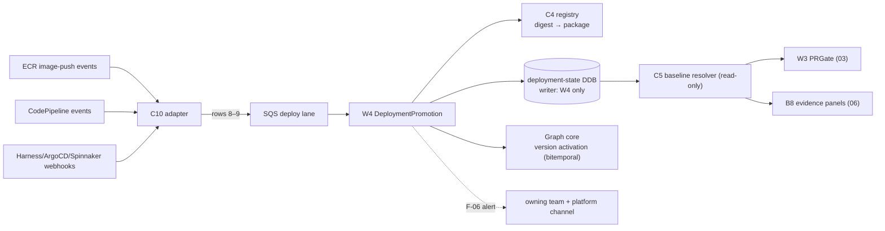

# 05 — Step 5: Deployment Promotion

| | |
|---|---|
| **Status** | Draft — for review (normative once approved) |
| **Step** | Deploy success promotes the exact artifact digest's lineage to "authoritative for that environment"; deploy failure changes nothing; rollback reactivates the prior version — bitemporally, with nothing deleted |
| **Runs** | Every deployment, failure, and rollback (~`A·d = 7,000`/day at the planning point) |
| **PRD homes** | C5 baseline resolver · C10 deployment/rollback event adapter · W4 DeploymentPromotion ([00-component-inventory.md](00-component-inventory.md)) |

## 1. Step overview and boundaries

Trust binds to the artifact digest (ADR-020): a repo builds several artifacts, one artifact runs in several environments, and only a successful deployment promotes the exact digest's lineage to **environment-authoritative**. This step implements the de-review §6.1 deployment-authority state machine exactly (`Candidate → Superseded | MergedCandidate → Authoritative | FailedDeploy`; `Authoritative → PriorReactivated` on rollback), writes the `deployment-state` table that C5 serves as the *only* baseline lookup path for the PR gate, and enforces the hotfix invariant (F-06): a digest observed in an environment with no lineage package is a first-class, unskippable alert.

"Authoritative" here is a deployment/environment property — not a rung on the human trust ladder ([00 §5](00-component-inventory.md) terminology note). Promotion moves *which version answers for an environment*; approval ([06](06-approval.md)) moves *how much humans have attested it*; runtime evidence ([04](04-runtime-corroboration.md)) moves *confidence*. Three orthogonal axes.

- **Owned trigger rows:** 8 (`deploy.succeeded`), 9 (`deploy.failed` / `deploy.rolledback`).
- **Entry events:** ECR image-push events (digest signal) + CD events (CodePipeline native; Harness/ArgoCD/Spinnaker via receiver Lambda).
- **Exit / state mutated:** `deployment-state` table updates; version activation/reactivation in the graph core (bitemporal — previous versions remain queryable); F-06 alerts; drift re-evaluation events on rollback; flow-status records.
- **Not in this step:** candidate creation and merge recording (step 3, rows 5–7); trust promotion (step 6); expected-vs-runtime reconciliation details (the standing evidence pipelines of step 4 — promotion emits the reconcile trigger).

## 2. Normative inputs

| Source | What it governs here | Mode |
|---|---|---|
| [De-review §6.1](../platform-10-de-review/README.md) | The deployment-authority state machine — implemented verbatim | referenced |
| [Workflow spec §4](../aws-lineage-collection-plan/04-collection-workflow-spec.md) | The state diagram (the §6.1 table in picture form) + hotfix invariant note | referenced |
| [ADR-020](../aws-lineage-collection-plan/01-decision-records.md) | Artifact digest as trust-binding unit; promotion keys `(artifactDigest, environment)` | referenced |
| [Trigger rows 8–9](../aws-lineage-collection-plan/03-trigger-matrix.md) | Event semantics; bitemporal record; drift re-evaluation on rollback | referenced |
| [02-aws-architecture §2 rows 5, 10](../aws-lineage-collection-plan/02-aws-architecture.md) | AWS realizations; `deployment-state` table shape | referenced |
| [`event-catalog.md`](contracts/events/event-catalog.md) rows 8–9 | Event payloads, idempotency keys, deploy lane | **new — normative here** |

## 3. Process flow

```mermaid
sequenceDiagram
  autonumber
  participant CD as CD system / ECR
  participant C10 as C10 adapter
  participant EB as EventBridge (deploy lane)
  participant W4 as W4 DeploymentPromotion
  participant AR as C4 artifact registry
  participant DS as deployment-state (DDB)
  participant CORE as Graph core

  CD->>C10: deploy succeeded {env, service, digest, deploymentId}
  C10->>EB: deploy.succeeded (normalized)
  EB->>W4: start (deploy lane — minutes objective)
  W4->>AR: resolve digest → lineage package (per-artifact lineage/<artifact>.yaml binding)
  alt lineage package exists
    W4->>DS: put {(environment, serviceUrn) → (artifactDigest, contentHash, deployedAt)}
    W4->>CORE: promote exact digest's lineage → Authoritative for env (new active version; previous queryable)
    W4->>EB: reconcile-expected-vs-runtime trigger (standing pipelines, step 4)
  else no package for digest (hotfix path)
    W4->>W4: F-06 first-class alert — unskippable, binding
    W4->>DS: record digest observed-unbound (visible state, not silence)
  end
```

Failure and rollback (row 9):

```mermaid
stateDiagram-v2
  MergedCandidate --> FailedDeploy: deploy.failed\n(no change to active version)
  Authoritative --> PriorReactivated: deploy.rolledback\n(prior deployed artifact reactivated;\nbitemporal record; nothing deleted;\ndrift re-evaluation triggered)
```

### Failure and ordering

- **Idempotency:** `deploymentId` is the key everywhere; duplicate CD/ECR events converge to one state transition.
- **Out-of-order deploy events** (e.g. rollback event arrives before the success it reverses, cross-region relays): W4 orders by the CD system's `deployedAt`, not arrival; a transition older than the current state's timestamp is recorded in the bitemporal history but does not regress the active pointer — and raises an ordering metric.
- **Unknown digest** (deploy of an artifact the platform never saw): the F-06 path — alert + `observed-unbound` state; the nightly sweep and the owning team's remediation close it.
- **Partial/canary deploys:** promotion applies per `(environment, serviceUrn)` at the granularity the CD events carry; a canary environment is its own environment key (de-review §6.3 deploy suite covers canary/partial).
- **Adapter down:** CD events are redelivered per source semantics (EventBridge native) or caught by the nightly reconciliation's deployment sweep; a gap shows up as `deployment-state` staleness vs ECR truth — alarmed.

## 4. Components in this step

| ID | Role here | PRD |
|---|---|---|
| C10 deploy/rollback adapter | Normalize CD/ECR events → rows 8–9 | **this doc §5.1** |
| W4 DeploymentPromotion | The state machine executor | **this doc §5.2** |
| C5 baseline resolver | Serve `deployment-state` reads (the only baseline path) | **this doc §5.3** |
| C4 artifact registry | Digest → lineage package resolution | [02 §5.3](02-baseline-collection.md) |
| C1 receiver | (not in this path — CD events don't come through GitHub) | [03 §5.1](03-incremental-collection.md) |
| X3 trust promotion | Orthogonal axis — unaffected by promotion | [06 §5.3](06-approval.md) |
| C12 | Deploy-lane metrics, F-06 alerting, flow status | [08 §5.1](08-scale-and-visibility.md) |

## 5. Component PRDs

### 5.1 C10 — Deployment and rollback event adapter

**Purpose.** One normalized deploy-event stream from a heterogeneous CD estate: native EventBridge sources (ECR image-push, CodePipeline) plus a receiver Lambda for Harness/ArgoCD/Spinnaker webhooks — all emitting catalog rows 8–9.

**Requirements.**

- REQ-C10-01 (MUST) Normalize every source to `deploy.succeeded` / `deploy.failed` / `deploy.rolledback` with `{environment, serviceUrn, artifactDigest, deploymentId, deployedAt}`; unknown-source events are quarantined visibly, never dropped.
- REQ-C10-02 (MUST) Authenticate webhook sources (per-source shared secrets/OIDC); map CD-system environment names to platform environments via reviewed config (the environment mapping is identity-critical — a wrong mapping cross-joins environments, de-review risk 1).
- REQ-C10-03 (MUST) Carry the *exact* image digest (`sha256:…`) — tags are never a promotion key (tags move; digests don't).
- REQ-C10-04 (MUST) Emit rollbacks as `deploy.rolledback` with `priorDeploymentId` when the CD system supplies it; when it doesn't, W4 resolves the prior from `deployment-state` history.
- REQ-C10-05 (SHOULD) Publish per-source delivery-lag metrics (CD event lag is part of the "deployed lineage queryable ≤ 10 min" freshness bar).

**Interfaces.** Sources: ECR/CodePipeline EventBridge, CD webhooks. Emits: rows 8–9 onto the deploy lane. Config: environment-mapping table (versioned, reviewed).

### 5.2 W4 — DeploymentPromotion workflow

**Purpose.** Execute the deployment-authority state machine exactly: resolve digest → promote/record-failure/reactivate → emit reconcile triggers — with the F-06 hotfix invariant enforced.

**Requirements.**

- REQ-W4-01 (MUST) Implement the de-review §6.1 rows for deploy success/failure/rollback verbatim (the ASL structurally checked against workflow-spec §4's diagram, as W1–W3 are).
- REQ-W4-02 (MUST) On success: resolve the digest's lineage package via C4 (per-artifact `lineage/<artifact>.yaml` binding); write `deployment-state`; promote the exact digest's lineage to Authoritative for that environment as a *new active version* — the previous version stays queryable (bitemporal-lite, ADR-003 alignment).
- REQ-W4-03 (MUST) On failure: mark the candidate `FailedDeploy`; no change to the active version.
- REQ-W4-04 (MUST) On rollback: reactivate the prior deployed artifact/version (`PriorReactivated`), record bitemporally, delete nothing, and emit a drift re-evaluation trigger (the rolled-back-to version's expected-vs-runtime posture gets re-checked by the standing pipelines).
- REQ-W4-05 (MUST) F-06: when no lineage package exists for a deployed digest, raise a first-class alert (unskippable, binding — routed to the owning team and the platform channel) and record `observed-unbound` — never silently proceed, never fake a promotion.
- REQ-W4-06 (MUST) Meet the deploy-lane objective: promotion visible in queries ≤ 10 min from the CD event (the month-6 freshness bar; measured as an SLI).
- REQ-W4-07 (MUST) Write flow-status stages (`received → resolved → promoted|failed|reactivated → reported`) keyed by `deploymentId`-rooted correlation.

**Interfaces.** Triggered by rows 8–9 (deploy lane). Reads: C4, `deployment-state` history. Writes: `deployment-state`, graph-core version activation, alerts, flow status.

### 5.3 C5 — Baseline resolver

**Purpose.** The single answer to "what is the baseline for environment E?": the last successful deployment's artifact — never default-branch HEAD. The de-review's most-cited correctness rule, enforced as the only lookup path W3 (and impact rendering) may use.

**Requirements.**

- REQ-C5-01 (MUST) Serve `(environment, serviceUrn) → {artifactDigest, contentHash, deployedAt}` from `deployment-state`; O(1); p50 < 100 ms (it sits inside W3's ~2 s baseline budget).
- REQ-C5-02 (MUST) Return a typed `no-deployment-recorded` result for services never deployed in an environment — consumers must handle it explicitly (gate: warn posture, "no environment baseline"); C5 never falls back to default-branch HEAD silently.
- REQ-C5-03 (MUST) Serve point-in-time reads (`asOf`) from the bitemporal history — decision replay needs the baseline *as it was* (ADR-004 reproducibility).
- REQ-C5-04 (MUST) Be read-only for every consumer except W4 (IAM-enforced single writer).
- REQ-C5-05 (SHOULD) Publish `deployment-state` staleness vs ECR observed digests as the drift alarm feeding F-06 detection.

**Interfaces.** Store: `deployment-state` DDB (writer: W4 only). Readers: W3, C7, B8 evidence panels, W5 (nightly deployment sweep). API: internal Lambda (`GET /baseline/{env}/{serviceUrn}[?asOf=…]`).

## 6. High-level design



## 7. Low-level design

### 7.1 `deployment-state` table

- PK `ENV#{environment}#SVC#{serviceUrn}`, SK `CURRENT` (active pointer) and `HIST#{deployedAt}#{deploymentId}` (bitemporal history rows; append-only).
- `CURRENT` write is conditional on `deployedAt` ≥ stored `deployedAt` (the out-of-order guard); history rows always append.
- Item: `{artifactDigest, contentHash, deployedAt, deploymentId, state: Authoritative|FailedDeploy|PriorReactivated|observed-unbound, priorDeploymentId?}`.

### 7.2 W4

- **Modules:** `services/promotion/` — `src/resolve/` (digest → package via C4), `src/transition/` (state machine rules), `src/activate/` (graph-core version calls), `src/alerts/` (F-06).
- **Transition rules table** (pure function `(currentState, event, timestamps) → (nextState, actions)`) is the code mirror of de-review §6.1 — tested cell by cell.
- **Rollback resolution:** `priorDeploymentId` from the event, else latest `HIST` row with `state = Authoritative` preceding the current; ambiguity (no prior) → alert + no-op (a rollback with nothing to reactivate is an estate inconsistency, surfaced not guessed).
- **Errors:** `package-missing` (F-06 path — not an error exit; a designed outcome) · `registry-unavailable` (retry; deploy lane tolerates minutes) · `core-activation-failed` (retry; `deployment-state` write and core activation are reconciled by an outbox so they cannot split-brain: DS write commits first, activation retries from the outbox until confirmed).
- **Idempotency key:** `(deploymentId, outcome)`.

### 7.3 C10 / C5

- **C10:** per-source normalizer modules with contract fixtures per CD system; environment-mapping config schema-validated; unknown environment → quarantine + alarm (never guess a mapping).
- **C5:** thin Lambda over DDB with an LRU (TTL 30 s — staleness bounded well under the gate's tolerance); `asOf` reads scan `HIST` descending; the `no-deployment-recorded` result is a typed response, not a 404 (consumers must branch on it).

## 8. Use cases with success criteria

| ID | Use case | Success criteria |
|---|---|---|
| UC-5-01 | Successful deploy of a merged candidate | Digest's lineage Authoritative for the env ≤ 10 min from the CD event; previous version still queryable; `deployment-state` CURRENT updated; expected-vs-runtime reconcile triggered; flow status complete |
| UC-5-02 | Deploy failure | Candidate `FailedDeploy`; active version unchanged; C5 answers exactly as before the attempt |
| UC-5-03 | Rollback | Prior artifact/version reactivated; bitemporal history shows both transitions; nothing deleted; drift re-evaluation emitted; C5 serves the reactivated baseline immediately (cache TTL ≤ 30 s) |
| UC-5-04 | Hotfix digest with no lineage package (F-06) | First-class alert to owning team + platform channel; `observed-unbound` state visible in coverage/admin surfaces; no fake promotion; closure path: the digest's repo/SHA gets baselined and a follow-up event binds it |
| UC-5-05 | Duplicate `deploy.succeeded` (redelivery) | Single state transition; second event converges as no-op (`deploymentId` idempotency) |
| UC-5-06 | Out-of-order: rollback event arrives before its success event | Active pointer never regresses (`deployedAt` guard); both events land in history; ordering metric increments |
| UC-5-07 | Canary/partial deploy | Promotion scoped to the canary environment key only; main env baseline untouched (de-review §6.3 deploy suite) |
| UC-5-08 | Gate reads after deploy (UC-3-07 continuation) | Next PR on the service diffs against the *new* environment baseline — never default-branch HEAD (asserted by an end-to-end fixture) |
| UC-5-09 | Decision replay | A sampled past gate decision replays with `asOf` baseline + pinned tuple to the identical outcome (month-6: 100% of sampled decisions) |

## 9. Contract-testing expectations

| Component | Contract | Pairs | CI check |
|---|---|---|---|
| C10 | [`event-catalog.md`](contracts/events/event-catalog.md) rows 8–9 | C10 → W4 | Recorded fixtures per CD source (ECR, CodePipeline, Harness, ArgoCD) normalize to catalog-valid events with digests, never tags; unknown-env fixture quarantines |
| W4 | de-review §6.1 transition table | — | Cell-by-cell transition tests: every `(state, event)` pair yields exactly the table's `(nextState, actions)`; unexpected pairs alarm, never silently no-op |
| C5 | baseline read contract | C5 → W3, C7, B8 | Typed `no-deployment-recorded` branch exercised by consumer tests; `asOf` reproducibility test (write history, read past states) |
| W4/C5 | single-writer invariant | — | IAM policy test: only W4's role can write `deployment-state`; a consumer write attempt fails in CI's policy simulation |

## 10. Live-dependency-testing expectations

| Dependency | Test | Proves | Guards |
|---|---|---|---|
| ECR (test registry) | Real image push → EventBridge event → W4 | Native event shape/digest fidelity end-to-end | Test registry; teardown |
| CD sandbox (one real CD system, e.g. CodePipeline test pipeline) | Scripted deploy → fail → rollback sequence | Event ordering/latency of a real CD system; ≤ 10 min freshness measured | Test pipeline; sandbox env keys |
| DynamoDB (real) | Concurrent duplicate + out-of-order event storm (20 events, shuffled) | Conditional-write guards under real contention | Test table |
| Full stack (test stage) | UC-5-08 end-to-end: deploy then open a PR | The gate demonstrably baselines on the deployment, not HEAD | Sandbox org + test stage |

## 11. End-user testing hooks

- E2E journeys: **E2E-04** (deploy → promote → rollback) in [09-end-user-testing.md](09-end-user-testing.md).
- User-observable interfaces: environment/version indicators on lineage views (which version answers for prod), the F-06 alert (team channel + admin screen 7 health), flow status by `deploymentId`, PR checks visibly re-baselining after deploys.

## 12. Step acceptance criteria

- [ ] The §6.1 state machine implemented verbatim and cell-tested; no undocumented transitions.
- [ ] Promotion binds to exact digests; tags never promote; deployed lineage queryable ≤ 10 min.
- [ ] Rollback is bitemporal reactivation — nothing deleted, prior versions queryable, drift re-evaluation fired.
- [ ] F-06: unbound digests alert unskippably and are visible states; closure path demonstrated.
- [ ] C5 is the only baseline path, single-writer enforced, `asOf` replay proven.
- [ ] Flow-status records for every deploy event, including failures, duplicates (converged), and unbound digests.

## 13. Traceability

- **ADRs:** 020 (digest binding), 003 via HLD (bitemporal-lite), 004 (replay), 026 (deploy lane).
- **Trigger rows:** 8, 9 (owned).
- **Findings:** F-06 (the hotfix invariant — this step's reason to exist), F-01 (honest promotion: no package ⇒ no promotion).
- **De-review:** §6.1 (deploy/fail/rollback rows), §6.2 components 5 and 10, §6.3 deploy suite, month-6 freshness bar.
