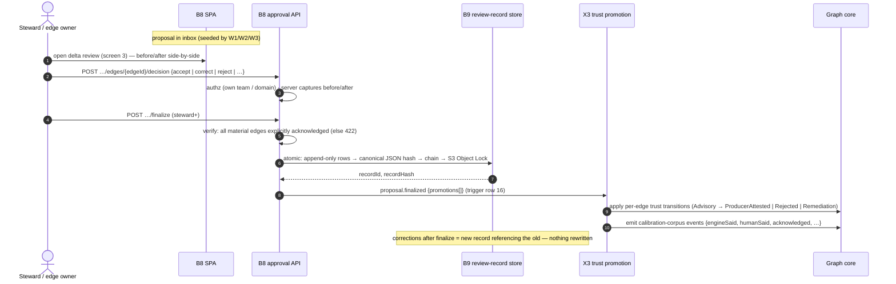
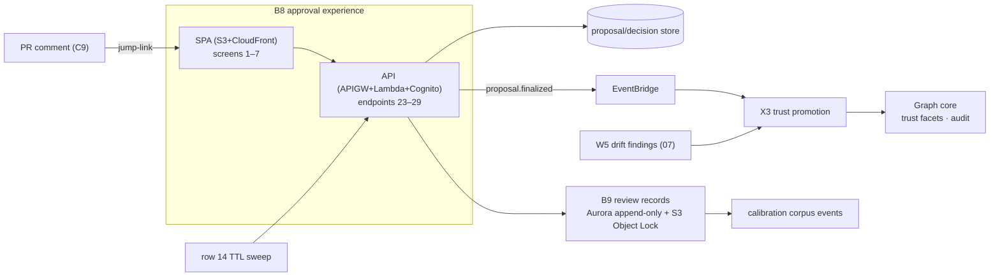

# 06 — Step 6: Approval

| | |
|---|---|
| **Status** | Draft — for review (normative once approved) |
| **Step** | Delta surfaces in the UI → per-edge accept/correct/reject with before/after captured → immutable review record → trust promotion |
| **Runs** | Continuously: proposals arrive from baselines and deltas; stewards work the queues; finalization fires trust promotion |
| **PRD homes** | B8 approval UI + API · B9 review-record store · X3 trust-promotion service ([00-component-inventory.md](00-component-inventory.md)) |

## 1. Step overview and boundaries

Approval is where humans add what automation cannot: per-edge judgement on material mappings, before/after-audited corrections, steward decisions on identity and waivers — and the trust promotion that makes edges **Producer-attested**. Its four rules are ADR-024's: per-edge decisions (acknowledgement required only for material mappings; everything else recorded as unreviewed rather than silently blessed); immutable review records (append-only, hash-chained, Object-Locked); approval is trust promotion, not admission (lineage is already Advisory when review starts — F-05); and steward queues for what users cannot decide alone (fuzzy identity merges, waivers, attestation renewals). The screens, states, endpoints, and roles are the approval spec's; this doc decomposes them into buildable components.

Trust (human ladder) and confidence (evidence bands) are orthogonal axes, both visible on every edge — this step moves only trust.

- **Owned trigger rows:** 14 (waiver/attestation expiry approaching), 16 (`proposal.finalized`).
- **Entry:** proposals seeded by W1 (baselines) and W2/W3 deltas; TTL sweeps; drift re-queues from [07](07-nightly-reconciliation.md).
- **Exit / state mutated:** review records (B9); trust transitions on edges (X3); calibration-corpus events; steward-queue resolutions.
- **Not in this step:** confidence scoring (evidence axis, [04](04-runtime-corroboration.md)/graph core); waiver *evaluation* in gate decisions (C8, [03](03-incremental-collection.md) — this step hosts waiver *approval workflow* surfaces); deployment authority ([05](05-deployment-promotion.md)).

## 2. Normative inputs

| Source | What it governs here | Mode |
|---|---|---|
| [ADR-024](../aws-lineage-collection-plan/01-decision-records.md) | The four approval rules; UI stack; calibration corpus | referenced |
| [Approval spec](../aws-lineage-collection-plan/05-approval-ui-spec.md) | Trust ladder, 7 screens, seven-state rendering, endpoints 21–29, roles, finalize mechanics §7, NFRs §8 — decomposed here, never altered | referenced |
| [HLD §6.5, §8, §9.1](../architecture-review-v8/04-high-level-design.md) | Waiver semantics; seven consumer states; RBAC roles | referenced |
| [ADR-006](../architecture-review-v8/03-decision-records.md) | Fuzzy identity merges never auto-merge; human confirmation | referenced |
| [Trigger rows 14, 16](../aws-lineage-collection-plan/03-trigger-matrix.md) | TTL sweep and finalization semantics | referenced |
| [`review-record.schema.json`](contracts/schemas/review-record.schema.json) · [`delta.schema.json`](contracts/schemas/delta.schema.json) · [`approval-api.openapi.yaml`](contracts/openapi/approval-api.openapi.yaml) | Shapes and API | **new — normative here** |

## 3. Process flow

Row 14 (TTL sweep): waivers ≤ 90 d and declared contracts (default TTL 180 d) approaching expiry generate steward-queue items and owner notifications; true expiry emits decay events (declared edges decay to Inferred).

### Failure and ordering

- **Finalize is atomic** (approval spec §7 steps 1–5): if any step fails, the whole finalize fails and no partial record exists; retries are idempotent on `proposalId` (already-finalized ⇒ 409 with the existing recordId).
- **Trust promotion is asynchronous but exactly-once-converging:** X3 consumes `proposal.finalized` idempotently on `recordId`; a replay re-applies the same transitions as no-ops.
- **Drift re-queue:** `ProducerAttested → UnderReview` on nightly divergence or runtime conflict — attested trust is never silently preserved against contradicting evidence (trust ladder).
- **Concurrent decisions on one edge:** last-writer-wins pre-finalize with full audit of intermediate decisions; the finalize snapshot freezes the state at finalize time.
- **DLQ:** X3's consumer has a DLQ; a stuck promotion (edge vanished by tombstone) quarantines with reason and lands in the steward drift tab.

## 4. Components in this step

| ID | Role here | PRD |
|---|---|---|
| B8 approval UI + API | Screens 1–7, endpoints 23–29, RBAC | **this doc §5.1** |
| B9 review-record store | Append-only + hash-chain + Object Lock | **this doc §5.2** |
| X3 trust-promotion service | Row-16 consumer; ladder transitions; calibration events | **this doc §5.3** |
| C8 policy/waiver | Waiver storage/evaluation (queue surface here, evaluation in 03) | [03 §5.5](03-incremental-collection.md) |
| C9 renderer | The PR-side entry point (jump-link into screen 3) | [03 §5.6](03-incremental-collection.md) |
| B1 registry | Screen 7 CRUD | [01 §5.1](01-onboard.md) |
| X4 coverage | Screen 1 payload | [02 §5.5](02-baseline-collection.md) |
| C12 | Audit tables, approval-funnel metrics | [08 §5.1](08-scale-and-visibility.md) |

## 5. Component PRDs

### 5.1 B8 — Approval UI + API

**Purpose.** The seven-screen SPA and its API: coverage dashboard, review inbox, delta review, edge review, steward queues, review-record viewer, admin/flow-status — app-scoped always, whole-graph never (PRD 3's founding principle).

**Requirements.**

- REQ-B8-01 (MUST) Implement the seven screens with the contents and role gates of the approval spec §3, and the screen flow of its diagram, including the PR-comment jump-link into delta review.
- REQ-B8-02 (MUST) Serve endpoints 23–29 per [`approval-api.openapi.yaml`](contracts/openapi/approval-api.openapi.yaml); Cognito federated to corporate OIDC; groups → `viewer`/`domain-steward`/`platform-admin`; the §6 role matrix enforced server-side (client hiding is UX, not authz).
- REQ-B8-03 (MUST) Render all seven consumer states with the spec §4 treatments verbatim — `not-observed` as first-class blind spots (never blank), `truncated` with counts (never an unlabeled cut), `error` with reason + flow link (never silently omitted).
- REQ-B8-04 (MUST) Render confidence as `{score, band}` — integer + band, never decimals — with the runtime-less cap surfaced ("capped at 64 — no runtime corroboration yet").
- REQ-B8-05 (MUST) Enforce decision semantics: per-edge actions (acknowledge/accept/correct/reject/request-remediation); server captures before/after on corrections; bulk operations available **only** for non-material edges (bulk-accept of material mappings structurally impossible); finalize rejects (422) while material edges lack explicit acknowledgement.
- REQ-B8-06 (MUST) Enforce steward-queue semantics: identity merges (never auto-merged, ADR-006), waivers (approver = downstream owner/steward, self-approval rejected server-side, ≤ 90 d), attestation/drift triage.
- REQ-B8-07 (MUST) Meet the NFRs: inbox/dashboard p95 < 500 ms; progressive rendering for large deltas (truncated + pagination); severity/trust never color-only; keyboard-completable decision flow.
- REQ-B8-08 (MUST) Deny service accounts on UI-scoped endpoints unless explicitly scoped; audit PII-tagged lineage reads for all human roles (ADR-016).

**Interfaces.** SPA: S3 + CloudFront. API: API GW (HTTP) + Lambda + Cognito. Reads: proposals/deltas (C6 output store), coverage (X4), evidence (C4, graph core), flow status (endpoint 29 ← flow-status DDB), review records (B9). Writes: decisions, finalize → B9/X3.

### 5.2 B9 — Review-record store

**Purpose.** The immutable memory of every human decision: append-only Aurora rows plus content-addressed, hash-chained S3 objects under Object Lock (governance mode). Records are never updated; corrections are new records referencing the old.

**Requirements.**

- REQ-B9-01 (MUST) Persist records validating against [`review-record.schema.json`](contracts/schemas/review-record.schema.json), via the atomic finalize sequence of approval spec §7 (rows → canonical hash → `previousRecordHash` chain per app → Object Lock put → promotions → events).
- REQ-B9-02 (MUST) Enforce immutability structurally: no UPDATE/DELETE grants on the record tables for the API role; S3 governance-mode retention per compliance policy.
- REQ-B9-03 (MUST) Verify and expose chain integrity: `GET /v1/review-records/{id}` returns `chainVerified`; a chain break is a sev-1 audit alarm.
- REQ-B9-04 (MUST) Emit calibration-corpus events at finalize: `{edge, engineSaid, humanSaid, provenance, archetype, repo, commit, reviewer, acknowledged}` — the per-edge `acknowledged` flag is what separates reviewed labels from pass-through.
- REQ-B9-05 (SHOULD) Support export (record + chain segment) for audit (IMP-011).

**Interfaces.** Writer: B8 finalize path only. Readers: endpoint 27, auditors, calibration pipeline. Stores: Aurora append-only tables + S3 Object Lock bucket.

### 5.3 X3 — Trust-promotion service

**Purpose.** The row-16 consumer: turn finalized human decisions into trust-ladder transitions on the graph — and nothing else. Promotion never deletes evidence; rejection demotes/flags; no approval action modifies source schemas, pipelines, or deployments (IMP-012).

**Requirements.**

- REQ-X3-01 (MUST) Consume `proposal.finalized` idempotently (`recordId`); apply per-edge transitions exactly as the record's `trustPromotions` states: `Advisory|UnderReview → ProducerAttested | Rejected | Remediation`.
- REQ-X3-02 (MUST) Attach attestation TTLs on promotion; expiry approaching flows through row 14 (steward re-queue); true expiry decays trust and re-queues.
- REQ-X3-03 (MUST) Apply drift demotion: on nightly divergence findings or runtime conflicts against attested edges, transition `ProducerAttested → UnderReview` with the finding attached.
- REQ-X3-04 (MUST) Never touch confidence scores/bands (orthogonal axis), and never delete evidence on rejection — rejected edges stay queryable, flagged.
- REQ-X3-05 (MUST) Write an audit row per transition (actor = the record; system = X3) and a flow-status record per consumed finalization.

**Interfaces.** Consumes: `proposal.finalized` (row 16), drift findings (from W5), TTL expiry events (row 14). Writes: trust facets in the graph core, audit, flow status.

## 6. High-level design

Stores: proposal/decision store (writer: B8 + seeding workflows; reader B8) · B9 stores (writer: finalize only) · calibration corpus (append-only; consumer: confidence-model calibration, out of scope here).

## 7. Low-level design

### 7.1 B8

- **Modules:** `services/approval-api/` — `src/authz/` (role matrix middleware, server-side), `src/proposals/`, `src/decisions/` (before/after capture), `src/finalize/` (the §7 saga), `src/steward/` (merges/waivers/attestations), `src/flows/` (endpoint 29 proxy); `apps/approval-spa/` — screen modules 1–7, shared state-rendering library (the seven-state treatments as one component set, so no screen can render a state off-spec).
- **Finalize saga:** single Lambda transaction boundary: Aurora tx (rows + chain-head advance with `SELECT … FOR UPDATE` on the app's chain head) → hash → S3 put (Object Lock) → outbox event. S3 failure rolls the tx back; outbox retries make promotion at-least-once (X3 converges).
- **Errors:** `unacknowledged-material` (422 with the offending edge list) · `already-finalized` (409 + recordId) · `authz-denied` (403, audited) · `chain-head-contention` (retry — serialized per app).
- **Idempotency:** decisions `(proposalId, edgeId, actor, revision)`; finalize `proposalId`.

### 7.2 B9

- Aurora: `review_record`, `review_decision` (FK), `chain_head (appId → lastHash)`; API role grants: INSERT + SELECT only.
- Canonical JSON: RFC 8785-style canonicalization before hashing (the same canonicalizer the verification endpoint uses — one implementation, imported twice).
- S3 key: `review-records/{appId}/{recordHash}.json`; Object Lock governance mode, retention per compliance config.
- **Chain verification:** walk `previousRecordHash` from the queried record to the root, comparing recomputed hashes; verification depth configurable (full walk for audits, 1-link for interactive reads).

### 7.3 X3

- Consumer Lambda on the row-16 rule + drift/TTL inputs; transition application is per-edge conditional update (`current trust == from`) — a mismatch (concurrent demotion) records a conflict audit row and re-queues to the steward drift tab rather than force-applying.
- **Idempotency:** `recordId` (finalizations), `(findingId)` (drift), `(id, expiresAt)` (TTL).
- **Errors:** `edge-not-found` (tombstoned since review → DLQ + drift tab) · `transition-conflict` (audited re-queue).

## 8. Use cases with success criteria

| ID | Use case | Success criteria |
|---|---|---|
| UC-6-01 | Review a delta end-to-end | Steward opens screen 3 from the PR comment; before/after rendered side-by-side per changed edge; per-edge decisions recorded with server-captured before/after; finalize produces a chain-valid record; edges promoted `ProducerAttested`; calibration events emitted with correct `acknowledged` flags |
| UC-6-02 | Finalize with an unacknowledged material edge | 422 listing the edges; nothing written; non-material edges' bulk-accept unaffected |
| UC-6-03 | Bulk-accept attempt on material edges | Structurally impossible: no API path accepts it (fixture-tested); UI offers bulk only on non-material |
| UC-6-04 | Correction | `before`/`after` both frozen in the record; the corrected edge carries the human value; the engine's original preserved as evidence |
| UC-6-05 | Rejection | Edge flagged `Rejected`; evidence intact and queryable; nothing deleted |
| UC-6-06 | Post-finalize correction | New proposal → new record with `supersedesRecordId`; the old record byte-identical; chain extends |
| UC-6-07 | Immutability attack (test) | UPDATE attempts under the API role fail at the DB; premature S3 delete under governance lock fails; chain verification detects a manufactured tamper |
| UC-6-08 | Identity merge queue | Fuzzy candidate approved/rejected by steward only; never auto-merged; decision audited (ADR-006) |
| UC-6-09 | Waiver lifecycle (queue side) | Approval by downstream owner/steward; self-approval rejected server-side; expiry ≤ 90 d enforced; row-14 notification before expiry; expiry visible in the gate's behavior (UC-3-08) |
| UC-6-10 | Attestation TTL decay | Declared edge reaches TTL 180 d: decays to Inferred; re-queued; visible on screen 5 |
| UC-6-11 | Drift demotion | Nightly finding against an attested edge → `UnderReview` with the finding attached; steward sees it in the drift tab |
| UC-6-12 | RBAC matrix | Every §6 cell enforced server-side (viewer cannot finalize; service accounts denied; PII reads audited) — one test per cell |
| UC-6-13 | Approval funnel visibility | Time-to-first-review and ack coverage published; SLA aging visible in the inbox |

## 9. Contract-testing expectations

| Component | Contract | Pairs | CI check |
|---|---|---|---|
| B8 | [`approval-api.openapi.yaml`](contracts/openapi/approval-api.openapi.yaml) | SPA → API | Generative conformance (every operation, every documented error code reachable); SPA client generated from the spec so drift is a compile error |
| B8 | [`delta.schema.json`](contracts/schemas/delta.schema.json) | C6 → B8 | Screen-3 rendering fixtures consume only schema fields; `materiality` drives the ack requirement in fixtures |
| B9 | [`review-record.schema.json`](contracts/schemas/review-record.schema.json) | B8 → B9 → auditors | Records validate; canonicalization golden tests (same record → same hash across implementations); chain property test (N records → verifiable chain; any byte flip detected) |
| X3 | `proposal.finalized` (row 16) + promotion effects | B8 → X3 → core | Fixture finalizations produce exactly the record's transitions; replay converges; conflict path exercised |
| B8 | seven-state rendering | core states → SPA | A fixture per consumer state asserting the spec §4 treatment (hatched not-observed, labeled truncation, etc.) via component tests |

## 10. Live-dependency-testing expectations

| Dependency | Test | Proves | Guards |
|---|---|---|---|
| Cognito + corporate OIDC (test IdP) | Login → group mapping → role enforcement for all three roles | Federation and group→role mapping against a real IdP | Test IdP tenant |
| Aurora + S3 Object Lock (real) | Full finalize saga incl. forced S3 failure mid-saga | Atomicity (rollback proven), governance-mode immutability (delete attempt fails), chain-head serialization under concurrent finalizes | Test cluster/bucket; short retention in test |
| CloudFront + S3 (real, test distro) | SPA smoke: all seven screens load; p95 < 500 ms on inbox/dashboard with seeded data | NFR §8 under real CDN behavior | Test distribution |
| EventBridge → X3 → graph core (test stage) | Finalize → promotion visible in lineage reads | The async trust path end-to-end with real delivery semantics | Test stage |

## 11. End-user testing hooks

- E2E journeys: **E2E-01** (onboard → approved graph — the approval leg), **E2E-02** (push → delta → approval) in [09-end-user-testing.md](09-end-user-testing.md).
- User-observable interfaces: screens 1–7 (the primary human surface of the whole platform), endpoints 23–29, the PR comment jump-link, notification emails/queue items from row 14.

## 12. Step acceptance criteria

- [ ] Per-edge decision semantics enforced: material-only ack requirement, server-captured before/after, no bulk path for material edges.
- [ ] Review records immutable by construction (grants + Object Lock + chain), verification exposed, tamper detected.
- [ ] Approval = trust promotion only: Advisory publication precedes review; rejection preserves evidence; no side effects on sources (IMP-012).
- [ ] Steward queues enforce ADR-006 and HLD §6.5 verbatim (incl. server-side self-approval rejection).
- [ ] Calibration corpus accumulates with honest `acknowledged` flags.
- [ ] RBAC matrix fully server-side; PII reads audited; flow-status records for finalizations and X3 applications.

## 13. Traceability

- **ADRs:** 024 (the step's charter), 006 (identity merges), 016 (audit/PII), 008 (band rendering).
- **Trigger rows:** 14, 16 (owned).
- **Findings:** F-05 (Advisory-first; approval as promotion), F-06 (per-edge acknowledgement discipline), F-01 (honest states in the UI).
- **De-review:** IMP-009/011/012 via ADR-024; month-6 operations bar (waiver audit); §6.3 waiver suite.
