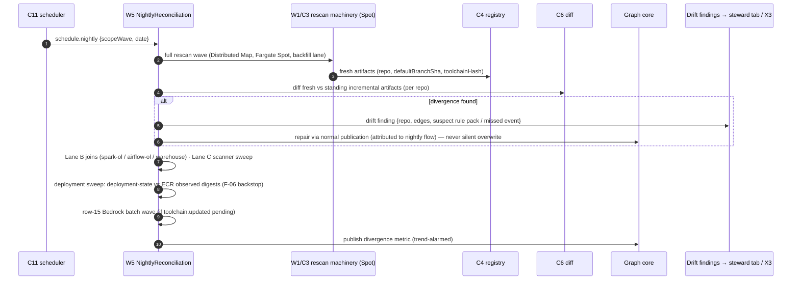
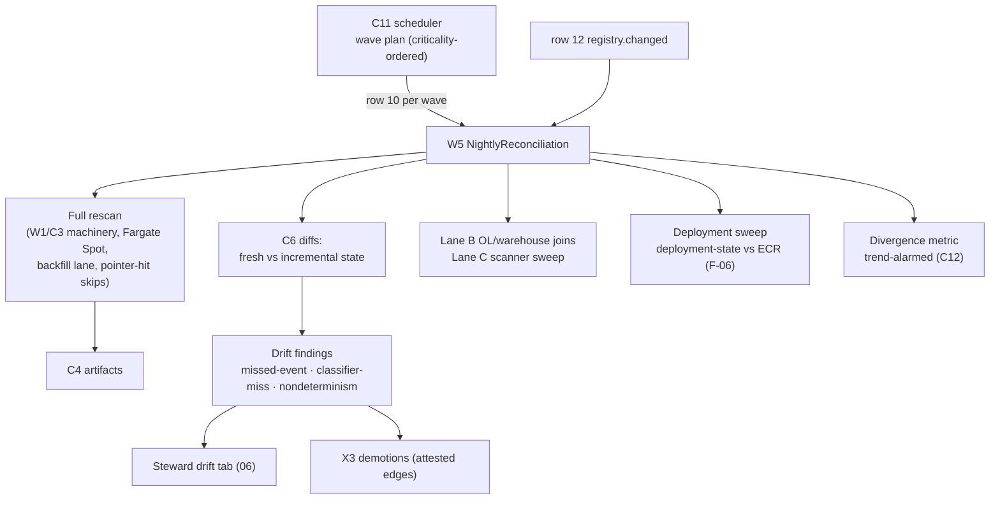

# 07 — Step 7: Nightly Reconciliation

| | |
|---|---|
| **Status** | Draft — for review (normative once approved) |
| **Step** | Full rescan diffed against incremental state — the standing bug detector (F-03 divergence metric) and the missed-event repair loop |
| **Runs** | Nightly (EventBridge Scheduler), plus registry-change reconciliation (row 12) |
| **PRD homes** | C11 nightly reconciliation scheduler · W5 NightlyReconciliation ([00-component-inventory.md](00-component-inventory.md)) |

## 1. Step overview and boundaries

The incremental path is fast because it trusts determinant-based invalidation; the nightly path is what keeps that trust honest. W5 runs a full rescan on Fargate Spot, diffs the fresh artifacts against the standing incremental state, and publishes the **incremental-vs-full divergence rate** — if the fast path ever skips real impact, it surfaces as drift within a day, with the offending rule pack identifiable. The same pass repairs missed webhooks (GitHub delivery is at-least-once and can lag — the documented safety net of ADR-023), runs the Lane B OpenLineage/warehouse joins and the Lane C scheduled scanner sweep, executes the row-15 Bedrock batch waves, and sweeps deployment-state against ECR truth (the F-06 backstop). Drift findings are issues/alerts — **never silent overwrites**.

- **Owned trigger rows:** 10 (nightly schedule), 12 (schema-registry subject change).
- **Entry events:** `schedule.nightly`; `registry.changed`.
- **Exit / state mutated:** drift findings (issues/alerts, steward drift tab); divergence metric; repaired incremental state (through the normal publication path, attributed to the nightly flow); Lane B/C refreshes; type-truth reconciliations and tombstones (row 12).
- **Not in this step:** the extraction machinery itself (reused from [02](02-baseline-collection.md) — W5 is a scheduler/differ, not a second extractor); trust demotion mechanics (X3 in [06](06-approval.md) consumes the findings); wave capacity math ([08](08-scale-and-visibility.md)).

## 2. Normative inputs

| Source | What it governs here | Mode |
|---|---|---|
| [Workflow spec §4 (NightlyReconciliation)](../aws-lineage-collection-plan/04-collection-workflow-spec.md) | The nightly sequence: rescan → diff → drift findings → Lane B/C → divergence metric | referenced |
| [Trigger rows 10, 12](../aws-lineage-collection-plan/03-trigger-matrix.md) | Semantics: repair missed webhooks; registry overrides all for type truth; tombstone on subject deletion | referenced |
| [De-review §6.1](../platform-10-de-review/README.md) | "Nightly scan" row: repair missed incremental events; emit drift findings; open issue/alert, not silent overwrite | referenced |
| [ADR-023 consequence](../aws-lineage-collection-plan/01-decision-records.md) | Nightly as the missed-delivery safety net | referenced |
| [08 §1–§3](../aws-lineage-collection-plan/08-scale-resilience-observability.md) | Wave compute (`W = A × t̄_base = 700` task-hours; < 8 h at C ≥ 100), Spot posture, backfill-lane shedding | referenced |
| [Assessment 9-step reconciliation](../lineage-collection-assessment.md) | Runtime-only edges admitted and flagged as extraction drift; collector outage → stale, never deletion | referenced |
| [`event-catalog.md`](contracts/events/event-catalog.md) rows 10, 12 | Event payloads and keys | **new — normative here** |
| Drift-finding record shape (§7.3) | The finding object consumed by the steward drift tab and X3 | **new — defined here** |

## 3. Process flow



Row 12 (registry change) runs on its own rule, not just nightly: re-derive affected edges, reconcile type truth (registry overrides all), tombstone on subject deletion, surface schema-delta drift to owners; the nightly pass is its full-coverage backstop.

### Failure and ordering

- **Idempotency:** the wave key is `(date, scopeWave)`; re-running a failed wave resumes from the Distributed Map checkpoint; per-repo work keys on `(repo, sha, toolchainHash)` so completed items are pointer-hits.
- **Spot interruption:** map retry Spot → on-demand; backfill lane sheds first under account pressure and resumes — a delayed nightly is a visible SLI breach, not lost work.
- **Divergence between a mid-wave push and the rescan:** W5 diffs against the artifact the incremental state *claims* (by SHA); a repo whose HEAD moved mid-wave is diffed at the SHA the wave cloned — no false drift from racing pushes (SHA-pinned comparisons).
- **Finding floods:** findings dedup on `(repo, edgeId, divergenceKind, toolchainHash)`; a rule-pack bug producing thousands of identical findings rolls up to one finding per (rule pack, kind) with a count.
- **Never silent:** every repair publishes through the normal gateway path with the nightly flow's correlation ID — reconstructable, auditable, alertable.

## 4. Components in this step

| ID | Role here | PRD |
|---|---|---|
| C11 scheduler | Wave scheduling + wave planning inputs | **this doc §5.1** |
| W5 NightlyReconciliation | The reconciliation workflow | **this doc §5.2** |
| C2/C3/C4/B4/W1 machinery | Rescan execution (reused) | [02](02-baseline-collection.md) |
| C6 diff | Fresh-vs-incremental diffs | [03 §5.3](03-incremental-collection.md) |
| X2 classifier | Its verdicts are what divergence audits | [03 §5.2](03-incremental-collection.md) |
| B2 / X1 | Inventory freshness for wave scope | [01](01-onboard.md) |
| B3 / B7 | Lane B evidence joins | [04](04-runtime-corroboration.md) |
| C5 | Deployment sweep reads | [05 §5.3](05-deployment-promotion.md) |
| X3 | Consumes drift findings (attested demotions) | [06 §5.3](06-approval.md) |
| X4 | Coverage refresh from the sweep | [02 §5.5](02-baseline-collection.md) |
| C12 | Divergence metric, alarms, flow status | [08 §5.1](08-scale-and-visibility.md) |

## 5. Component PRDs

### 5.1 C11 — Nightly reconciliation scheduler

**Purpose.** The clock and the wave planner's front end: EventBridge Scheduler emitting `schedule.nightly` per wave, ordered by app criticality, sized to the overnight window.

**Requirements.**

- REQ-C11-01 (MUST) Emit `schedule.nightly {scopeWave, date}` per planned wave; waves = `⌈R_scope / 10,000⌉` map runs (Distributed Map ceiling), ordered so Tier-1 apps rescan first.
- REQ-C11-02 (MUST) Consume the wave planner's capacity inputs ([08 §2](../aws-lineage-collection-plan/08-scale-resilience-observability.md)): concurrency `C_wave` from account budgets; pause/resume on backpressure signals (backfill sheds first).
- REQ-C11-03 (MUST) Include pending row-15 batch work (toolchain re-extraction) in the night's plan — the Bedrock batch wave is a nightly tenant, never an interactive one.
- REQ-C11-04 (MUST) Alarm when projected wall-clock exceeds the 8 h window (`W / C_wave` recomputed nightly from measured t̄_base) — capacity drift is caught before the SLO breach, not after.
- REQ-C11-05 (SHOULD) Support an operator-visible wave calendar (which apps, which wave, expected window) on screen 7.

**Interfaces.** Emits: row 10 events. Reads: B1 (criticality tiers), quota/capacity metrics (C12), pending row-15 queue. Realization: EventBridge Scheduler + planner Lambda.

### 5.2 W5 — NightlyReconciliation workflow

**Purpose.** The reconciliation engine: full rescan, divergence computation, drift findings, missed-event repair, Lane B/C sweeps, deployment sweep — the platform's standing proof that its fast paths are honest.

**Requirements.**

- REQ-W5-01 (MUST) Execute the full rescan by *reusing* the W1/C3 machinery (Spot, backfill lane, pointer-hit skips) — no second extractor implementation exists.
- REQ-W5-02 (MUST) Compute per-repo divergence: diff the fresh artifact against the artifact the incremental state holds for the same `(repo, sha the incremental path last processed)`; any non-empty diff is a divergence classified as `missed-event` (incremental never saw the SHA), `classifier-miss` (saw it, exited no-impact, but edges changed — the F-03 bug case, with the no-impact verdict's evidence attached to identify the rule pack), or `nondeterminism` (same SHA, different artifact hash — a reproducibility violation, sev-1).
- REQ-W5-03 (MUST) Publish the divergence rate as the standing F-03 metric — **trend-alarmed**, not just thresholded ([08 §5.4](../aws-lineage-collection-plan/08-scale-resilience-observability.md)).
- REQ-W5-04 (MUST) Repair through the normal publication path (gateway envelopes, Advisory) with the nightly correlation ID; emit a drift finding per divergence (§7.3 shape); never overwrite silently.
- REQ-W5-05 (MUST) Run Lane B reconciliation (join `spark-ol`/`airflow-ol`/`warehouse` evidence to build-time edges; runtime-only edges admitted and **flagged as extraction drift**) and the Lane C scheduled scanner sweep (advisory refresh for no-repo systems).
- REQ-W5-06 (MUST) Sweep `deployment-state` vs ECR observed digests: any digest running with no lineage package raises the F-06 alert path ([05](05-deployment-promotion.md)); any missed deploy event is repaired.
- REQ-W5-07 (MUST) Execute row 12 handling (and its nightly backstop): re-derive affected edges on `registry.changed`; type truth reconciles registry-over-all; subject deletion tombstones (lifecycle event, not row deletion); schema-delta drift surfaced to owners.
- REQ-W5-08 (MUST) Emit flow-status stages per wave and per repo (`received → extracted → diffed → reported`), so "why did the nightly touch my repo" is answerable per repo.

**Interfaces.** Consumes: rows 10, 12. Calls: W1 machinery, C6, C5, B7. Emits: drift findings (steward tab + X3), divergence metric, repairs, coverage refresh (X4).

## 6. High-level design



## 7. Low-level design

### 7.1 W5 orchestration

- ASL: wave input → parallel branches: (a) rescan map → per-repo diff → findings; (b) Lane B/C sweeps; (c) deployment sweep; (d) row-15 batch if pending — joined into the metrics/report stage. Branch failures isolate (a failed Lane B join doesn't abort the rescan branch); each branch reports its own outcome.
- **Divergence classifier (pure function):**
  1. `incrementalSha ≠ freshSha` → the incremental path is behind → replay check: was a `repo.push` event received for `freshSha`? no → `missed-event`; yes-but-no-impact-verdict → `classifier-miss`; yes-and-processed → in-flight race, skip (tomorrow confirms).
  2. Same SHA, different artifact hash → `nondeterminism` (sev-1).
  3. Same artifact, graph state differs → publication gap → repair by re-publish.
- **Errors:** `wave-overrun` (alarm; wave resumes next night from checkpoint) · `diff-failed` (per-repo finding `error`, wave continues) · `finding-flood` (roll-up rule, §3).
- **Idempotency:** `(date, scopeWave)`; per-repo `(repo, sha, toolchainHash)`.

### 7.2 C11

- Planner Lambda on a cron: compute waves from B1 scope + capacity inputs → create/update Scheduler one-shot entries for the night → publish the calendar. All planning state derivable (stateless replan is safe).

### 7.3 Drift-finding record (new contract, Tier 2)

```json
{
  "findingId": "01J…",
  "kind": "missed-event | classifier-miss | nondeterminism | runtime-only-edge | deployment-gap | schema-drift",
  "repo": "org/repo", "app": "appId",
  "shaExpected": "…", "shaFound": "…",
  "edges": [ {"edgeId": "…", "divergence": "added|changed|removed"} ],
  "suspect": {"rulePack": "sql@3", "verdictRef": "correlationId of the no-impact verdict"},
  "wave": {"date": "…", "scopeWave": 1, "correlationId": "…"},
  "rollupCount": 1,
  "routedTo": ["steward-drift-tab", "x3-demotion?"]
}
```

Consumed by the steward drift tab (screen 5) and X3 (demotion of affected attested edges). `suspect` is populated for `classifier-miss` — the rule-pack identification that makes the metric actionable.

## 8. Use cases with success criteria

| ID | Use case | Success criteria |
|---|---|---|
| UC-7-01 | Clean night (no drift) | Wave completes < 8 h; divergence rate 0 for sampled repos; pointer-hits skip unchanged repos (compute ≪ first baseline); flow status per repo |
| UC-7-02 | Missed webhook repair | A push whose webhook was dropped (simulated) is caught: finding `missed-event`; state repaired via normal publication; the repair attributable to the nightly correlation ID; developer's flow-status query for their SHA shows the nightly repair |
| UC-7-03 | Seeded classifier bug (the F-03 drill) | A rule pack modified to wrongly exit no-impact on SQL changes: next nightly emits `classifier-miss` findings with `suspect.rulePack` identifying it; divergence trend alarm fires; UC-3-13's audit trail closes the loop |
| UC-7-04 | Nondeterminism detection | A seeded nondeterministic extractor build: `nondeterminism` finding, sev-1 alarm (reproducibility violation) |
| UC-7-05 | Drift vs attested edge | Finding routed to X3; `ProducerAttested → UnderReview` with the finding attached (UC-6-11 pairing) |
| UC-7-06 | Lane B join | Spark OL evidence joins build-time edges; a runtime-only edge is admitted **and flagged** as extraction drift — visible, not silently merged |
| UC-7-07 | Registry subject deletion (row 12) | Affected edges re-derived; deleted subject tombstoned (queryable history); owners notified of schema drift |
| UC-7-08 | Deployment sweep catches an unbound digest | The F-06 alert fires from the nightly path (a CD event was missed); `deployment-state` repaired after binding |
| UC-7-09 | Wave overrun under quota pressure | Backfill shed first; PR lane untouched (verified concurrently); wave resumes next night from checkpoint; overrun SLI visible |
| UC-7-10 | Finding flood | 1,000 identical classifier-miss findings roll up to one per (rule pack, kind) with count; steward tab stays usable |

## 9. Contract-testing expectations

| Component | Contract | Pairs | CI check |
|---|---|---|---|
| W5 | drift-finding record (§7.3) | W5 → steward tab, X3 | Finding fixtures per kind validate; `classifier-miss` fixtures always carry `suspect`; roll-up property test |
| W5 | divergence classifier | — | Pure-function table tests: every (incremental state, fresh state, event history) combination in §7.1 maps to the specified kind; the in-flight-race case emits nothing |
| C11 | row 10 events + wave plan | C11 → W5 | Plan fixtures: wave count = `⌈R_scope/10,000⌉`; criticality ordering asserted; capacity inputs respected |
| W5 | reuse invariant | — | Static check: W5's rescan states invoke the same task definition/image as W1 (no second extractor drift) |
| W5 | ASL ↔ workflow-spec §4 | — | Structural branch/state match test |

## 10. Live-dependency-testing expectations

| Dependency | Test | Proves | Guards |
|---|---|---|---|
| Fargate Spot (real) | A 50-repo rescan wave with induced Spot interruptions | Checkpoint/resume and Spot→on-demand retry at real capacity semantics | Test account; small wave |
| GitHub (sandbox) | Drop a webhook deliberately (disable receiver briefly, push, re-enable) | UC-7-02 end-to-end against real delivery behavior | Sandbox |
| Bedrock batch (real) | A small row-15 batch wave through the real batch API | Batch job lifecycle, cache repopulation, comparison report | Budget cap; ≤ 100 slices |
| ECR (test registry) | Deployment sweep against real ECR digest listings | The F-06 backstop reads real registry truth | Test registry |
| Full stack (test stage) | The seeded classifier-bug drill (UC-7-03) quarterly | The platform's headline safety property, proven on real infrastructure | Test stage; drill runbook |

## 11. End-user testing hooks

- E2E journeys: **E2E-05** (nightly catches a missed event) in [09-end-user-testing.md](09-end-user-testing.md).
- User-observable interfaces: steward drift tab (screen 5), divergence trend on the operator dashboard, nightly wave calendar (screen 7), per-repo nightly flow status, drift notifications to owners.

## 12. Step acceptance criteria

- [ ] Divergence metric published nightly, trend-alarmed; the seeded classifier-bug drill passes (bug → finding → suspect rule pack → fix, within one day).
- [ ] Missed webhooks and missed deploy events demonstrably repaired, attributably (correlation ID), never silently.
- [ ] Nondeterminism detected as sev-1; reproducibility invariant policed in production, not just CI.
- [ ] Lane B/C sweeps run; runtime-only edges flagged as drift; registry row 12 semantics (type truth, tombstones) verified.
- [ ] Wave completes inside the 8 h window at planning scale, or alarms *before* breaching; backfill sheds first under pressure.
- [ ] Flow-status records exist per wave and per repo touched.

## 13. Traceability

- **ADRs:** 023 (safety net), 025 (Lane B/C scope), 026 (waves, lanes, Spot), 020 (app-scoped reporting of findings), 029 (unpinned-library gap coverage).
- **Trigger rows:** 10, 12 (owned).
- **Findings:** F-03 (the divergence metric is its standing detector — this step's charter), F-06 (deployment sweep backstop), F-02 (Lane C sweep).
- **De-review:** §6.1 nightly row, §6.2 component 11, replay/recovery month-6 bars.
