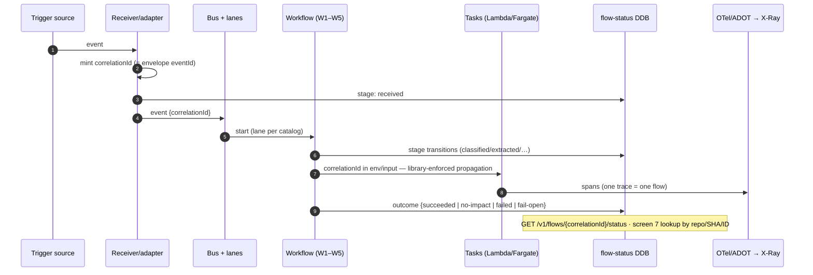
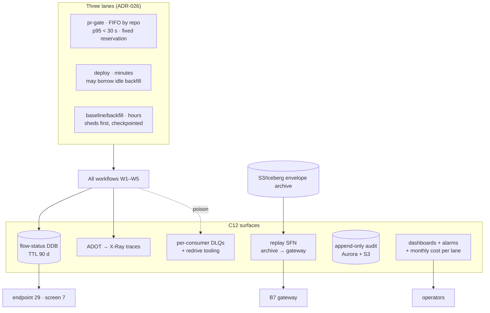

# 08 — Step 8: Scale and Visibility

| | |
|---|---|
| **Status** | Draft — for review (normative once approved) |
| **Step** | Priority lanes (PR > deploy > backfill), 10k-repo wave math, and per-flow "where is my run?" tracing |
| **Runs** | Always — this step is the platform's operating envelope, not a workflow |
| **PRD home** | C12 metrics, audit, DLQ/replay, and operator tooling ([00-component-inventory.md](00-component-inventory.md)) |
| **Scale anchor** | R = 10,000 registered repos, a = 0.7 active → A = 7,000; ≥ 1 deploy/repo/day; spiky. Pilot = one Business App (3–5 repos). Both numbers travel together everywhere ([08 §1](../aws-lineage-collection-plan/08-scale-resilience-observability.md)) |

## 1. Step overview and boundaries

Step 8 owns no trigger rows by design: it specifies how *all* flows behave under load, failure, and inspection. The normative capacity math, lane design, failure-mode table, and observability spec are [08-scale-resilience-observability.md](../aws-lineage-collection-plan/08-scale-resilience-observability.md) (ADR-026); this doc turns them into the buildable component C12 and the cross-cutting acceptance machinery: the three physically separate SQS lanes with reservations (pr-gate FIFO > deploy > baseline/backfill, backfill sheds first), the Distributed Map wave envelope, per-consumer DLQs with the standing replay workflow, correlation-ID tracing (OTel/ADOT → X-Ray), the flow-status record behind endpoint 29, and the fleet dashboards/alarms.

- **Entry/exit:** none of its own; C12 instruments every other step's flows.
- **State mutated:** flow-status records, metrics, alarms, audit rows, DLQ contents, replay executions.
- **Not in this step:** lane *assignment* per trigger (the event catalog and each owning doc); wave *scheduling* (C11, [07](07-nightly-reconciliation.md)); the graph core's own observability (ADR-017, out of collection scope).

## 2. Normative inputs

| Source | What it governs here | Mode |
|---|---|---|
| [ADR-026](../aws-lineage-collection-plan/01-decision-records.md) | The four decisions: Distributed Map fan-out, three lanes, resilience posture, end-to-end visibility | referenced |
| [08 §1](../aws-lineage-collection-plan/08-scale-resilience-observability.md) | Capacity formulas (E = A·(d+p+q) = 49,000/day ≈ 0.57 ev/s; W = 700 task-hours; 280 task-hours/day incremental) | referenced |
| [08 §2](../aws-lineage-collection-plan/08-scale-resilience-observability.md) | `C_wave` formula; quota watch-list; Spot-with-dignity | referenced |
| [08 §3](../aws-lineage-collection-plan/08-scale-resilience-observability.md) | Lane table, reservations, backpressure rules | referenced |
| [08 §4](../aws-lineage-collection-plan/08-scale-resilience-observability.md) | Failure-mode table; replay semantics (replays past events, never mints work) | referenced |
| [08 §5](../aws-lineage-collection-plan/08-scale-resilience-observability.md) | Correlation IDs, tracing stack, flow-status record, dashboards/alarms — decomposed here | referenced |
| [ADR-022](../aws-lineage-collection-plan/01-decision-records.md) | Envelope archive as replay source; Kafka migration triggers | referenced |
| [`flow-status.schema.json`](contracts/schemas/flow-status.schema.json) | The record shape | **new — normative here** |

## 3. Process flow

Visibility is a property of every flow, not a flow itself. The instrumentation path every flow shares:

Failure handling is the [08 §4](../aws-lineage-collection-plan/08-scale-resilience-observability.md) table (referenced, not restated); C12's build obligations from it: every consumer has a DLQ (alert depth > 100, drain < 24 h), the replay Step Function reads the S3/Iceberg envelope archive by time/source/repo filter, and replay's acceptance test is "replayed events converge to identical graph state."

## 4. Components in this step

| ID | Role here | PRD |
|---|---|---|
| C12 metrics/audit/DLQ/replay/operator tooling | Everything below | **this doc §5.1** |
| every other component | Instrumented by C12's libraries and consumed by its dashboards | their home docs |

## 5. Component PRD

### 5.1 C12 — Metrics, audit, DLQ/replay, and operator tooling

**Purpose.** The platform's nervous system: flow-status recording, correlation-ID propagation, tracing, metrics/alarms/dashboards, per-consumer DLQs with redrive, the standing replay workflow, and append-only audit — the machinery that makes "where is my run?" a one-lookup answer and makes degradation visible instead of silent.

**Requirements.**

- REQ-C12-01 (MUST) Ship the **flow-status library** (part of the ADR-027 conformance library): stage writes per [`flow-status.schema.json`](contracts/schemas/flow-status.schema.json) at every stage transition (~5–7 writes/flow ≈ 343k writes/day at planning scale — DynamoDB on-demand, TTL ~90 d); every flow gets a record, including no-impact and fail-open outcomes.
- REQ-C12-02 (MUST) Enforce correlation-ID propagation by library (envelope build stamps it; task launchers pass it; log lines carry it) — propagation coverage is itself a measured SLI.
- REQ-C12-03 (MUST) Provide OTel instrumentation via ADOT on Lambda and Fargate + Step Functions native tracing, X-Ray as the pilot backend; one trace = one flow; trace coverage of flows is a published SLI.
- REQ-C12-04 (MUST) Operate the three lanes' health surface: per-lane throughput, queue age (alarmed), reservation utilization; backpressure automation pauses backfill map runs first (checkpointed), and the pr-gate reservation is never borrowed against.
- REQ-C12-05 (MUST) Provide per-consumer SQS DLQs with reason-tagged quarantine, depth alarms (> 100), drain SLO (< 24 h), and operator redrive tooling.
- REQ-C12-06 (MUST) Operate the standing replay Step Function over the envelope archive (filters: time/source/repo); replay re-processes past envelopes only — it cannot mint new work (ADR-023 invariant); its acceptance test is graph-state convergence.
- REQ-C12-07 (MUST) Maintain append-only audit (Aurora + S3 export) for: reclassifications, steward decisions, waiver lifecycle, trust transitions, replay executions, and operator actions.
- REQ-C12-08 (MUST) Publish the fleet dashboard set ([08 §5.4](../aws-lineage-collection-plan/08-scale-resilience-observability.md)): lane throughput/age, DLQ depth, fail-open rate (< 0.5%/30 d), freshness SLIs (stream p95 ≤ 60 s, batch/registry ≤ 10 min), baseline-wave wall clock vs 8 h, divergence rate (trend), classifier no-impact ratio, Bedrock spend + cache hit rate, approval funnel, quota consumables (Fargate vCPUs, RunTask rate, state transitions, Lambda concurrency, Bedrock TPS, PutEvents) — with a monthly per-lane cost report.
- REQ-C12-09 (MUST) Serve endpoint 29 (`GET /v1/flows/{correlationId}/status`) and the screen-7 lookups (by repo/SHA/correlation ID).
- REQ-C12-10 (SHOULD) Keep wave planning honest: expose measured `t̄_base`, `t̄_incr`, and classifier pass-through `f` so C11's plans and the capacity formulas recompute from *measured* inputs (no naked numbers — every derived value shows its formula).

**Interfaces.** Libraries: flow-status + correlation (consumed by every component). Stores: flow-status DDB, audit Aurora/S3, envelope archive (reader for replay). Surfaces: endpoint 29, screen 7, CloudWatch dashboards/alarms, redrive/replay operator runbooks.

## 6. High-level design

## 7. Low-level design

- **Flow-status library:** thin client with buffered conditional writes (`stage` appends are idempotent on `(correlationId, stage)`); outcome write is last-wins-with-audit; TTL attribute set at creation.
- **Lane wiring (CDK):** three queues + per-workflow event-source mappings with reserved concurrency; pr-gate FIFO `MessageGroupId = repo`; backpressure automation = a Lambda on queue-age alarms calling the wave planner's pause API (checkpointed Distributed Map).
- **Replay SFN:** input `{from, to, source?, repo?}` → Athena query over the archive → batched re-submit to B7 with original `idempotencyKey`s (convergence, not duplication) → convergence report (graph-state hash comparison on a sampled scope).
- **Audit:** writer library appends `{actor, action, subject, before?, after?, at, correlationId}`; Aurora tables INSERT-only grants; daily S3 export.
- **Dashboards as code:** CloudWatch dashboards + alarms defined in CDK beside the components they observe; alarm thresholds are the doc'd numbers (drift between doc and alarm is a review-blocking diff).
- **Error taxonomy registry:** each component's LLD-defined `errorClass` values register in a shared enum module consumed by `flow-status.errorClass` — one vocabulary, greppable fleet-wide.
- **Idempotency:** stage writes `(correlationId, stage)`; replay `(runId)`; audit rows append-only by construction.

## 8. Use cases with success criteria

| ID | Use case | Success criteria |
|---|---|---|
| UC-8-01 | "Where is my run?" | Any user resolves a push/PR/deploy/baseline flow by repo/SHA/correlation ID in one lookup (endpoint 29 or screen 7): every stage timestamped, outcome + errorClass present; works for no-impact and fail-open flows too |
| UC-8-02 | Spike absorption | A simulated release train (20% of daily deploys in one hour, +0.39 ev/s) leaves the pr-gate p95 unmoved; backfill sheds (pauses) first; nothing lost (checkpoints) |
| UC-8-03 | PR-lane protection under saturation | With the Fargate budget saturated by a wave, a PR still gates within budget (reservation never borrowed); if the lane itself breaches, fail-open + warn — never silent green |
| UC-8-04 | Poison event | Quarantined to its consumer's DLQ with reason; alarm at depth > 100; redrive after fix; drain < 24 h |
| UC-8-05 | Replay convergence | Replay of a 24 h window produces identical graph state (sampled hash comparison); replay cannot mint new work (attempting a synthetic-event injection fails by construction) |
| UC-8-06 | Trace completeness | One trace per flow across webhook → bus → workflow → task → gateway → write; trace-coverage SLI ≥ target on the pilot |
| UC-8-07 | Quota headroom | All watch-list quotas alarmed as consumables; a simulated quota approach alarms before exhaustion; `C_wave` recomputes from the constrained budget |
| UC-8-08 | 10k-repo wave math holds (Phase 5 rehearsal) | `E = 49,000/day ≈ 0.57 ev/s` sustained absorbed with margin; wave wall-clock matches `W / C_wave` prediction within tolerance; measured `t̄_base`, `f` published back into the formulas |
| UC-8-09 | Cost visibility | Monthly per-lane cost report produced; Bedrock spend tracks cache-miss volume, not push volume |
| UC-8-10 | Audit completeness | Every reclassification, steward decision, waiver action, trust transition, and operator replay/redrive has an append-only audit row with correlation ID |

## 9. Contract-testing expectations

| Contract | Pairs | CI check |
|---|---|---|
| [`flow-status.schema.json`](contracts/schemas/flow-status.schema.json) | every workflow → C12 → endpoint 29 | Library writes validate; stage/trigger/lane enums closed (an undeclared stage fails the writer's build); outcome always terminal |
| correlation propagation | library → all components | A propagation test harness runs a synthetic flow through stubbed stages and asserts the ID at every hop; lint rule: no component constructs envelopes/tasks outside the library |
| DLQ reason vocabulary | consumers → operator tooling | Reason strings from the shared enum; redrive tooling round-trips every reason |
| replay interface | replay SFN → B7 | Replayed envelopes carry original idempotencyKeys (fixture-diffed); convergence report schema pinned |
| errorClass registry | all components → flow status | Each LLD's taxonomy registered; `flow-status.errorClass` values ∈ registry (build-time check) |

## 10. Live-dependency-testing expectations

| Dependency | Test | Proves | Guards |
|---|---|---|---|
| SQS/EventBridge/SFN (real, test account) | UC-8-02/03 load drill: synthetic spike + wave saturation | Reservation isolation and shedding at real service semantics — the core scale claim | Test account; bounded synthetic load |
| X-Ray + ADOT (real) | Synthetic flow tracing across Lambda + Fargate + SFN | Trace stitching across runtimes (emulators can't) | Test account |
| DynamoDB (real) | 343k-writes/day-equivalent burst on flow-status | On-demand scaling headroom; TTL behavior | Test table |
| S3/Iceberg + Athena (real) | Replay of a seeded archive window | Archive partitioning, filter queries, convergence measurement | Test bucket |
| Quotas (real account) | Read-and-alarm on actual account quotas; a controlled RunTask-rate approach | The consumable-quota alarms fire on real limits ("inputs requested ahead of need, not discovered limits") | Stop at 80% of quota |

## 11. End-user testing hooks

- E2E journeys: **E2E-07** (10k wave with lanes held) plus the visibility legs of every other journey (each E2E asserts its flow-status trail) in [09-end-user-testing.md](09-end-user-testing.md).
- User-observable interfaces: endpoint 29, screen 7 flow lookup, PR-check timing (the lane promise as users feel it), operator dashboards, DLQ/redrive runbooks.

## 12. Step acceptance criteria

- [ ] Every flow in the platform produces a complete flow-status record; endpoint 29 and screen 7 answer in one lookup.
- [ ] The three-lane isolation holds under drill: spike never starves the PR lane; backfill sheds first, checkpointed.
- [ ] DLQ/replay operational: poison quarantine, redrive, and convergent replay all demonstrated; replay mints no work.
- [ ] All [08 §5.4](../aws-lineage-collection-plan/08-scale-resilience-observability.md) dashboards/alarms live, thresholds matching the documented numbers; quota watch-list alarmed.
- [ ] Capacity formulas recompute from measured inputs; the Phase 5 rehearsal validates the 10k math (2k design point and 10k ceiling reported together).
- [ ] Append-only audit covers every human and operator mutation path.

## 13. Traceability

- **ADRs:** 026 (the charter), 022 (archive/replay, migration triggers), 021 (quota-budget consequence), 023 (replay-mints-no-work invariant), 017 via 08 (tracing stack).
- **Trigger rows:** none owned (by design — see [00 §4](00-component-inventory.md)).
- **Findings:** F-01 (fail-open visibility), F-03 (divergence metric hosted on these dashboards), F-07 (the 30 s budget engineering: lanes + reservations + warm paths).
- **De-review:** §6.2 component 12; month-6 reliability/operations bars (99.9% query availability is graph-core-owned; queue-buffered ingest 99.5% and replay-proves-no-loss land here).
