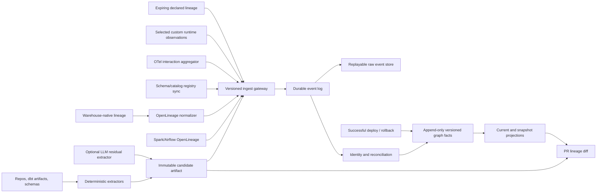

# Lineage Collection Assessment and Implementable Recommendation

## Decision

Adopt a **hybrid, evidence-based collection architecture**:

1. Generate a deterministic, build-time lineage artifact that represents the predicted dependency superset.
2. Ingest runtime evidence from OpenLineage and warehouse-native sources to confirm execution and recency.
3. Use ordinary OpenTelemetry only for service, endpoint, topic interaction, frequency, and trace correlation.
4. Permit explicitly instrumented element mappings only as a small, separately governed custom runtime-lineage signal; do not infer element lineage from ordinary traces.
5. Reconcile all signals through deterministic, environment-qualified identity into append-only, versioned graph facts.
6. Make uncovered, not-observed, stale, conflicting, and retired states explicit. Absence of evidence must never mean no dependency.

This is a conditional recommendation for a bounded production pilot, not an enterprise blocking rollout. The design is implementable when identity, ingestion, temporal, deployment, coverage, and policy contracts are completed before connector breadth or confidence scoring.

## What the repository currently proposes

The latest proposal has the right conceptual core: a build-time predicted lineage superset is reconciled with runtime observations, and per-edge provenance/confidence is used to support impact analysis. The Platform-10 deep dive improves feasibility by:

- using SQL parsing and compiled artifacts before general source analysis;
- using tree-sitter for structural discovery rather than semantic data flow;
- restricting LLM extraction to ambiguous residue;
- using Spark OpenLineage and warehouse-native lineage for runtime column evidence;
- using OTel for interaction and recency evidence;
- deferring the unsupported Dask collector;
- treating identity resolution as the central technical risk.

These choices are supported in [Deep Dive — Lineage Collection Proposal](<latest_source/Data Lineage Impact Platform-10/Deep Dive - Lineage Collection Proposal.dc.html>) and subsequently qualified by the [Platform-10 Distinguished Engineer Review](platform-10-de-review/README.md).

The earlier [v8 target architecture](architecture-review-v8/02-target-architecture.md) also supplies several missing implementation decisions: PostgreSQL as a versioned graph system of record, Kafka as the durable event backbone, Iceberg as the raw replay store, deterministic URNs and aliases, a per-attribute conflict matrix, schema registries as type authority, declared lineage as an escape hatch, and coverage as a product surface.

## Assessment

### What should be retained

| Design choice | Assessment | Reason |
|---|---|---|
| Build-time plus runtime evidence | Retain | Static analysis sees unexecuted/cold paths; runtime proves what executed. Neither alone supports trustworthy pre-merge impact. |
| Parser-first extraction | Retain | SQL, dbt artifacts, schemas, and API contracts have deterministic representations. Sending these to an LLM reduces reproducibility and accuracy. |
| Tree-sitter candidate discovery | Retain with bounded role | It is effective for locating annotations, paths, calls, and enclosing context, but it does not provide name resolution, types, or semantic data flow. |
| LLM residual extraction | Retain as optional/inferred | It can cover dynamic SQL and UDF residue, but must be schema-validated, version-pinned, content-hash cached, evaluated on a labeled set, and prohibited from blocking by itself. |
| OpenLineage as runtime interchange | Retain | It is the best common envelope for Spark, Airflow/dbt topology, and normalized warehouse evidence. Column coverage must be measured per integration and operation. |
| Warehouse-native lineage | Retain as federated evidence | It provides high-fidelity, low-instrumentation evidence inside an engine, but cannot cover cross-engine service, stream, or file boundaries. |
| OTel interaction aggregation | Retain | It provides caller/callee, endpoint/topic, frequency, latency, and recency. It should corroborate interaction-level edges, not column edges. |
| Dask collector | Defer | No maintained OpenLineage column collector or Catalyst-equivalent semantic plan exists. Treat it as R&D, sequenced by measured estate share. |
| Confidence/provenance | Retain after calibration | Provenance and bands are valuable, but weights are priors until measured against labeled outcomes. Confidence must not conceal cold or uncovered paths. |

### Material gaps that prevent direct implementation

1. **Identity is not merely a normalizer.** It is a product contract spanning repo, service catalog, runtime service name, environment, dataset namespace, schema version, endpoint, topic, and field. A false match creates falsely verified lineage; a missed match silently suppresses confidence.
2. **The original collection narrative lacks a complete temporal model.** Mutable current-state edges cannot reproduce a PR decision. Facts, snapshots, extractor/model versions, deployment baselines, and policies must be pinned.
3. **Event delivery semantics are underspecified.** A production collector needs schema versioning, idempotency, ordering, retries, DLQ, replay, raw retention, and poison-event handling.
4. **Coverage is currently easy to overstate.** Receiving an OpenLineage event does not imply a column facet was present. Ordinary OTel spans do not imply field evidence. Each asset and edge needs a granularity-aware coverage state.
5. **Deployment authority is missing from a collector-only view.** A merge creates candidate lineage; only a successful deployment makes that artifact authoritative for an environment. Rollback must reactivate the previous version.
6. **Confidence scoring is too early.** Numeric weights should not be implemented before identity accuracy, extractor quality, coverage truth, and conflict behavior are measurable.
7. **OTel language is internally inconsistent.** The deep dive correctly says ordinary OTel is never column lineage; the later review allows custom structured lineage records over OTel. Resolve this by defining two distinct inputs: `OtelInteractionAggregate` and `RuntimeLineageObservation`.
8. **The repository contains stale examples.** Some prototype text still describes Dask as emitting OpenLineage column facets. That is not a supported implementation commitment and should not drive estimates.

## Recommended collection architecture



### Signal responsibility matrix

| Signal | May assert | Must not assert | Initial confidence posture |
|---|---|---|---|
| SQL/dbt/schema parser | candidate datasets, fields, transforms, code refs, schema intent | runtime frequency or execution | Inferred until corroborated |
| Tree-sitter discovery | source/sink/call/topic/path candidates and bounded context | semantic field mapping by itself | Candidate only |
| LLM residual | proposed field mapping, transform, guard for unsupported constructs | its own trustworthy confidence; authoritative type | Inferred; never blocks alone |
| Spark OpenLineage column facet | observed dataset/column mapping for supported operations | complete coverage when facet is absent | Runtime-confirming |
| Airflow OpenLineage | job/dataset topology; operator-dependent facets | universal column coverage | Dataset-confirming by default |
| Warehouse-native lineage | observed in-engine reads/writes and columns where supported | cross-engine/application coverage | Runtime-confirming within published scope |
| Schema registry/catalog | entity schema and type/version truth | transform or execution | Authoritative for type/schema |
| Ordinary OTel | service/endpoint/topic interaction, recency, frequency, trace correlation | field/column mappings | Interaction-confirming only |
| Custom runtime observation | explicit source/target element mapping, outcome, deployment and trace correlation | universal coverage; inferred mapping | Confirming only after contract gates pass |
| `lineage.yaml` / manual declaration | owner-attested edge for unsupported systems | Verified status without runtime | Probable ceiling; mandatory TTL |

## Contracts to implement first

### 1. Canonical identity

Use an environment-qualified deterministic name plus a stable internal entity ID:

```text
urn:tl:{environment}:{entityType}:{authority}:{path}[#{element}]
```

Required rules:

- exact normalized URN and registered aliases may auto-merge;
- renames create aliases and explicit lifecycle events;
- fuzzy similarity creates a review candidate and never auto-merges;
- environment is mandatory and cross-environment corroboration is rejected;
- service catalog mappings connect repo, deployment unit, `service.name`, and owner;
- schema version is a fact attached to the entity, not part of entity identity;
- identity quality is measured on hand-labeled positive, negative, and ambiguous examples.

Pilot gate: at least 95% precision and 90% recall, with zero cross-environment auto-merges.

### 2. Versioned ingestion envelope

All collectors normalize to a common envelope before reconciliation:

```json
{
  "eventId": "01J...",
  "eventType": "lineage.observation",
  "schemaVersion": "1.0",
  "producer": {"name": "spark-openlineage", "version": "..."},
  "environment": "prod",
  "observedAt": "...",
  "emittedAt": "...",
  "commitSha": "...",
  "deploymentId": "...",
  "orderingKey": "canonical-target-or-edge",
  "idempotencyKey": "...",
  "payloadHash": "...",
  "provenance": {"signal": "spark", "artifactOrRunId": "..."},
  "payload": {}
}
```

The gateway must authenticate workload identity, reject value-bearing fields, validate versions, record the raw event, and acknowledge only after durable acceptance. Consumers must be idempotent. Replay of duplicates and out-of-order events must converge to the same graph state.

### 3. Immutable candidate lineage artifact

Every analyzed commit emits a signed/content-addressed artifact containing:

- repo and commit SHA;
- intended environment/deployment unit;
- entities and aliases;
- candidate edges with source/target URNs;
- level/channel/transform/guard/code reference;
- extractor, parser, prompt, and model versions;
- per-edge provenance and unsupported-construct findings;
- artifact hash and creation time.

The same commit and toolchain must reproduce the same semantic artifact. Candidate artifacts remain separate from the deployed authoritative version.

### 4. Deterministic reconciliation

Process each observation in this order:

1. Validate envelope and metadata-only boundary.
2. Deduplicate on idempotency key/event ID.
3. Resolve environment-qualified identities using exact rules and aliases.
4. Quarantine unresolved or fuzzy matches for review.
5. Append the observation; never overwrite prior evidence.
6. Reconcile each attribute with its own authority rule:
   - edge execution/existence: runtime observation over declared over static over LLM;
   - transform expression/intent: deterministic static over LLM over runtime facet description;
   - type/schema: registry/catalog over runtime over static over LLM;
   - path frequency/recency: runtime only.
7. Preserve disagreements as conflicts; do not average them away.
8. Recompute a versioned confidence band and coverage state.
9. Mint or advance the logical snapshot/projection.

Static-only cold paths remain visible as possible impact. Runtime-only edges are admitted and flagged as extraction drift. A collector outage changes coverage to stale/error; it never deletes an edge.

### 5. Separate OTel contracts

`OtelInteractionAggregate` is produced by collector-side aggregation and contains service/endpoint/topic identity plus counts, recency, error rate, and latency. Raw spans should not be retained in the lineage graph.

`RuntimeLineageObservation` is optional, explicitly instrumented, and restricted to selected high-impact paths. Prefer a structured log/dedicated event correlated to a trace over a variable attribute set on an ordinary span. It must include source and target element URNs, operation, transform identity, code/deployment provenance, successful commit outcome, instrumentation version, and event ID. Emit once per operation/path/schema version or bounded window, never per row.

This custom signal may confirm an element edge only after tests prove schema conformance, no truncation, acceptable overhead, independent delivery, emitted-versus-ingested accounting, and correct success/commit semantics. If those gates fail, use OTel only for interactions and emit the lineage observation through a transactional outbox or dedicated OpenLineage producer.

## Options considered

| Option | Strengths | Failure against this use case | Decision |
|---|---|---|---|
| Pure static analysis | Pre-merge, reproducible, sees cold paths | Cannot prove execution; weak for dynamic code and cross-system identity | Reject as sole approach; use as baseline plane |
| Pure OpenLineage/runtime | Observed truth, mature Spark ecosystem | Misses never-run paths; facet absence is silent; incomplete across applications and legacy systems | Reject as sole approach; use as confirmation plane |
| Warehouse-native only | High fidelity and low instrumentation inside one engine | Engine-scoped and blind between services, streams, files, and engines | Federate as a source |
| Metadata/catalog platform as the full product | Connector breadth, mature storage/search/UI | Does not inherently supply code-path guards, predicted cold paths, confidence contract, or deployment-aware PR gating | Consider for commodity ingestion/projection, not as the semantic contract |
| DataHub/OpenMetadata connectors feeding this platform | Accelerates long-tail coverage | Imports foreign identity/semantics at the most sensitive boundary | Tier-2 accelerator only; normalize and confidence-cap |
| CodeQL-class deep app analysis | Strong deterministic interprocedural flow for supported languages | High cost/language specificity; still cannot cross runtime infrastructure boundaries | Exclude from v1; revisit only for a measured high-value gap |
| General OTel-derived field lineage | Broad existing deployment footprint | No standard lineage convention; sampling and attribute limits; traces do not imply data mappings | Reject |
| Targeted custom OTel lineage record | Trace correlation and low-friction transport for a few critical paths | Custom schema, manual ownership, delivery/coverage/overhead risk | Pilot narrowly with a dedicated contract and fallback |
| Dask runtime column collector | Would fill a demonstrated niche | No maintained integration or semantic plan; greenfield R&D | Defer until estate-share and value trigger is met |
| Declarative lineage contracts | Immediate coverage for unsupported systems | Can rot and can be wrong | Adopt with owner, validation, TTL, audit, and confidence ceiling |
| Recommended hybrid | Pre-merge completeness plus runtime trust, explicit uncertainty, cross-system graph | Reconciliation/identity are real platform work | Choose for the bounded pilot |

## Implementation sequence

### Weeks 1–4: contracts and ground truth

- Select one representative vertical slice spanning a service/API or stream, one batch/warehouse transform, schemas, and one known unsupported area.
- Approve identity, event, artifact, lifecycle, temporal, conflict, deployment, security, and coverage contracts.
- Build labeled entity/edge sets and record known negative/ambiguous cases.
- Stand up the ingest gateway, schema registry, durable log, raw archive, versioned fact schema, and basic metrics.
- Classify every in-scope system as automated, declared, or uncovered.

Exit only if identity reaches the pilot threshold, duplicate/out-of-order/rename/delete/rollback contract tests exist, and all in-scope systems have owners and collection posture.

### Weeks 5–8: deterministic baseline

- Implement SQL/dbt/schema/OpenAPI/protobuf extraction for the slice.
- Add tree-sitter structural discovery only where required.
- Add LLM residue behind a labeled evaluation gate; keep it suggestion-only if precision is below 90%.
- Produce immutable candidate artifacts for full and incremental scans.
- Verify full and incremental scans converge semantically.

### Weeks 9–12: runtime and reconciliation

- Add the slice's highest-value runtime source: Spark OpenLineage or one warehouse-native source.
- Add schema/catalog synchronization and Airflow/dbt job topology where applicable.
- Aggregate ordinary OTel for interactions and recency.
- Implement identity resolution, per-attribute conflict rules, DLQ/replay, coverage states, and operator visibility.
- Optionally pilot custom runtime observations on two or three critical paths, isolated from ordinary spans.

### Weeks 13–16: evergreen change loop

- On PR updates, generate the candidate artifact, compare with the last successfully deployed baseline, and calculate impact against a pinned snapshot.
- On merge, retain the candidate; on successful deployment, promote the exact shipped artifact; on rollback, reactivate the prior version.
- Run in observe mode with a hard timeout and fail-open warning.
- Add nightly full reconciliation to detect missed webhooks, extraction drift, and runtime-only edges.

Move to warn mode only after measured identity, extraction, replay, coverage, reproducibility, and latency gates pass. Blocking should be a later policy decision backed by at least four stable weeks of warn-mode evidence.

## Pilot acceptance criteria

| Area | Required evidence |
|---|---|
| Identity | Sampled precision >=95%, recall >=90%, zero cross-environment auto-merges |
| Reproducibility | Same commit/toolchain yields the same artifact; sampled PR decisions replay from pinned snapshot/policy/tool versions |
| Ingestion | Duplicate and out-of-order replay converges; poison events enter DLQ; raw events are replayable |
| Extraction | Unsupported constructs are explicit; deterministic accuracy is measured; LLM-only edges meet >=90% precision or remain suggestion-only |
| Coverage | Every in-scope asset has automated/declared/uncovered status; event receipt and field-facet coverage are measured separately |
| Freshness | Streaming runtime evidence p95 <=60 seconds; batch/registry evidence <=10 minutes |
| CI | Incremental check p95 <30 seconds, hard timeout 120 seconds, failures fail open with an explicit warning |
| Deployment | Failed deployments do not change production lineage; rollback restores the prior active version without deleting history |
| Trust | No “no impact” result when required coverage is stale/unknown or traversal is truncated |
| Operations | Metrics, alerts, DLQ/replay, runbooks, owner routing, and audit are exercised |

## Final rationale

The recommended hybrid is the only considered option that meets all three requirements simultaneously:

- **completeness before execution**, including cold and conditional paths;
- **trust from observed execution**, recency, and authoritative schema evidence;
- **pre-merge usability**, with reproducible decisions and uncertainty visible to developers.

Its main cost is not collector code. It is the identity, temporal, reconciliation, coverage, and deployment-control layer. That cost is unavoidable for any system allowed to claim cross-system element lineage or influence delivery. Sequencing those contracts first turns the proposal from a compelling product narrative into a testable platform pilot.
