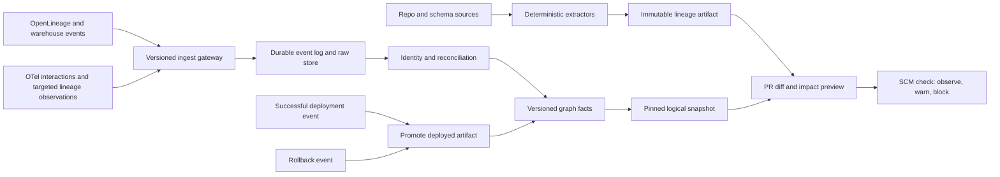

# Throughline Platform-10 — Distinguished Engineer Assessment and Six-Month Execution Roadmap

| | |
|---|---|
| **Review date** | 2026-07-09 |
| **Branch** | `codex/platform-10-de-review` |
| **Source package** | `deliverables/latest_source/Data Lineage Impact Platform-10/` |
| **Decision** | **Conditional GO for a six-month production pilot; NO-GO for enterprise blocking rollout as currently specified** |
| **Primary six-month outcome** | A trustworthy lineage collection loop for one representative vertical slice, kept evergreen by PR, deployment, runtime, rollback, and reconciliation automation |

## 1. Executive verdict

The proposal has a strong product thesis and a technically viable core: combine a build-time predicted lineage superset with runtime evidence, reconcile both into a canonical graph, expose uncertainty, and use the result in the change path. Platform-10 materially improves the earlier proposal by making static extraction parser-first, constraining LLM use to ambiguous residue, deferring the unsupported Dask collector, and using OpenLineage as the general runtime interchange. The clarified proposal also uses deliberately instrumented OpenTelemetry records to capture element-level evidence on selected high-impact flows. That targeted use is feasible, but it is a custom lineage observation contract carried over OTel—not standard column lineage inferred from ordinary traces—and requires a separate sampling, durability, coverage, and schema discipline.

It is not yet ready for enterprise implementation or blocking CI enforcement as written. The PRDs remain v0.9 drafts; several success criteria are qualitative; the architecture does not specify temporal snapshots, authoritative deployment state, replay/order semantics, security, a concrete graph persistence choice, or a gate policy/waiver model. The prototype is effective product discovery, not evidence that the backend or operational model works.

The correct investment decision is a staged six-month pilot with explicit exit gates. The program should fund one hard, representative vertical slice and pull the CI/CD lineage loop into the first four months. It should not promise org-wide coverage, Dask column lineage, or broad blocking enforcement during that window.

### Readiness scorecard

| Area | Rating | Assessment |
|---|---:|---|
| Product thesis | Strong | Multi-signal confidence plus pre-merge impact is a differentiated and valuable wedge. |
| Prototype | Strong for discovery; weak for implementation proof | Core journeys are coherent and demonstrable, but the data is synthetic and operational/error/accessibility states are missing. |
| PRD completeness | Medium-low | Functional intent is clear; testable acceptance criteria, NFRs, lifecycle, security, and operating policies are incomplete. |
| Collection feasibility | Conditional | SQL/dbt/Spark/OpenLineage and warehouse-native sources are feasible; Dask and deep application-code lineage are not six-month commitments. |
| Architecture implementability | Medium-low | The logical planes are sound, but multiple load-bearing contracts remain undecided. |
| Scale viability | Medium-high after redesign | The graph volume is manageable. Correctness under identity, time, conflict, and partial coverage is the real scaling risk. |
| Existing roadmap | Not approved for the requested goal | It defers CI lineage diff to month 10 and gating to months 11–12, conflicting with an evergreen-lineage goal in the first six months. |

## 2. Prototype and PRD readiness

### 2.1 What is ready

The interactive prototype demonstrates the right mental model:

- Search-first entry and progressive disclosure from domain to app, service, dataset, and field.
- Shared Lineage, Interactions, Impact, and Provenance lenses.
- Schema-change simulation with type widening, column drop, and additive-change scenarios.
- Downstream severity, owner attribution, confirmed versus possible impact, and team notification drafts.
- Provenance and confidence as visible product concepts rather than hidden metadata.

Hands-on validation confirmed that changing `customer_raw.email` from a widening change to a dropped column updates the blast radius and severity. Search returns dataset-level matches, and the UI keeps the affected subgraph scoped rather than attempting to draw the entire estate.

The three PRDs also establish a coherent functional spine:

- PRD 1 defines candidate extraction, runtime collectors, reconciliation, confidence, CI delta generation, and stale-edge decay.
- PRD 2 defines change semantics, downstream traversal, severity classification, confirmed/possible tiers, and CI gating.
- PRD 3 defines altitude navigation, scoped fetching, shared lens state, search, filters, and rendering constraints.

### 2.2 What prevents build-ready status

#### Requirements and acceptance gaps

1. **Success criteria are mostly directional.** Phrases such as “majority,” “growing share,” “feel instant,” and “within one pipeline cycle” cannot serve as release gates. The program needs numeric targets for identity quality, extraction quality, collection coverage, freshness, gate latency, false-positive rate, availability, and replay recovery.
2. **No normative temporal model exists.** A graph that continuously mutates cannot reproduce why a PR was warned or blocked. Every impact result must pin a graph snapshot, policy version, extractor/model version, and base/head commit pair.
3. **Entity lifecycle is incomplete.** Rename, move, delete, retirement, alias continuity, environment separation, schema-version continuity, and rollback semantics need explicit requirements. Decay alone cannot distinguish a retired edge from a quiet seasonal path.
4. **CI/CD semantics stop at “diff versus baseline.”** The package does not define which baseline is authoritative, how concurrent PRs behave, how merge queues/rebases are handled, or how a successfully merged but failed deployment affects production lineage.
5. **Failure posture is unspecified.** Collector outage, partial coverage, event duplication, out-of-order events, DLQ replay, graph-store outage, LLM outage, and CI timeout need defined behavior.
6. **Security and governance are missing from the PRDs.** Source and SQL may be sent to a model endpoint; the graph maps PII flows; collectors and CI require machine authentication; gate overrides require audit. AuthN, AuthZ, metadata-only enforcement, retention, and audit are release requirements, not later polish.
7. **Gate policy is incomplete.** “Block confirmed breaking” is not enough. The system needs policy ownership, repository/domain applicability, waivers with expiry, fail-open/fail-closed posture, and a false-positive circuit breaker.
8. **Collector coverage has no contractual escape hatch.** Unsupported systems must be represented as explicitly uncovered or via reviewed, expiring declarative lineage—not silently absent.

#### Prototype journey and edge-case gaps

The prototype does not demonstrate:

- Empty results, zero-lineage, not-observed, stale, retired, permission-denied, partial-data, or backend-error states.
- Collector health and coverage gaps in the context of an impact decision.
- Concurrent changes, rollback, renamed assets, deleted columns, cyclic graphs, fan-out truncation, or multiple environments.
- Gate waiver, policy explanation, timeout/fail-open, or appeal/reproduction workflows.
- Keyboard navigation, focus states, screen-reader semantics, and non-color severity/confidence cues. Most interactive controls render as generic elements rather than semantic buttons/tabs.
- Small-screen and dense-data usability beyond the responsive documentation layout.

### 2.3 Required PRD amendments before Phase 1 exit

Add the following normative sections to PRD 1 and cross-reference them from PRDs 2 and 3:

- Canonical identity grammar, environment axis, aliases, rename/delete/tombstone lifecycle.
- Immutable lineage artifact and bitemporal/snapshot model.
- Ingestion envelope: `eventId`, producer, schema version, observed time, emitted time, environment, commit/deployment identity, idempotency key, ordering key, provenance, and payload hash.
- Conflict-resolution matrix by attribute and signal type.
- Coverage states: `confirmed`, `inferred`, `declared`, `not_observed`, `stale`, `retired`, `error`.
- Collector SDK/contract, DLQ, replay, backpressure, and version compatibility.
- CI baseline and deployment-promotion state machine.
- Security, retention, audit, and model-data handling.
- Quantified NFR and success-metric table.

## 3. Architecture validation

### 3.1 Architecture that should be retained

Keep these Platform-10 decisions:

1. **Two evidence planes.** Build-time extraction provides completeness; runtime evidence provides corroboration and recency.
2. **Parser-first extraction.** Use deterministic parsers and compiled artifacts before tree-sitter candidate discovery; use LLMs only for schema-validated residual ambiguity.
3. **OpenLineage as the runtime interchange.** Spark, dbt/Airflow, and warehouse-native evidence should normalize into a versioned OpenLineage-compatible envelope.
4. **OTel as a targeted runtime evidence channel.** Ordinary auto-instrumented traces remain interaction/recency evidence. For selected high-impact flows, explicit instrumentation may emit element-level source/target mappings, transform identity, code/deployment provenance, and operation outcome under a versioned custom convention. These observations may corroborate build-time edges when their identity and completion semantics match; they must not be presented as generally available OTel column lineage.
5. **Confidence bands and provenance.** Static/LLM-only evidence cannot reach the band that is permitted to block.
6. **Altitude-scoped serving.** Server-side rollups, scoped neighborhoods, bounded traversal, search-first navigation, and virtualized rendering are the correct response to visual scale.
7. **Dask deferral.** Treat a Dask column-lineage collector as R&D driven by measured estate share, not a hidden integration task.

### 3.2 Required target-architecture corrections

The four logical planes should be implemented as the following concrete flow:



Key corrections:

- **System of record:** Store immutable/versioned nodes, edges, aliases, observations, deployments, policies, and decisions. Build current-state and traversal projections from those facts. Do not make an opaque mutable graph database the only record.
- **Temporal reproducibility:** A gate decision records `{snapshotId, baseSha, headSha, deploymentBaseline, policyVersion, extractorVersion, modelVersion}`.
- **Identity:** Use deterministic environment-qualified URNs plus stable internal entity IDs and aliases. Exact rules auto-merge; fuzzy matches enter human review and never auto-promote confidence.
- **Ingestion:** Durable event log, raw replayable store, schema registry, idempotent consumers, per-entity ordering, DLQ, and bounded retry. The current `202 Accepted` example is insufficient without these semantics.
- **Deployment authority:** A merged commit creates a candidate lineage version. Only a successful deployment to a named environment makes that version authoritative for that environment. Rollback reactivates the prior deployed version.
- **Gate policy:** Policy-as-code, observe→warn→block rollout, expiring waivers, audited overrides, false-positive budget, hard timeout, and default fail-open with warning. Critical domains may explicitly opt into fail-closed.
- **Serving:** Cycle-safe and depth/node/edge/time-budgeted traversal; cached/materialized blast radii for critical hubs; persisted/cost-bounded UI queries rather than open arbitrary graph traversal.
- **Security:** OIDC for users, workload identity for collectors/CI, domain-scoped RBAC, metadata-only schemas, secret scanning before model use, encryption, and audit of PII-lineage reads and all gate-affecting mutations.

### 3.3 Scalability and bottleneck assessment

The proposed graph size is not intrinsically difficult. Even at millions of nodes/edges, a relational versioned store plus compact in-memory adjacency projections can serve bounded traversals. The dominant risks are semantic and operational:

| Bottleneck | Assessment | Required control |
|---|---|---|
| Identity resolution | Critical path; silent misses create false confidence | Deterministic rules, catalog mappings, alias lifecycle, sampled precision/recall SLI |
| Runtime event volume | Architecture sizes OpenLineage but does not fully model raw OTel volume | Aggregate OTel at collector/processor; retain aggregates, not raw spans, in the lineage system |
| LLM cost/drift | Manageable only when residual and change-hash bounded | Pinned prompt/model, golden set, content-hash cache, schema validation, no self-scored confidence |
| Graph writes | Manageable with batching; dangerous if last-write-wins mutability is used | Append/version facts, idempotency, entity-key partitioning, CDC projection |
| Deep traversal/fan-out | Hub assets can explode BFS and CI latency | Cycle detection, node/edge/depth/time budgets, truncation semantics, materialized critical paths |
| Reconciliation backlog | Can silently age confidence and impact answers | Queue-age SLO, conflict backlog SLI, DLQ alerts, coverage displayed in decisions |
| Search/UI rendering | Solved conceptually, not measured | Scoped APIs, server rollups, virtualization, worst-domain load tests |

### 3.4 Integration feasibility

| Integration | Six-month posture |
|---|---|
| SQL/dbt artifacts | Commit. High-confidence deterministic baseline using SQL parsing plus compiled manifest/catalog context. |
| Spark OpenLineage | Commit for the slice if Spark is present. Validate column-facet coverage by operation, not simply event receipt. |
| Airflow OpenLineage | Commit for job/dataset topology when present; treat column detail as operator-dependent. |
| Warehouse-native lineage | Prefer one engine used by the slice; normalize its evidence rather than rebuilding it. |
| Schema registry/OpenAPI/protobuf | Commit as authoritative schema/type inputs for change classification. |
| OTel | Commit for aggregated interactions and for explicitly instrumented element-level observations on a small set of high-impact flows. Use a governed custom schema and independent completeness/durability controls; never infer general column lineage from ordinary spans. |
| Tree-sitter | Commit as candidate discovery/context slicing, not as a semantic data-flow engine. |
| LLM enrichment | Limited pilot behind evaluation and cost gates; never block on LLM-only evidence. |
| Dask | Defer. Use static/declarative coverage until an R&D decision is justified. |
| Long-tail legacy ETL | Provide a schema-validated, owner-attributed, expiring `lineage.yaml` escape hatch and show its confidence ceiling. |

### 3.5 Feasibility of targeted OTel element-level instrumentation

**Verdict: feasible with constraints; recommended as a selective corroboration mechanism, not the universal runtime lineage plane.**

OpenTelemetry can represent custom attributes and timestamped span events, and the Collector can receive, transform, batch, retry, and export OTLP telemetry. The Collector's Kafka exporter can publish traces or logs as OTLP protobuf/JSON and can choose topics and message keys from metadata/attributes. The missing piece is semantic standardization: OTel has no adopted lineage signal or column-lineage convention. Throughline must own and version the observation schema and normalize it before fusion.

#### Recommended emission model

Prefer a **structured OTel log record or dedicated lineage event emitted through the OTel SDK/Collector**, correlated to the active trace with `trace_id`/`span_id`, over packing a variable number of field mappings into ordinary span attributes.

Each observation should describe metadata, never record values:

```json
{
  "schema": "throughline.runtime-lineage/v1",
  "eventId": "01J...",
  "observedAt": "2026-07-09T20:14:32Z",
  "source": "urn:tl:prod:kafka:orders.events#total_amount",
  "target": "urn:tl:prod:s3:orders_raw#total_amount",
  "operation": "write",
  "transformId": "money.cents-to-decimal/v2",
  "pathId": "orders-svc#confirmed-order",
  "codeRef": "OrderService.java:88",
  "deploymentId": "orders-svc:c7e1:prod",
  "outcome": "committed",
  "traceId": "...",
  "spanId": "...",
  "instrumentationVersion": "throughline-otel-java/1.2.0"
}
```

Emit on successful sink/commit acknowledgement, not when processing merely starts. One observation may contain a bounded mapping set, but large mappings should be chunked into independently identifiable records. No row values, payload fragments, raw SQL parameters, or PII values belong in the event.

#### Stream and fusion path

```mermaid
flowchart LR
  A["High-impact application path"] --> B["Throughline OTel instrumentation library"]
  B --> C["OTLP: structured log/event plus trace correlation"]
  C --> D["OTel Collector: validate, filter, redact, batch"]
  D --> E["Kafka: runtime-lineage.v1, keyed by canonical edge"]
  E --> F["Runtime observation normalizer"]
  F --> G["Idempotency, ordering, schema and identity validation"]
  G --> H["Fusion with build-time candidate edges"]
  H --> I["Confidence and provenance update"]
```



The fusion consumer should accept a normalized `RuntimeLineageObservation`, not arbitrary raw spans. Partition by canonical edge or target asset so observations for the same lineage fact are ordered. Deduplicate on `eventId`; retain the raw OTLP record for replay; pin the instrumentation schema/version in provenance.

#### Pushback and tradeoffs

| Pushback | Why it is valid | Required tradeoff/control |
|---|---|---|
| OTel does not standardize lineage | Teams/languages will otherwise invent incompatible keys and semantics | Own a versioned Throughline convention and SDK wrappers; normalize to the fusion event contract; consider an OpenLineage custom facet at the canonical boundary |
| Trace sampling can drop the evidence | Span attributes/events on a non-sampled trace are not exported; attributes added after span creation cannot influence head sampling | Prefer a separate OTel log/event pipeline independent of trace sampling, or guarantee lineage-bearing spans are recorded/exported through explicit sampling policy; measure emitted-versus-ingested counts |
| Attribute and event limits can truncate mappings | OTel SDKs may cap/discard attributes; the common default attribute count is 128; repeated keys overwrite | Use one structured lineage record or bounded chunks, validate limits in every supported SDK, and reject/alert on truncation rather than silently accepting partial mappings |
| Cardinality and cost can explode | Field URNs, paths, and transforms are high-cardinality; per-row emission is untenable | Emit mapping metadata once per operation/path/schema version or aggregate over a window; never emit one event per record/row |
| Application overhead and ownership | Manual instrumentation adds latency, code changes, and long-term maintenance | Limit to high-impact flows, provide thin language SDKs/decorators, enforce contract tests in CI, and budget adoption work explicitly |
| Telemetry delivery is not automatically durable | Collector queues can fill and the Kafka exporter has bounded retry/queue defaults; telemetry loss is normally acceptable, lineage loss may not be | Use a disk-backed queue or application-side outbox where loss is unacceptable, stronger Kafka acknowledgement, DLQ/replay, end-to-end sequence/coverage SLIs, and fail the confidence promotion—not the business operation—when evidence is missing |
| A runtime observation can be true but incomplete | Only instrumented paths are visible; absence is not proof that no edge exists | Publish instrumentation coverage by flow/path/deployment; treat missing OTel evidence as `not_observed`, never `no_dependency` |
| Runtime and build-time identities can disagree | A correct observation with a mismatched URN will not fuse, silently reducing confidence | Reuse the same generated identity library and deployment manifest in build-time extraction and runtime instrumentation; quarantine mismatches for review |
| Instrumentation could leak sensitive data | Element-level naming can tempt teams to attach values or payloads | Metadata-only schema, SDK allow-list, Collector redaction/rejection, security review, and no baggage propagation of lineage payloads |

#### Confidence semantics

- An ordinary OTel span confirms service/endpoint interaction and recency, not an element mapping.
- A valid targeted lineage observation can confirm a specific element edge only when source/target identities, environment, schema/deployment version, and successful outcome match the build-time candidate.
- A targeted observation with no build-time match is admitted as runtime-only evidence and flagged as extractor drift; it is not discarded.
- Missing observations lower coverage, not truth. A sampled-out or stale flow cannot be interpreted as a removed edge.
- Promotion to `Verified` requires the observation channel's measured delivery coverage to meet its SLO; otherwise the evidence remains runtime provenance without automatic gate authority.

#### Six-month feasibility gate

Pilot this mechanism on **two or three high-impact paths**, not the entire slice. Proceed beyond the pilot only if:

- Application overhead is below the agreed budget (recommended starting target: p95 latency increase under 1% and no material allocation pressure).
- Emitted-to-Kafka delivery is at least 99.9% in fault-injection tests, with replay accounting for the remainder.
- Identity match precision is at least 95% and no cross-environment matches occur.
- Instrumentation contract tests prove no values/PII are emitted and no SDK silently truncates mappings.
- At least one real build-time edge is promoted through OTel evidence and one runtime-only edge is correctly surfaced as drift.

If these gates fail, retain OTel for interactions and trace correlation, and emit high-impact lineage through a dedicated transactional outbox/OpenLineage producer instead.

### 3.6 Alternatives to application OTel instrumentation

There is no universal zero-application-overhead mechanism that can prove an arbitrary in-process `input.field → output.field` transformation. An external observer can prove that service A called service B, read topic X, or wrote table Y; it cannot generally prove which input field produced which output field when the mapping happens inside application memory, especially when traffic is encrypted or transformations are dynamic.

The practical alternatives are:

| Option | Application overhead | Element-level fidelity | Best use | Pushback / limitation |
|---|---:|---:|---|---|
| Execution-plan or platform-native lineage: Spark/OpenLineage, Databricks Unity Catalog, Snowflake access history | None or negligible | High within supported engine operations | SQL, dataframe, warehouse, and managed pipeline transformations | Coverage is engine-specific; UDFs, RDDs, paths, unsupported jobs, and cross-service transformations create gaps |
| Broker/schema-registry observation | None when broker infrastructure already exists | Medium at message boundary | Prove producer/consumer/topic/schema-version edges and field availability | A schema proves fields exist, not that source field A produced output field B; serializers and application transforms remain opaque |
| Database CDC / transaction-log capture | None in application; database/connect infrastructure overhead | High for before/after database columns, low for upstream derivation | Prove writes, deletes, ordering, schema changes, and table/column activity | CDC exposes row changes and can create PII/volume risk; it does not identify which upstream service field caused a column value |
| Service mesh/API gateway or Envoy external processing | No application code; proxy latency/CPU | Medium for request/response payload fields | Verify API-boundary field presence and correlate ingress fields with egress fields for simple pass-through services | Body inspection requires TLS visibility and schema-aware parsing; synchronous external processing adds data-plane latency and still cannot see internal transforms reliably |
| eBPF/Hubble network observation | No application code; node/kernel overhead | Low for elements, high for service/channel edges | Verify service-to-service, HTTP/gRPC route, Kafka topic, DNS, and network edges | Cannot generally inspect encrypted payloads or infer semantic field mappings; use for service edge verification, not element lineage |
| Runtime bytecode/interpreter agent | No source changes; application CPU/heap/startup overhead | Potentially high for supported languages/frameworks | Hook serializers, mapping libraries, database clients, and generated models | Language/framework-specific, brittle across upgrades, and can become dynamic-taint analysis with unacceptable production overhead |
| Shadow replay with synthetic markers or dynamic taint | None in production; substantial test/shadow infrastructure overhead | High for exercised paths | Verify high-impact build-time mappings before deployment using representative traffic/data | Not continuous production verification; coverage is limited to replayed paths and synthetic-data fidelity |
| Direct OpenLineage producer or transactional outbox | Small explicit application overhead | High and durable when correctly instrumented | Tier-0/high-impact flows where evidence loss is unacceptable | Requires application changes and ownership; an outbox adds storage and publishing complexity but has the strongest delivery semantics |

#### Recommended layered strategy

1. **Use native execution evidence first.** Prefer Spark/OpenLineage, warehouse lineage tables, query history, schema registries, and CDC wherever the platform already exposes the transform or boundary.
2. **Use eBPF/Hubble or the service mesh for service-edge verification.** These verify that the runtime call/topic relationship exists without modifying application code, but do not promote a field mapping to Verified.
3. **Use shadow replay for high-impact mappings when production overhead is unacceptable.** Replay representative or synthetic tagged inputs through the deployed artifact in a controlled environment and compare observed outputs with build-time mappings.
4. **Use targeted in-process evidence only for the remaining critical gap.** Choose structured OTel lineage records, a framework/bytecode agent, or a transactional outbox based on reliability and overhead requirements.

For the six-month pilot, the recommended comparison is:

- Native platform lineage for data-engine paths.
- Hubble/service-mesh evidence for service and Kafka boundaries.
- Shadow replay for two high-impact field mappings.
- Targeted OTel structured events for the same two mappings as the continuous-runtime candidate.

Measure fidelity, application/proxy overhead, delivery loss, engineering effort, and operational complexity. This produces an evidence-based choice rather than assuming one collection mechanism should cover every edge class.

## 4. Current roadmap assessment

### 4.1 What the roadmap gets right

- It recognizes identity/signal reconciliation as the earliest go/no-go gate.
- It uses one vertical slice before domain expansion.
- It separates a two-team foundation period from later onboarding scale.
- It acknowledges that impact and gating depend on collection and trust.
- It includes an observe→warn→block adoption concept and explicit contingency.

### 4.2 Timeline and dependency findings

1. **The roadmap does not meet the requested six-month goal.** It schedules “CI lineage diff per PR” in month 10 and change-safe gating in months 11–12. Month 6 delivers lineage plus UI while the evergreen change loop remains unfinished.
2. **The package contains competing planning baselines.** The current roadmap says 18 months, while the Critical Review and Remediation Plan still reason about a 24-month plan. The headline also says 18 months “within a 19-month target.” One authoritative program baseline is required.
3. **The first six months over-parallelize Team 1.** Unified identity, static+LLM, OTel, Spark, Dask, streaming, and field derivations are shown as overlapping work for one five-person team. Dask alone is acknowledged elsewhere as greenfield R&D.
4. **UI is overfunded relative to the requested outcome.** A discovery prototype already exists. Months 1–6 should fund a thin validation/coverage/impact surface, not production polish across four lenses.
5. **Critical enabling dependencies are absent from the schedule.** Event contract/versioning, raw replay, snapshot semantics, environment/deployment mapping, schema authority, security, gate policy, waivers, and operational SLOs are not explicit bars.
6. **Month 6 is a feature milestone, not an operability milestone.** “Visible in the UI” does not prove lineage is fresh, replayable, reproducible, secure, or trustworthy enough to inform CI.
7. **The onboarding assumptions lack a complexity model tied to real stack patterns.** The estimator helps, but the plan should classify slices by new collector, identity ambiguity, cross-domain edges, and schema authority before forecasting throughput.

### 4.3 Recommended roadmap change

Reframe the first six months from “collection plus broad UI” to **“collection plus evergreen change loop.”** Pull incremental extraction, immutable artifacts, PR delta generation, deployment promotion, rollback, nightly reconciliation, and observe/warn checks into months 2–4. Defer broad UI, Dask, org-wide connector coverage, and enforced blocking until the pilot passes numeric trust gates.

## 5. Detailed six-month execution roadmap

### 5.1 Scope and operating assumptions

- Two teams / approximately 10 engineers for six months, matching the current staffing envelope.
- One deliberately representative vertical slice spanning 3–5 repositories, at least one cross-team boundary, one streaming or API boundary, one batch/warehouse transform, and one known legacy/coverage gap.
- Team A: Collection & Trust. Team B: CI/CD & Pilot Operations.
- Minimal read-only UI is allowed for validation, coverage, provenance, and impact explanation. Full lens polish is out of scope.
- No Dask collector, org-wide rollout, arbitrary-language deep dataflow, or broad blocking mandate in this window.

### Phase 0 — Weeks 1–4: contracts, slice, and go/no-go foundations

**Outcome:** The team knows exactly what an entity, event, lineage version, deployment, and decision mean before building collectors.

**Technical milestones**

- Select and inventory the vertical slice: repos, services, jobs, datasets, schemas, environments, owners, pipelines, deploy strategies, and historical incidents.
- Approve ADRs for identity, temporal facts/snapshots, ingestion/replay, graph store/projection, confidence/conflict policy, security, and CI failure posture.
- Define canonical URNs plus stable entity IDs, aliases, environment axis, schema versions, tombstones, and rename/rollback rules.
- Define versioned OpenLineage-compatible ingest envelope and immutable lineage-artifact schema.
- Create a hand-labeled ground-truth set for entity matches and lineage edges, including negative and ambiguous cases.
- Add `throughline.yaml` repo/subtree mapping contract and validation schema.
- Establish platform skeleton: schema registry, durable queue/log, raw event store, versioned graph schema, metrics, and CI service identity.

**Integration points**

- Service catalog/CODEOWNERS, SCM webhooks, deployment system, schema registry/catalog, IdP/workload identity, and one runtime source.

**Validation and exit gate**

- Identity spike achieves at least 95% precision and 90% recall on labeled slice entities.
- 100% of in-scope systems have an owner, environment, schema authority, and collection posture (`automated`, `declared`, or `uncovered`).
- Duplicate, out-of-order, delete, rename, and rollback examples are represented in contract tests.
- Security threat model and metadata-only boundary are approved.
- Failure to meet identity targets triggers PIVOT to reviewed manual mappings; severe failure triggers STOP on cross-signal confidence/gating.

### Phase 1 — Weeks 5–8: deterministic baseline and lineage artifacts

**Outcome:** Every selected commit produces a reproducible candidate lineage artifact without depending on runtime or the UI.

**Technical milestones**

- Implement deterministic SQL/dbt/schema extraction for the slice.
- Use tree-sitter only to find source/sink/call candidates and bound context.
- Add optional LLM residual extraction behind schema validation, pinned model/prompt versions, secret scanning, content-hash caching, and a golden-set gate.
- Emit signed/content-addressed artifacts containing entities, edges, transforms, codeRefs, paths, provenance, extractor versions, commit SHA, and environment intent.
- Build full-scan and changed-file incremental modes; ensure both converge to the same artifact.
- Store candidate artifacts separately from the deployed/authoritative lineage version.

**Integration points**

- Repository build jobs, dbt manifest/run artifacts, OpenAPI/protobuf/schema files, schema catalog, artifact store.

**Validation and exit gate**

- Re-running the same commit with the same toolchain produces an identical artifact hash.
- Deterministic parser accuracy is measured against the labeled set; unsupported constructs are explicit, never silently dropped.
- LLM-only edges meet at least 90% precision and 70% recall or remain suggestion-only and Inferred.
- Incremental and full scans produce semantically identical lineage for the same head SHA.
- Artifact generation fits an agreed build budget and has no source/secret leakage.

### Phase 2 — Weeks 9–12: runtime ingestion, reconciliation, and coverage truth

**Outcome:** Candidate edges reconcile with real execution evidence, and the system can state where it is blind.

**Technical milestones**

- Integrate the slice's highest-value runtime source: Spark OpenLineage and/or one warehouse-native collector; add Airflow/dbt topology if used.
- Ingest aggregated OTel interactions for service/endpoint evidence and recency. In parallel, pilot the governed structured OTel lineage record on two or three high-impact paths, route it to the runtime-lineage stream, and fuse only after schema, identity, outcome, and delivery checks pass.
- Implement schema validation, idempotency, entity-key ordering, DLQ, replay, and raw-event retention.
- Implement deterministic canonicalization, exact-match merge, alias lookup, conflict recording, and a human review queue for fuzzy candidates.
- Implement per-attribute precedence and cold/seasonal-path policy.
- Produce coverage SLIs by asset, edge, granularity, signal, and environment.
- Build minimal provenance/coverage inspection endpoints and operator view.

**Integration points**

- OpenLineage transport, OTel collector/processor, warehouse/catalog API, raw object store, queue/log, service catalog.

**Validation and exit gate**

- Replayed events converge to the same graph state; duplicate application changes no state.
- Runtime evidence cannot corroborate the wrong environment.
- Column-facet coverage is measured per operation; event receipt is not counted as column coverage.
- Ingestion freshness targets: p95 under 60 seconds for streaming evidence and under 10 minutes for batch/registry evidence.
- Unresolved entities, conflicts, DLQ age, stale collectors, and uncovered regions are visible and alertable.

### Phase 3 — Weeks 13–16: evergreen CI/CD loop

**Outcome:** Every PR and deployment updates lineage through a reproducible, non-blocking automation path.

**Technical milestones**

- On PR open/update/rebase, resolve repo manifest, generate the head lineage artifact, and compare it with the immutable baseline associated with the base branch's deployed version.
- Detect added/changed/removed edges, schema changes, and codeRef-linked transform logic changes.
- Run a bounded impact preview against a pinned graph snapshot and record the full decision tuple.
- Publish a stable SCM check and concise PR comment in **observe mode**; link to evidence and coverage, not only severity.
- On merge, record the candidate version but do not promote it as production truth.
- On successful deployment, promote the exact build artifact to the target environment; on rollback, reactivate the prior deployed version.
- Add nightly/full reconciliation to detect extraction drift, missed webhooks, manual changes, and runtime-only edges.
- Implement cache keys and concurrency rules for force-push, merge queue, concurrent PRs, monorepos, and repeated webhook delivery.

**Integration points**

- SCM App/checks API, branch protection in observe-only mode, build artifact registry, CD deployment/rollback events, graph snapshot service, ownership routing.

**Validation and exit gate**

- CI check p95 below 30 seconds for incremental slice changes; hard timeout at 120 seconds.
- Timeout/platform failure fails open with an explicit warning and an auditable decision.
- Same base/head/snapshot/policy/tool versions reproduce the same decision.
- Failed deployments never alter authoritative production lineage.
- Rollback restores the correct active lineage version without deleting history.
- Test matrix covers stale base, rebase, force-push, concurrent PRs, merge queue, retry, partial collector outage, rename, deletion, and no-impact changes.

### Phase 4 — Weeks 17–20: impact calibration and warn-mode adoption

**Outcome:** The automation earns trust before it is permitted to block.

**Technical milestones**

- Implement cycle-safe, depth/node/edge/time-budgeted traversal and explicit truncation/coverage semantics.
- Implement versioned change-type × usage severity rules with confirmed versus possible tiers.
- Backtest against historical changes/incidents and inject synthetic breaking/additive/rename/drop/rollback cases.
- Add owner attribution, expiring waivers, policy-as-code, audited overrides, and a false-positive circuit breaker.
- Move the pilot repositories from observe to **warn** only after precision and latency targets hold.
- Publish gate-quality dashboards: latency, fail-open, false positive, false negative from adjudicated samples, waiver rate, and coverage at decision time.

**Integration points**

- Historical SCM/deployment data, incident records, policy engine, ownership catalog, notification system.

**Validation and exit gate**

- Verified-band observed precision at least 95%; Probable at least 80%.
- Breaking-classification precision at least 98% on the labeled/backtest set before any block experiment.
- No decision reports “no impact” when traversal is truncated, coverage is unknown, or a required collector is stale.
- Waivers have actor, reason, scope, expiry, and immutable audit record.

### Phase 5 — Weeks 21–26: production pilot, SLOs, and block-readiness decision

**Outcome:** The vertical slice runs continuously with evergreen lineage and measurable trust. Blocking is an evidence-based option, not a calendar commitment.

**Technical milestones**

- Operate PR, deployment, runtime, nightly reconciliation, and rollback paths in production for the pilot.
- Run load, hub-fan-out, replay, store-failover, queue-backlog, collector-loss, and deployment-rollback exercises.
- Deliver runbooks, on-call alerts, collector onboarding docs, schema/version compatibility policy, and incident reproduction workflow.
- Produce before/after metrics and a go/pivot/stop recommendation for domain expansion.
- Optionally enable block mode for a narrowly scoped rule/repository only after at least four stable warn-mode weeks and all exit gates pass.

**Month-6 exit criteria**

| Category | Target |
|---|---|
| Identity | Sampled precision ≥95%, recall ≥90%; zero cross-environment auto-merges |
| Coverage | 100% in-scope assets classified; ≥90% of critical assets connected; ≥80% of critical column edges runtime-confirmed or explicitly declared/uncovered |
| Extraction | Deterministic artifact reproducibility 100%; LLM residual stays within approved accuracy/cost envelope |
| Freshness | PR delta within CI SLO; deployed lineage queryable ≤10 minutes; runtime evidence p95 ≤60 seconds stream / ≤10 minutes batch |
| Reliability | Query availability 99.9%; queue-buffered ingest availability 99.5%; replay proves no effective event loss |
| Gate quality | CI p95 <30 seconds; fail-open behavior tested; breaking precision ≥98%; false-positive rate within the agreed pilot budget |
| Reproducibility | 100% of sampled PR decisions replay from pinned snapshot/policy/tool versions |
| Operations | Dashboards, alerts, DLQ/replay, runbooks, owner escalation, waiver audit, rollback, and disaster-recovery exercise complete |

## 6. CI/CD and automation design

### 6.1 State machine

| Trigger | Action | Graph effect | SCM/developer effect |
|---|---|---|---|
| PR opened/updated | Incremental extraction of head; compare to deployed base artifact; pin snapshot; calculate delta/impact | Store candidate artifact and decision; do not mutate deployed truth | Observe/warn check with evidence, uncertainty, and coverage |
| PR rebased/force-pushed | Invalidate old candidate by head SHA; recompute against new base | Preserve old decision for audit, mark superseded | Replace check for new head |
| Merge | Record merged candidate | Still not production-authoritative | No block by itself |
| Deployment succeeded | Promote exact signed artifact produced by the deployed build to target environment | New active version; previous remains queryable | Reconcile expected vs runtime |
| Deployment failed | Mark candidate failed | No change to active version | Warning only if appropriate |
| Rollback | Reactivate prior deployed artifact/version | Bitemporal/versioned state records rollback | Re-evaluate drift/impact if needed |
| Runtime event | Reconcile evidence, update observation/freshness/conflict facts | Confidence/provenance projection updates under a new logical snapshot | No rewrite of historical decisions |
| Nightly scan | Full extraction and drift compare | Repair missed incremental events; emit drift findings | Open issue/alert, not silent overwrite |
| Collector stale/outage | Mark coverage state stale/error | Do not infer absence | Gate degrades per policy; default fail-open + warn |

### 6.2 Required pipeline components

1. SCM App/webhook receiver with deduplication and installation-scoped credentials.
2. Manifest resolver for repo/monorepo path → service/environment mapping.
3. Incremental extractor runner with isolated, least-privilege source access.
4. Immutable artifact registry keyed by repo, commit SHA, extractor/toolchain version, and content hash.
5. Baseline resolver keyed by environment's last successful deployment, not merely default-branch HEAD.
6. Versioned diff engine for entities, edges, transforms, schemas, and codeRefs.
7. Snapshot-pinned impact service with bounded traversal.
8. Policy decision service and waiver store.
9. SCM check/comment renderer with stable annotation IDs to avoid comment spam.
10. Deployment and rollback event adapter.
11. Nightly reconciliation scheduler.
12. Metrics, audit, DLQ/replay, and operator tooling.

### 6.3 CI validation suite

The release test suite must include:

- No-op change, additive field, widening/narrowing type, rename, drop, nullability change, and transform-only change.
- New service/dataset, deleted service/dataset, alias/rename continuity, and environment collision.
- Static-only, runtime-only, conflicting signals, cold path, stale collector, and uncovered dependency.
- Duplicate/out-of-order events, replay, partial batch, poison event, and schema-version incompatibility.
- Concurrent PRs changing the same edge, stale base, rebase, force-push, merge queue, and monorepo subtree mapping.
- Successful deploy, failed deploy, canary/partial deploy, rollback, and out-of-band production change.
- Cycle, high-fan-out hub, traversal truncation, timeout, graph-store failover, and policy-service outage.
- Waiver issue/expiry/revocation, unauthorized override, and full decision reproduction.

## 7. Top six-month technical risks

### Risk 1 — Identity resolution silently under-joins or cross-joins evidence

**Why it matters:** Every confidence and impact decision depends on static, catalog, runtime, schema, and deployment signals referring to the same entity in the same environment. A bad join rarely fails loudly; it creates missing or falsely verified lineage.

**Mitigation:** Deterministic environment-qualified URNs, stable IDs plus aliases, service-catalog backbone, schema authority mapping, exact auto-merge only, human-confirmed fuzzy candidates, sampled precision/recall SLI, and a Phase-0 go/pivot/stop gate.

**Contingency:** If recall misses but precision holds, use reviewed manual mappings for the pilot and narrow scope. If precision cannot reach 95%, do not ship cross-signal confidence or blocking decisions.

### Risk 2 — Coverage gaps create false “safe” answers

**Why it matters:** Spark/dbt/warehouse collectors and ordinary versus explicitly instrumented OTel records cover different levels and fail silently in different ways. Absence of evidence can be misread as absence of dependency.

**Mitigation:** Select a deliberately messy slice, publish coverage by asset/edge/granularity/environment, distinguish `not_observed` from `no_dependency`, add a reviewed/expiring declarative lineage contract, validate column-facet presence by operation, and never block when required coverage is stale/unknown.

**Contingency:** Fall back to static/declarative lineage and warn-tier “possible impact”; defer block mode and prioritize the connector that unlocks the largest measured gap.

### Risk 3 — CI latency or false positives cause teams to bypass the system

**Why it matters:** A technically correct platform that slows or wrongly blocks delivery will be disabled. The existing roadmap postpones this learning until too late.

**Mitigation:** Pull CI into month 3/4, use changed-file extraction and content-hash caches, pin reproducible decision inputs, cap traversal, set p95 <30 seconds and 120-second hard timeout, default fail-open with warning, roll out observe→warn→block, provide expiring audited waivers, and trip a circuit breaker when the false-positive budget is exceeded.

**Contingency:** Keep the check advisory and preserve the evergreen artifact/deployment loop. CI collection value does not depend on immediate blocking authority.

## 8. Funding and governance gates

| Gate | Decision |
|---|---|
| End week 4 | GO only if identity and contract design pass; otherwise pivot scope before collector build expands. |
| End week 8 | GO only if deterministic baseline is reproducible and extraction gaps are visible. |
| End week 12 | GO only if replay/idempotency/environment isolation and coverage truth work. |
| End week 16 | GO to warn pilot only if deployed-version promotion, rollback, reproducibility, and CI latency pass. |
| End week 20 | GO to production pilot only if impact precision and policy/waiver controls pass. |
| End month 6 | Expand, hold, or stop based on numeric quality/operability outcomes; do not expand because the calendar says so. |

## 9. Final recommendation

Approve the six-month pilot with the revised scope and gates above. Do not approve the existing 18-month roadmap as an execution baseline until the organization selects one authoritative timeline/LOE model and rewrites the first six months around evergreen CI/CD. Do not fund Dask lineage, full four-lens UI hardening, or enterprise block mode in this window.

The month-6 promise should be precise:

> For one representative vertical slice, every reviewed code change produces a reproducible lineage delta; every successful deployment promotes the exact lineage artifact that shipped; runtime evidence continuously reconciles confidence; failures, gaps, and rollbacks are explicit; and the pilot can run observe/warn checks within CI SLOs. Blocking is enabled only if measured precision and trust gates pass.

## 10. Reviewed artifacts

- [PRD 1 — Lineage Collection](<../latest_source/Data Lineage Impact Platform-10/PRD 1 - Lineage Collection.dc.html>)
- [PRD 2 — Impact Analysis](<../latest_source/Data Lineage Impact Platform-10/PRD 2 - Impact Analysis.dc.html>)
- [PRD 3 — UI Representation](<../latest_source/Data Lineage Impact Platform-10/PRD 3 - UI Representation.dc.html>)
- [Architecture & Scale](<../latest_source/Data Lineage Impact Platform-10/Architecture & Scale.dc.html>)
- [Architecture Flow — Tech Leaders](<../latest_source/Data Lineage Impact Platform-10/Architecture Flow - Tech Leaders.dc.html>)
- [Deep Dive — Lineage Collection Proposal](<../latest_source/Data Lineage Impact Platform-10/Deep Dive - Lineage Collection Proposal.dc.html>)
- [Roadmap & LOE](<../latest_source/Data Lineage Impact Platform-10/Roadmap & LOE.dc.html>)
- [Critical Review](<../latest_source/Data Lineage Impact Platform-10/Critical Review.dc.html>)
- [Remediation Plan](<../latest_source/Data Lineage Impact Platform-10/Remediation Plan.dc.html>)
- [Worked Example](<../latest_source/Data Lineage Impact Platform-10/Worked Example.dc.html>)
- [Onboarding Estimator](<../latest_source/Data Lineage Impact Platform-10/Onboarding Estimator.dc.html>)
- [Interactive prototype — Agentic](<../latest_source/Data Lineage Impact Platform-10/Throughline - Agentic.dc.html>)
- [Interactive prototype — Final](<../latest_source/Data Lineage Impact Platform-10/Throughline - Final.dc.html>)

The Platform-10 assessment was also cross-checked against the repository's prior v8 architecture review package to ensure previously identified temporal, identity, gate, security, and coverage gaps were not mistakenly treated as closed merely because the product narrative improved.
