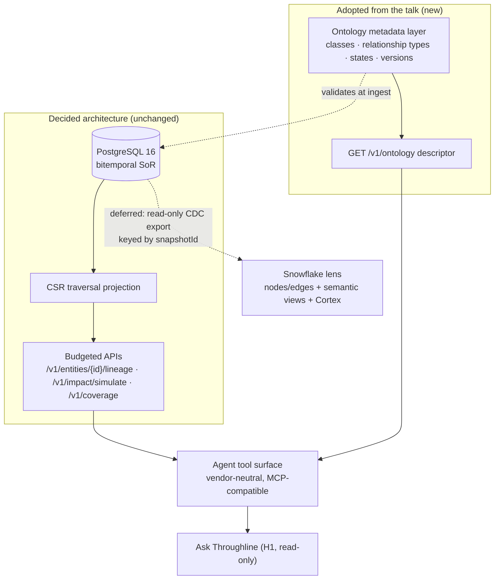

# Snowflake Ontology Proposal — Assessment for Element-Level Lineage and Agent Traversal

**Input under assessment:** the Snowflake Summit 2026 "Ontology on Snowflake" proposal
([summary + talk detail](../source_material/snowflake-summit-2026-ontology-on-snowflake-summary.md)),
evaluated against this repository's decided lineage architecture
([architecture-review-v8](architecture-review-v8/README.md), [Platform-10 DE review](platform-10-de-review/README.md),
[lineage collection assessment](lineage-collection-assessment.md)).

**Question answered:** can the ontology proposal help the element-level, end-to-end lineage
collection and retrieval mechanism, given that the lineage graph is planned to be traversed by an
AI agent in the future?

## Decision

A four-part split verdict, because the proposal is four separable things:

1. **As the lineage physical store / system of record: Reject.** The two-table VARIANT
   nodes/edges model conflicts with [ADR-001](architecture-review-v8/03-decision-records.md#adr-001-graph-storage)
   (Decided: PostgreSQL 16 system of record + in-process CSR traversal projection; graph databases
   and dual-store explicitly rejected) and discards exactly the typed guarantees the reviews
   identify as the hard part of this system: bitemporal versioning and snapshot pinning
   ([ADR-004](architecture-review-v8/03-decision-records.md#adr-004-temporal-model)), the
   `UNIQUE (source, run_id, event_id)` idempotency contract
   ([ADR-003](architecture-review-v8/03-decision-records.md#adr-003-raw-event-store-and-ingestion-contract)),
   per-attribute conflict provenance, and lifecycle states. ADR-001's own revisit trigger
   (>~50M edges, or traversal p99 breach) remains the only re-opening condition.
2. **As a layered semantic pattern for agent-facing retrieval: Adopt with changes.** This is the
   headline. The lineage graph *is* a knowledge graph in the talk's vocabulary, and Throughline
   already has an ontology — the closed URN type vocabulary, the edge level/channel enums, the
   signal-authority matrix, the confidence bands, the lifecycle and consumer states, the severity
   matrix. It is just **implicit, scattered across prose** in ADRs and the HLD. Making it an
   explicit, versioned, machine-readable metadata layer, with generated *budgeted* views and a
   vendor-neutral agent tool surface, is precisely what a future agent needs to traverse the graph
   without hallucinating its semantics. This fills a verified white space: the repository contains
   zero ontology, semantic-layer, knowledge-graph, or agent-tool-surface content today, while the
   exploratory agentic layer ("Ask Throughline", 14 proposed agents) assumes grounded graph
   traversal it has no contract for.
3. **As a Snowflake-materialized serving lens: Defer, with named preconditions and a re-open
   trigger.** A read-only CDC/snapshot export of the graph into Snowflake nodes/edges tables with
   generated semantic views (optionally fronted by a Cortex agent) is a legitimate future serving
   surface for Snowflake-resident consumers — never the system of record. See §7.
4. **For collection: Marginal and indirect.** The talk is a retrieval-and-semantics story. It does
   not touch OpenLineage event mechanics, four-signal fusion, or identity resolution — the #1
   named risk with a ≥95% precision / ≥90% recall go/no-go gate
   ([lineage collection assessment](lineage-collection-assessment.md), "Canonical identity").
   The one real collection gain is modest: expressing signal-assertion rules as machine-checkable
   ontology constraints (see F1/§5), which is ADR-007's existing precedence matrix made
   declarative, not a new capability.

The recommendation is deliberately costed at approximately zero during the six-month conditional-GO
pilot ([Platform-10 DE review](platform-10-de-review/README.md)): documentation plus, at most, one
read-only descriptor endpoint. Nothing here re-sequences the pilot.

## What the talk proposes

A five-layer, Snowflake-native stack: **L1** physical storage as exactly two tables
(nodes, edges; VARIANT properties; entity-type additions are inserts, not migrations). **L2**
ontology metadata as pure declarative configuration (class hierarchy, relationship constraints).
**L3** a compiler (`generate_ontology_view`) that generates polymorphic union views from L2 —
add a subtype, rerun, zero downstream changes. **L4** three purpose-built semantic lenses over the
same facts: a concrete knowledge-graph model (fast, multi-hop SQL), an abstract ontology model
(polymorphic, for AI reasoning across type boundaries), and a governance model (the system
describing itself: what types and relationships exist, who has access). **L5** a Cortex Agent as
conductor: intent classification routes each question to the right lens or tool, possibly several
in parallel, and merges results. An "Ontology Stack Builder" skill automates setup via a gated,
human-in-the-loop workflow.

One framing point matters before the fit map: the talk's core rule — *keep the ontology (blueprint,
slow-changing) separate from the knowledge graph (instances, fast-changing)* — is **independent
confirmation of a separation Throughline already made**. Slow-changing configuration
(URN grammar, `schema_versions`, `policies`, the conflict matrix) already lives apart from
fast-changing bitemporal edge facts. Much of the talk validates decisions this repository has
already taken; the genuinely new material is layers 2–5 as an *explicit, consumable* semantic
surface.

## Layer-by-layer fit map

| Talk layer | Throughline equivalent today | Verdict | Why |
|---|---|---|---|
| **L1** two-table VARIANT store | Typed bitemporal DDL ([HLD §2](architecture-review-v8/04-high-level-design.md)); CSR projection ([ADR-001](architecture-review-v8/03-decision-records.md#adr-001-graph-storage), [ADR-010](architecture-review-v8/03-decision-records.md#adr-010-impact-traversal)) | **Reject** (as store) | The CSR projection already plays the "radically simple physical layer" role — in process, rebuildable, disposable. The SoR needs typed constraints the VARIANT model gives up (F2). |
| **L2** ontology metadata | *Implicit*: URN type vocabulary ([ADR-005](architecture-review-v8/03-decision-records.md#adr-005-canonical-urn-grammar)); level/channel/lifecycle/band enums (HLD §2); signal-authority matrix (HLD §4.1, [ADR-007](architecture-review-v8/03-decision-records.md#adr-007-signal-precedence-and-conflict-resolution)); 7-state consumer contract (HLD §8); severity matrix | **Adopt — make explicit** | The single most valuable import. An agent cannot consume prose ADRs; it can consume a versioned ontology descriptor (F1, §5). |
| **L3** compiler → polymorphic views | Persisted GraphQL queries ([ADR-019](architecture-review-v8/03-decision-records.md#adr-019-api-serving-strategy)); top-500 hub precompute (HLD §5.4); coverage roll-ups | **Adapt** | Generated views must compile to *budgeted persisted queries*, never open polymorphic unions. A literal "everything that feeds element X through any channel" union view is the unbounded hub-traversal risk ADR-019 explicitly rejected (F3-adjacent hazard). |
| **L4** three lenses (KG / ontology / governance) | Existing four lenses (Lineage, Interactions, Impact, Provenance); governance ≈ 7-state contract + `GET /v1/coverage` (HLD §7–8) | **Adopt framing** | The "governance model — the system describing itself" is the missing piece, and it serves the underserved exec/governance persona (GAP-S4) as well as agents. The payoff does not depend on agent funding (defuses F7). |
| **L5** agent-as-conductor | "Ask Throughline" (exploratory; H1 read-only anchor in `latest_source/Data Lineage Impact Platform-10/Agentic Experiences.dc.html`); no tool surface exists | **Adapt** | Correct interaction model — intent routing over specialized, budgeted tools, never one monolithic query. But specify it vendor-neutral (MCP-compatible tool contract); Cortex is one possible client, relevant only inside the deferred Snowflake lens (F5). |
| Ontology Stack Builder | ADR-015 LLM extraction gates | **Reject for v1** | LLM schema introspection proposing an ontology falls squarely under [ADR-015](architecture-review-v8/03-decision-records.md#adr-015-llm-extraction-hardening) discipline (golden sets, pinned versions, eval gates). The lineage ontology is small and hand-writable; automation solves a problem this repo does not have. |



## Findings

**F1 — The ontology exists but is implicit. (High)**
Throughline's blueprint is real and already governs the system, but it is distributed across
prose: the closed entity-type vocabulary (`org|domain|app|svc|ds|job|col|ep|topic|field`,
ADR-005), the edge attribute enums (`level: system|dataset|column`,
`channel: batch|stream|rest|graphql|grpc|async`, HLD §2.1), the containment altitudes
(org → domain → app → service/dataset/job → column/endpoint), the per-attribute authority matrix
(HLD §4.1), the lifecycle machine (`active → stale → retired`, ADR-009), the confidence bands
(Verified/Probable/Inferred, ADR-008), the 7-state consumer contract (HLD §8), and the
change-type × usage severity matrix (PRD 2). A human reads these; an agent cannot. Until this is a
machine-readable artifact, any "Ask Throughline" implementation would hard-code graph semantics in
prompts — unversioned, unreviewed, and silently divergent from the ADRs.

**F2 — The generic two-table store contradicts decided architecture. (Critical, if adopted)**
Beyond the ADR-001 conflict: VARIANT properties cannot enforce the idempotency key, bitemporal
interval integrity, entity-ID foreign keys ("URNs are names, not join keys", HLD §2), or the
conflict/lifecycle flags. Every one of these is load-bearing for the product's trust story. The
talk optimizes for schema-less flexibility; this system's reviews conclude the opposite —
*"correctness under identity, conflict, and time"* is the risk, and typed constraints are the
mitigation.

**F3 — No agent tool surface exists anywhere. (High)**
The agentic material ("Ask Throughline", the 14-agent catalog) is exploratory HTML with no tool
schemas, no NL→query contract, no agent authN/authZ or audit treatment, and no presence in any
ADR, the gap register, the NFRs, or the six-month plan of record. The talk's L5 supplies the
right *shape* for closing this: a conductor over specialized tools. §6 states what those tools
must inherit.

**F4 — The pinned decision tuple lacks an ontology version. (Medium — net-new requirement)**
ADR-004 pins `{snapshotId, policyVersion, confidenceModelVersion}` on every impact/gate response
so decisions are reproducible. Once an explicit ontology layer exists, it becomes a fourth
reproducibility axis: editing a relationship constraint or state meaning would silently change
what past agent answers *meant*. Every agent-facing response must additionally pin
`ontologyVersion`. This requirement is invisible until the ontology is explicit — it is the
strongest thing the talk surfaces that the current architecture genuinely lacks.

**F5 — Cortex lock-in must be declined at the core. (Medium)**
The talk's L5 is Cortex-specific. Throughline's agent surface must be specified as a
vendor-neutral tool contract (MCP-compatible), with Cortex as at most one client inside the
deferred Snowflake lens. Locking the reasoning loop to one vendor's agent runtime would couple the
platform's most differentiated future surface to its least differentiated dependency.

**F6 — The Snowflake lens is a dual-store drift risk. (Medium)**
Any materialized copy of the graph can silently diverge from the SoR. Mitigations are
preconditions in §7: read-only, export keyed by `snapshotId`, scheduled reconciliation against
the SoR watermark, and a hard never-SoR rule. ADR-001 already rejected dual-store for the *serving*
path; the lens is acceptable only as a *consumer*, downstream of the same CDC discipline as the
CSR projection and OpenSearch.

**F7 — Premature-abstraction risk against the pilot. (Medium)**
The plan of record excludes agents entirely, and GAP-R1 records five unreconciled effort
envelopes. Anything adopted from this assessment must not add scope to the six-month pilot.
Hence the phasing in §9: during the pilot, the ontology layer is documentation (a YAML of
vocabularies that already exist); implementation begins only alongside H1 agent work, and the
governance-lens payoff (GAP-S4) stands on its own if agents slip.

**F8 — Subtyping must not reopen the closed URN vocabulary. (Low)**
The talk's "add a subtype, rerun the compiler" appeal presumes an open type system. ADR-005's
type vocabulary is deliberately closed and ADR-006's identity determinism depends on it. Subtypes
(e.g. `ds/kafka-topic` vs `ds/s3-landing`, or domain-specific column classifications) live as
ontology metadata *over* the closed base types — never as new URN types. Identity is not the
ontology's to extend.

## Contract to build first: the ontology-metadata layer

Sketch, not spec — sized for one design doc plus one migration when H1 begins. PostgreSQL is
authoritative (same SoR, same review discipline); a generated read-only descriptor serves agents
and humans; a YAML export makes ontology changes reviewable in PRs like `lineage.yaml` and Rego
policies already are.

```text
ontology_classes        (class_id, base_urn_type,            -- FK into the CLOSED ADR-005 vocabulary
                         parent_class_id NULL,               -- is-a hierarchy (subtypes as metadata, F8)
                         altitude,                           -- org|domain|app|svc-ds-job|element
                         meaning TEXT)                       -- one-sentence agent-readable definition

relationship_types      (rel_id, name,                       -- e.g. flows_to, interacts_with, contains
                         source_class, target_class,
                         level, channel_set,
                         may_assert_signals TEXT[],          -- e.g. column edges: OL facets only —
                                                             -- ADR-007 + INT-001 made machine-checkable
                         meaning TEXT)

state_vocabulary        (state_id, applies_to,               -- edge|node|response-slot
                         name,                               -- 7 consumer states + lifecycle + bands
                         meaning TEXT, rendering_guidance TEXT)

ontology_versions       (ontology_version PK, git_ref, activated_at)
                                                             -- joins the pinned tuple (F4)
```

Two properties make this more than documentation:

- **Ingest validation.** `relationship_types.may_assert_signals` turns two prose invariants into
  gateway checks: *"only OpenLineage facets confirm column edges"* and INT-001's rule that
  interactions are stored apart from lineage and never manufactured into it. A violating event is
  rejected to the DLQ with a named constraint, not silently absorbed. (Honest framing: this is
  ADR-007's matrix and the PRD's INT-001 made declarative — a real but modest gain.)
- **Self-description.** `GET /v1/ontology` (ETag = `ontology_version`) returns classes,
  relationship types, states, and their meanings — the talk's "governance model: the system
  describing itself." It is the first tool an agent calls, and equally a dashboardable contract
  for the exec/governance persona (GAP-S4).

## Agent tool-surface implications

The agent gets **tools, not a query language** — ADR-019's discipline extended to a new consumer
class. The toolset is the existing budgeted API plus the descriptor:

| Tool | Backed by | Notes |
|---|---|---|
| `describe_ontology` | `GET /v1/ontology` | always called first; response pinned by `ontologyVersion` |
| `get_entity` / `search` | `GET /v1/entities/{id}`, `GET /v1/search` | faceted, permission-filtered |
| `traverse_lineage` | `GET /v1/entities/{id}/lineage` | direction, depth, `minBand`, `snapshotId`, `includeRetired` |
| `simulate_impact` | `POST /v1/impact/simulate` | budgeted BFS; Confirmed vs Possible tiers |
| `get_coverage` | `GET /v1/coverage` | so the agent can say what it *cannot* see |

Invariants every agent answer inherits from the decided architecture, without exception:

1. **Pinning:** every response carries `{snapshotId, policyVersion, confidenceModelVersion, ontologyVersion}` (F4).
2. **Bands, never scalars:** confidence roll-ups are band distributions; blending to a single
   number is prohibited (ADR-008, HLD §5.3).
3. **Truncation is visible:** budget exhaustion returns `truncated: true` + continuation cursor;
   an agent must report it, never paper over it.
4. **Citations are mandatory:** answers ground to node/edge IDs — the "Ask Throughline" pattern —
   so every claim is checkable against the graph.
5. **The 7-state vocabulary appears in answers:** `not-observed` is a first-class blind spot,
   never blank; *absence of evidence is never "no dependency"*.
6. **AuthZ and audit:** agents are service accounts under the HLD §9 RBAC matrix (PII-tagged
   lineage excluded unless scoped) with audit events per answer; autonomy starts and stays at
   read-only for H1.

## The Snowflake lens option (Deferred)

For an estate whose analysts and agents already live in Snowflake, a serving lens is legitimate:
CDC/snapshot export of the current graph (nodes, edges, states, bands) into Snowflake tables,
talk-style generated semantic views on top, optionally a Cortex agent as one client of the same
tool contract.

**Preconditions, all mandatory:**
- The Tier-1 Snowflake connector (ACCESS_HISTORY, ADR-012) is live first — evidence flows in
  before serving flows out.
- Export is read-only and keyed by `snapshotId`; consumers can state which graph version they saw.
- Invariants survive the export: band distributions, the 7 states, tombstones, and INT-001's
  lineage/interaction separation are preserved in the exported model.
- A scheduled reconciliation job compares lens watermarks against the SoR; drift is an alert, not
  a surprise (F6).
- **Never system of record.** No writes, no identity decisions, no gate decisions from the lens.

**Re-open trigger:** demonstrated demand from a Snowflake-resident consumer population *and*
pilot exit gates passed. Until both, this stays deferred — consistent with the existing verdict
that warehouse-native platforms are *"adopted as a federated source, not the framework."*

## What this does not help

- **Collection mechanics.** OpenLineage events, four-signal fusion, path-qualified edges
  (`guard`, `codeRef`, `frequency`), CI diffing — untouched by the proposal.
- **Identity resolution.** The #1 risk (≥95% precision / ≥90% recall gate, no probabilistic
  auto-merge, no cross-environment corroboration) is exactly as hard with an ontology as without.
- **Confidence calibration.** Bands remain priors until measured; an ontology describes them, it
  does not validate them.
- **The pilot's scope or sequence.** Nothing here moves a date in the six-month plan.

## Phased recommendation

| Phase | Trigger | Work | Cost / gate |
|---|---|---|---|
| **P0 — during the pilot** | now | Adopt "ontology-explicit" as a principle. Write the ontology YAML for the vocabularies that already exist (pure transcription of ADR-005/007/008/009, HLD §2/§8, PRD 2 severity matrix). Submit Proposed ADR-020 (§10) to the next review cycle. | Docs only; zero pilot impact. STOP condition: none needed at this cost. |
| **H1 — with "Ask Throughline" (read-only)** | agent work funded | Implement the four ontology tables + `GET /v1/ontology`; add `ontologyVersion` to the pinned tuple; define the MCP-compatible tool contract (§6). | One migration + one endpoint. Gate: descriptor is complete against the ADRs (checked in review, like the v8 traceability matrix). PIVOT: if agent funding slips, ship the descriptor anyway for the GAP-S4 governance surface. |
| **H2 — conductor routing** | H1 answers grounded and cited in production use | Intent classification over the toolset; parallel tool calls; merged, cited answers. | Gate: H1 citation-accuracy sampling passes before any autonomy above read-only. |
| **Snowflake lens** | re-open trigger in §7 | Read-only export + semantic views + optional Cortex client. | Gate: preconditions in §7, all of them. |

## Proposed ADR-020: Agent semantic-access layer

> **Status:** *Proposed — drafted in this assessment for ratification in the next review-package
> cycle. Not part of the v8 decision index; nothing below is Decided.*
>
> **Context.** The lineage graph will be traversed by AI agents ("Ask Throughline", H1 read-only).
> The graph's semantics — entity types, relationship rules, states, bands, severity — exist only
> as prose across ADR-005/007/008/009, HLD §2/§4/§8, and PRD 2. Agents consuming prose hard-code
> semantics in prompts: unversioned, unreviewed, divergence invisible. The Snowflake Summit 2026
> ontology architecture demonstrates the missing shape: explicit ontology metadata, generated
> views, purpose-built lenses, and an agent routing over specialized tools.
>
> **Decision (proposed).** Introduce an ontology-metadata layer in the existing PostgreSQL SoR
> (`ontology_classes`, `relationship_types`, `state_vocabulary`, `ontology_versions`), a generated
> read-only `GET /v1/ontology` descriptor, and a vendor-neutral (MCP-compatible) agent tool
> contract over the existing budgeted endpoints. Extend the pinned decision tuple with
> `ontologyVersion`. Subtypes are metadata over the closed ADR-005 type vocabulary; the URN
> grammar does not change. Relationship-type signal rules (`may_assert_signals`) are enforced at
> the ingest gateway.
>
> **Why.** An agent needs the schema-of-the-graph to plan traversals; the governance descriptor is
> also the cheapest way to serve the exec/governance persona (GAP-S4). Explicit, versioned
> semantics keep agent behavior reviewable the same way Rego policies and `lineage.yaml` already
> are.
>
> **Alternatives considered.** *Prompt-embedded semantics* — rejected: unversioned, unauditable,
> silently divergent. *Adopting the Snowflake stack wholesale as the store* — rejected: conflicts
> with ADR-001/003/004 (see F2). *Open polymorphic views for agents* — rejected: the ADR-019
> hub-traversal hazard; agents get budgeted tools. *A standalone semantic/graph service* —
> rejected: a second stateful system for metadata a few tables hold.
>
> **Consequences.** One more slowly-changing configuration surface under review discipline; a
> fourth version axis in the pinned tuple; ingest gains named, declarative constraint rejections.
>
> **Revisit trigger:** agent workloads demand ad-hoc graph queries beyond the tool contract
> (re-opens ADR-019's trigger), or the ontology layer's change rate approaches the graph's —
> which would mean it is modeling facts, not meaning, and belongs in the graph instead.

## References

| Document | Role in this assessment |
|---|---|
| [source_material/snowflake-summit-2026-ontology-on-snowflake-summary.md](../source_material/snowflake-summit-2026-ontology-on-snowflake-summary.md) | The proposal under assessment |
| [architecture-review-v8/03-decision-records.md](architecture-review-v8/03-decision-records.md) | ADR-001/003/004/005/006/007/008/009/010/012/015/019 — the decided architecture this is measured against |
| [architecture-review-v8/04-high-level-design.md](architecture-review-v8/04-high-level-design.md) | §1 URN grammar · §2 DDL · §4 fusion · §5 traversal · §7 API · §8 consumer states · §9 security |
| [architecture-review-v8/01-gap-register.md](architecture-review-v8/01-gap-register.md) | GAP-S4 (exec persona), GAP-R1 (effort envelopes) |
| [platform-10-de-review/README.md](platform-10-de-review/README.md) | Six-month conditional-GO plan of record; agents excluded from it |
| [lineage-collection-assessment.md](lineage-collection-assessment.md) | Sibling assessment; identity gate; signal responsibility matrix |
| [Throughline-OpenLineage-Platform-PRD.md](Throughline-OpenLineage-Platform-PRD.md) | INT-001 (interactions separate from lineage) |
| `latest_source/Data Lineage Impact Platform-10/Agentic Experiences.dc.html` | "Ask Throughline" + 14-agent exploratory catalog (H1/H2/H3 horizons) |
