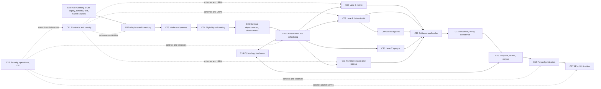

# System Context and Architecture

**Status:** Normative shared specification
**Scope:** Baseline, incremental, and integration-runtime collection through
approved graph/search publication and operation

## 1. Product Boundary

The product inventories an enterprise software estate, collects element-level
lineage evidence, verifies and reconciles that evidence into reviewable
proposals, publishes only approved state, and exposes trusted traversal,
discovery, evidence, and operational status.

The platform owns lineage metadata and its audit history. It does not own
source repositories, deployment systems, data-plane payloads, business schemas,
test execution, or the applications it observes.

## 2. Authoritative Architecture Rules

> EventBridge routes, SQS buffers, Step Functions coordinates, Batch analyzes,
> S3 preserves, DynamoDB controls, Neptune traverses, OpenSearch discovers, and
> a user approves.

- OpenLineage plus governed extensions and the LineageSpec package are the
  external interchange contracts.
- S3 evidence, accepted manifests, and reviewer labels are immutable truth.
- DynamoDB holds operational state, idempotency, indexes, leases, fencing
  tokens, and active pointers.
- Neptune and OpenSearch contain rebuildable approved projections only.
- Application context and repository analysis are separately versioned and
  reusable.
- Deterministic/native evidence is preferred. An LLM receives only named holes.
- Runtime field evidence is integration-only and metadata-only. Production is
  hard-denied.
- Runtime execution strengthens structural confidence only; it cannot prove an
  internal derivation.
- Structural and derivational confidence are stored and rendered separately.
- Missing, stale, conflicting, incomplete, excluded, or unresolved work is
  always visible.
- Material proposals require explicit human approval at launch.

## 3. Actors and External Systems

| Actor/system | Supplies or consumes | Trust boundary |
|---|---|---|
| Application owner | Application selection, ownership corrections, proposal decisions | Enterprise SSO; domain-scoped authorization |
| Data/platform engineer | Schemas, native plans, operational remediation | Privileged metadata access; no payload access |
| Reviewer/approver | Edge corrections, rationale, approval/rejection | Optional separation of proposer and approver |
| Incident responder | Search and bounded blast-radius traversal | Active approved versions only by default |
| Platform operator | Redrive, reconciliation, rebuild, recovery | Break-glass and audited operations |
| SCM providers | Repositories, commits, pull-request events | Short-lived read credentials and controlled egress |
| Test Automation Service | Application-to-repository and scenario mappings | Governed cross-account/API integration |
| Deployment systems | Immutable artifact digests and environment decisions | Signed/authenticated event source |
| Schema/catalog systems | Canonical datasets, fields, types, contracts | Read-only metadata integration |
| Spark/dbt/Airflow | Native run and column-plan evidence | Engine/run identity and artifact binding |
| Integration applications | Metadata-only sidecar evidence | Signed expiring session; integration environment attestation |
| Production applications | Deployment and ordinary interaction context | No instrumented field-evidence grant |

## 4. Component Topology

## 5. Component Responsibilities

| ID | Component | Owns | Key output |
|---|---|---|---|
| C01 | Contracts and identity | Canonical schemas, URNs, aliases, resolution | Versioned contracts and resolved IDs |
| C02 | Adapters and inventory | External discovery and immutable inventory snapshots | `RepositoryInventorySnapshot` |
| C03 | Intake and queues | Validation, normalization, idempotency, routing, buffering | `EventEnvelope` plus queue decision |
| C04 | Eligibility and routing | Repository/path classification and Lane A/B/C assignment | `RepositoryEligibilityDecision` |
| C05 | Context and indexes | Application snapshot, dependencies, determinants | `ApplicationContextSnapshot`, indexes |
| C06 | Orchestration | Baseline/incremental/runtime/publish/reconcile workflows | `CollectionRun` stage history |
| C07 | Lane B | Engine-native exact column evidence | `NativeLineageRun` |
| C08 | Lane A deterministic | Provable edges, determinants, explicit holes | `DeterministicAnalysisPackage` |
| C09 | Lane A agentic | Bounded cited hole resolution | `AgentResolution` |
| C10 | Lane C | Advisory opaque-system fingerprint evidence | `OpaqueEvidencePackage` |
| C11 | Runtime | Signed sessions and metadata-only execution evidence | `RuntimeEvidenceSession` and manifest |
| C12 | Evidence/cache | Immutable artifacts and content-addressed reuse | `EvidenceReference` and cache records |
| C13 | Trust engine | Merge, G1-G5, conflicts, coverage, two confidence axes | `VerifiedLineageCandidateSet` |
| C14 | CI/freshness | Drift, signed artifact binding, deployment freshness | `ArtifactLineageBinding` and decisions |
| C15 | Review/corpus | Proposal state, corrections, decisions, labels | `LineageProposal`, `ReviewLabel` |
| C16 | Publication | Fenced graph version and rebuildable projections | `AcceptedLineageManifest`, graph pointer |
| C17 | Experience | Query/search/review/timeline APIs and UI | User-visible approved lineage and status |
| C18 | Operations | Common security, telemetry, runbooks, reconcile, recovery | Audit, alarms, recovery evidence |

## 6. Baseline Collection Flow

1. A user or governed schedule selects a business application.
2. C02 queries the Test Automation Service, SCM, deployment, schema/catalog,
   native-lineage, and selected CloudWatch context sources. It writes a complete
   or explicitly partial inventory snapshot through C12.
3. C03 accepts a baseline trigger, assigns correlation fields, and routes it to
   the baseline queue. C06 starts one visible baseline workflow.
4. C04 classifies every repository or monorepo workload path before expensive
   checkout. `UNKNOWN` blocks critical baseline completion.
5. C05 creates the application context and indexes libraries, infrastructure
   bindings, contracts, test scenarios, and initial determinants.
6. C06 schedules C07-C11 according to classification, substrate lane, policy,
   and evidence need. Work is bounded by priority, domain, and downstream quota.
7. Collectors write immutable outputs to C12. They return small checksummed S3
   references, not large workflow payloads.
8. C13 resolves identities, deduplicates candidates, applies G1-G5, returns
   dropped-edge holes, records conflicts/coverage, and assigns structural and
   derivational bands.
9. C15 produces an immutable baseline proposal with included/excluded/mixed/
   unknown counts and before/after evidence.
10. A reviewer corrects, rejects, or approves. C16 publishes only an approved
    accepted manifest and C17 shows the active graph and complete timeline.

Baseline completion is not merely a successful workflow state. A critical
active repository cannot remain unknown; incomplete evidence and unresolved
holes must be visible; and no graph becomes active before approval and fenced
publication.

## 7. Incremental Collection Flow

1. C03 validates an SCM event by commit SHA or a deployment event by artifact
   digest and environment. Missing immutable identity is quarantined, never
   deduplicated under an empty key.
2. C04 loads repository class and path policy. C05 resolves affected
   determinants, consumers, bindings, contracts, and test mappings.
3. C06 schedules targeted analysis. A shared-library change affects consuming
   applications only when their dependency/determinant relationship requires
   it; capacity-only infrastructure changes record no lineage impact.
4. C13 compares results with the accepted baseline and emits added, removed,
   transform, confidence, coverage, conflict, and unresolved differences.
5. C15 presents a new immutable proposal. C14 binds an approved LineageSpec
   package to the built artifact and reconciles every deployed artifact,
   including emergency/hotfix paths.
6. C16 publishes the approved version, then C17 reads through the new active
   pointer. A scheduled full scan measures incremental divergence; any non-zero
   divergence is a defect.

## 8. Integration Runtime Evidence Flow

1. C06 requests named integration scenarios for a repository commit and
   artifact digest.
2. C11 creates a signed, expiring `integration` session. AppConfig validators,
   organizational policy, and workload IAM deny production targets.
3. All expected sidecars attest environment and report `READY`; only then may
   tests begin.
4. Sidecars emit allowlisted schemas, field paths/types, direction, trace/test
   IDs, artifact identity, session-keyed irreversible fingerprints, monotonic
   sequences, and closing checksums. Raw or encoded payload values are forbidden.
5. CloudWatch receives evidence; a validator assigns explicit session/sidecar
   Kinesis partitioning; C12 persists validated immutable evidence.
6. C11 drains, verifies manifests, disables the flag in a finally path, and
   closes `COMPLETE`, `INCOMPLETE`, `TRUNCATED`, `FAILED`, `EXPIRED`, or
   `CANCELLED`.
7. C13 may strengthen structural confidence only for `COMPLETE` evidence.
   Runtime evidence never proves the transform and never excludes an unexecuted
   path.

## 9. Proposal and Publication Flow

1. C13 produces deterministic proposal inputs relative to an expected base
   graph version.
2. C15 transitions `DRAFT -> AWAITING_REVIEW`. A correction creates a new
   immutable draft version; rejection and supersession preserve history.
3. Approval creates a checksummed `AcceptedLineageManifest` naming reviewer,
   policy, proposal version, and expected prior graph version.
4. C16 conditionally reserves the application, issues a target version, lease,
   and fencing token, stages an immutable Neptune namespace, and checks counts
   and checksums.
5. One DynamoDB transaction advances the active pointer only if the reservation,
   token, and expected prior version still match. An expired worker cannot win.
6. OpenSearch refreshes from the active version and records a watermark. Query
   responses expose projection lag; failed projections are rebuildable from the
   accepted manifest.

## 10. AWS Runtime Mapping

| Concern | Approved service | Boundary rule |
|---|---|---|
| Event routing/replay | EventBridge rules/archive | Does not provide worker backpressure |
| Durable priority work | SQS Standard queues/DLQs | At-least-once is normal |
| Workflow coordination | Step Functions Standard/Distributed Map | Large payloads use S3 references |
| Short control action | Lambda | No repository clone or full SCA |
| Heavy analysis | AWS Batch | Ephemeral encrypted workspace |
| Bounded residual inference | Bedrock via enterprise gateway | Named holes and approved tools only |
| Runtime flag/session | AppConfig plus DynamoDB | Integration only; expiring and signed |
| Runtime transport | CloudWatch validator to Kinesis | Per-sidecar order; no silent sampling |
| Immutable truth | S3 with KMS/versioning/Object Lock | Evidence and manifests are append-only |
| Operational state | DynamoDB | Conditional idempotency and fencing |
| Approved traversal | Neptune | Immutable version namespaces |
| Approved discovery | OpenSearch | Watermarked rebuildable projection |
| Experience | API Gateway plus web application | Domain RBAC and evidence ABAC |
| Audit/operations | CloudWatch, ADOT/X-Ray, CloudTrail | Common correlation contract |

## 11. Authoritative Data Ownership

| Artifact | Authority | Projection/index |
|---|---|---|
| Inventory snapshot | S3 | DynamoDB inventory watermark |
| Eligibility decision | S3 history | DynamoDB effective registry |
| Application context | S3 | DynamoDB lookup/indexes |
| Analysis/native/agent/runtime packages | S3 | Content-addressed DynamoDB index |
| Proposal versions | S3 | DynamoDB lifecycle state |
| Review labels | S3/analytics catalog | Calibration aggregates |
| Accepted manifest | S3 Object Lock | DynamoDB active pointer |
| Active approved lineage | Accepted manifest plus active pointer | Neptune/OpenSearch |
| Run stage history | DynamoDB plus immutable audit | C17 timeline read model |

## 12. Platform Invariants

1. Every external trigger is rejected, quarantined, coalesced with recorded
   identities, or mapped to a visible run; it is never silently dropped.
2. Every repository is included, excluded with reason/evidence, mixed by path,
   or unknown and awaiting review.
3. Every candidate edge has canonical endpoints, provenance, artifact/effective
   version, evidence references, and independent confidence axes.
4. Every named hole remains open, becomes closed with evidence, or is returned
   open with a reason. Counters balance by immutable hole identity.
5. A service interaction alone is not a lineage edge.
6. OTel or sidecar execution alone cannot set derivational `VERIFIED`.
7. Sole-LLM provenance cannot reach the highest band on either axis.
8. Incomplete runtime evidence cannot promote confidence.
9. CI reports drift; it does not claim semantic validation.
10. A deployed digest without a lineage decision raises an alert.
11. An accepted manifest and reviewer label are never updated in place.
12. A graph pointer advances only through a valid fencing token and expected
    prior version.
13. Query/read projections can be deleted and rebuilt without losing approved
    state.
14. Production cannot enable or submit instrumented runtime field evidence.
15. Privacy violations are deterministic invalid input, quarantined and audited,
    not retried.

## 13. Capacity and SLO Envelope

- Inventory and baseline capacity: 10,000 repositories in 12 hours, initially
  tested with 500 Batch job slots and measured 70% planning utilization.
- Trigger intake: accept a 10,000-event burst without loss and sustain 100
  normalized triggers per second.
- Incremental analysis: 30 minutes p95 excluding human review and deferred
  runtime evidence.
- Tier-1 start latency: five minutes p95 during baseline/backfill.
- Projection visibility: 95% of approved changes queryable within 60 seconds.
- Bounded one-hop graph query: two seconds p95.
- Warm-standby objectives: 15-minute RPO and four-hour RTO.

These are launch gates requiring production-like load and quota evidence, not
guarantees inferred from service documentation.

## 14. Correlation Contract

Every applicable event, log, metric, trace, audit record, artifact metadata,
and user timeline stage carries:

`collectionRunId`, `applicationId`, `repositoryId`, `commitSha`,
`artifactDigest`, `runtimeSessionId`, `proposalId`, `graphVersion`, `traceId`,
`policyVersion`, and `analyzerVersion`.

Fields not yet known are absent, never an empty string used as identity. Child
operations retain the parent run and trace relationships.

## 15. Launch Definition

The platform is launch-ready only when all P0 component requirements and every
interface test pass; the mixed-application steel thread reaches an approved,
queryable graph; privacy and production hard-deny gates pass; duplicate/replay,
fenced publication, rebuild, chaos, load/fairness, and regional recovery tests
retain evidence; and all waivers are scoped, approved, and unexpired.
