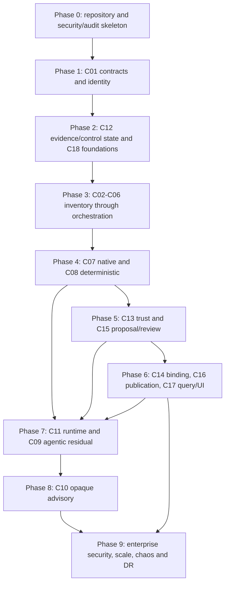

# Implementation Sequence and Phase Gates

**Status:** Normative build order for the first production implementation  
**Audience:** Coding agents, engineering owners, QA, security, SRE and release
management

## 1. Sequencing Rules

The sequence builds contract and truth foundations before producers, then the
earliest reviewable vertical slice, then optional/higher-risk evidence lanes,
and finally enterprise scale/recovery. C18 security/observability constructs are
implemented incrementally in every phase; Phase 9 validates the complete system.

**No component may skip** its component tests, every touching INT row, P0
traceability, deployed controls, cleanup or retained evidence because an E2E
test happens to pass. A phase may develop independent components in parallel
only after their shared upstream contracts are frozen for that phase.

Each phase uses one immutable release-candidate set: Git commit, contract and
policy versions, container digests, IaC assembly and fixture manifest. Exit
evidence from a different incompatible set cannot unlock the next phase.

## 2. Dependency DAG

Cross-phase rules:

- C01 schema/URN meaning gates every producer and consumer.
- C12 immutable write/read/checksum and C18 account/IAM/KMS/network/audit
  foundations gate any real evidence.
- C02-C06 produce pinned, visible work before a lane collector is integrated.
- C13 and C15 are required before any C16 active pointer can exist.
- C14 binding is required for deployed-artifact currentness; C16/C17 may first
  demonstrate a nondeployed pilot baseline, then must integrate C14.
- C11 and C09 add evidence only to already safe deterministic/native/trust
  paths. C10 is advisory and cannot delay the launch-critical vertical slice.
- C18 controls and telemetry are acceptance dependencies in every phase, not a
  hardening task deferred to Phase 9.

## 3. Phase Summary

| Phase | Components/capability | Entry Criteria | Repository Targets | Exit Criteria |
|---|---|---|---|---|
| Phase 0 | Monorepo/toolchain and C18 control skeleton | Approved PRD package | Root manifests, CI, infra, policies, test support | Reproducible build; policy/audit skeleton; empty-account deployment |
| Phase 1 | C01 contracts/identity | Phase 0 green | contracts, contract libraries, identity registry | Canonical goldens and INT-001..006 pass |
| Phase 2 | C12 evidence/cache plus C18 foundations | Phase 1 frozen | evidence registry/client and evidence/security/audit stacks | Immutable truth/control read/write/restore and INT-078..085 foundations pass |
| Phase 3 | C02-C06 control plane | Phase 2 truth/state | adapters, inventory, intake, eligibility, context, run controller/workflows | Inventory-to-visible-run and INT-007..041 pass |
| Phase 4 | C07/C08 collection | Phase 3 pinned work | native ingest/workers, deterministic workers, analyzer SDK | Native/static packages and INT-042..055 pass |
| Phase 5 | C13/C15 trust/governance | Phase 4 goldens | verification/confidence/proposal/review | Reviewable baseline and INT-086..093/102..109 pass |
| Phase 6 | C14/C16/C17 | Phase 5 approval contract | CI/binder/deploy, publication/projections, query API/web | Fenced active query/UI and INT-094..126 pass |
| Phase 7 | C11/C09 | Safe Phase 6 slice and privacy/AI controls | runtime session/sidecar and agent tools/resolver | Runtime/agent paths and INT-056..062/070..077 pass |
| Phase 8 | C10 advisory | Phase 7 caps/privacy | opaque control/source-local/aggregate | Advisory/abstention/privacy and INT-063..069 pass |
| Phase 9 | Full C18 launch | Phases 0-8 complete | reconciliation, operations, redrive, DR, dashboards/runbooks/tests | All P0, INT and E2E-001..014 pass |

## 4. Phase 0 — Repository, Toolchain and Control Skeleton

### Entry Criteria

- Component PRD package and source precedence are approved.
- Engineering owners approve monorepo access, CI runners, nonproduction AWS
  organization/accounts/Regions and cost boundary.
- Security approves bootstrap roles and no production deployment permission.

### Repository Targets

    package.json
    pnpm-workspace.yaml
    tsconfig.base.json
    pyproject.toml
    uv.lock
    .tool-versions
    .github/workflows/
    contracts/
    packages/test-support/
    infra/bin/
    infra/lib/constructs/security/
    infra/lib/constructs/observability/
    policies/
    tests/fixtures/lineage/
    tests/contract/
    tests/security/foundation/
    docs/runbooks/foundation/

Create formatting, lint, typecheck, unit/contract, SBOM, secret, dependency,
IaC/policy and documentation checks. Bootstrap separate control, evidence,
application and observability/security staging accounts with private network/
KMS/audit constructs and mandatory tags.

### Exit Criteria

- Clean checkout reproduces locked TypeScript/Python dependencies and tests.
- CI has least-privilege OIDC role and cannot assume production runtime roles.
- Empty stacks synthesize/deploy/destroy in an ephemeral account; central audit,
  KMS and network conformance probes pass.
- Fixture manifest, deterministic clock/ID/checksum package and signed
  TestEvidenceManifest schema pass.

### Validation Commands

    corepack pnpm install --frozen-lockfile
    uv sync --frozen --all-groups
    pnpm format:check
    pnpm lint
    pnpm typecheck
    pnpm test:unit
    pnpm test:contract
    pnpm test:policy
    pnpm cdk:synth
    pnpm test:deployed -- --phase=0

## 5. Phase 1 — C01 Contracts and Identity

### Entry Criteria

- Phase 0 evidence is signed and current.
- Contract owners approve canonical URN grammar, environment/effective version,
  schema versioning and compatibility policy.

### Repository Targets

    contracts/schemas/
    contracts/openapi/
    contracts/examples/
    contracts/openlineage/
    packages/contracts-ts/
    packages/contracts-py/
    services/contract-registry/
    services/identity-registry/
    infra/lib/stacks/identity-stack.ts
    tests/contract/identity/
    tests/integration/identity/
    tests/load/identity/

Implement schema libraries/generators before service endpoints. Use identical
canonical JSON/SHA-256 goldens across TypeScript/Python; add a Go golden only if
a Go sidecar SDK is later selected.

### Exit Criteria

- C01 P0 and C01-CT-001..012 pass.
- INT-001..006 pass all six dimensions in deployed staging.
- Registry rollback/outage/restore, alias ambiguity and cross-language
  canonicalization retain evidence.
- Contract compatibility workflow blocks unsupported change.

### Validation Commands

    pnpm test:contract -- --component=C01
    pnpm test:component -- --component=C01
    uv run pytest tests/contract/identity tests/unit/identity
    pnpm test:integration -- --ids=INT-001..INT-006
    pnpm test:load -- --component=C01

## 6. Phase 2 — C12 Immutable Evidence and C18 Foundations

### Entry Criteria

- Phase 1 contract artifact is versioned and compatibility-tested.
- Retention/Object Lock, KMS data classes, account boundaries and audit owners
  are approved for staging.

### Repository Targets

    contracts/schemas/evidence/
    packages/evidence-client/
    services/evidence-registry/
    services/cache-index/
    infra/lib/stacks/evidence-stack.ts
    infra/lib/stacks/audit-stack.ts
    infra/lib/stacks/security-stack.ts
    infra/lib/constructs/evidence-store.ts
    infra/lib/constructs/operational-state.ts
    policies/evidence/
    tests/contract/evidence/
    tests/integration/evidence/
    tests/security/evidence/
    tests/dr/evidence/

### Exit Criteria

- C12 P0 and C12-CT-001..012 pass; applicable C18 foundation cases pass.
- Immutable put/get, first-writer cache, conflict/quarantine, Object Lock,
  legal hold, data events, PITR/CRR/restore and checksum inventory are proven.
- Producer SDK cannot write outside its contract/prefix/data class.
- INT-078..085 pass with generic producer harness; each real producer repeats
  its INT-078 path in its phase.

### Validation Commands

    pnpm test:component -- --component=C12
    uv run pytest tests/unit/evidence tests/integration/evidence
    pnpm test:security -- --scope=evidence-foundation
    pnpm test:integration -- --ids=INT-078..INT-085
    pnpm test:dr -- --scenario=evidence-restore

## 7. Phase 3 — Inventory, Intake, Classification, Context and Orchestration

### Entry Criteria

- Phase 2 evidence client and operational-state constructs are published.
- Staging contracts/credentials/sandboxes for Test Automation, SCM, deployment,
  catalog/schema, native and CloudWatch context sources are available.

### Repository Targets

    contracts/schemas/{inventory,events,eligibility,context,runs}/
    services/source-adapters/
    services/inventory-builder/
    services/event-normalizer/
    services/eligibility/
    services/context-index/
    services/run-controller/
    services/run-timeline/
    infra/lib/stacks/workflow-stack.ts
    infra/lib/constructs/{inventory-state,event-bus,priority-queues,event-archive,eligibility-registry,lineage-workflows,batch-capacity}.ts
    tests/{contract,integration,load,chaos}/{inventory,event-intake,eligibility,context,workflows}/

Implement C02/C03 in parallel after schemas; C04/C05 evaluators/indexes next;
C06 consumes their immutable outputs and must not duplicate business logic.

### Exit Criteria

- C02-C06 P0 and each component suite pass.
- INT-007..041 pass, including source outage, duplicate/out-of-order,
  UNKNOWN/mixed monorepo, library/infra no-impact, priority fairness, finally
  and redrive.
- FX-PILOT reaches a visible pinned run with stub lane results; every inventory
  member and trigger has an outcome.
- E2E-009 control path and control-plane load targets pass.

### Validation Commands

    pnpm test:component -- --components=C02,C03,C04,C05,C06
    pnpm test:integration -- --ids=INT-007..INT-041
    pnpm test:e2e -- --ids=E2E-009
    pnpm test:load -- --profile=LP-INGRESS-BURST
    pnpm test:load -- --scope=control-plane
    pnpm test:chaos -- --scope=control-plane

## 8. Phase 4 — Native and Deterministic Collection

### Entry Criteria

- Phase 3 produces exact lane job/context/budget/result contracts.
- Approved Spark/dbt/Airflow and language/framework fixtures are pinned;
  analyzer images have sandbox/no-egress controls.

### Repository Targets

    contracts/schemas/{native-lineage,deterministic-analysis}/
    services/native-ingest/
    workers/native-{spark,dbt,airflow}/
    workers/deterministic-{spring,fastapi,dask,sql}/
    packages/analyzer-sdk/
    infra/lib/constructs/{native-lineage-intake,analysis-jobs}.ts
    tests/fixtures/{native,static-holes}/
    tests/contract/{native-lineage,deterministic-analysis}/
    tests/integration/{native-lineage,deterministic-analysis}/
    tests/load/{native-lineage,deterministic-analysis}/

### Exit Criteria

- C07/C08 P0 and suites pass; outputs are immutable and reproducible.
- INT-042..055 pass with exact native mappings, unresolved cases,
  deterministic proof/Holes, cache and sandbox/fault behavior.
- E2E-002 passes. E2E-003 deterministic half produces its exact open Hole.
- Same deterministic request yields byte-identical package/checksum.

### Validation Commands

    uv run pytest tests/unit/native tests/unit/deterministic
    pnpm test:component -- --components=C07,C08
    pnpm test:integration -- --ids=INT-042..INT-055
    pnpm test:e2e -- --ids=E2E-002
    pnpm test:load -- --scope=collection

## 9. Phase 5 — Trust Engine and Human Governance

### Entry Criteria

- Phase 4 native/static packages and hole/candidate goldens are immutable.
- G1-G5, two-axis confidence, proposal materiality, reviewer ownership and
  launch no-auto-approval policy are approved.

### Repository Targets

    contracts/schemas/{verification,confidence,proposal,review-label}/
    workers/{reconciliation,verification}/
    services/confidence-policy/
    services/proposal-review/
    services/review-assignment/
    infra/lib/constructs/{verification-jobs,proposal-state}.ts
    tests/fixtures/{verification-microworld,review}/
    tests/{contract,integration,load,security}/{verification,proposal-review}/

### Exit Criteria

- C13/C15 P0 and suites pass; INT-086..093 and INT-102..109 pass.
- E2E-004 passes, including drop/downgrade, balanced holes, separate axes and
  deterministic ordering.
- FX-PILOT produces immutable before/after proposal; correction/version/
  concurrent decision and explicit approval rules pass.
- Corpus validation excludes bulk-unreviewed and reports progress to the
  200-edge/six-archetype gate.

### Validation Commands

    uv run pytest tests/unit/verification
    pnpm test:component -- --components=C13,C15
    pnpm test:integration -- --ids=INT-086..INT-093,INT-102..INT-109
    pnpm test:e2e -- --ids=E2E-004
    pnpm test:security -- --scope=trust-review

## 10. Phase 6 — CI Binding, Publication, Query API and UI

### Entry Criteria

- Phase 5 produces an exact approved manifest request against a known base.
- Staging CI/build/deploy/signing, Neptune, OpenSearch, SSO/SCIM and browser
  test identities are available.

### Repository Targets

    contracts/schemas/{ci-drift,artifact-binding,publication}/
    contracts/openapi/lineage-query-v1.yaml
    services/{ci-drift,artifact-binder,deployment-lineage-controller}/
    services/publication-controller/
    workers/{graph-exporter,neptune-projector,opensearch-projector,projection-reconciler}/
    services/query-api/
    apps/lineage-web/
    packages/{api-client,ui-components}/
    infra/lib/stacks/{projection,experience}-stack.ts
    tests/{contract,integration,load,chaos,security,accessibility,e2e}/

### Exit Criteria

- C14/C16/C17 P0 and suites pass; INT-094..126 pass.
- E2E-001, E2E-006, E2E-008, E2E-010 and E2E-011 pass through active,
  version-consistent query/UI.
- Stale worker, partial graph, pointer race, search lag and rebuild preserve
  prior active truth.
- Query bounds/two-axis/coverage/stale states, review concurrency, accessibility
  and artifact freshness/hotfix controls pass.

### Validation Commands

    pnpm test:component -- --components=C14,C16,C17
    uv run pytest tests/unit/graph-exporter tests/unit/projection
    pnpm test:integration -- --ids=INT-094..INT-126
    pnpm test:e2e -- --ids=E2E-001,E2E-006,E2E-008,E2E-010,E2E-011
    pnpm test:accessibility
    pnpm test:load -- --profiles=LP-PUBLICATION,LP-QUERY
    pnpm test:chaos -- --scope=publication-query

## 11. Phase 7 — Runtime Evidence and Agentic Residuals

### Entry Criteria

- Phase 6 deterministic/native review/publication/query path is safe.
- Security approves integration-only runtime hard-deny and enterprise model
  gateway bounded-context/tool/model/Region policy.

### Repository Targets

    contracts/schemas/{runtime-evidence,agent-resolution}/
    services/runtime-session/
    sidecars/runtime-evidence/
    services/agent-task-builder/
    services/agent-tools/
    workers/agent-resolver/
    infra/lib/constructs/{runtime-session,runtime-evidence-pipeline,agent-gateway,agent-cache}.ts
    tests/fixtures/{runtime,agent-holes}/
    tests/{contract,integration,security,load}/{runtime-evidence,agent-resolver}/

### Exit Criteria

- C11/C09 P0 and suites pass; INT-056..062 and INT-070..077 pass.
- E2E-003 and E2E-005 pass; runtime changes structural only and incomplete
  sessions never promote.
- E2E-013 production hard-deny passes every layer.
- Prompt injection/arbitrary tools/whole repository/secret leakage fail; cited
  agent edge remains capped and invalid citation reopens hole.

### Validation Commands

    uv run pytest tests/unit/agent-resolver tests/unit/runtime-validator
    pnpm test:component -- --components=C09,C11
    pnpm test:integration -- --ids=INT-056..INT-062,INT-070..INT-077
    pnpm test:e2e -- --ids=E2E-003,E2E-005,E2E-013
    pnpm test:security -- --scope=runtime-agentic
    pnpm test:load -- --profile=LP-RUNTIME-10X

## 12. Phase 8 — Opaque Advisory Collection

### Entry Criteria

- Phase 7 trust engine enforces advisory confidence cap/abstention.
- Privacy approves source-local fields, minimum observation, key lifecycle and
  kill path for the selected opaque substrate.

### Repository Targets

    contracts/schemas/opaque-evidence/
    services/opaque-control/
    source-local/opaque-collector/
    workers/opaque-aggregate/
    infra/lib/constructs/opaque-collection.ts
    tests/fixtures/opaque/
    tests/{contract,integration,security,load}/opaque/

### Exit Criteria

- C10 P0 and suite pass; INT-063..069 pass.
- Raw/reversible/sensitive/low-cardinality values appear in no sink.
- Ambiguous/insufficient/expired/nonmatch evidence abstains; advisory cannot
  block deploy or reach verified derivation.
- Failure/kill/cost shedding leaves launch-critical paths unaffected.

### Validation Commands

    uv run pytest tests/unit/opaque tests/integration/opaque
    pnpm test:component -- --component=C10
    pnpm test:integration -- --ids=INT-063..INT-069
    pnpm test:security -- --scope=opaque
    pnpm test:load -- --scope=opaque

## 13. Phase 9 — Enterprise Security, Operations, Scale and DR

### Entry Criteria

- Phases 0-8 have current signed evidence on one release-candidate set.
- All 585 P0 requirements map through component/INT/E2E evidence; no expired P0
  waiver, critical UNKNOWN or unowned alarm/runbook.
- Production-shaped primary and warm-standby quotas/topology are approved.

### Repository Targets

    services/reconciliation-controller/
    services/operations-api/
    workflows/redrive/
    workflows/regional-recovery/
    infra/lib/stacks/{operations,dr}-stack.ts
    packages/telemetry-contract/
    policies/
    dashboards/
    docs/runbooks/
    tests/{security,operations,load,chaos,dr,e2e}/
    evidence/launch-manifest-schema/

### Exit Criteria

- C18 P0/C18-CT-001..012 and INT-127..138 pass; all other component/INT tests
  rerun where topology/load/Region semantics change.
- E2E-001..014 pass on the same release candidate.
- 10k baseline/burst/fairness/publication/query SLOs and cost/headroom pass.
- Audit/privacy/accessibility/supply-chain/reconciliation/DLQ-redrive/zone-chaos/
  projection rebuild/warm-standby failover and failback pass exact rules.
- Signed launch checklist links all manifests, builds, dashboards, alarms,
  runbooks, cleanup and approvals; recovery meets 15-minute RPO/four-hour RTO.

### Validation Commands

    pnpm validate:all
    pnpm test:component -- --components=C01..C18
    pnpm test:integration -- --ids=INT-001..INT-138
    pnpm test:e2e -- --ids=E2E-001..E2E-014
    pnpm test:security
    pnpm test:load -- --all-required-profiles
    pnpm test:chaos
    pnpm test:dr -- --scenario=regional-failover-failback
    pnpm evidence:verify -- --candidate=current

## 14. Change, Rollback and Re-entry Rules

- A contract semantic change returns affected producer/consumer phases to
  contract and INT gates; compatibility decides whether older E2E evidence is
  valid.
- A security/IAM/network/KMS/retention/audit change returns affected phases to
  deployed conformance/security tests.
- An analyzer/model/policy change invalidates its component, downstream trust/
  proposal/publication and applicable accuracy E2E evidence.
- A graph/search/query schema or publication change reruns C16/C17, rebuild,
  E2E-011/012 and query/load tests.
- A topology/Region/backup/replication change reruns Phase 9 DR.
- Rollback uses a previously tested immutable build/policy/IaC set and governed
  state protocol; it never edits accepted evidence/manifests or bypasses fence.

Phase completion is a reproducible evidence state, not a calendar milestone.
