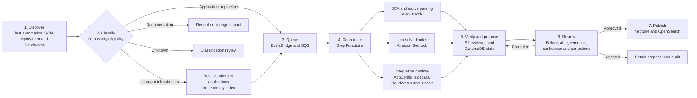
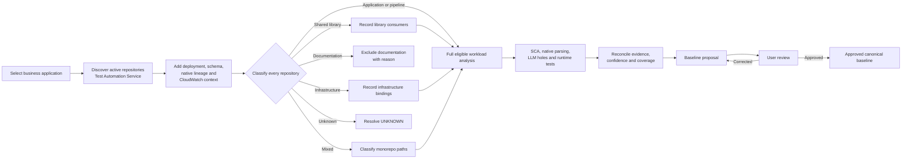
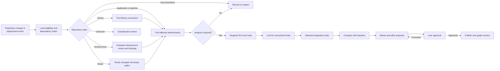
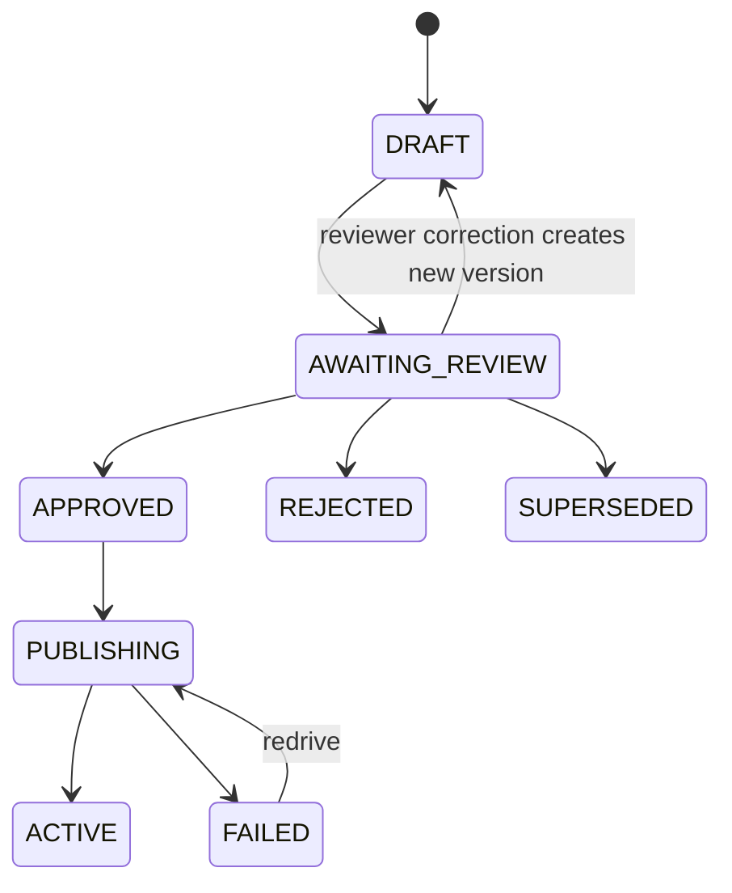

# AWS End-to-End Lineage Collection Architecture

**Status:** Approved design
**Date:** 2026-08-01
**Scope:** Baseline and incremental lineage collection for an enterprise estate of up to 10,000 repositories

## 1. Executive Summary

This design defines a scalable and resilient AWS architecture for collecting,
reviewing, publishing, and operating end-to-end application lineage.

The platform has two primary collection modes:

1. **Business-application baseline:** Discover the active repositories that form
   a business application, enrich them with deployment, schema, native lineage,
   and CloudWatch interaction context, and create a reviewable initial lineage
   graph.
2. **Repository incremental update:** When a repository or deployed artifact
   changes, use the approved baseline and its determinant index to analyze only
   the affected lineage, then present a before-and-after proposal.

Runtime lineage collection uses metadata-only instrumented sidecars during
integration tests. The sidecars are enabled through a bounded AWS AppConfig
session and are disabled in production. They may emit schemas, field paths,
types, trace identifiers, and irreversible session-scoped fingerprints, but
never raw payload values.

All material lineage proposals require explicit human approval at launch.
Accepted evidence and manifests are immutable. Amazon Neptune and Amazon
OpenSearch are rebuildable projections of approved state rather than systems of
record.

The core design rule is:

> EventBridge routes, SQS buffers, Step Functions coordinates, Batch analyzes,
> S3 preserves, DynamoDB controls, Neptune traverses, and the user approves.

## 2. Objectives

The platform must:

- Inventory and classify all enterprise repositories.
- Collect baseline lineage for every eligible business application.
- Update lineage when a repository or deployed artifact changes.
- Exclude infrastructure, shared-library, documentation, and test-only
  repositories from standalone lineage generation without ignoring their
  possible impact on applications.
- Treat library and infrastructure changes as dependency triggers for affected
  application re-analysis.
- Combine deterministic SCA, native lineage, bounded LLM analysis, governed
  rules, and integration-test runtime evidence.
- Keep runtime interactions distinct from data-lineage assertions.
- Display structural and derivational confidence independently.
- Display evidence, coverage, conflicts, and unresolved paths.
- Present before-and-after lineage to users for correction, approval, or
  rejection.
- Preserve every proposal, reviewer correction, decision, and graph version.
- Scale to 10,000 repositories and at least 10,000 deployed-artifact decisions
  per day, including substantial release spikes.
- Provide end-to-end status to application users and operational visibility to
  platform teams.
- Recover without treating Neptune or OpenSearch as irreplaceable state.

Capacity planning assumes that all 10,000 repositories could be eligible.
Repository exclusion is a semantic decision, not a sizing shortcut.

## 3. Governing Principles

1. OpenLineage and the governed LineageSpec are the interchange contracts.
2. Application context and repository analysis are separately versioned and
   reusable.
3. A service interaction does not automatically become a lineage edge.
4. Structural and derivational confidence are independent.
5. Runtime collectors operate only during bounded integration-test sessions.
6. Runtime collectors never persist raw or reversible payload data.
7. Deterministic and native evidence is preferred over inference.
8. LLM analysis is limited to named unresolved holes.
9. All asynchronous delivery and analysis stages are idempotent.
10. Missing, stale, conflicting, or incomplete evidence is visible.
11. Evidence and proposals are immutable; corrections create new versions.
12. Material proposals require explicit human approval at launch.
13. Approved graph and search projections are rebuildable from S3 manifests.
14. No repository, event, failed analysis, or dropped evidence is silently
    ignored.

## 4. Approaches Considered

| Approach | Strengths | Limitations | Decision |
|---|---|---|---|
| EventBridge, SQS, Step Functions, and AWS Batch | Managed routing, burst buffering, visible workflow state, isolated elastic analysis, stage-level retry and redrive | Requires disciplined idempotency and service-quota management | **Selected** |
| Amazon MSK and Amazon EKS streaming platform | Maximum scheduler and stream-processing control; suitable when the organization already operates Kafka and Kubernetes at scale | Higher platform operations burden, custom workflow state, more complex tenant fairness and recovery | Not selected for the initial platform |
| Scheduled enterprise batch plus repository CI jobs | Simple to understand and initially inexpensive | Weak global visibility, poor spike isolation, fragmented retry/audit, limited business-application orchestration | Rejected |

The selected architecture separates event routing, durable work queues,
workflow coordination, heavy analysis, immutable evidence, operational state,
graph traversal, and search. This makes capacity, failure, cost, and ownership
boundaries explicit.

## 5. Architecture at a Glance

### 5.1 End-to-End Flow



### 5.2 One Service, One Responsibility

| Service | Primary responsibility |
|---|---|
| Amazon EventBridge | Decide where a normalized event goes |
| Amazon SQS | Hold prioritized work until capacity is available |
| AWS Step Functions | Coordinate long-running, visible workflows |
| AWS Lambda | Execute short control-plane actions |
| AWS Batch | Execute CPU-, memory-, disk-, and time-intensive analyzers |
| Amazon Bedrock | Resolve only named deterministic-analysis holes |
| AWS AppConfig | Control bounded integration-test evidence sessions |
| Amazon CloudWatch Logs | Receive application context and sidecar evidence |
| Amazon Kinesis Data Streams | Transport high-volume runtime evidence |
| Amazon S3 | Preserve immutable evidence, proposals, and manifests |
| Amazon DynamoDB | Maintain workflow, eligibility, determinant, and version state |
| Amazon Neptune | Traverse approved lineage |
| Amazon OpenSearch Service | Find assets and fields |
| API Gateway and web application | Present review and approval workflows |
| CloudWatch, X-Ray/ADOT, and CloudTrail | Operate, trace, and audit the platform |

## 6. AWS Service Selection Rationale

### 6.1 EventBridge for Event Routing

EventBridge receives normalized repository, deployment, baseline, runtime
session, approval, and publication events. Content-based rules route one event
to the appropriate queues and operational consumers. An EventBridge archive
supports controlled replay.

EventBridge is not the work queue. Routing and durable worker backpressure are
different responsibilities.

### 6.2 SQS for Backpressure and Priority Isolation

Separate Standard queues support:

1. Tier-1 incremental work.
2. Standard incremental work.
3. Baseline work.
4. Backfill and reconciliation.
5. LLM-limited residual work.
6. Runtime correlation.

SQS absorbs deployment spikes and prevents baseline work from starving
incremental analysis. At-least-once delivery is treated as normal; every
consumer uses an idempotency key and conditional write. Each queue has a DLQ
and governed redrive procedure.

### 6.3 Step Functions for Coordination

Step Functions Standard workflows coordinate baseline, incremental, runtime
session, verification, approval-publication, and reconciliation processes.

Distributed Map fans out baseline manifests stored in S3. Although the service
supports up to 10,000 parallel child workflows, configured concurrency is
bounded by Batch, Bedrock, source-control, schema-registry, and data-store
quotas. Standard workflow redrive resumes unsuccessful work without
unnecessarily repeating completed stages.

Lambda is not used as an orchestrator because collection workflows are
long-running, stateful, and operationally significant.

### 6.4 Lambda for Short Control Actions

Lambda performs:

- Event normalization.
- Repository eligibility evaluation.
- AppConfig validation.
- Idempotency checks.
- Small API commands.
- SQS dispatch.
- Manifest validation.
- Notification routing.

It does not clone repositories or run full SCA.

### 6.5 AWS Batch for Analysis

Containerized Batch jobs perform source checkout, deterministic parsing, SCA,
schema extraction, verification, large reconciliation, and graph-export
preparation.

The compute strategy is:

- Fargate for smaller, latency-sensitive incremental jobs with simple resource
  requirements.
- EC2 On-Demand capacity for the reliable baseline floor.
- EC2 Spot capacity for interruptible baseline and backfill work.
- Separate compute environments and job queues for workload fairness.

Analyzer output is checkpointed to S3 so interrupted jobs can resume or be
replayed without losing completed evidence.

### 6.6 Bedrock for Bounded Residual Resolution

The LLM receives a named hole, relevant bounded code spans, schema context, and
deterministic tools. It never receives an entire repository. Every proposed
edge must cite evidence and pass verification gates.

The cache key includes:

```
codeSliceHash + schemaHash + modelVersion + promptVersion + policyVersion
```

LLM-only evidence cannot receive the highest confidence band or independently
block a deployment.

### 6.7 AppConfig for Runtime Session Control

AppConfig provides centrally validated, dynamically retrievable, auditable
feature flags. A runtime session is bound to an integration environment,
application, artifact digest, test run, expiry, evidence policy, and sidecar
version.

An environment variable alone is insufficient because it lacks central
validation, expiry, safe rollout, and automatic rollback.

### 6.8 CloudWatch Logs for Context and Evidence Entry

CloudWatch is used in two distinct modes:

1. Ordinary production logs provide application-to-repository and interaction
   context. They do not prove field derivation.
2. Dedicated integration log groups receive structured metadata-only lineage
   evidence from sidecars.

Subscription filters forward only governed lineage records to Kinesis. The
platform reconciles sequence numbers and final manifests because transport
failure must produce INCOMPLETE rather than false success.

### 6.9 Kinesis for Runtime Evidence

Runtime field observations are telemetry rather than control events. Kinesis
provides a stream partitioned by runtime session, on-demand capacity, ordered
records within a partition, and independent consumers for validation,
correlation, and archival.

EventBridge and the main SQS queues are intentionally not used for every
runtime observation.

### 6.10 S3 for Immutable Truth

S3 stores:

- Source observations.
- Application context snapshots.
- Repository manifests.
- Analyzer output.
- Runtime evidence.
- Proposals and diffs.
- Accepted manifests.
- Reviewer corrections.
- Graph exports.
- Evaluation and reconciliation data.

Versioning, checksums, KMS, lifecycle policy, cross-Region replication, and
Object Lock protect the evidence lifecycle. S3 is the recovery source of truth.

### 6.11 DynamoDB for Operational State

DynamoDB stores:

- Run and stage ledger.
- Idempotency keys.
- Processing leases.
- Repository eligibility.
- Repository and artifact relationships.
- Consumer dependency index.
- Edge determinants.
- Runtime session state.
- Proposal state.
- Current canonical graph pointer.
- Projection watermarks.

Conditional writes support idempotency, optimistic publication, and
single-writer fencing without turning DynamoDB into the lineage graph.

### 6.12 Neptune for Approved Graph Traversal

Neptune stores a query-optimized projection of approved applications, services,
jobs, datasets, fields, interactions, lineage edges, evidence references, and
effective graph versions.

It serves bounded upstream/downstream traversal and path explanation. Search,
evidence history, workflow state, and immutable manifests remain outside
Neptune. Representative benchmarks at the target graph size are a launch gate.

### 6.13 OpenSearch for Discovery

OpenSearch supports text search, autocomplete, owner/domain filtering, and
permission-aware discovery across applications, datasets, fields, proposals,
and evidence.

It is not authoritative and is rebuilt from approved manifests and graph
projections.

## 7. Repository Eligibility and Exclusion

### 7.1 Objective

Inventory every repository, but execute standalone lineage generation only for
eligible deployable applications and data-processing workloads.

Infrastructure, libraries, documentation, and test-only repositories remain
visible. Their changes may trigger downstream action even when they do not
produce lineage by themselves.

### 7.2 Classification Model

| Classification | Standalone baseline | Change behavior |
|---|---:|---|
| APPLICATION_RUNTIME | Included | Incremental lineage |
| DATA_PIPELINE | Included | Incremental and native lineage |
| CONTRACT_SCHEMA_SOURCE | Metadata-only | Re-evaluate connected producers and consumers |
| SHARED_LIBRARY | Excluded | Find consumers and selectively re-analyze |
| INFRASTRUCTURE | Excluded | Evaluate bindings and trigger affected applications |
| DOCUMENTATION | Excluded | Record NO_LINEAGE_IMPACT |
| TEST_AUTOMATION | Excluded | Update runtime coverage and affected test mappings |
| MIXED_MONOREPO | Path-level | Route each changed workload/path |
| UNKNOWN | Never silently excluded | Quarantine for classification review |

A documentation repository containing authoritative OpenAPI, AsyncAPI, Avro,
Protobuf, or JSON Schema is a CONTRACT_SCHEMA_SOURCE. A library containing a
deployable workload becomes MIXED_MONOREPO.

### 7.3 Evidence Precedence

1. Governed service-catalog or repository metadata.
2. Test Automation Service application association.
3. CI/CD evidence for deployable artifacts.
4. Deterministic manifests and repository structure.
5. SBOM, dependency, package, and lock-file evidence.
6. CloudWatch deployment and interaction association.
7. Heuristics requiring review.

An LLM may propose a classification but cannot automatically exclude a
repository. Ambiguity becomes UNKNOWN.

### 7.4 Eligibility Registry

Each decision records:

- Organization and repository ID.
- Classification and eligible paths.
- Inclusion/exclusion reason codes.
- Supporting evidence.
- Application and owner.
- Policy version.
- Effective and expiry timestamps.
- Manual override, reviewer, and rationale.
- Consumer and infrastructure dependencies.
- Last reconciliation time.
- Metadata/content signature.

Manual overrides are time-bounded. When an override expires, classification is
re-evaluated.

### 7.5 Classification Changes

| Transition | Required action |
|---|---|
| Excluded to included | Run repository/application baseline |
| Included to excluded | Require review and undeployment confirmation |
| Documentation to contract source | Re-evaluate connected applications |
| Library to deployable workload | Establish ownership and run baseline |
| Known to unknown/conflicting | Keep current graph but mark classification stale |

An included repository becoming excluded never deletes active lineage
automatically.

## 8. Baseline Collection Flow

The baseline unit is a business application.



### 8.1 Discover and Snapshot

The workflow:

1. Queries the Test Automation Service for active repositories.
2. Resolves application, domain, owner, and repository associations.
3. Resolves current commit and immutable deployed artifact digests.
4. Captures schema, contract, native lineage, and selected CloudWatch context.
5. Writes an immutable ApplicationContextSnapshot to S3.

Application/repository association evidence is ranked:

1. Governed catalog or Test Automation ownership.
2. Deployment and artifact metadata.
3. Explicit configuration or contract reference.
4. CloudWatch-observed interaction.
5. Inference requiring review.

### 8.2 Classify Before Expensive Analysis

The eligibility classifier runs before full checkout or SCA. Clearly excluded
repositories receive metadata and dependency-manifest inspection only.

Monorepositories are divided into workload units using build manifests,
deployment descriptors, container definitions, project boundaries, and
path-level policies.

### 8.3 Build the Dependency Index

The baseline records:

- Library to consuming repository and pinned version.
- Infrastructure to application, route, topic, queue, endpoint, and
  configuration binding.
- Contract/schema to producers and consumers.
- Test scenario to application and runtime evidence.

This is how excluded repositories can safely trigger application work later.

### 8.4 Analyze Eligible Workloads

Unique repository/artifact digests are analyzed once and reused across
applications. The substrate router selects native, deterministic SCA, LLM
residual, runtime, and governed-rule lanes.

### 8.5 Reconcile and Review

The baseline proposal contains:

- Proposed application graph.
- Added nodes and edges.
- Structural and derivational confidence.
- Evidence references.
- Unresolved holes.
- Conflicts.
- Included, excluded, mixed, and unknown repository counts.
- Ownership and coverage gaps.

A baseline cannot be complete while a critical active repository remains
UNKNOWN.

## 9. Incremental Update Flow

The incremental unit is a repository plus immutable artifact digest.



### 9.1 Normalize and Deduplicate

SCM and deployment adapters emit normalized events. The workflow uses:

```
organization + repository + artifactDigest + analyzerVersion + policyVersion
```

as its primary idempotency key.

PR events may be coalesced when an older commit was never deployed. Every
deployed artifact, including hotfixes, receives a lineage decision.

### 9.2 Determinant-Based Invalidation

The workflow loads the accepted baseline and determinant index. It evaluates
changed files, symbols, schemas, build inputs, configuration keys, and
dependency versions. Changed-file proximity alone is insufficient.

### 9.3 Class-Specific Behavior

**Application or pipeline:** Run the targeted incremental path.

**Shared library:** Inspect changed exported types, serializers, mappers,
schemas, and configuration interfaces. Resolve consumers and enqueue only those
whose determinants or dependency versions are affected. A library commit does
not change canonical lineage until a consuming application artifact is
analyzed and deployed.

**Infrastructure:** Ignore capacity-only changes such as CPU, memory, tags, or
alarms. Re-evaluate applications for changes to topics, queues, API routes,
event routing, database endpoints, schema references, environment variables,
task wiring, or service discovery. Infrastructure may change interaction or
configuration evidence, but cannot directly assert field derivation.

**Documentation:** Record NO_LINEAGE_IMPACT unless changed paths contain
machine-readable contracts or schemas.

**Test automation:** Update scenario coverage. If lineage-relevant scenarios
changed, mark corresponding runtime evidence stale and schedule targeted
recollection.

**Mixed monorepo:** Route each changed path according to its workload class.

**Unknown:** Preserve the event, request classification, and replay after
resolution.

### 9.4 Produce the Diff

The proposal clearly separates:

- Added edges.
- Removed edges.
- Modified transformation metadata.
- Structural-confidence changes.
- Derivational-confidence changes.
- Newly unresolved paths.
- Coverage changes.
- NO_LINEAGE_IMPACT decisions and reasons.

## 10. Integration-Test Runtime Collection

### 10.1 Scope

Runtime sidecars run only in registered integration-test sessions. Ordinary
production logs remain available for application context, but instrumented
field-boundary collection is disabled and denied in production.

### 10.2 Session Flow

```mermaid
flowchart LR
    A["Request runtime evidence"]
    B["Create signed, expiring<br/>integration session"]
    C["AppConfig enables flag"]
    D["Sidecars report READY"]
    E["Run selected tests"]
    F["Emit metadata-only evidence"]
    G["CloudWatch lineage logs"]
    H["Kinesis session stream"]
    I["Validate, deduplicate,<br/>reconcile and correlate"]
    J["Immutable S3 evidence"]
    K["Drain and verify manifests"]
    L["Disable flag and close session"]
    M["Structural confidence update"]
    P["Production account"]

    A --> B --> C --> D --> E --> F --> G --> H --> I --> J --> M
    E --> K --> L
    P -. "IAM, policy and validator deny" .-> C
```



The lifecycle is:

```
REQUESTED -> ENABLING -> READY -> COLLECTING -> DRAINING
          -> DISABLED -> COMPLETE
```

Alternative terminal states are INCOMPLETE, FAILED, EXPIRED, and CANCELLED.

Tests begin only after all expected sidecars are READY. The workflow disables
the flag in a finally path. Session expiry is an independent kill switch.

### 10.3 Session Contract

Each session includes:

- Session, test-run, application, and repository IDs.
- Commit and artifact digest.
- Environment fixed to integration.
- Start time and expiry.
- Schema allowlist.
- Maximum events and bytes.
- Fingerprint policy version.
- Minimum sidecar version.
- Sampling or truncation policy.

AppConfig validators reject invalid or production-targeted sessions.

### 10.4 Permitted Evidence

- Schema URN and schema hash.
- Field path and logical type.
- Nullability and presence.
- Protocol, operation, and direction.
- Trace, span, and test-scenario identifiers.
- Commit and artifact digest.
- Instrumentation version.
- Session-scoped keyed fingerprints.
- Observation count and window.
- Monotonic sequence number and final checksum.

### 10.5 Prohibited Evidence

- Raw or encoded payload values.
- Request or response bodies.
- Reversible tokens.
- Credentials or authentication material.
- SQL parameter values.
- Payload-bearing exception text.
- Unbounded free-form logs.

Fingerprints use a session-scoped keyed HMAC. The key is available only to the
integration sidecars for the active session and becomes inaccessible when the
session closes. Sensitive and low-cardinality fields are not fingerprinted.

### 10.6 Failure Semantics

The application is not dependent on collector health. The test evidence path
may fail or become incomplete without causing the application container to
fail.

Each expected sidecar reports registration, heartbeats, monotonic sequences,
and a closing manifest. Missing sequences or manifests result in INCOMPLETE and
prevent confidence promotion. Evidence transport never silently samples after
exceeding limits; the session is marked TRUNCATED/INCOMPLETE.

### 10.7 Production Hard-Deny

Defense in depth includes:

- Omit the collector from production templates where possible.
- Remove lineage-ingestion permissions from production workload roles.
- Reject production enablement in AppConfig validation.
- Deny production accounts and organizational units in collector policies.
- Require sidecars to attest integration environment identity.
- Issue no session grant without a registered test run and matching digest.
- Audit all flag and session changes through CloudTrail.

## 11. Evidence and Confidence

### 11.1 Two Independent Axes

**Structural confidence** answers whether a relationship exists, executed, and
matches a specific artifact version.

It is influenced by deterministic reachability, native run evidence,
integration-test execution, deployment binding, and boundary fingerprint
agreement.

**Derivational confidence** answers whether the field mapping and
transformation are correct.

It is influenced by native execution plans, dbt manifests, compiled SQL,
deterministic transformation analysis, contract tests, and governed review.

### 11.2 Evidence Semantics

| Evidence | Structural value | Derivational value |
|---|---|---|
| Native Spark/dbt/OpenLineage column plan | Strong | Oracle where exact |
| Deterministic SCA | Proposed/provable reachability | Strong where semantics are deterministic |
| LLM with cited evidence | Inferred and capped | Probable and capped |
| Integration-test sidecar | Executed-path corroboration | Does not prove transformation |
| Ordinary production CloudWatch interaction | Application interaction context | None |
| Human acceptance/correction | Governed accepted state | Label for calibration, not an execution oracle |

Runtime evidence cannot:

- Prove internal mathematical derivation.
- Prove an unexecuted path does not exist.
- Convert an interaction into a lineage edge by itself.
- Promote derivational confidence to VERIFIED.

### 11.3 Calibration

The UI displays both axes and their evidence. A single collapsed float is
prohibited. Until bands are calibrated against labelled human corrections,
they render as UNCALIBRATED.

Each material review emits:

```
diff(engineProposal, acceptedProposal)
```

with provenance, archetype, repository, commit, reviewer, and time. Correction
rates are measured by provenance and workload archetype.

## 12. Proposal, Approval, and Publication

### 12.1 Proposal Lifecycle



The review UI shows:

- Before and after graph.
- Added, removed, and modified edges.
- Both confidence axes.
- Evidence provenance.
- Unresolved holes and coverage.
- Repository, commit, artifact, and test-run context.
- Reviewer edits, rationale, and comments.

Reviewer corrections create a new immutable proposal version.

### 12.2 Publication Protocol

1. Write the approved canonical manifest to S3.
2. Stage the Neptune graph delta.
3. Verify expected prior graph version, counts, and checksums.
4. Apply the bounded graph mutation with retry for transaction conflicts.
5. Conditionally update the DynamoDB active graph pointer.
6. Refresh OpenSearch.
7. Mark the proposal ACTIVE with graph version and projection watermark.
8. Emit the immutable audit event.

If another proposal changed the expected prior graph version, publication
stops and the proposal is rebased or superseded. It is never applied blindly.

## 13. Data Ownership and Core Artifacts

| Artifact | Authoritative store | Key identity |
|---|---|---|
| RepositoryInventorySnapshot | S3 | organization + inventory time |
| RepositoryEligibilityDecision | DynamoDB plus S3 history | repository + policy version |
| ApplicationContextSnapshot | S3 | application + snapshot version |
| RepositoryAnalysisPackage | S3 | repository + artifact digest + analyzer version |
| RuntimeEvidenceSession | DynamoDB plus S3 evidence | runtime session ID |
| LineageProposal | S3 plus DynamoDB state | proposal ID + version |
| AcceptedLineageManifest | S3 Object Lock | graph version |
| ActiveGraphPointer | DynamoDB | environment + application/domain |
| Lineage graph | Neptune projection | canonical URNs + effective versions |
| Search index | OpenSearch projection | asset/field ID |
| Review label | S3/Glue | proposal edge + decision |

Large workflow payloads are passed by S3 reference, not embedded in Step
Functions state.

## 14. Scale and Capacity

### 14.1 Planning Formula

```
requiredConcurrency =
    repositoryCount * meanJobMinutes
    / (targetWindowMinutes * utilization)
```

Example baseline:

- Repository count: 10,000.
- Mean scan: 15 minutes.
- Target window: 12 hours.
- Utilization: 70%.
- Calculated concurrency: approximately 298 job slots.
- Initial quota and load-test target: 500 job slots.

Example incremental:

- Deployed-artifact decisions per day: 10,000.
- Mean targeted analysis: five minutes.
- Average concurrent demand: approximately 50 job slots.
- Dedicated priority capacity: reserved and independently scalable.

These are planning assumptions, not production guarantees. Measurements are
segmented by archetype, repository size, evidence lanes, and cache hit rate.

### 14.2 Workload Fairness

- Tier-1 incremental queues have reserved compute.
- Standard incremental work can borrow unused baseline capacity.
- Baseline and backfill cannot consume Tier-1 reservations.
- Bedrock concurrency is separately rate-limited.
- Runtime Kinesis capacity is isolated from repository control events.
- Per-domain admission control prevents one business unit from monopolizing
  the platform.

### 14.3 Content-Addressed Reuse

The platform avoids repeated work by caching:

- Repository analysis by artifact digest and analyzer version.
- Native manifests by run/artifact digest.
- LLM residuals by content/schema/model/prompt versions.
- Schema normalization by schema hash.
- Shared repository results across applications.

### 14.4 Initial Performance Targets

- Accept a burst of 10,000 normalized trigger events without loss.
- Sustain 100 normalized triggers per second.
- Complete a 10,000-repository baseline within 12 hours.
- Complete normal incremental analysis within 30 minutes at p95, excluding
  human review and deferred post-analysis runtime evidence.
- Keep Tier-1 incremental start latency within five minutes at p95 during
  baseline and backfill.
- Make 95% of approved projection changes queryable within 60 seconds.
- Return bounded one-hop graph queries within two seconds at p95.

All targets require representative load and quota tests before launch.

## 15. Resilience and Recovery

### 15.1 Failure Classification

**Transient:** throttling, dependency timeout, network failure, temporary
capacity shortage, Neptune transaction conflict. Apply bounded retry with
exponential backoff and jitter.

**Deterministic:** invalid schema, unsupported language, missing owner,
verification failure, prohibited payload evidence. Quarantine with a reason;
do not waste retry capacity.

**Incomplete:** missing sidecar manifests, missing inventory source, partial
context, unresolved dependency, expired runtime session. Surface explicitly
and prevent unwarranted confidence.

### 15.2 Recovery Mechanisms

- SQS DLQs and governed redrive.
- EventBridge archive and replay.
- Step Functions Standard redrive.
- S3 stage checkpoints.
- DynamoDB conditional idempotency records.
- Inventory-to-run reconciliation.
- Deployment-to-lineage reconciliation.
- Projection watermarks and rebuild procedures.
- Scheduled full scans to measure incremental divergence.

### 15.3 Multi-AZ and Cross-Region

The primary Region is Multi-AZ. Neptune uses a writer and read replicas across
Availability Zones. OpenSearch uses a production Multi-AZ configuration.

The warm-standby Region receives:

- S3 cross-Region replication, including governed evidence retention.
- DynamoDB replicated state or tested backup/restore according to table
  conflict requirements.
- Neptune stream replication or cross-Region snapshot restoration according to
  the validated graph RPO/RTO.
- OpenSearch snapshots or a complete rebuild from approved manifests.
- Infrastructure-as-code definitions for control and compute planes.

Initial objectives:

- RPO: 15 minutes.
- RTO: four hours.

S3 evidence and accepted manifests remain the rebuild source of truth.

## 16. Security and Privacy

### 16.1 Account Boundaries

Recommended accounts:

- Lineage control and compute.
- Lineage evidence/data.
- Lineage application/API.
- Central observability and security.
- Integration application accounts.

Production application accounts provide governed context access but cannot
enable or send instrumented runtime lineage evidence.

### 16.2 Controls

- AWS Organizations-scoped cross-account roles.
- Least-privilege namespace and source permissions.
- Private subnets and VPC endpoints.
- Controlled egress for enterprise SCM.
- Short-lived source credentials from Secrets Manager.
- KMS keys separated by environment and data class.
- Enterprise SSO and SCIM.
- Domain RBAC plus sensitive-metadata ABAC.
- Optional separation of proposer and approver.
- CloudTrail for configuration, access, review, export, and administration.
- S3 data events for evidence access where required.
- Automated retention, legal hold, and deletion policy.
- No production payload capture.
- No raw integration-test payload storage.
- Ephemeral encrypted analyzer workspaces.
- Bedrock receives only bounded residual context.

## 17. End-to-End Visibility

### 17.1 Correlation Contract

Every trigger and stage carries:

- collectionRunId
- applicationId
- repositoryId
- commitSha
- artifactDigest
- runtimeSessionId
- proposalId
- graphVersion
- traceId
- policyVersion
- analyzerVersion

### 17.2 User Timeline

The application UI exposes:

```
Triggered -> Context -> Eligibility -> Analysis -> Runtime Test
          -> Verification -> Review -> Publication
```

It shows current stage, completed stages, elapsed time, retry state, missing
evidence, proposal readiness, review state, publication version, and projection
watermark. Users do not require direct Step Functions or CloudWatch access.

### 17.3 Operational Signals

- Queue age, backlog, throughput, and DLQ depth by priority.
- Workflow stage latency, failure, retry, and redrive.
- Inventory coverage and reconciliation differences.
- Included, excluded, mixed, unknown, and stale classifications.
- Baseline and incremental coverage by application/domain.
- Deployed artifacts missing lineage.
- Stale lineage and graph projection lag.
- SCA holes opened and resolved.
- Bedrock usage, cache hit rate, throttle, and cost.
- Runtime sidecar readiness, sequence gaps, truncation, and completeness.
- Structural and derivational confidence distribution.
- Approval backlog and reviewer latency.
- Incremental versus scheduled-full-scan divergence.
- Neptune and OpenSearch saturation and query latency.
- Cost by application, lane, and analyzer.

CloudWatch provides metrics, logs, dashboards, alarms, and synthetics.
X-Ray/ADOT provides distributed traces. CloudTrail provides immutable API and
configuration audit.

## 18. Verification and Launch Gates

### 18.1 Functional Gates

- A business-application baseline produces a reviewable graph.
- Every discovered repository has an eligibility state.
- A critical active repository cannot remain silently UNKNOWN.
- A repository change produces a determinant-bounded diff.
- Library and infrastructure changes resolve affected consumers.
- Documentation changes close with an explainable no-impact decision.
- Reviewer edits create a new immutable proposal.
- Rejected proposals never enter the active graph.
- Approved proposals publish against the expected prior graph version.

### 18.2 Privacy Gates

- Known secrets and raw payload values never appear in runtime evidence.
- Sensitive and low-cardinality fields are not fingerprinted.
- Fingerprint keys cannot be used after session closure.
- Production enable attempts fail at AppConfig, IAM, resource-policy, and
  sidecar-attestation layers.

### 18.3 Accuracy Gates

- Runtime evidence changes structural confidence only.
- LLM-only edges remain confidence-capped.
- Unresolved paths and coverage gaps remain visible.
- Incremental results are compared with scheduled full scans.
- Confidence bands are calibrated against human-labelled review data before
  enforcement.

### 18.4 Resilience Gates

- Duplicate and out-of-order events are safe.
- Analyzer, sidecar, Kinesis, queue, and projection failures are recoverable.
- Missing evidence yields INCOMPLETE rather than success.
- A projection can be rebuilt from S3 manifests.
- Regional recovery passes validated RPO/RTO exercises.

### 18.5 Performance Gates

- Baseline, incremental, ingress, runtime, query, and publication targets pass
  representative tests.
- Instrumentation overhead remains within an approved CPU, memory, and latency
  budget.
- Release spikes do not starve Tier-1 applications.

## 19. Rollout

### Phase 0: Foundation

- Approve identity, naming, evidence, retention, confidence, and eligibility
  policies.
- Deploy EventBridge, queues, Step Functions, S3, DynamoDB, and operational
  telemetry.
- Establish synthetic replay and rebuild tests.

### Phase 1: Inventory and Native Baseline

- Onboard Test Automation Service inventory.
- Classify repositories and resolve UNKNOWN critical workloads.
- Enable native Spark/dbt/OpenLineage inputs.
- Deliver baseline proposal and approval workflow for pilot applications.

### Phase 2: Deterministic and Incremental

- Deploy initial SCA adapters.
- Build determinant and dependency indexes.
- Process repository and deployment changes.
- Deliver before-and-after incremental review.

### Phase 3: Metadata-Only Runtime and LLM Residuals

- Deploy integration-test sidecars and AppConfig session controller.
- Establish privacy and production-deny gates.
- Enable Bedrock only for unresolved deterministic holes.
- Begin confidence calibration corpus.

### Phase 4: Enterprise Scale and DR

- Expand application/domain onboarding.
- Complete 10,000-repository load validation.
- Validate graph benchmarks, chaos tests, and regional recovery.
- Consider policy-based auto-publication only after measured calibration and
  explicit governance approval.

## 20. Risks and Mitigations

| Risk | Mitigation |
|---|---|
| False repository exclusion hides lineage | Deterministic precedence, UNKNOWN quarantine, no LLM auto-exclusion, expiring overrides, inventory reconciliation |
| Library/infra change misses a consumer | SBOM/lock-file/config dependency index plus scheduled full-scan divergence |
| Interactions are mistaken for lineage | Separate models, governed mapping rules, explicit evidence type |
| LLM creates plausible but unsupported edges | Named holes, evidence citations, hard verification gates, confidence cap |
| Runtime metadata leaks values | Strict schema, no free-form payloads, keyed session fingerprints, sensitive-field suppression |
| Feature flag remains enabled | Finally-path disable, expiry, AppConfig rollback, production IAM/resource deny |
| Baseline starves incremental work | Separate queues, compute environments, and reserved Tier-1 capacity |
| Graph projection becomes unavailable | Immutable S3 manifests, DynamoDB watermarks, tested rebuild |
| Human review becomes a bottleneck | Application ownership, material-change focus, priority queues, review SLIs; no premature auto-publish |
| High-degree graph queries become slow | Bounded traversal, pagination, aggregation, async impact analysis, benchmark gate |

## 21. Implementation Decisions Still Requiring Measurement

- Final AWS Region and warm-standby Region.
- Exact repository-size and language distribution.
- Initial SCA adapter languages and frameworks.
- Source-control adapter and repository checkout limits.
- Test Automation Service API contract and rate limits.
- CloudWatch log groups and query patterns approved for context.
- Runtime sidecar CPU/memory/latency budget.
- Kinesis event volume and retention.
- Neptune instance classes, read-replica count, and graph partition model.
- OpenSearch sizing and whether P0 can launch with a smaller search projection.
- Evidence and review retention periods.
- Domain-level SLO tiers and escalation rules.
- Confidence band thresholds after calibration.

These items do not change the logical architecture. They are resolved through
the implementation plan, representative benchmarks, security review, and pilot
measurements.

## 22. Primary AWS References

- [Step Functions Distributed Map](https://docs.aws.amazon.com/step-functions/latest/dg/state-map-distributed.html)
- [Step Functions redrive](https://docs.aws.amazon.com/step-functions/latest/dg/redrive-executions.html)
- [SQS Standard queues](https://docs.aws.amazon.com/AWSSimpleQueueService/latest/SQSDeveloperGuide/standard-queues.html)
- [AWS Batch Fargate selection](https://docs.aws.amazon.com/batch/latest/userguide/when-to-use-fargate.html)
- [AWS AppConfig](https://docs.aws.amazon.com/appconfig/latest/userguide/what-is-appconfig.html)
- [CloudWatch Logs subscription filters](https://docs.aws.amazon.com/AmazonCloudWatch/latest/logs/SubscriptionFilters.html)
- [CloudWatch cross-account and cross-Region log centralization](https://docs.aws.amazon.com/AmazonCloudWatch/latest/logs/CloudWatchLogs_Centralization.html)
- [Amazon S3 Object Lock](https://docs.aws.amazon.com/AmazonS3/latest/userguide/object-lock.html)
- [Amazon Neptune reliability and availability](https://docs.aws.amazon.com/neptune/latest/userguide/feature-overview-storage.html)
- [Amazon Neptune transaction isolation](https://docs.aws.amazon.com/neptune/latest/userguide/transactions-neptune.html)
- [OpenSearch Multi-AZ with Standby](https://docs.aws.amazon.com/opensearch-service/latest/developerguide/managedomains-multiaz.html)
- [Amazon Bedrock data protection](https://docs.aws.amazon.com/bedrock/latest/userguide/data-protection.html)
